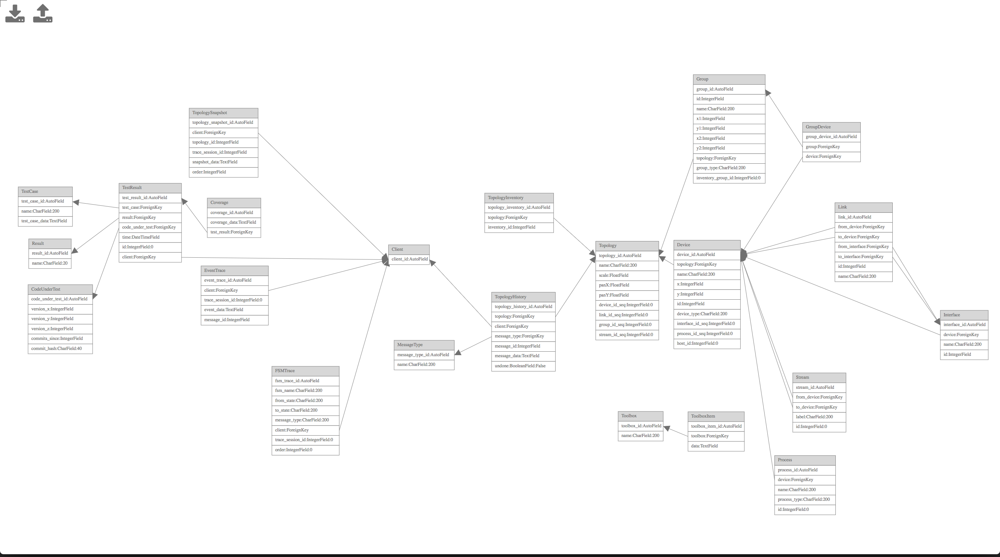

The design files in this directory are used in the database schema designer tool.

* [models.png](models.png) - An image of the database schema design for network UI.
* [models.yml](models.yml) - Provides the main schema design for the network UI project.
* [api.yml](api.yml) - Provides additional meta-data for the API.

