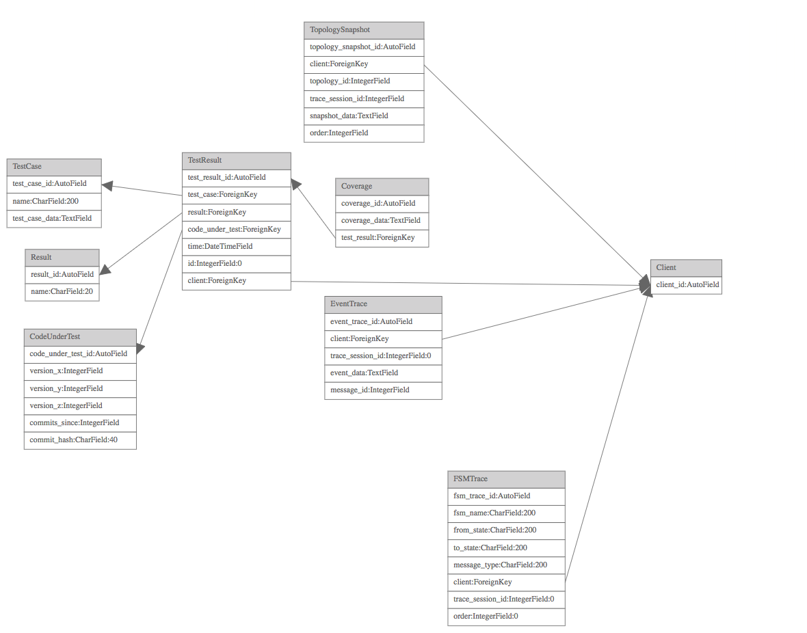

Network UI Test
===============

Network UI Test is an event driven test framework for testing the Network UI.
This tool works by setting up the UI with a pre-test run snapshot, replaying a
set of events to the Network UI, catching exceptions and then comparing the
state of the system after the events to a post test run snapshot.  Test results
and test code coverage are stored for each test run through the system.  This
allows us to determine which lines of test are run during each test and which
lines are run under any test.  This can be very helpful during development to
determine that the code is executed as expected given a certain input, to find
code that needs additional tests, and to find code that is not be run under any
of the given inputs (a.k.a. dead code).

Using this test framework it is fairly easy to achieve 90%+ code coverage under
test with a few days of work recording and crafting tests.

Test Steps
----------

The tests suppported by this test framework perform the following steps:

* Reset code coverage records
* Recreate a pre-test snapshot on the UI
* Replay a set of events to the UI
* Check for exceptions thrown by the UI
* Check the state of the system based on the post-test snapshot
* Report the pass/fail/error status of the test by test name, code version, and client id
* Report the code coverage per test result
* Repeat for next test

Test Case Data Schema
---------------------

The tests are completely data driven and the data for the test snapshots and events are stored in a JSON
structure in the `TestCase` model under the `test_case_data` field that has the following structure:

    {
        "event_trace": [],
        "fsm_trace": [],
        "snapshots": [
            {
                "devices": [],
                "inventory_toolbox": [],
                "links": [],
                "message_id": 4,
                "msg_type": "Snapshot",
                "order": 0,
                "sender": 0,
                "trace_id": 2
            },
            {
                "devices": [],
                "inventory_toolbox": [],
                "links": [],
                "message_id": 31,
                "msg_type": "Snapshot",
                "order": 1,
                "sender": 0,
                "trace_id": 2
            }
        ]
    }

The pre-test snapshot has order 0 and the post-test snapshot has order 1.

Network UI Test Models
----------------------

* FSMTrace - The record of an event that happend during an FSM trace.  This is used in the recording phase of test case data.
* EventTrace - The record of an event that happened during an event trace. This is used in the recording phase of test case data.
* Coverage - Per-line test case coverage as returned by istanbul JS code coverage tool.
* TopologySnapshot - A snapshot of the state of the network UI before or after the test was run.
* TestCase - The definition of a test case with a given name using the test case data schema defined above.
* Result - One of passed, failed, errored, skipped, aborted, not run, or blocked.
* TestResult - The record of one test case being run at a certain code location by a client at a certain time.
* CodeUnderTest - The record of what exactly was the code being tested at the time the test was run.

Messages
--------

JSON messages are passed over the `/network_ui/test` websocket between the test client and the test server.
The protocol that is used for all messages is in ABNF (RFC5234):

    message_type    =  'MultipleMessage' / 'MouseEvent' / 'MouseWheelEvent' / 'KeyEvent' / 'StartRecording' / 'StopRecording' / 'ViewPort' / 'FSMTrace' / 'ChannelTrace' / 'Snapshot' / 'EnableTest' / 'DisableTest' / 'StartTest' / 'TestCompleted' / 'TestResult' / 'Coverage'
    message_data    = '{' 'msg_type' ': ' message_type ', ' key-value *( ', ' key-value ) '}'
    message         = '[ id , ' posint ']' / '[ topology_id , ' posint ']' / '[' message_type ', ' message_data ']'

See https://github.com/AndyA/abnfgen/blob/master/andy/json.abnf for the rest of the JSON ABNF.

See [designs/messages.yml](designs/messages.yml) for the allowable keys and values for each message type.

Loading Tests
-------------

Tests can be imported from exported data dumps from the `awx-manage datadump` command. From the Tower shell run
the following command:

    awx-manage loaddata /awx_devel/network_ui_test_cases_2018_03_12.json

This will load the tests from the `network_ui_test_cases_2018_03_12.json` file.

Exporting Tests
---------------

Use the standard Django dumpdata command to dump the test case data to a file:

    awx-manage dumpdata network_ui_test.TestCase > /awx_devel/network_ui_test_cases_YYYY_MM_DD.json

Writing Tests Manually or Generating Tests
------------------------------------------

Use the empty test case schema above and add messages to the event_trace list.   Then upload the
JSON test data to the upload test URL below.

Recording Tests
---------------

Tests can be reruns of previously recorded manual interactions with the network UI.  To start a recording
open the JavaScript console and run this command:

    scope.onRecordButton()

To stop the recording run this command:

    scope.onRecordButton()

To download the recording use this command:

    scope.onDownloadRecordingButton()

After downloading the recording upload the data using the following URL to make a test of it.

Uploading Tests
---------------

Go to the URL: https://SERVER:PORT/network_ui_test/upload_test and use the form to upload test data
and choose a test case name.

Instrumenting a UI Build
------------------------

Code coverage is collected automatically if the UI is built with instrumented code. Add this section to the
rules in awx/ui/build/webpack.base.js to build instrumented code.

     {
         test: /\.js$/,
        use: {
            loader: 'istanbul-instrumenter-loader',
            options: { esModules: true }
        },
        enforce: 'pre',
        include: [
            /src\/network-ui\//
        ]
    },

Then run:

    make ui-devel

or:

    make ui-docker

To rebuild the code with istanbul instrumentation.

Running Tests
-------------

To kick off tests in the web browser navigate to the Network UI page under an inventory and open the JavaScript console.
Run this command in the JavaScript console:

    scope.onRunTestsButton();

Building a Coverage Report
--------------------------

To build a coverage report for the last set of tests that were run as in above.  Edit the `tools/Makefile` and change
`SERVER` to match your Tower server. Then run the following command from the `tools` directory:

    make coverage

This will download all the coverage data from all the test results that were previously recorded and build a coverage
report with istantbul.  You can then view the report at the address http://localhost:9000 or http://server:PORT
where you executed the command.

http://localhost:9000/coverage will contain the coverage for all test cases merged together.
http://localhost:9000/Load/coverage will contain the coverage for just loading the page.
http://localhost:9000/TestX/coverage will contain the coverage for just the TestX test where
TestX is the name of one of the tests run previously.

3.3 Hardening Road Map
----------------------

* Add post-test snapshot comparison
* Add FSM trace comparison
* Add an ability to run a single test
* Add an ability to run a subset of the tests
* Add a big red light when event recording is on.

