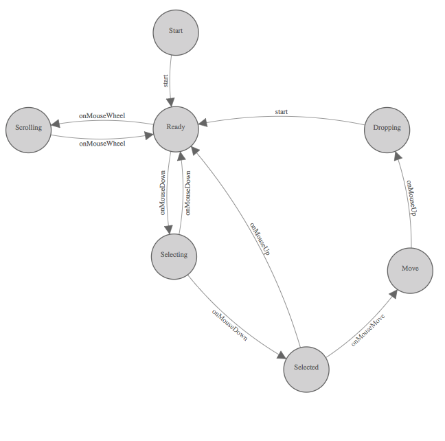

Getting Started With Network UI Development
===========================================


**Introduction**

The Networking UI component of AWX works differently from the rest of the AWX
web UI to support high-scale interactive graphical design of networking
topologies.

The Networking UI is a virtual graphical canvas where graphical elements are
drawn upon.  This canvas supports panning (scrolling horizontally and
vertically) and scaling (zooming in and out), dynamic changing of modes, and
other features that would be very difficult or impossible to implement with
standard HTML events and rendering.

This interface is more like computer graphics than it is building a styled text
document with interactive components.  A good grasp of Cartesian coordinates,
trigonometry, and analytic geometry are useful when working with this code.

* See: <https://en.wikipedia.org/wiki/Analytic_geometry>

**Design choices**

Certain design choices were made to make the UI performant and scale to a large
number of nodes in a diagram.  These include the use of simple ES5 functions for
better performance over more advanced functions.  For instance C-style for-loops
were many times faster than implementations of `forEach` or iterators which make
function calls during each iteration.  This basic ES5 style should be followed
throughout the implementation of the Network UI.

**AngularJS**

The Networking UI component uses AngularJS 1.6.x for part of the rendering pipeline
but it is not a normal AngularJS web application.  AngularJS makes use of
data-binding and watchers which I found do not scale to the number of elements
we are trying to support in the Networking UI.   The Networking UI only uses
AngularJS for SVG rendering (using AngularJS templates) which does scale
sufficiently.


**AngularJS Controllers**

Instead of creating many AngularJS controllers and directives the networking UI
uses one big controller to hold the state of the entire UI.  Normally this is
an anti-pattern in AngularJS.  Here is was necessary to scale to a large number
of on-screen elements.

**AngularJS Directives**

* See: <https://docs.angularjs.org/guide/directive>

AngularJS directives are used in the networking UI application using the element
matching style and the `templateUrl` option to include a template. A majority of
the directives are defined in `network.ui.app.js`.

* See: [network.ui.app.js](network.ui.app.js)
```
    .directive('awxNetDeviceDetail', deviceDetail.deviceDetail)
```

* See: [device.detail.directive.js](device.detail.directive.js)
```
function deviceDetail () {
  return { restrict: 'A', templateUrl: '/static/network_ui/widgets/device_detail.html' };
}
```

**AngularJS Templates**

* See: <https://docs.angularjs.org/guide/templates>

Normal AngularJS templates are used with the networking UI controller.  
The templates can be found in `/widgets`. Child
scopes are created for sub-templates using the `ng-repeat` directive.

In this example the `awx-net-link` directive expects a Link model to be
passed to it.  The Link model is defined in the `models.js` file.

* See: [link.directive.js](link.directive.js)
* See: [link.partial.svg](link.partial.svg)

* See: [network_ui.html](network_ui.partial.svg)
```
    <g ng-repeat="link in links">
    <g awx-net-link></g>
    </g>
```

* See: [models.js](models.js)
```
function Link(id, from_device, to_device, from_interface, to_interface) {
    this.id = id;
    this.from_device = from_device;
    this.to_device = to_device;
    this.from_interface = from_interface;
    this.to_interface = to_interface;
    this.selected = false;
    this.remote_selected = false;
    this.status = null;
    this.edit_label = false;
    this.name = "";
}
```
 
The following example sets the toolbox.selected_item value to the variable 
item which the directives used in the child scope expect to be set.

* See: [inventory_toolbox.html](inventory_toolbox.partial.svg)
```
<g ng-repeat="item in [toolbox.selected_item]">
```


**DOM (Document Object Model)**

No state is stored in or attached to the DOM.  All state is stored in
javascript objects attached to the network ui controller.

Direct DOM manipulation should not be used in the network UI unless absolutely
necessary. JQuery should not be used.  The DOM is generated through the use of
AngularJS templates.

**SVG (Scalable Vector Graphics)**

* See: <https://developer.mozilla.org/en-US/docs/Web/SVG>

The network UI is built as one large SVG element (the SVG canvas) with other
graphical elements (lines, circles, rectangles, paths, and text) absolutely
positioned within the outer most SVG element.  The browser is not involved with
layout of the elements within the SVG.   Each "widget" in the network UI needs
to track or calculate its own position on the SVG canvas. The z-level of the
elements are determined by the draw order on the canvas which is defined
in `network_ui.partial.svg`.  Elements drawn first will be hidden behind
elements drawn later.


**Rendering Pipeline**

Event -> Javscript objects -> AngularJS templates -> SVG

AngularJS is used to render the SVG inside the SVG canvas using directives
and templates.  AngularJS is also used to schedule when the SVG canvas will
be updated. When an input event comes from the user, or an event is received
over the websocket, javascript objects will be updated according the the network
UI code.  Then AngularJS will be notified that it needs to update the templates
either automatically for some events or explicitly using `$scope.$apply();` if
not handled automatically by AngularJS.  The templates will render to SVG and be
included in the DOM for the rest of the AWX UI.

Because the networking UI does not use watchers nor data-binding features of
AngularJS events flow in one way from event to javascript to angular to SVG.
Events do not flow backwards through this pipeline.

Clicking on an SVG element will not send the event to that SVG element directly
from the browser.   It must be routed through the network UI code first.


**SVG Primer**

SVG uses tags to define graphical elements just like HTML uses tags to define
text documents.   Commonly use tags include g, circle, rect, path, and text.
SVG elements are absolutely positioned within an SVG canvas.  The group tag, g,
is similar to the div tag in HTML.  Text in SVG must be contained in the text
tag and cannot be outside tags as in HTML.

* See: <https://developer.mozilla.org/en-US/docs/Web/SVG/Element>

Each tag that describes a visual element requires X and Y coordinates as input
to position that element. These coordinates are relative to position of the SVG
canvas. The network UI uses the entire page height and width for the SVG canvas
so that the position on the SVG on the canvas is the same as the position on
the page.


SVG supports graphical transformations on several tags to allow relative
positioning of sub-elements which makes calculating the X and Y positions
easier.   The network UI uses transformations often for this purpose.
Transformations that are often used here are the translate, scale, and rotate
transforms.  Translate moves the origin of the coordinate system to a new point
for the sub-elements.  Scale multiplies the size of the units in a coordinate
system by some factor.  Rotate performs a rotation about the origin by some
number of degrees.  These functions are converted to a matrix operation on the
coordinate system which can be efficiently applied.  It is often useful to use
the transforms to simplify the calculations of X and Y coordinates instead of
calculating those values in Javascript. Also these transforms make developing
widgets much easier since we only need to keep up with a single point for the
widget and all other points can be relatively positioned from that point.
Hard-coding positions in widget development is the normal case since transforms
can change the size and position of the widget when the widget is applied to
the canvas.  Only when necessary should we calculate positions of parts of a
widget in javascript.

* See: <https://developer.mozilla.org/en-US/docs/Web/SVG/Attribute/transform>


SVG paths are a mini-language for defining graphics operations in one tag. It
is often used to create shapes that are more complex than lines, rectangles,
and circles.  It is very useful for defining arcs.

* See: <https://developer.mozilla.org/en-US/docs/Web/SVG/Tutorial/Paths>

**SVG and CSS**

CSS and SVG work really nicely together for setting style, colors, and fonts in SVG.
The SVG uses different attributes for setting colors than does HTML elements.
Most SVG elements use `stroke` and `fill` to define the colors and `stroke-width`
to define the width of lines and curves. The attributes `font-family` and `font-size`
are used to set the font for text elements in SVG.  The network UI uses the Less
CSS compiler and BEM naming conventions to simplify and organize CSS.

* See: [style.less](style.less)
* See: <http://lesscss.org/>
* See: <http://getbem.com/introduction/>

**Events**

All mouse and keyboard events are captured by the outer most element of the
network UI.  Mouse movements, mouse clicks, and key presses are all routed by
the network UI code and not by the browser.  This is done to implement
interactions with the virtual graphical canvas that are not supported by the
browser.  "Simple" things like buttons and text fields have to be handled by
the network UI code instead of relying on the browser to route the mouse click
to the appropriate object.


The following code captures all the mouse movements, mouse clicks, mouse wheel,
and touch events and sends them to the corresponding network UI controller functions.

* See: [network_ui.partial.svg](network_ui.partial.svg#L3)

```
    <svg id="frame" class="NetworkUI"
         ng-attr-height="{{graph.height}}"
         ng-attr-width="{{graph.width}}"
         ng-mousedown="onMouseDown($event)"
         ng-mouseup="onMouseUp($event)"
         ng-mouseenter="onMouseEnter($event)"
         ng-mouseleave="onMouseLeave($event)"
         ng-mousemove="onMouseMove($event)"
         ng-mouseover="onMouseOver($event)"
         ng-touchstart="onTouchStart($event)"
         ng-touchmove="onTouchMove($event)"
         ng-touchend="onTouchEnd($event)"
         ng-tap="onTap($event)"
         msd-wheel="onMouseWheel($event, $delta, $deltaX, $deltaY)">
```


Key events are captured by the following code:

* See: [network.ui.controller.js](network.ui.controller.js)

```
    $document.bind("keydown", $scope.onKeyDown);
```

**Describing Behavior with Finite State Machines**

To implement complex UI interactions predictably and correctly is a tough
problem.  Often the problem is solved by creating a large library of generic
reusable components that are rigorously tested and hardened by a large group of
developers over a period of several years. Eventually the myriad bugs are
hammered out at great expense.  Only then can the UI components be reliably
used.  This code does not follow that approach.

The workflows this code supports require very specific UI components that are
not found in generic libraries.  The interactions we want to support are not
available in generic libraries.  This code develops from scratch only the
components that are necessary to implement the workflows of designing and
operating networks of devices.

This code defines those elements using finite state machines to process the
events from user input and other software components.  Programming with finite
state machines allows us to define formally complex behavior that would
normally be informally defined by branches, functions, object interactions, and
object inheritance.  Formal definition eliminates much of the unexpected
behavior that causes defects in the software.

* See: <https://en.wikipedia.org/wiki/Finite-state_machine>

Finite state machines can be represented as a directed graph of labeled nodes and labeled edges
which can be both be represented visually and in machine readable code.

The network UI uses finite state machines to describe what happens when the software receives
an input.

**Link FSM**


For example the link FSM describes how to connect devices with links. The FSM
diagram above maps out the states and events that will select a device to connect and another
device to connect to.  FSMs traditionally start in the `Start` state.  We get a free transition
to the `Ready` state by handling the special event called `start` and changing state to `Ready`.
Then when the `NewLink` event is received from a hot key or button click the FSM changes
state to the `Selecting` state.  On a `MouseUp` event the FSM changes to the the `Connecting` state
if the mouse is over a device icon otherwise it stays in the `Selecting` state.  In the `Connecting`
state the FSM changes to the `Connected` state when it receives a `MouseUp` event and the
mouse is over another device otherwise it goes back to the `Ready` state since the user  cancelled
the connecting operation.   Finally in the `Connected` state the FSM changes to the `Ready` state
for free using the `start` event so that the user can connect another set of devices.

* See: [designs/link.yml](designs/link.yml)
* See: [link.js](link.js)

The link FSM diagram has an equivalent machine readable representation in `designs/link.yml`. This
representation is useful for comparing the current implementation in `link.js` to the design to see if they
are out-of-sync.  If they are out-of-sync either the design or the implementation can be updated depending
on if you are changing the design or implementation first.

Tools are provided to facilitate the design-first and the implementation-first workflows.

**Design-First Workflow**

In the design-first workflow, first change the design and then update the
implementation to match.  In this workflow we use the
[fsm-designer-svg](https://github.com/benthomasson/fsm-designer-svg) tool to
change the FSM diagram, then export the FSM to a file, then generate a skeleton
of the javascript code that implements the FSM.  Then development of the logic
inside the event handlers can begin with a clear understanding of the state of
the system and what that event handler should do.

Use `tools/fsm_generate_diffs.py` to generate the new skeleton code:

```
    ./tools/fsm_generate_diffs.py designs/link.yml ./link.js
```

This will print out code for additional states or transitions needed in the implementation.
Copy those lines into the implementation code and fill out the event handler functions.


**Implementation-First Workflow**

In the implementation-first workflow, first change the code and then update the
design to reflect the changes.  This workflow is useful when the design doesn't
survive its impact with reality and the code adds additional requirements to
the design.  Often in usabilty testing we find that we forgot to consider
handling a certain interaction or user input in a state.  We can quickly add
that transition to the code and test it out.   Once confirmed that the interaction
is correct we can update the design and run `./tools/fsm-diff` to make sure the two
are in sync.


Use `./extract.js` and `tools/fsm-diff` to compare the implementation to the design
and add any additional transitions to the FSM design.

```
    ./extract.js link.js > ./extracted/link.yml
    ./tools/fsm-diff designs/link.yml extracted/link.yml
```


**Validating That Design Matches Implementation**

Use the `make extract` and `make diff` Makefile targets to do a mass extact of the
FSMs from the implementation and a mass comparison against the designs.  Take
note of any differences between design and implementation and update the appropriate
files as outlined in the workflows above.

```
    make extract; make diff
```


**Finite State Machine Implementation**

The implementation of a finite state machine in the network UI is split into
two parts: the declaration of the states and the event-handlers which may cause
FSM transitions using `controller.changeState`.

**FSM States**

* See: <https://en.wikipedia.org/wiki/Flyweight_pattern>
* See: <https://en.wikipedia.org/wiki/Singleton_pattern>

States are implemented using an object-oriented style in ES5 using the
flyweight and singleton patterns. This means that the state objects store no
information on themselves and that there is only one instance of each state
class.  All states should provide a `start` and `end` function which will be
called when a FSM state is entered and exited respectively. Subclassing
[fsm.State](fsm.js#L36) will provide empty `start` and `end` functions that
can be overridden as necessary.

* See: [fsm.js](fsm.js#L2)

The state variable is stored on another object called an FSMController (which
should not be confused with an AngularJS controller). The FSMController holds
all the state for each FSM instance.  If you need more than one copy of an FSM
(for buttons for instance) use more than one instance of FSMController and
pass the same FSM starting state to their constructor e.g. `button.Start`.
Variables other than `state` should not be stored on the FSMController. A
special variable named `scope` is useful for that. The scope can be used
to hold arbitrary data that the FSM code will use in addition to the messages
in the event handlers. In the network UI often the `scope` is a reference
to the network UI AngularJS controller's scope. In the case of a button
the scope is a reference to the `Button` model.

* See: [models.js](models.js#302)

The following code creates a new instance of `FSMController` using the
`Button` model as the scope and the `button.Start` state as the initial
state.

```
    this.fsm = new fsm.FSMController(this, button.Start, null);
```

* See: [link.js](link.js#L40)

This code block defines the `_Selecting` class in ES5 style and uses the
`inherits` NPM module to define that the class is a subclass of `_State`.  We
also create a single instance (a singleton) of this class named `Selecting`.

```
    function _Selecting () {
        this.name = 'Selecting';
    }
    inherits(_Selecting, _State);
    var Selecting = new _Selecting();
    exports.Selecting = Selecting;
```

**FSM Event Handlers and Transitions**

After all the states are defined the event handlers for those state classes can be defined.
We do this to prevent forward references in the file.

* See: [link.js](link.js#L134)

In this code we define an event handler for the `MouseUp` event on the `Selecting` state. This
code should select a single device if the mouse is over that device.  It should store
that device somewhere and change to the `Connecting` state. The code below creates a new
`Link` model and stores the `selected_device` in that object.  The `new_link` object is
stored in the `controller.scope` for later use in the FSM. Finally the event handler changes
state using `controller.changeState` to change the state of the FSM to `Connecting`.

Event handlers must start with the prefix of `on` and a suffix of the name of the messsage
type. The special functions `start` and `end` do not follow this rule nor do
they receive a message.

The event handler must also define its `transitions` as a list so that `./extract.js` can
find them.

```
    _Selecting.prototype.onMouseUp = function (controller) {

        var selected_device = controller.scope.select_items(false).last_selected_device;
        if (selected_device !== null) {
            controller.scope.new_link = new models.Link(controller.scope.link_id_seq(), selected_device, null, null, null, true);
            controller.scope.links.push(controller.scope.new_link);
            controller.changeState(Connecting);
        }
    };
    _Selecting.prototype.onMouseUp.transitions = ['Connecting'];

```

**FSM Designs**

All the finite state machines for the network UI have been designed using the
[fsm-designer-svg](https://github.com/benthomasson/fsm-designer-svg) tool
and their designs are stored in the `designs` directory.

* See: [designs/README.md](designs/README.md)


**Data Models**

There are two types of data structures used in the network UI: messages and
models.  Models are used for long-lived data that is used to render the UI
whereas messages are used for ephemeral data that is passed from one part of
the system to another.  Models may be unpacked or serialized into messages that
are sent to other FSMControllers in the client or sent over a websocket to the
server.

* See: [models.js](models.js)

The models defined in [models.js](models.js) are:

* Device - a networking device i.e. a router, a switch, or a host
* Interface - a networking interface
* Link - a connection between interfaces
* Button - a UI button
* ToggleButton - a togglable UI button
* Task - a playbook task
* Group - a grouping of devices
* ToolBox - a UI element for holding things that can be placed on the virtual canvas
* Configuration - a configuration for a device
* Process - an application running on a device
* Stream - a flow of data between applications


**Message Types**

Message types define the structure of the data that is passed between the server
and the client and between different parts of the client. This provides a known and
well defined data structure that can be counted up on the code.

* See: [messages.js](messages.js)

The messages defined are [messages.js](messages.js):

* DeviceMove - Device has changed x,y position
* DeviceCreate - A device was created
* DeviceDestroy - A device was destroyed
* DeviceLabelEdit - The label of a device was changed
* DeviceSelected - A device was selected
* DeviceUnSelected - A device was unselected
* InterfaceCreate - An interface was created
* InterfaceLabelEdit - The label of an interface was changed
* LinkLabelEdit - The label of a link was changed
* LinkCreate - A link was created
* LinkDestroy - A link was destroyed
* LinkSelected - A link was selected
* LinkUnSelected -  A link was unselected
* Undo - Undo the last operation
* Redo - Redo the last undone operation
* Deploy - Call the deploy playbook
* Destroy - Call the destroy playbook
* Discover - Call the discover playbook
* Layout - Call the layout function
* MultipleMessage - A collection of messages that should be handled together
* Coverage - A coverage report
* MouseEvent - A generic mouse event
* MouseWheelEvent  - A mouse wheel event
* KeyEvent - A key press event
* TouchEvent - A touch screen event
* StartRecording - Start recording user interactions
* StopRecording - Stop recording user interactions
* ViewPort - Update the view port onto the virtual canvas
* NewDevice - Request for a new device
* PasteDevice - Paste a device from a toolbox
* PasteProcess - Paste a process from a toolbox
* NewGroup - Request for a new group
* PasteGroup - Paste a group from a toolbox
* PasteRack - Paste a rack from a toolbox
* PasteSite - Paste a site from a toolbox
* CopySite - Copy a stie to a toolbox
* GroupMove - A group has changed its x, y coordinates
* GroupCreate - A new group was created
* GroupDestroy - A group was destroyed
* GroupLabelEdit - The label for a group was changed
* GroupSelected - A group was selected
* GroupUnSelected - A group was unselected
* GroupMembership - The device membership of a group changed
* TableCellEdit - A table cell was chaged
* ProcessCreate - A new process was created
* StreamCreate - A new stream was created
* StreamDestroy - A stream was destroyed
* StreamLabelEdit - The label of a stream was changed
* StreamSelected - A stream was selected
* StreamUnSelected - A stream was unselected

**Message Passing**

Messages are passed along channels between FSMs and over the websocket to and
from the server. Messages from the server over the web socket and user input
events from the web browser are passed to the `first_channel` where they are
passed along the chain of FSMControllers until they reach the end with
`NullChannel` or they are handled and the models are updated.

* See: [network.ui.controller.js](network.ui.controller.js#L115)

The order (from first to last) of message handling is:

* Mode FSM
* Site Toolbox FSM
* Rack Toolbox FSM
* Inventory Toolbox FSM
* App Toolbox FSM
* Time FSM
* Buttons FSM
* Site FSM
* Rack FSM
* Group FSM
* Stream FSM
* Link FSM
* Move FSM
* Device Detail FSM
* View FSM
* Null FSM


Widget Development
==================

When developing a new UI widget follow this process:

For a widget named `new widget` do this:

* Add a template in `widgets` for the new widget with name `new_widget.html`
* Add a directive that loads that template in `src` with name `new.widget.directive.js`
* Register the directive with the network UI application in `src/network.ui.app.js` using name `awxNetNewWidget`
* Add a tag that loads the directive into an existing template in `widgets`.  If you are not sure add it to `widgets/network_ui.html`.
* Test that the directive is loaded when the page renders in a browser
* Iterate on the template for the new widget until the UI look matches the mockup
* Design the interaction behavior using [fsm-designer-svg](https://github.com/benthomasson/fsm-designer-svg)
* Export the FSM design to `designs` in a file named `designs/new_widget.yml`
* Create a new empty FSM implementation file in `src` named `src/new.wiget.fsm.js`
* Use the `./tools/fsm_generate_diffs.py` tool to generate the skeleton for the new FSM implementation
* Decide if you need any new data structures for your UI widget. If so, add them to `src/models.js`.
* Decide if you need any new messages to communicate between the UI and the server or between pieces of the UI.
  If so, add them to `src/messages.js`
* Add the FSM implementation to a FSMController in `src/network.ui.controller.js`
* Write the logic in the event handlers to update the models, send any messages, and change states according to the design.
* Test the interaction manually in a browser
* Iterate on changing the event handlers until the desired interaction is acheived
* Update the design to match the implementation

**Widget Development Example**

This example follows development of the inventory toolbox widget.

* Add a template in `widgets` for the new widget with name [inventory_toolbox.partial.svg](inventory_toolbox.partial.svg)

```
    <!-- Copyright (c) 2017 Red Hat, Inc. -->

    <g ng-if="toolbox.enabled">
    <rect class="NetworkUI__toolbox"
          ng-attr-x="{{toolbox.x}}"
          ng-attr-y="{{toolbox.y}}"
          ng-attr-width="{{toolbox.width}}"
          ng-attr-height="{{toolbox.height}}"
          rx=5></rect>
    ...
    </g> <!-- ng-if toolbox.enabled -->
```

* Add a directive that loads that template in `src/network-ui` with name [inventory.toolbox.directive.js](inventory.toolbox.directive.js)

```
    /* Copyright (c) 2017 Red Hat, Inc. */

    function inventoryToolbox () {
      return { restrict: 'A', templateUrl: '/static/network_ui/widgets/inventory_toolbox.html' };
    }
    exports.inventoryToolbox = inventoryToolbox;
```


* Register the directive with the network UI application in [network.ui.app.js](network.ui.app.js#L61) using name `awxNetInventoryToolbox`

```
...
    var inventoryToolbox = require('./inventory.toolbox.directive.js');
...
    .directive('awxNetInventoryToolbox', inventoryToolbox.inventoryToolbox)
...
```

* Add a tag that loads the directive into an existing template in `src/network-ui` in [network_ui.partial.svg](network_ui.partial.svg#L94)

```
        <g awx-net-inventory-toolbox></g>
```

* Test that the directive is loaded when the page renders in a browser
* Iterate on the template for the new widget until the UI look matches the mockup
* Design the interaction behavior using [fsm-designer-svg](https://github.com/benthomasson/fsm-designer-svg)



* Export the FSM design to `designs` in a file named `designs/toolbox.yml`

```
    finite_state_machine_id: 14
    name: toolbox
    states:
    - id: 2
      label: Selected
      x: 1180
      y: 959
    - id: 6
      label: Move
      x: 1409
      y: 741
    - id: 3
      label: Ready
      x: 892
      y: 429
    - id: 4
      label: Scrolling
      x: 567
      y: 431
    - id: 5
      label: Start
      x: 892
      y: 216
    - id: 7
      label: Selecting
      x: 888
      y: 710
    - id: 1
      label: Dropping
      x: 1358
      y: 431
    transitions:
    - from_state: Selecting
      label: onMouseDown
      to_state: Selected
    - from_state: Selected
      label: onMouseMove
      to_state: Move
    - from_state: Selecting
      label: onMouseDown
      to_state: Ready
    - from_state: Selected
      label: onMouseUp
      to_state: Ready
    - from_state: Dropping
      label: start
      to_state: Ready
    - from_state: Start
      label: start
      to_state: Ready
    - from_state: Scrolling
      label: onMouseWheel
      to_state: Ready
    - from_state: Ready
      label: onMouseWheel
      to_state: Scrolling
    - from_state: Ready
      label: onMouseDown
      to_state: Selecting
    - from_state: Move
      label: onMouseUp
      to_state: Dropping
```

* Create a new empty FSM implementation file in `src/network-ui` named `toolbox.fsm.js`

```
    touch toolbox.fsm.js
```

* Use the `./tools/fsm_generate_diffs.py` tool to generate the skeleton for the new FSM implementation

```
    ./tools/fsm_generate_diffs.py designs/toolbox.yml src/toolbox.fsm.js --append
```


```
    var inherits = require('inherits');
    var fsm = require('./fsm.js');

    function _State () {
    }
    inherits(_State, fsm._State);


    function _Start () {
        this.name = 'Start';
    }
    inherits(_Start, _State);
    var Start = new _Start();
    exports.Start = Start;

    function _Selected () {
        this.name = 'Selected';
    }
    inherits(_Selected, _State);
    var Selected = new _Selected();
    exports.Selected = Selected;

    function _Dropping () {
        this.name = 'Dropping';
    }
    inherits(_Dropping, _State);
    var Dropping = new _Dropping();
    exports.Dropping = Dropping;

    function _Ready () {
        this.name = 'Ready';
    }
    inherits(_Ready, _State);
    var Ready = new _Ready();
    exports.Ready = Ready;

    function _Selecting () {
        this.name = 'Selecting';
    }
    inherits(_Selecting, _State);
    var Selecting = new _Selecting();
    exports.Selecting = Selecting;

    function _Move () {
        this.name = 'Move';
    }
    inherits(_Move, _State);
    var Move = new _Move();
    exports.Move = Move;

    function _Scrolling () {
        this.name = 'Scrolling';
    }
    inherits(_Scrolling, _State);
    var Scrolling = new _Scrolling();
    exports.Scrolling = Scrolling;


    _Start.prototype.start = function (controller) {

        controller.changeState(Ready);

    };
    _Start.prototype.start.transitions = ['Ready'];


    _Selected.prototype.onMouseMove = function (controller) {

        controller.changeState(Move);

    };
    _Selected.prototype.onMouseMove.transitions = ['Move'];

    _Selected.prototype.onMouseUp = function (controller) {

        controller.changeState(Ready);

    };
    _Selected.prototype.onMouseUp.transitions = ['Ready'];


    _Dropping.prototype.start = function (controller) {

        controller.changeState(Ready);

    };
    _Dropping.prototype.start.transitions = ['Ready'];


    _Ready.prototype.onMouseDown = function (controller) {

        controller.changeState(Selecting);

    };
    _Ready.prototype.onMouseDown.transitions = ['Selecting'];

    _Ready.prototype.onMouseWheel = function (controller) {

        controller.changeState(Scrolling);

    };
    _Ready.prototype.onMouseWheel.transitions = ['Scrolling'];


    _Selecting.prototype.onMouseDown = function (controller) {

        controller.changeState(Ready);

        controller.changeState(Selected);

    };
    _Selecting.prototype.onMouseDown.transitions = ['Ready', 'Selected'];


    _Move.prototype.onMouseUp = function (controller) {

        controller.changeState(Dropping);

    };
    _Move.prototype.onMouseUp.transitions = ['Dropping'];


    _Scrolling.prototype.onMouseWheel = function (controller) {

        controller.changeState(Ready);

    };
    _Scrolling.prototype.onMouseWheel.transitions = ['Ready'];
    };
    _Ready.prototype.onMouseWheel.transitions = ['Scrolling'];


    _Selecting.prototype.onMouseDown = function (controller) {

        controller.changeState(Ready);

        controller.changeState(Selected);

    };
    _Selecting.prototype.onMouseDown.transitions = ['Ready', 'Selected'];


    _Move.prototype.onMouseUp = function (controller) {

        controller.changeState(Dropping);

    };
    _Move.prototype.onMouseUp.transitions = ['Dropping'];


    _Scrolling.prototype.onMouseWheel = function (controller) {

        controller.changeState(Ready);

    };
    _Scrolling.prototype.onMouseWheel.transitions = ['Ready'];

```

* Decide if you need any new data structures for your UI widget. If so, add them to [src/models.js](src/models.js#L608).

```
    function ToolBox(id, name, type, x, y, width, height) {
        this.id = id;
        this.name = name;
        this.type = type;
        this.x = x;
        this.y = y;
        this.width = width;
        this.height = height;
        this.items = [];
        this.spacing = 200;
        this.scroll_offset = 0;
        this.selected_item = null;
        this.enabled = true;
    }
    exports.ToolBox = ToolBox;
```

* Decide if you need any new messages to communicate between the UI and the server or between pieces of the UI.
  If so, add them to [messages.js](messages.js#L251)

```
    function PasteDevice(device) {
        this.device = device;
    }
    exports.PasteDevice = PasteDevice;
```

* Write the logic in the event handlers to update the models, send any messages, and change states according to the design.

See: [toolbox.fsm.js](toolbox.fsm.js)

* Add the FSM implementation to a FSMController in [network.ui.controller.js](network.ui.controller.js#L145)

```
    $scope.inventory_toolbox_controller = new fsm.FSMController($scope, toolbox_fsm.Start, $scope.app_toolbox_controller);
```

* Test the interaction manually in a browser
* Iterate on changing the event handlers until the desired interaction is achieved
* Update the design to match the implementation
