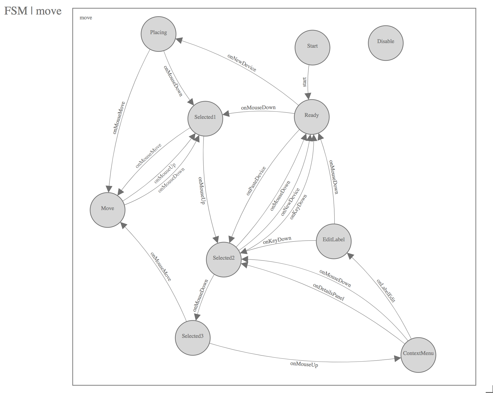

Finite State Machine Designs
============================

This directory contains the finite state machine designs that were used to
generate the skeleton of the javascript implementations and can be used to
check that the implementations still match the designs.

**Machine Readable FSM Schema**

The machine readable FSM schema contains three top-level elements: `name`, `states`, and `transitions`.
* The `name` element is a string.
* The `states` element contains a list of `state` elements which have attributes `id`, `label`, and `x`, and `y`.
* The `transitions` element contains a list of `transition` elements which have attributes `from_state`, `to_state`, and `label`.

**Design Diagrams**

The diagrams below are visual representations of the finite state machine designs in this directory.
The equivalent machine readable representations are linked as well.

---

**Null FSM**
* See: null.yml

The null FSM is an FSM that ignores all events.

---

**Button FSM**
* See: button.yml

The button FSM describes how a button works. The key insight here is that a button is not
clicked if the mouse is not over the button on both the `MouseDown` and `MouseUp` events. Moving
the mouse off the button before `MouseUp` is not a click.

---

**Buttons FSM**
* See: buttons.yml

The buttons FSM distributes events to the buttons which each have their own FSM.

---

**Device Detail FSM**
* See: device_detail.yml

The device detail FSM describes interactions when zoomed into a device.

---

**Group FSM**
* See: group.yml

The group FSM describes how to organize multiple devices together in a group.

---

**Hot Keys FSM**
* See: hotkeys.yml

The hot keys FSM handles key events and generates new events like `NewLink` to implement
hot keys.

---

**Link FSM**
* See: link.yml

The link FSM connects two devices together with a link.

---

**Mode FSM**
* See: mode.yml

The mode FSM controls the overall mode of the network UI application.

---

**Move FSM**
* See: move.yml

The move FSM controls placement of devices as well as editing the device labels.

---

**Rack FSM**
* See: rack.yml

The rack FSM controls organizing devices into a special group called a rack.

---

**Site FSM**
* See: site.yml

The site FSM controls organizing devices into a special group called a site.

---

**Stream FSM**
* See: stream.yml

The stream FSM controls how streams are defined between devices.

---

**Time FSM**
* See: time.yml

The time FSM controls undo/redo functionality of the network UI.

---

**Toolbox FSM**
* See: toolbox.yml

The toolbox FSM controls the drag-and-drop toolboxes and allow placement of new devices, applications,
racks, and sites onto the canvas.

---

**View FSM**
* See: view.yml

The view FSM controls the panning and scaling of the the virtual canvas through clicking-and-dragging
of the background and scrolling the mousewheel.

