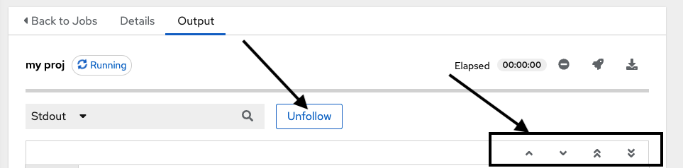
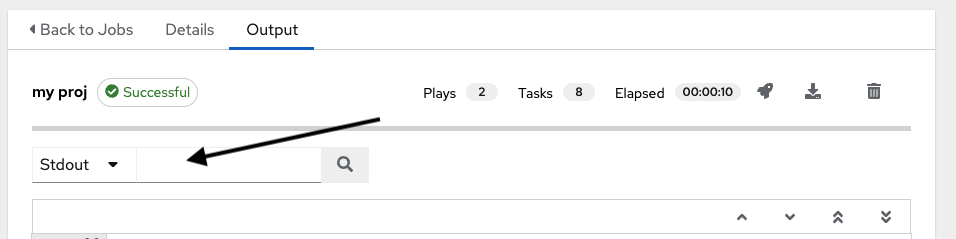

This document is meant to provide some guidance into the functionality of Job Output and its features.

## Overview of the feature/screen. Summary of what it does/is

Joboutput is a feature that allows users to see how their job is doing as it is being run.
This feature displays data sent to the UI via websockets that are connected to several
different endpoints in the API.

The job output has 2 different states that result in different functionality. One state
is when, the job is actively running. There is limited functionality because of how the
job events are processed when they reach the UI. While the job is running, and
output is coming into the UI, the following features turn off:

1. [Search](#Search)- The ability to search the output of a job.
2. [Expand/Collapse](#Expand/Collapse)- The ability to expand and collapse job events, tasks, plays, or even the
   job itself. The only part of the job ouput that is not collapsable is the playbook summary (only jobs that
   are executed from a Job Template have Expand/Collapse functionality).

The following features are enabled:

1. Follow/unfollow - `Follow` indicates you are streaming the output on the screen
   as it comes into the UI. If you see some output that you want to examine closer while the job is running
   scroll to it, and click `Unfollow`, and the output will stop streaming onto the screen. This feature is only
   enabled when the job is running and is not complete. If the user scrolls up in the output the UI will unfollow.
2. Page up and page down buttons- Use these buttons to navigate quickly up and down the output.

After the job is complete, the Follow/Unfollow button disabled, and Expand/Collapse and Search become enabled.

Not all job types are created equal. Some jobs have a concept of parent-child events. Job events can be inside a Task,
a Task can be inside a Play, and a Play inside a Playbook. Leveraging this concept to enable Expand/Collapse for these
job types, allows you to collapse and hide the children of a particular line of output. This parent-child event
relationship only exists on jobs executed from a job template. All other types of jobs do not
have this event concept, and therefore, do not have Expand/Collapse functionality. By default all job
events are expanded.

## How output works generally.

1. Explain the different state components
2. Page up and page down and what’s happening in the background.

## Different type of job events, and how they relate to the state object

1. Tasks
2. plays
3. events

## Non-standard cases

1. When an event comes into the output that has a parent, but the parent hasn’t arrived yet.
2. When an event with children arrives in output, but the children are not yet present.

## Expand/Collapse

### Expand collapse a single event - how it works and how it changes the state object

### Expand collapse all - how it works and how it changes the state object

## Search

1. During job run
2. After job run
