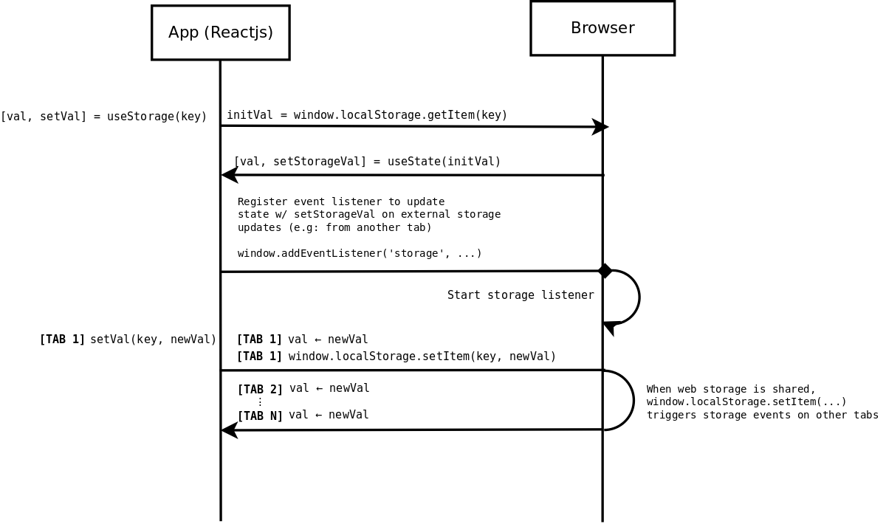
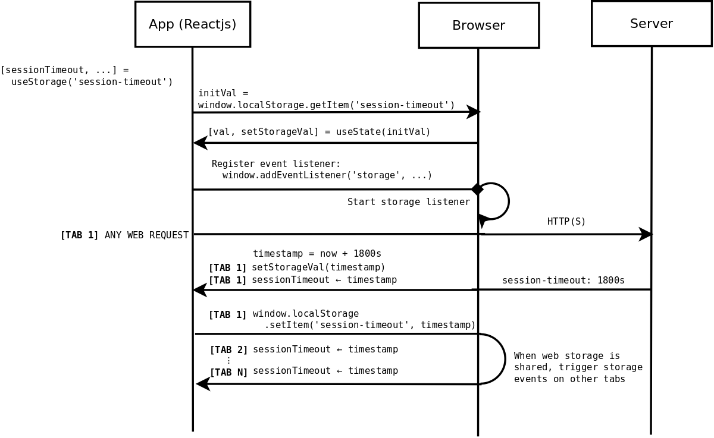

# Application Architecture

## Local Storage Integration
The `useStorage` hook integrates with the browser's localStorage api.
It accepts a localStorage key as its only argument and returns a state
variable and setter function for that state variable. The hook enables
bidirectional data transfer between tabs via an event listener that
is registered with the Web Storage api.

The `useStorage` hook currently lives in the `AppContainer` component. It
can be relocated to a more general location should and if the need
ever arise

## Session Expiration
Session timeout state is communicated to the client in the HTTP(S)
response headers. Every HTTP(S) response is intercepted to read the
session expiration time before being passed into the rest of the
application. A timeout date is computed from the intercepted HTTP(S)
headers and is pushed into local storage, where it can be read using
standard Web Storage apis or other utilities, such as `useStorage`.

