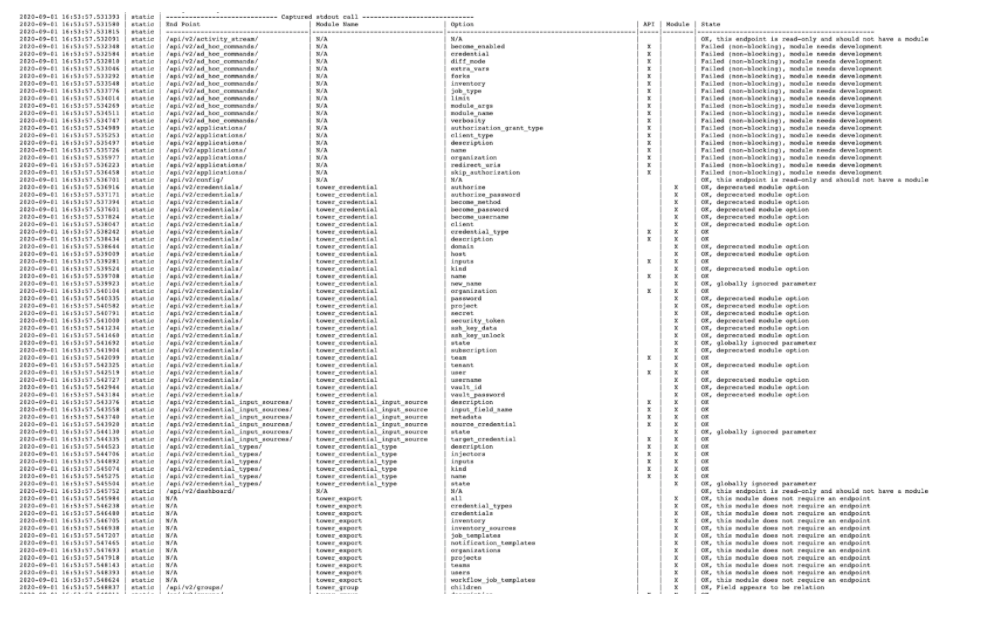

# Testing the AWX Collection

We strive to have test coverage for all modules in the AWX Collection. The `/test` and `/tests` directories contain unit and integration tests, respectively. Tests ensure that any changes to the AWX Collection do not adversely affect expected behavior and functionality.

When trying to fix a bug, it is best to replicate its behavior within a test with an assertion for the desired behavior. After that, edit the code and running the test to ensure your changes corrected the problem and did not affect anything else.


## Unit Tests

The unit tests are stored in the `test/awx` directory and, where possible, test interactions between the collections modules and the AWX database. This is achieved by  using a Python testing suite and having a mocked layer which emulates interactions with the API. You do not need a server to run these unit tests. The depth of testing is not fixed and can change from module to module.

Let's take a closer look at the `test_token.py` file (which tests the `token` module):

```
from __future__ import absolute_import, division, print_function

__metaclass__ = type

import pytest

from awx.main.models import OAuth2AccessToken


@pytest.mark.django_db
def test_create_token(run_module, admin_user):

    module_args = {
        'description': 'barfoo',
        'state': 'present',
        'scope': 'read',
        'controller_host': None,
        'controller_username': None,
        'controller_password': None,
        'validate_certs': None,
        'controller_oauthtoken': None,
        'controller_config_file': None,
    }

    result = run_module('token', module_args, admin_user)
    assert result.get('changed'), result

    tokens = OAuth2AccessToken.objects.filter(description='barfoo')
    assert len(tokens) == 1, 'Tokens with description of barfoo != 0: {0}'.format(len(tokens))
    assert tokens[0].scope == 'read', 'Token was not given read access'
```

This test has a single test called `test_create_token`. It creates a `module_args` section which is what will be passed into our module. We then call `run_module`, asking it to run the `token` module with the `module_args` we created and give us back the results. After that, we run an assertion to validate that our module did in fact report a change to the system. We will then use Python objects to look up the token that has a description of `barfoo` (which was in our arguments to the module). We want to validate that we only got back one token (the one we created) and that the scope of the token we created was read.


### Completion Test

The completeness check is run from the unit tests and can be found in `awx_collection/tests/awx/test_completness.py`. It compares the CRUD modules to the API endpoints and looks for discrepancies in options between the two.

For example, when creating a new module for an endpoint and the module has parameters A, B and C, and the endpoint supports options A, B and D, then errors around parameter C and option D being mismatched would come up.

A completeness failure will generate a large ASCII table in the Zuul log indicating what is going on:



To find the error, look at the last column and search for the term "failure". There will most likely be some failures which have been deemed acceptable and will typically say "non-blocking" next to them. Those errors can be safely ignored.


## Integration Tests

Integration tests are stored in the `/tests` directory and will be familiar to Ansible developers as these tests are executed with the ansible-test command line program.

Inside the `/tests` directory, there are two folders:

- `/integration`
- `/sanity`

In the `/sanity` folder are file directives for specific Ansible versions which contain information about which tests to skip for specific files. There are a number of reasons you may need to skip a sanity test. See the [`ansible-test` documentation](https://docs.ansible.com/ansible/latest/dev_guide/testing_running_locally.html) for more details about how and why you might want to skip a test.

In the `integration/targets` folder you will see directories (which act as roles) for all of the different modules and plugins. When the collection is tested, an instance of Automation Platform Controller (or AWX) will be spun up and these roles will be applied to the target server to validate the functionality of the modules. Since these are really roles, each directory will contain a tasks folder under it with a `main.yml` file as an entry point.

While not strictly followed, the general flow of a test should be:

- **Generate a test ID**

```
- name: Generate test id
  set_fact:
    test_id: "{{ lookup('password', '/dev/null chars=ascii_letters length=16') }}"
```

- **Generate names for any objects this test will create**

```
- name: Generate names
  set_fact:
    group_name1: "AWX-Collection-tests-instance_group-group1-{{ test_id }}"
    group_name2: "AWX-Collection-tests-instance_group-group2-{{ test_id }}"
    cred_name1: "AWX-Collection-tests-instance_group-cred1-{{ test_id }}"
```

- **Non-creating tests (i.e. test for specific error conditions, etc), with assertion**

```
- name: Try to use a token as a dict which is missing the token parameter
  job_list:
    controller_oauthtoken:
      not_token: "This has no token entry"
  register: results
  ignore_errors: true

- assert:
    that:
      - results is failed
      - '"The provided dict in controller_oauthtoken did not properly contain the token entry" == results.msg'
```

- **`Block:`**
  - Run test which creates/modifies/deletes object(s)
```
    - name: Create a container group
      instance_group:
        name: "{{ group_name2 }}"
        credential: "{{ cred_result.id }}"
      register: result
```
  - Assert proper results were returned
```
    - assert:
        that:
          - "result is changed"
```

- **`Always:`**
  - Cleanup created objects
```
    - name: Delete the credential
      credential:
        name: "{{ cred_name1 }}"
        organization: "Default"
        credential_type: "OpenShift or Kubernetes API Bearer Token"
```
  - Assert cleanup worked properly (if needed)

When writing an integration test, a test of asset type A does not need to make assertions for asset type B. For example, if you are writing an integration test for a credential and you create a custom credential type, you do not need to assert that the `credential_type` call properly worked, you can assume it will. In addition, when cleaning up and deleting the `credential_type`, you do not need to assert that it properly deleted the credential type.


## Running Unit Tests

You can use the `Makefile` to run unit tests. In addition to the `make` command, you need a virtual environment with several requirements installed. These requirements are outlined in the [`awx_collection/README.md`](https://github.com/ansible/awx/blob/devel/awx_collection/README.md) file.

> **Note:** The process for the installation will differ depending on OS and version.

Once your environment is completely established, you can run all of the unit tests with the command (your results may vary):

```
$ make test_collection
rm -f /home/student1/virtuelenvs//awx/lib/python3.6/no-global-site-packages.txt
if [ "/home/student1/virtuelenvs/" ]; then \
        . /home/student1/virtuelenvs//awx/bin/activate; \
fi; \
py.test awx_collection/test/awx -v
==================================== test session starts ====================================
platform linux -- Python 3.6.8, pytest-6.1.0, py-1.9.0, pluggy-0.13.1 -- /home/student1/virtuelenvs/awx/bin/python
cachedir: .pytest_cache
django: settings: awx.settings.development (from ini)
rootdir: /home/student1/awx, configfile: pytest.ini
plugins: cov-2.10.1, django-3.10.0, pythonpath-0.7.3, mock-1.11.1, timeout-1.4.2, forked-1.3.0, xdist-1.34.0
collected 116 items

awx_collection/test/awx/test_application.py::test_create_application PASSED                [  0%]
awx_collection/test/awx/test_completeness.py::test_completeness PASSED                     [  1%]

...

==================================== short test summary info ====================================
FAILED awx_collection/test/awx/test_job_template.py::test_create_job_template - AssertionError: assert {'changed': T...'name': 'foo'} == {'changed': T...
FAILED awx_collection/test/awx/test_job_template.py::test_job_template_with_new_credentials - assert 16 == 14
FAILED awx_collection/test/awx/test_job_template.py::test_job_template_with_survey_spec - assert 11 == 9
FAILED awx_collection/test/awx/test_module_utils.py::test_version_warning - SystemExit: 1
FAILED awx_collection/test/awx/test_module_utils.py::test_type_warning - SystemExit: 1
====================== 5 failed, 106 passed, 5 skipped, 56 warnings in 48.53s ===================
make: *** [Makefile:382: test_collection] Error 1
```

In addition to running all of the tests, you can also specify specific tests to run. This is useful when developing a single module. In this example, we will run the tests for the `token` module:

```
$ pytest awx_collection/test/awx/test_token.py
============================ test session starts ============================
platform darwin -- Python 3.7.0, pytest-3.6.0, py-1.8.1, pluggy-0.6.0
django: settings: awx.settings.development (from ini)
rootdir: /Users/jowestco/junk/awx, inifile: pytest.ini
plugins: xdist-1.27.0, timeout-1.3.4, pythonpath-0.7.3, mock-1.11.1, forked-1.1.3, django-3.9.0, cov-2.8.1
collected 1 item                                                                                                                                                  

awx_collection/test/awx/test_token.py .                               [100%]

========================= 1 passed in 1.72 seconds =========================
```


## Running Integration Tests

For integration tests, you will need an existing AWX or Automation Platform Controller instance to run the test playbooks against. You can write a simple `run_it.yml` playbook to invoke the main method:

```
---
- name: Run Integration Test
  hosts: localhost
  connection: local
  gather_facts: False
  environment:
      TOWER_HOST: <URL>
      TOWER_USERNAME: <username>
      TOWER_PASSWORD: <password>
      TOWER_VERIFY_SSL: False
  collections:
    - awx.awx

  tasks:
    - include_tasks: main.yml
```

Place this file in the `/tasks` directory of the test playbook you'd like to run (i.e., `awx/awx_collection/tests/integration/targets/ad_hoc_command_cancel/tasks/`; a test playbook named `main.yml` must be in the same directory).

The `run_it.yml` playbook will set up your connection parameters via environment variables and then invoke the `main.yml` play of the role.

The output below is what should ideally be seen when running an integration test:

```
$ ansible-playbook run_it.yml

PLAY [Run Integration Test] *******************************************************************************

TASK [include_tasks] **************************************************************************************
included: /home/student1/awx/awx_collection/tests/integration/targets/demo_data/tasks/main.yml for localhost

TASK [Assure that default organization exists] *************************************************************
[WARNING]: You are using the awx version of this collection but connecting to Red Hat Ansible Tower
ok: [localhost]

TASK [HACK - delete orphaned projects from preload data where organization deleted] ************************

TASK [Assure that demo project exists] *********************************************************************
changed: [localhost]

TASK [Assure that demo inventory exists] *******************************************************************
changed: [localhost]

TASK [Create a Host] ***************************************************************************************
changed: [localhost]

TASK [Assure that demo job template exists] *****************************************************************
changed: [localhost]

PLAY RECAP **************************************************************************************
localhost: ok=6    changed=4    unreachable=0    failed=0    skipped=1    rescued=0    ignored=0
```

You should see the tasks from the integration test run as expected.

It is critical to keep in mind that the integration tests run against the _installed_ version of the collection, not against the files in `~/awx/awx_collection/plugins/modules`. Because of this, you need to build your development version of the collection by running `make install_collection` prior to running a test against it or your results may vary.

In order to avoid having to rebuild every time, you can attempt to run `make symlink_collection`. This will symlink your development directory into the Ansible-installed collection location.

> **Note:** Collections and symlinks can be unstable.
