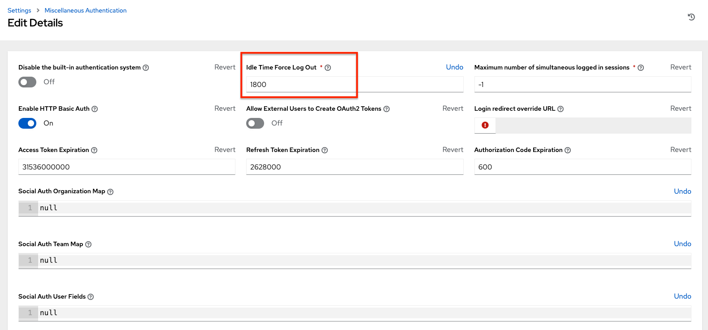

Changing the Default Timeout for Authentication
=================================================

.. index::
   pair: troubleshooting; authentication timeout
   pair: authentication timeout; changing the default
   single: authentication token
   single: authentication expiring
   single: log
   single: login timeout
   single: timeout login
   pair: timeout; session

The default length of time, in seconds, that your supplied token is valid can be changed in the System Settings screen of the AWX user interface:

1. Click the **Settings** from the left navigation bar.  

3. Click **Miscellaneous Authentication settings** under the System settings.

3. Click **Edit**.

4. Enter the timeout period in seconds in the **Idle Time Force Log Out** text field.

4. Click **Save** to apply your changes.

.. note::

  If you are accessing AWX directly and are having trouble getting your authentication to stay, in that you have to keep logging in over and over, try clearing your web browser's cache. In situations like this, it is often found that the authentication token has been cached in the browser session and must be cleared.
