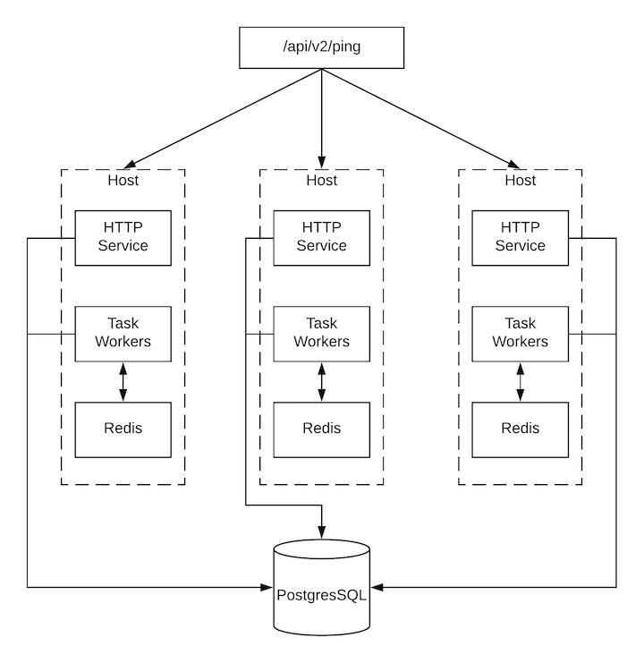

.. _ag_clustering:

Clustering
============

.. index::
   pair: redundancy; instance groups
   pair: redundancy; clustering

Clustering is sharing load between hosts. Each instance should be able to act as an entry point for UI and API access. This should enable AWX administrators to use load balancers in front of as many instances as they wish and maintain good data visibility.

.. note::
  Load balancing is optional and is entirely possible to have ingress on one or all instances as needed. The ``CSRF_TRUSTED_ORIGIN`` setting may be required if you are using AWX behind a load balancer. See :ref:`ki_csrf_trusted_origin_setting` for more detail.

Each instance should be able to join AWX cluster and expand its ability to execute jobs. This is a simple system where jobs can and will run anywhere rather than be directed on where to run. Also, clustered instances can be grouped into different pools/queues, called :ref:`ag_instance_groups`.

Setup Considerations
---------------------

.. index::
   single: clustering; setup considerations
   pair: clustering; PostgreSQL

This section covers initial setup of clusters only. For upgrading an existing cluster, refer to the |atumg|.

Important considerations to note in the new clustering environment:

- PostgreSQL is still a standalone instance and is not clustered. AWX does not manage replica configuration or database failover (if the user configures standby replicas). 

- When spinning up a cluster, the database node should be a standalone server, and PostgreSQL should not be installed on one of AWX nodes.

- PgBouncer is not recommended for connection pooling with AWX. Currently, AWX relies heavily on ``pg_notify`` for sending messages across various components, and therefore, PgBouncer cannot readily be used in transaction pooling mode.

- The maximum supported instances in a cluster is 20.

- All instances should be reachable from all other instances and they should be able to reach the database. It is also important for the hosts to have a stable address and/or hostname (depending on how the AWX host is configured).

- All instances must be geographically collocated, with reliable low-latency connections between instances.

- For purposes of upgrading to a clustered environment, your primary instance must be part of the ``default`` group in the inventory *AND* it needs to be the first host listed in the ``default`` group.

- Manual projects must be manually synced to all instances by the customer, and updated on all instances at once.

- The ``inventory`` file for platform deployments should be saved/persisted. If new instances are to be provisioned, the passwords and configuration options, as well as host names, must be made available to the installer.

Scaling the Web and Task pods independently 
--------------------------------------------

You can scale replicas up or down for each deployment by using the ``web_replicas`` or ``task_replicas`` respectively. You can scale all pods across both deployments by using ``replicas`` as well. The logic behind these CRD keys acts as such:

- If you specify the ``replicas`` field, the key passed will scale both the ``web`` and ``task`` replicas to the same number. 
- If ``web_replicas`` or ``task_replicas`` is ever passed, it will override the existing ``replicas`` field on the specific deployment with the new key value.

These new replicas can be constrained in a similar manner to previous single deployments by appending the particular deployment name in front of the constraint used. More about those new constraints can be found below in the :ref:`ag_assign_pods_to_nodes` section. 

.. _ag_assign_pods_to_nodes:

Assigning AWX pods to specific nodes
-------------------------------------

You can constrain the AWX pods created by the operator to run on a certain subset of nodes. ``node_selector`` and ``postgres_selector`` constrains the AWX pods to run only on the nodes that match all the specified key/value pairs. ``tolerations`` and ``postgres_tolerations`` allow the AWX pods to be scheduled onto nodes with matching taints. The ability to specify ``topologySpreadConstraints`` is also allowed through ``topology_spread_constraints`` If you want to use affinity rules for your AWX pod, you can use the ``affinity`` option.

If you want to constrain the web and task pods individually, you can do so by specifying the deployment type before the specific setting. For example, specifying ``task_tolerations`` will allow the AWX task pod to be scheduled onto nodes with matching taints. 

+----------------------------------+------------------------------------------+----------+
| Name                             | Description                              | Default  |
+----------------------------------+------------------------------------------+----------+
| postgres_image                   | Path of the image to pull                | postgres |
+----------------------------------+------------------------------------------+----------+
| postgres_image_version           | Image version to pull                    | 13       |
+----------------------------------+------------------------------------------+----------+
| node_selector                    | AWX pods' nodeSelector                   | ''       |
+----------------------------------+------------------------------------------+----------+
| web_node_selector                | AWX web pods' nodeSelector               | ''       |
+----------------------------------+------------------------------------------+----------+
| task_node_selector               | AWX task pods' nodeSelector              | ''       |
+----------------------------------+------------------------------------------+----------+
| topology_spread_constraints      | AWX pods' topologySpreadConstraints      | ''       |
+----------------------------------+------------------------------------------+----------+
| web_topology_spread_constraints  | AWX web pods' topologySpreadConstraints  | ''       |
+----------------------------------+------------------------------------------+----------+
| task_topology_spread_constraints | AWX task pods' topologySpreadConstraints | ''       |
+----------------------------------+------------------------------------------+----------+
| affinity                         | AWX pods' affinity rules                 | ''       |
+----------------------------------+------------------------------------------+----------+
| web_affinity                     | AWX web pods' affinity rules             | ''       |
+----------------------------------+------------------------------------------+----------+
| task_affinity                    | AWX task pods' affinity rules            | ''       |
+----------------------------------+------------------------------------------+----------+
| tolerations                      | AWX pods' tolerations                    | ''       |
+----------------------------------+------------------------------------------+----------+
| web_tolerations                  | AWX web pods' tolerations                | ''       |
+----------------------------------+------------------------------------------+----------+
| task_tolerations                 | AWX task pods' tolerations               | ''       |
+----------------------------------+------------------------------------------+----------+
| annotations                      | AWX pods' annotations                    | ''       |
+----------------------------------+------------------------------------------+----------+
| postgres_selector                | Postgres pods' nodeSelector              | ''       |
+----------------------------------+------------------------------------------+----------+
| postgres_tolerations             | Postgres pods' tolerations               | ''       |
+----------------------------------+------------------------------------------+----------+

Example of customization could be:

::

  ---
  spec:
      ...
      node_selector: |
        disktype: ssd
        kubernetes.io/arch: amd64
        kubernetes.io/os: linux
      topology_spread_constraints: |
        - maxSkew: 100
        topologyKey: "topology.kubernetes.io/zone"
        whenUnsatisfiable: "ScheduleAnyway"
        labelSelector:
          matchLabels:
              app.kubernetes.io/name: "<resourcename>"
      tolerations: |
        - key: "dedicated"
        operator: "Equal"
        value: "AWX"
        effect: "NoSchedule"
      task_tolerations: |
        - key: "dedicated"
        operator: "Equal"
        value: "AWX_task"
        effect: "NoSchedule"
      postgres_selector: |
        disktype: ssd
        kubernetes.io/arch: amd64
        kubernetes.io/os: linux
      postgres_tolerations: |
        - key: "dedicated"
        operator: "Equal"
        value: "AWX"
        effect: "NoSchedule"
      affinity:
        nodeAffinity:
        preferredDuringSchedulingIgnoredDuringExecution:
        - weight: 1
          preference:
              matchExpressions:
              - key: another-node-label-key
                operator: In
                values:
                - another-node-label-value
                - another-node-label-value
        podAntiAffinity:
        preferredDuringSchedulingIgnoredDuringExecution:
        - weight: 100
          podAffinityTerm:
              labelSelector:
                matchExpressions:
                - key: security
                  operator: In
                  values:
                  - S2
              topologyKey: topology.kubernetes.io/zone

Status and Monitoring via Browser API
--------------------------------------

AWX itself reports as much status as it can via the Browsable API at ``/api/v2/ping`` in order to provide validation of the health of the cluster, including:

- The instance servicing the HTTP request

- The timestamps of the last heartbeat of all other instances in the cluster

- Instance Groups and Instance membership in those groups

View more details about Instances and Instance Groups, including running jobs and membership information at ``/api/v2/instances/`` and ``/api/v2/instance_groups/``.

Instance Services and Failure Behavior
----------------------------------------

Each AWX instance is made up of several different services working collaboratively:

- HTTP Services - This includes the AWX application itself as well as external web services.

- Callback Receiver - Receives job events from running Ansible jobs.

- Dispatcher - The worker queue that processes and runs all jobs.

- Redis - This key value store is used as a queue for event data propagated from ansible-playbook to the application.

- Rsyslog - log processing service used to deliver logs to various external logging services.

AWX is configured in such a way that if any of these services or their components fail, then all services are restarted. If these fail sufficiently often in a short span of time, then the entire instance will be placed offline in an automated fashion in order to allow remediation without causing unexpected behavior.

Job Runtime Behavior
---------------------

The way jobs are run and reported to a 'normal' user of AWX does not change. On the system side, some differences are worth noting:

- When a job is submitted from the API interface it gets pushed into the dispatcher queue.  Each AWX instance will connect to and receive jobs from that queue using a particular scheduling algorithm. Any instance in the cluster is just as likely to receive the work and execute the task. If a instance fails while executing jobs, then the work is marked as permanently failed.

- Project updates run successfully on any instance that could potentially run a job. Projects will sync themselves to the correct version on the instance immediately prior to running the job. If the needed revision is already locally checked out and Galaxy or Collections updates are not needed, then a sync may not be performed. 

- When the sync happens, it is recorded in the database as a project update with a ``launch_type = sync`` and ``job_type =  run``. Project syncs will not change the status or version of the project; instead, they will update the source tree *only* on the instance where they run. 

- If updates are needed from Galaxy or Collections, a sync is performed that downloads the required roles, consuming that much more space in your /tmp file. In cases where you have a big project (around 10 GB), disk space on ``/tmp`` may be an issue.

Job Runs
^^^^^^^^^^^

By default, when a job is submitted to the AWX queue, it can be picked up by any of the workers. However, you can control where a particular job runs, such as restricting the instances from which a job runs on. 

In order to support temporarily taking an instance offline, there is a property enabled defined on each instance. When this property is disabled, no jobs will be assigned to that instance. Existing jobs will finish, but no new work will be assigned.
