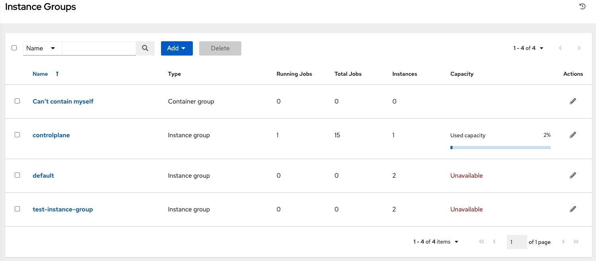
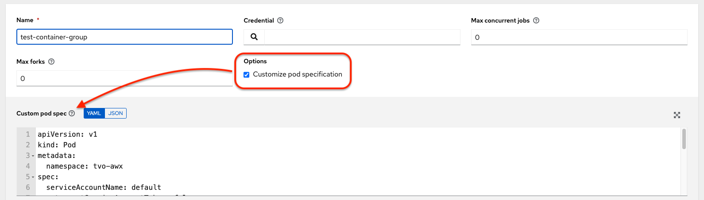
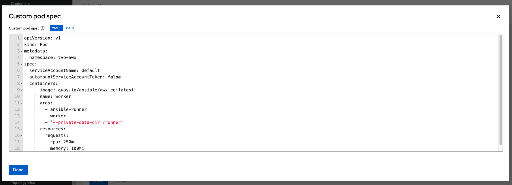

.. _ag_ext_exe_env:

Container and Instance Groups
==================================

.. index::
   pair: container; groups
   pair: instance; groups

AWX allows you to execute jobs via ansible playbook runs directly on a member of the cluster or in a namespace of an Openshift cluster with the necessary service account provisioned called a Container Group. You can execute jobs in a container group only as-needed per playbook. For more information, see :ref:`ag_container_groups` towards the end of this section.

For |ees|, see :ref:`ug_execution_environments` in the |atu|.

.. _ag_instance_groups:

Instance Groups
------------------

Instances can be grouped into one or more Instance Groups. Instance groups can be assigned to one or more of the resources listed below.

- Organizations
- Inventories
- Job Templates

When a job associated with one of the resources executes, it will be assigned to the instance group associated with the resource. During the execution process, instance groups associated with Job Templates are checked before those associated with Inventories. Similarly, instance groups associated with Inventories are checked before those associated with Organizations. Thus, Instance Group assignments for the three resources form a hierarchy: Job Template **>** Inventory **>** Organization.

Here are some of the things to consider when working with instance groups:

- You may optionally define other groups and group instances in those groups. These groups should be prefixed with ``instance_group_``. Instances are required to be in the ``awx`` or ``execution_nodes`` group alongside other ``instance_group_`` groups. In a clustered setup, at least one instance **must** be present in the ``awx`` group, which will appear as ``controlplane`` in the API instance groups. See :ref:`ag_awx_group_policies` for example scenarios.

- A ``default`` API instance group is automatically created with all nodes capable of running jobs. Technically, it is like any other instance group but if a specific instance group is not associated with a specific resource, then job execution will always fall back to the ``default`` instance group. The ``default`` instance group always exists (it cannot be deleted nor renamed).

- Do not create a group named ``instance_group_default``.

- Do not name any instance the same as a group name.

.. _ag_awx_group_policies:

``awx`` group policies
^^^^^^^^^^^^^^^^^^^^^^^^^

.. index::
   pair: policies; awx groups

Use the following criteria when defining nodes:

- nodes in the ``awx`` group can define ``node_type`` hostvar to be ``hybrid`` (default) or ``control``
- nodes in the ``execution_nodes`` group can define ``node_type`` hostvar to be ``execution`` (default) or ``hop``

You can define custom groups in the inventory file by naming groups with ``instance_group_*`` where ``*`` becomes the name of the group in the API. Or, you can create custom instance groups in the API after the install has finished. 

The current behavior expects a member of an ``instance_group_*`` be part of ``awx`` or ``execution_nodes`` group. Consider this example scenario:

::

	[awx]
	126-addr.tatu.home ansible_host=192.168.111.126  node_type=control

	[awx:vars]
	peers=execution_nodes

	[execution_nodes]

	[instance_group_test]
	110-addr.tatu.home ansible_host=192.168.111.110 receptor_listener_port=8928

As a result of running the installer, you will get the error below:

   .. code-block:: bash

	TASK [ansible.automation_platform_installer.check_config_static : Validate mesh topology] ***
	fatal: [126-addr.tatu.home -> localhost]: FAILED! => {"msg": "The host '110-addr.tatu.home' is not present in either [awx] or [execution_nodes]"}

To fix this, you could move the box ``110-addr.tatu.home`` to an ``execution_node`` group.

::

	[awx]
	126-addr.tatu.home ansible_host=192.168.111.126  node_type=control

	[awx:vars]
	peers=execution_nodes

	[execution_nodes]
	110-addr.tatu.home ansible_host=192.168.111.110 receptor_listener_port=8928

	[instance_group_test]
	110-addr.tatu.home 

This results in:

   .. code-block:: bash

	  TASK [ansible.automation_platform_installer.check_config_static : Validate mesh topology] ***
	  ok: [126-addr.tatu.home -> localhost] => {"changed": false, "mesh": {"110-addr.tatu.home": {"node_type": "execution", "peers": [], "receptor_control_filename": "receptor.sock", "receptor_control_service_name": "control", "receptor_listener": true, "receptor_listener_port": 8928, "receptor_listener_protocol": "tcp", "receptor_log_level": "info"}, "126-addr.tatu.home": {"node_type": "control", "peers": ["110-addr.tatu.home"], "receptor_control_filename": "receptor.sock", "receptor_control_service_name": "control", "receptor_listener": false, "receptor_listener_port": 27199, "receptor_listener_protocol": "tcp", "receptor_log_level": "info"}}}

Upon upgrading from older versions of awx, the legacy ``instance_group_`` member will most likely have the awx code installed, which would cause that node to be placed in the ``awx`` group. 

Configuring Instance Groups from the API
^^^^^^^^^^^^^^^^^^^^^^^^^^^^^^^^^^^^^^^^^
.. index::
   pair: instance group; configure
   pair: instance group; API

Instance groups can be created by POSTing to ``/api/v2/instance_groups`` as a system administrator.

Once created, instances can be associated with an instance group with:

   .. code-block:: bash

	  HTTP POST /api/v2/instance_groups/x/instances/ {'id': y}`

An instance that is added to an instance group will automatically reconfigure itself to listen on the group's work queue. See the following section, :ref:`ag_instance_group_policies`, for more details.

.. _ag_instance_group_policies:

Instance group policies
^^^^^^^^^^^^^^^^^^^^^^^^^

.. index::
   pair: policies; instance groups
   pair: clustering; instance group policies

You can configure AWX instances to automatically join Instance Groups when they come online by defining a :term:`policy`. These policies are evaluated for every new instance that comes online.

Instance Group Policies are controlled by three optional fields on an ``Instance Group``:

- ``policy_instance_percentage``: This is a number between 0 - 100. It guarantees that this percentage of active AWX instances will be added to this Instance Group. As new instances come online, if the number of Instances in this group relative to the total number of instances is less than the given percentage, then new ones will be added until the percentage condition is satisfied.
- ``policy_instance_minimum``: This policy attempts to keep at least this many instances in the Instance Group. If the number of available instances is lower than this minimum, then all instances will be placed in this Instance Group.
- ``policy_instance_list``: This is a fixed list of instance names to always include in this Instance Group.

The Instance Groups list view from the |at| User Interface provides a summary of the capacity levels for each instance group according to instance group policies:

|Instance Group policy example|

See :ref:`ug_instance_groups_create` for further detail.

Notable policy considerations
^^^^^^^^^^^^^^^^^^^^^^^^^^^^^^^^^

- ``policy_instance_percentage`` and ``policy_instance_minimum`` both set minimum allocations. The rule that results in more instances assigned to the group will take effect. For example, if you have a ``policy_instance_percentage`` of 50% and a ``policy_instance_minimum`` of 2 and you start 6 instances, 3 of them would be assigned to the Instance Group. If you reduce the number of total instances in the cluster to 2, then both of them would be assigned to the Instance Group to satisfy ``policy_instance_minimum``. This way, you can set a lower bound on the amount of available resources.

- Policies do not actively prevent instances from being associated with multiple Instance Groups, but this can effectively be achieved by making the percentages add up to 100. If you have 4 instance groups, assign each a percentage value of 25 and the instances will be distributed among them with no overlap.

Manually pinning instances to specific groups
^^^^^^^^^^^^^^^^^^^^^^^^^^^^^^^^^^^^^^^^^^^^^^^^^

.. index::
   pair: pinning; instance groups
   pair: clustering; pinning

If you have a special instance which needs to be exclusively assigned to a specific Instance Group but don't want it to automatically join other groups via "percentage" or "minimum" policies:

1. Add the instance to one or more Instance Groups' ``policy_instance_list``

2. Update the instance's ``managed_by_policy`` property to be ``False``.

This will prevent the Instance from being automatically added to other groups based on percentage and minimum policy; it will only belong to the groups you've manually assigned it to:

   .. code-block:: bash

	  HTTP PATCH /api/v2/instance_groups/N/
	  {
    	  "policy_instance_list": ["special-instance"]
	  }

	  HTTP PATCH /api/v2/instances/X/
	  {
    	  "managed_by_policy": False
	  }

.. _ag_instance_groups_job_runtime_behavior:

Job Runtime Behavior
^^^^^^^^^^^^^^^^^^^^^^

When you run a job associated with a instance group, some behaviors worth noting are:

- If a cluster is divided into separate instance groups, then the behavior is similar to the cluster as a whole. If two instances are assigned to a group then either one is just as likely to receive a job as any other in the same group.
- As AWX instances are brought online, it effectively expands the work capacity of the system. If those instances are also placed into instance groups, then they also expand that group's capacity. If an instance is performing work and it is a member of multiple groups, then capacity will be reduced from all groups for which it is a member. De-provisioning an instance will remove capacity from the cluster wherever that instance was assigned.

.. note::
	Not all instances are required to be provisioned with an equal capacity.

.. _ag_instance_groups_control_where_job_runs:

Control Where a Job Runs
^^^^^^^^^^^^^^^^^^^^^^^^^

If any of the job template, inventory, or organization has instance groups associated with them, a job ran from that job template will not be eligible for the default behavior. That means that if all of the instances inside of the instance groups associated with these 3 resources are out of capacity, the job will remain in the pending state until capacity becomes available.

The order of preference in determining which instance group to submit the job to is as follows:

1. job template
2. inventory
3. organization (by way of project)

If instance groups are associated with the job template, and all of these are at capacity, then the job will be submitted to instance groups specified on inventory, and then organization. Jobs should execute in those groups in preferential order as resources are available.

The global ``default`` group can still be associated with a resource, just like any of the custom instance groups defined in the playbook. This can be used to specify a preferred instance group on the job template or inventory, but still allow the job to be submitted to any instance if those are out of capacity.

As an example, by associating ``group_a`` with a Job Template and also associating the ``default`` group with its inventory, you allow the ``default`` group to be used as a fallback in case ``group_a`` gets out of capacity.

In addition, it is possible to not associate an instance group with one resource but designate another resource as the fallback. For example, not associating an instance group with a job template and have it fall back to the inventory and/or the organization's instance group.

This presents two other great use cases:

1. Associating instance groups with an inventory (omitting assigning the job template to an instance group) will allow the user to ensure that any playbook run against a specific inventory will run only on the group associated with it. This can be super useful in the situation where only those instances have a direct link to the managed nodes.

2. An administrator can assign instance groups to organizations. This effectively allows the administrator to segment out the entire infrastructure and guarantee that each organization has capacity to run jobs without interfering with any other organization's ability to run jobs.

Likewise, an administrator could assign multiple groups to each organization as desired, as in the following scenario:

	- There are three instance groups: A, B, and C. There are two organizations: Org1 and Org2.
	- The administrator assigns group A to Org1, group B to Org2 and then assign group C to both Org1 and Org2 as an overflow for any extra capacity that may be needed.
	- The organization administrators are then free to assign inventory or job templates to whichever group they want (or just let them inherit the default order from the organization).

	|Instance Group example|

Arranging resources in this way offers a lot of flexibility. Also, you can create instance groups with only one instance, thus allowing you to direct work towards a very specific Host in the AWX cluster.

.. _ag_instancegrp_cpacity:

Instance group capacity limits
^^^^^^^^^^^^^^^^^^^^^^^^^^^^^^^
.. index::
   pair: instance groups; capacity
   pair: instance groups; limits
   pair: instance groups; forks
   pair: instance groups; jobs

Sometimes there is external business logic which may drive the desire to limit the concurrency of jobs sent to an instance group, or the maximum number of forks to be consumed.

For traditional instances and instance groups, there could be a desire to allow two organizations to run jobs on the same underlying instances, but limit each organization's total number of concurrent jobs. This can be achieved by creating an instance group for each organization and assigning the value for ``max_concurrent_jobs``.

For container groups, AWX is generally not aware of the resource limits of the OpenShift cluster. There may be limits set on the number of pods on a namespace, or only resources available to schedule a certain number of pods at a time if no auto-scaling is in place. Again, in this case, we can adjust the value for ``max_concurrent_jobs``.

Another parameter available is ``max_forks``. This provides additional flexibility for capping the capacity consumed on an instance group or container group. This may be used if jobs with a wide variety of inventory sizes and "forks" values are being run. This way, you can limit an organization to run up to 10 jobs concurrently, but consume no more than 50 forks at a time.

::

	max_concurrent_jobs: 10
	max_forks: 50

If 10 jobs that use 5 forks each are run, an 11th job will wait until one of these finishes to run on that group (or be scheduled on a different group with capacity).

If 2 jobs are running with 20 forks each, then a 3rd job with a ``task_impact`` of 11 or more will wait until one of these finishes to run on that group (or be scheduled on a different group with capacity).

For container groups, using the ``max_forks`` value is useful given that all jobs are submitted using the same ``pod_spec`` with the same resource requests, irrespective of the "forks" value of the job. The default ``pod_spec`` sets requests and not limits, so the pods can "burst" above their requested value without being throttled or reaped. By setting the ``max_forks`` value, you can help prevent a scenario where too many jobs with large forks values get scheduled concurrently and cause the OpenShift nodes to be oversubscribed with multiple pods using more resources than their requested value.

To set the maximum values for the concurrent jobs and forks in an instance group, see :ref:`ug_instance_groups_create` in the |atu|.

.. _ag_instancegrp_deprovision:

Deprovision Instance Groups
^^^^^^^^^^^^^^^^^^^^^^^^^^^^^

.. index::
   pair: groups; deprovisioning

Re-running the setup playbook does not automatically deprovision instances since clusters do not currently distinguish between an instance that was taken offline intentionally or due to failure. Instead, shut down all services on the AWX instance and then run the deprovisioning tool from any other instance:

#. Shut down the instance or stop the service with the command, ``automation-awx-service stop``.

#. Run the deprovision command ``$ awx-manage deprovision_instance --hostname=<name used in inventory file>`` from another instance to remove it from the AWX cluster registry.

	Example: ``awx-manage deprovision_instance --hostname=hostB``

Similarly, deprovisioning instance groups in AWX does not automatically deprovision or remove instance groups, even though re-provisioning will often cause these to be unused. They may still show up in API endpoints and stats monitoring. These groups can be removed with the following command:

	Example: ``awx-manage unregister_queue --queuename=<name>``

Removing an instance's membership from an instance group in the inventory file and re-running the setup playbook does not ensure the instance won't be added back to a group. To be sure that an instance will not be added back to a group, remove via the API and also remove it in your inventory file, or you can stop defining instance groups in the inventory file altogether. You can also manage instance group topology through the |at| User Interface. For more information on managing instance groups in the UI, refer to :ref:`Instance Groups <ug_instance_groups>` in the |atu|.

.. _ag_container_groups:

Container Groups
-----------------

.. index::
   single: container groups
   pair: containers; instance groups

AWX supports :term:`Container Groups`, which allow you to execute jobs in AWX regardless of whether AWX is installed as a standalone, in  a virtual environment, or in a container. Container groups act as a pool of resources within a virtual environment. You can create instance groups to point to an OpenShift container, which are job environments that are provisioned on-demand as a Pod that exists only for the duration of the playbook run. This is known as the ephemeral execution model and ensures a clean environment for every job run.

In some cases, it is desirable to have container groups be "always-on", which is configured through the creation of an instance.

.. note::

	Container Groups upgraded from versions prior to |at| 4.0 will revert back to default and completely remove the old pod definition, clearing out all custom pod definitions in the migration.

Container groups are different from |ees| in that |ees| are container images and do not use a virtual environment. See :ref:`ug_execution_environments` in the |atu| for further detail.

Create a container group
^^^^^^^^^^^^^^^^^^^^^^^^^^^

.. include:: ../common/get-creds-from-service-account.rst

To create a container group:

1. Use the AWX user interface to create an :ref:`ug_credentials_ocp_k8s` credential that will be used with your container group, see :ref:`ug_credentials_add` in the |atu| for detail.

2. Create a new container group by navigating to the Instance Groups configuration window by clicking **Instance Groups** from the left navigation bar.

3. Click the **Add** button and select **Create Container Group**.

|IG - create new CG|

.. |IG - create new CG| image:: ../common/images/instance-group-create-new-cg.png
		:alt: Create new container group form.

4. Enter a name for your new container group and select the credential previously created to associate it to the container group.

.. _ag_customize_pod_spec:

Customize the Pod spec
^^^^^^^^^^^^^^^^^^^^^^^^

AWX provides a simple default Pod specification, however, you can provide a custom YAML (or JSON) document that overrides the default Pod spec. This field uses any custom fields (i.e. ``ImagePullSecrets``) that can be "serialized" as valid Pod JSON or YAML. A full list of options can be found in the `OpenShift documentation <https://docs.openshift.com/online/pro/architecture/core_concepts/pods_and_services.html>`_.

To customize the Pod spec, specify the namespace in the **Pod Spec Override** field by using the toggle to enable and expand the **Pod Spec Override** field and click **Save** when done.

|IG - CG customize pod|

You may provide additional customizations, if needed. Click **Expand** to view the entire customization window.

.. note::

	The image used at job launch time is determined by which |ee| is associated with the job. If a Container Registry credential is associated with the |ee|, then AWX will attempt to make a ``ImagePullSecret`` to pull the image. If you prefer not to give the service account permission to manage secrets, you must pre-create the ``ImagePullSecret`` and specify it on the pod spec, and omit any credential from the |ee| used.

Once the container group is successfully created, the **Details** tab of the newly created container group remains, which allows you to review and edit your container group information. This is the same menu that is opened if the Edit (|edit-button|) button is clicked from the **Instance Group** link. You can also edit **Instances** and review **Jobs** associated with this instance group.

.. |edit-button| image:: ../common/images/edit-button.png
		:alt: Edit button.

|IG - example CG successfully created|

Container groups and instance groups are labeled accordingly.

.. note::

	Despite the fact that customers have custom Pod specs, upgrades may be difficult if the default ``pod_spec`` changes. Most any manifest can be applied to any namespace, with the namespace specified separately, most likely you will only need to override the namespace. Similarly, pinning a default image for different releases of the platform to different versions of the default job runner container is tricky. If the default image is specified in the Pod spec, then upgrades do not pick up the new default changes are made to the default Pod spec.

Verify container group functions
^^^^^^^^^^^^^^^^^^^^^^^^^^^^^^^^^
To verify the deployment and termination of your container:

1. Create a mock inventory and associate the container group to it by populating the name of the container group in the **Instance Group** field. See :ref:`ug_inventories_add` in the |atu| for detail.

|Dummy inventory|

.. |Dummy inventory| image:: ../common/images/inventories-create-new-cg-test-inventory.png
		:alt: Example of creating a new container group test inventory.

2. Create "localhost" host in inventory with variables:

::

	{'ansible_host': '127.0.0.1', 'ansible_connection': 'local'}

|Inventory with localhost|

3. Launch an ad hoc job against the localhost using the *ping* or *setup* module. Even though the **Machine Credential** field is required, it does not matter which one is selected for this simple test.

|Launch inventory with localhost|

.. |Launch inventory with localhost| image:: ../common/images/inventories-launch-adhoc-cg-test-localhost.png

.. image:: ../common/images/inventories-launch-adhoc-cg-test-localhost2.png
	:alt: Launching a Ping adhoc command on the newly created inventory with localhost.

You can see in the jobs detail view the container was reached successfully using one of ad hoc jobs.

|Inventory with localhost ping success|

If you have an OpenShift UI, you can see Pods appear and disappear as they deploy and terminate. Alternatively, you can use the CLI to perform a ``get pod`` operation on your namespace to watch these same events occurring in real-time.

View container group jobs
^^^^^^^^^^^^^^^^^^^^^^^^^^^^^^^^^

When you run a job associated with a container group, you can see the details of that job in the **Details** view and its associated container group and the execution environment that spun up.

|IG - instances jobs|

Kubernetes API failure conditions
^^^^^^^^^^^^^^^^^^^^^^^^^^^^^^^^^^^

When running a container group and the Kubernetes API responds that the resource quota has been exceeded, AWX keeps the job in pending state. Other failures result in the traceback of the **Error Details** field showing the failure reason, similar to the example here: 

::

	Error creating pod: pods is forbidden: User "system: serviceaccount: aap:example" cannot create resource "pods" in API group "" in the namespace "aap"

.. _ag_container_capacity:

Container capacity limits
^^^^^^^^^^^^^^^^^^^^^^^^^^^^
.. index::
   pair: container groups; capacity
   pair: container groups; limits

Capacity limits and quotas for containers are defined via objects in the Kubernetes API:

- To set limits on all pods within a given namespace, use the ``LimitRange`` object. Refer to the OpenShift documentation for `Quotas and Limit Ranges <https://docs.openshift.com/online/pro/dev_guide/compute_resources.html#overview>`_.

- To set limits directly on the pod definition launched by AWX, see :ref:`ag_customize_pod_spec` and refer to the OpenShift documentation to set the options to `compute resources <https://docs.openshift.com/online/pro/dev_guide/compute_resources.html#dev-compute-resources>`_.

.. Note::

	Container groups do not use the capacity algorithm that normal nodes use. You would need to explicitly set the number of forks at the job template level, for instance. If forks are configured in AWX, that setting will be passed along to the container.
