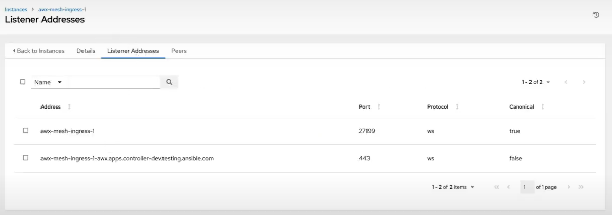
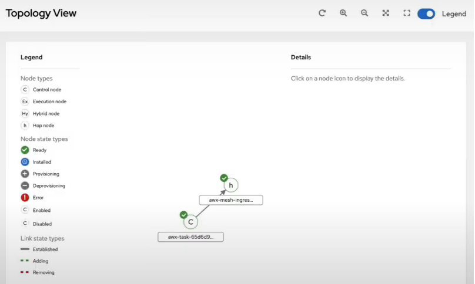
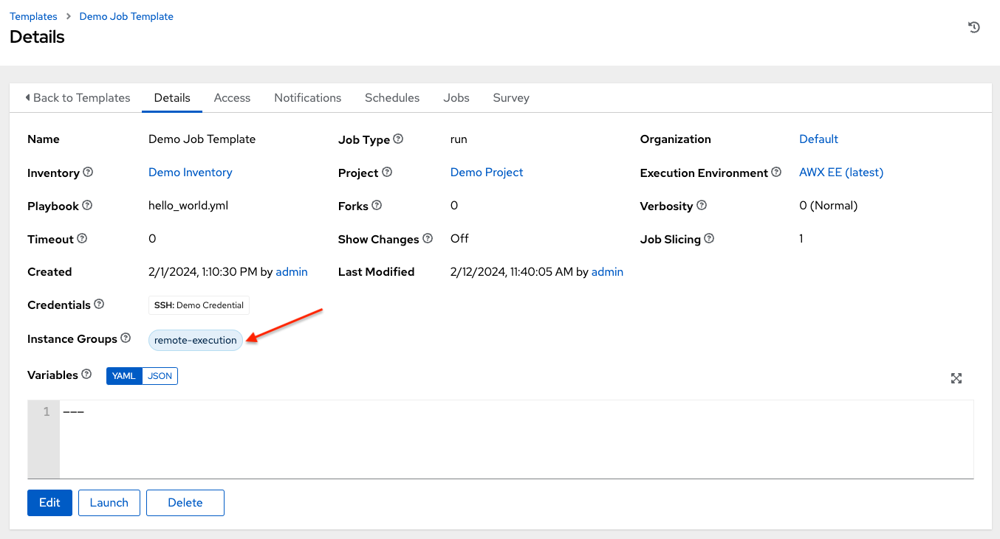

.. _ag_instances:

Managing Capacity With Instances
=================================

.. index::
   pair: topology;capacity
   pair: mesh;capacity
   pair: remove;capacity
   pair: add;capacity

Scaling your mesh is only available on Openshift and Kubernetes (K8S) deployments of AWX and is possible through adding or removing nodes from your cluster dynamically, through the **Instances** resource of the AWX User Interface, without running the installation script.

Instances serve as nodes in your mesh topology. Automation mesh allows you to extend the footprint of your automation. Where you launch a job and where the ``ansible-playbook`` runs can be in different locations.

Automation mesh is useful for:

- traversing difficult network topologies
- bringing execution capabilities (the machine running ``ansible-playbook``) closer to your target hosts

The nodes (control, hop, and execution instances) are interconnected via receptor, forming a virtual mesh.

.. image:: ../common/images/instances_mesh_concept_with_nodes.png
	:alt: Control node pointing to hop node, which is pointing to two execution nodes.  

Prerequisites
--------------

- |rhel| (RHEL) or Debian operating system. Bring a machine online with a compatible Red Hat family OS (e.g. RHEL 8 and 9) or Debian 11. This machine requires a static IP, or a resolvable DNS hostname that the AWX cluster can access. If the ``listener_port`` is defined, the machine will also need an available open port on which to establish inbound TCP connections (e.g. 27199).

  In general, the more CPU cores and memory the machine has, the more jobs that can be scheduled to run on that machine at once. See :ref:`ug_job_concurrency` for more information on capacity.

- The system that is going to run the install bundle to setup the remote node requires the collection ``ansible.receptor`` to be installed:

	- If machine has access to the internet:

	::

		ansible-galaxy install -r requirements.yml

	Installing the receptor collection dependency from the ``requirements.yml`` file will consistently retrieve the receptor version specified there, as well as any other collection dependencies that may be needed in the future.

	- If machine does not have access to the internet, refer to `Downloading a collection for offline use <https://docs.ansible.com/ansible/latest/collections_guide/collections_installing.html#downloading-a-collection-for-offline-use>`_.

- To manage instances from the AWX user interface, you must have System Administrator or System Auditor permissions.

Manage instances
-----------------

Click **Instances** from the left side navigation menu to access the Instances list.

.. image:: ../common/images/instances_list_view.png
	:alt: List view of instances in AWX

The Instances list displays all the current nodes in your topology, along with relevant details:

- **Host Name**

.. _node_statuses:

- **Status** indicates the state of the node:

	- **Installed**: a node that has successfully installed and configured, but has not yet passed the periodic health check
	- **Ready**: a node that is available to run jobs or route traffic between nodes on the mesh. This replaces the previously “Healthy” node state used in the mesh topology
	- **Provisioning**: a node that is in the process of being added to a current mesh, but is awaiting the job to install all of the packages (currently not yet supported and is subject to change in a future release)
	- **Deprovisioning**: a node that is in the process of being removed from a current mesh and is finishing up jobs currently running on it 
	- **Unavailable**: a node that did not pass the most recent health check, indicating connectivity or receptor problems
	- **Provisioning Failure**: a node that failed during provisioning (currently not yet supported and is subject to change in a future release)
	- **De-provisioning Failure**: a node that failed during deprovisioning (currently not yet supported and is subject to change in a future release)

- **Node Type** specifies whether the node is a control, hop, execution node, or hybrid (not applicable to operator-based installations). See :term:`node` for further detail.
- **Capacity Adjustment** allows you to adjust the number of forks in your nodes
- **Used Capacity** indicates how much capacity has been used
- **Actions** allow you to enable or disable the instance to control whether jobs can be assigned to it

From this page, you can add, remove or run health checks on your nodes. Use the check boxes next to an instance to select it to remove or run a health check against. When a button is grayed-out, you do not have permission for that particular action. Contact your Administrator to grant you the required level of access. If you are able to remove an instance, you will receive a prompt for confirmation, like the one below:

.. note::

	You can still remove an instance even if it is active and jobs are running on it. AWX will attempt to wait for any jobs running on this node to complete before actually removing it.

Click **Remove** to confirm.

.. _health_check:

If running a health check on an instance, at the top of the Details page, a message displays that the health check is in progress. 

.. image:: ../common/images/instances_health_check.png
	:alt: Health check for instances in AWX

Click **Reload** to refresh the instance status. 

.. note::

	Health checks are ran asynchronously, and may take up to a minute for the instance status to update, even with a refresh. The status may or may not change after the health check. At the bottom of the Details page, a timer/clock icon displays next to the last known health check date and time stamp if the health check task is currently running.

	.. image:: ../common/images/instances_health_check_pending.png
		:alt: Health check for instance still in pending state.

The example health check shows the status updates with an error on node 'one':

.. image:: ../common/images/topology-viewer-instance-with-errors.png
	:alt: Health check showing an error in one of the instances.

.. _ag_instances_add:

Add an instance
----------------

One of the ways to expand capacity is to create an instance. Standalone execution nodes can be added to run alongside the Kubernetes deployment of AWX. These machines will not be a part of the AWX Kubernetes cluster. The control nodes running in the cluster will connect and submit work to these machines via Receptor. The machines are registered in AWX as type "execution" instances, meaning they will only be used to run AWX jobs, not dispatch work or handle web requests as control nodes do.

Hop nodes can be added to sit between the control plane of AWX and standalone execution nodes. These machines will not be a part of the AWX Kubernetes cluster and they will be registered in AWX as node type "hop", meaning they will only handle inbound and outbound traffic for otherwise unreachable nodes in a different or more strict network.

Below is an example of an AWX task pod with two execution nodes. Traffic to execution node 2 flows through a hop node that is setup between it and the control plane.

.. image:: ../common/images/instances_awx_task_pods_hopnode.png
	:alt: AWX task pod with a hop node between the control plane of AWX and standalone execution nodes.

To create an instance in AWV:

1. Click **Instances** from the left side navigation menu of the AWX UI.

2. In the Instances list view, click the **Add** button and the Create new Instance window opens.

.. image:: ../common/images/instances_create_new.png
	:alt: Create a new instance form.

An instance has several attributes that may be configured:

- Enter a fully qualified domain name (ping-able DNS) or IP address for your instance in the **Host Name** field (required). This field is equivalent to ``hostname`` in the API.
- Optionally enter a **Description** for the instance
- The **Instance State** field is auto-populated, indicating that it is being installed, and cannot be modified 
- Optionally specify the **Listener Port** for the receptor to listen on for incoming connections. This is an open port on the remote machine used to establish inbound TCP connections. This field is equivalent to ``listener_port`` in the API. 
- Select from the options in **Instance Type** field to specify the type you want to create. Only execution and hop nodes can be created as operator-based installations do not support hybrid nodes. This field is equivalent to ``node_type`` in the API. 
- In the **Peers** field, select the instance hostnames you want your new instance to connect outbound to. 
- In the **Options** fields:
	- Check the **Enable Instance** box to make it available for jobs to run on an execution node.
	- Check the **Managed by Policy** box to allow policy to dictate how the instance is assigned.
	- Check the **Peers from control nodes** box to allow control nodes to peer to this instance automatically. Listener port needs to be set if this is enabled or the instance is a peer.

In the example diagram above, the configurations are as follows:

+------------------+--------------------------------------------------+---------------+--------------------------+--------------+
| instance type    | hostname                                         | listener_port | peers_from_control_nodes | peers        |
+==================+==================================================+===============+==========================+==============+
| control plane    | awx-task-65d6d96987-mgn9j                        | 27199         | true                     | []           |
+------------------+--------------------------------------------------+---------------+--------------------------+--------------+
| hop node         | awx-mesh-ingress-1                               | 27199         | true                     | []           |
+------------------+--------------------------------------------------+---------------+--------------------------+--------------+
| execution node 2 | ec2-35-87-18-213.us-west-2.compute.amazonaws.com | null          | false                    | ["hop node"] |
+------------------+--------------------------------------------------+---------------+--------------------------+--------------+

3. Once the attributes are configured, click **Save** to proceed.

Upon successful creation, the Details of the one of the created instances opens.

.. image:: ../common/images/instances_create_details.png
	:alt: Details of the newly created instance.

.. note::

	The proceeding steps 4-8 are intended to be ran from any computer that has SSH access to the newly created instance. 

4. Click the download button next to the **Install Bundle** field to download the tarball that contain files to allow AWX to make proper TCP connections to the remote machine.

.. image:: ../common/images/instances_install_bundle.png
	:alt: Instance details showing the Download button in the Install Bundle field of the Details tab.

5. Extract the downloaded ``tar.gz`` file from the location you downloaded it. The install bundle contains TLS certificates and keys, a certificate authority, and a proper Receptor configuration file. To facilitate that these files will be in the right location on the remote machine, the install bundle includes an ``install_receptor.yml`` playbook. The playbook requires the Receptor collection which can be obtained via:

::

	ansible-galaxy collection install -r requirements.yml

6. Before running the ``ansible-playbook`` command, edit the following fields in the ``inventory.yml`` file:

- ``ansible_user`` with the username running the installation
- ``ansible_ssh_private_key_file`` to contain the filename of the private key used to connect to the instance

::

	---
	all:
	  hosts:
	    remote-execution:
	      ansible_host: <hostname>
	      ansible_user: <username> # user provided
	      ansible_ssh_private_key_file: ~/.ssh/id_rsa

The content of the ``inventory.yml`` file serves as a template and contains variables for roles that are applied during the installation and configuration of a receptor node in a mesh topology. You may modify some of the other fields, or replace the file in its entirety for advanced scenarios. Refer to `Role Variables <https://github.com/ansible/receptor-collection/blob/main/README.md>`_ for more information on each variable.  

7. Save the file to continue.

8. Run the following command on the machine you want to update your mesh:

::

	ansible-playbook -i inventory.yml install_receptor.yml

Wait a few minutes for the periodic AWX task to do a health check against the new instance. You may run a health check by selecting the node and clicking the **Run health check** button from its Details page at any time. Once the instances endpoint or page reports a "Ready" status for the instance, jobs are now ready to run on this machine!

9. To view other instances within the same topology or associate peers, click the **Peers** tab. 

.. image:: ../common/images/instances_peers_tab.png
	:alt: "Peers" tab showing two peers.

To associate peers with your node, click the **Associate** button to open a dialog box of instances eligible for peering.

.. image:: ../common/images/instances_associate_peer.png
	:alt:  Instances available to peer with the example hop node.

Execution nodes can peer with either hop nodes or other execution nodes. Hop nodes can only peer with execution nodes unless you check the **Peers from control nodes** check box from the **Options** field.

.. note::

	If you associate or disassociate a peer, a notification will inform you to re-run the install bundle from the Peer Detail view (the :ref:`ag_topology_viewer` has the download link).

	.. image:: ../common/images/instances_associate_peer_reinstallmsg.png
		:alt: Notification to re-run the installation bundle due to change in the peering. 

You can remove an instance by clicking **Remove** in the Instances page, or by setting the instance ``node_state = deprovisioning`` via the API. Upon deleting, a pop-up message will appear to notify that you may need to re-run the install bundle to make sure things that were removed are no longer connected.

10. To view a graphical representation of your updated topology, refer to the :ref:`ag_topology_viewer` section of this guide.

Configuring a mesh ingress
---------------------------

If a remote execution node is setup inside a datacenter to communicate with target hosts from a k8s cluster because the k8s cluster is unable to reach the hosts via SSH, it risks exposing port information. To solve this, a hop node is placed inside of the k8s cluster to route traffic from task pods to the execution node, eliminating the risk of exposing any ports since execution node connections are outbound only.

A custom resource definition (CRD) called AWX mesh ingress was introduced as part of the operator, providing a way to stand up a hop node inside of the cluster to allow inbound connections. 

1. Create a control node
2. Crate a hop node
3. Spin up another instance for the execution node
4. Add instance to an instance group

In order to create a mesh ingress for AWX, create an AWX Mesh Ingress Kubernetes resource, which is a hop node type. Creating this mesh ingress will create all the necessary resources.

1. Run ``apply -f awxmeshingress-demo.yml``

2. If you want redundant paths, you may create multiple ingress resources the same way.

In this example, we created an ingress resource (awx-mesh-ingress-1) that will:
	- stand up a pod that runs a receptor
	- create services and routes that allow communication between the task container to the new ingress receptor instance 
	- create a route that exposes the receptor listener in order to allow external nodes to peer into the receptor mesh

.. note::
	
	In Openshift, the spec requires you to specify the ``deployment_name``, which is the AWX resource. In this example, ``deployment_name`` = awx 

4. Once the operator spins everything up, it will register that new mesh ingress node to AWX. 

5. Click the **Listener Addresses** tab to view details associated with the listener addresses of the mesh ingress node. In this example, the mesh ingress has two listener addresses:

	- one for internal, that is used for peering to by all control nodes (top) 
	- one for external, that is exposed to a route so external execution nodes can peer into it (bottom))

In the corresponding Topology view, you can see the AWX ingress node connected to the control plane.

6. Create a virtual machine, an instance that only allows inbound traffic for port 22 for SSH and that no other inbound traffic is allowed to this VM. This VM will be peering to the AWX control plane. An AWS VM is used for this example.

7. Create an external execution node instance (leave listener port blank because the VM spun up doesn't allow any inbound traffic) that is capable of running playbooks (the ec2 node). See :ref:`ag_instances_add` for detail.

8. Once the instance is created, peer the execution node to the mesh ingress node (awx-mesh-ingress-1).

9. Download the install bundle from the instance's Details view (|download|) and install the requirements:

::

	install -r requirements.yml

10. Run the playbook, specifying the ansible user and password that is needed to connect to this instance. This example playbook requires sudo permission.

::

	ansible-playbook install_receptor.yml -e ansible_user=ec2-user -I inventory.yml -v

11. After the playbook finishes running, the topology view now shows the AWX control plane and the execution node peering into the mesh ingress node.

12. Run a health check against the execution node to ensure the execution node is successfully added and ready to be added to an instance group.

13. Create an instance group and add the execution node to it in order for it to be used in your job execution. Whatever execution environment image used to run a playbook needs to be accessible for your remote execution node. Everything you are using in your playbook also needs to be accessible from this remote execution node.

Launching the job template will take a while in order to pull down new images. 

Using a custom Receptor CA
---------------------------

The control nodes on the K8S cluster will communicate with execution nodes via mutual TLS TCP connections, running via Receptor. Execution nodes will verify incoming connections by ensuring the x509 certificate was issued by a trusted Certificate Authority (CA).

You may choose to provide your own CA for this validation. If no CA is provided, AWX operator will automatically generate one using OpenSSL.

Given custom ``ca.crt`` and ``ca.key`` stored locally, run the following:

::

	kubectl create secret tls awx-demo-receptor-ca \
   	--cert=/path/to/ca.crt --key=/path/to/ca.key

The secret should be named ``{AWX Custom Resource name}-receptor-ca``. In the above, the AWX Custom Resource name is "awx-demo". Replace "awx-demo" with your AWX Custom Resource name.

If this secret is created after AWX is deployed, run the following to restart the deployment:

::

	kubectl rollout restart deployment awx-demo

.. note::

	Changing the receptor CA will sever connections to any existing execution nodes. These nodes will enter an *Unavailable* state, and jobs will not be able to run on them. You will need to download and re-run the install bundle for each execution node. This will replace the TLS certificate files with those signed by the new CA. The execution nodes will then appear in a *Ready* state after a few minutes.

Using a private image for the default EE
------------------------------------------

Refer to the AWX Operator Documentation on `Default execution environments from private registries <https://ansible.readthedocs.io/projects/awx-operator/en/latest/user-guide/advanced-configuration/default-execution-environments-from-private-registries.html>`_ for detail.

Troubleshooting
----------------

If you encounter issues while setting up instances, refer to these troubleshooting tips.

Fact cache not working
~~~~~~~~~~~~~~~~~~~~~~~

Make sure the system timezone on the execution node matches ``settings.TIME_ZONE`` (default is 'UTC') on AWX. Fact caching relies on comparing modified times of artifact files, and these modified times are not timezone-aware. Therefore, it is critical that the timezones of the execution nodes match AWX's timezone setting.

To set the system timezone to UTC:

::

	ln -s /usr/share/zoneinfo/Etc/UTC /etc/localtime

Permission denied errors
~~~~~~~~~~~~~~~~~~~~~~~~~~

Jobs may fail with the following error, or similar:

::

	"msg":"exec container process `/usr/local/bin/entrypoint`: Permission denied"

For RHEL-based machines, this could be due to SELinux that is enabled on the system. You can pass these ``extra_settings`` container options to override SELinux protections:

::

	DEFAULT_CONTAINER_RUN_OPTIONS = ['--network', 'slirp4netns:enable_ipv6=true', '--security-opt', 'label=disable']
