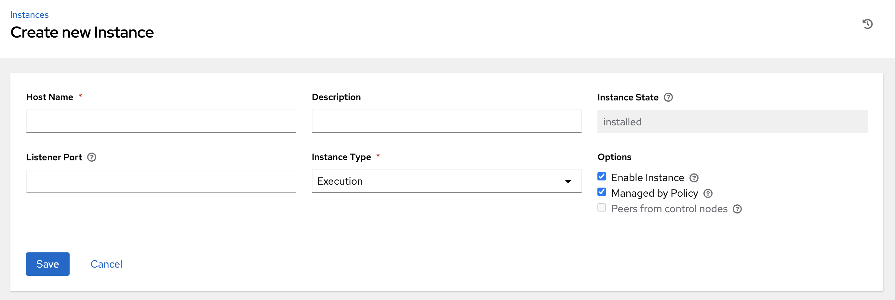
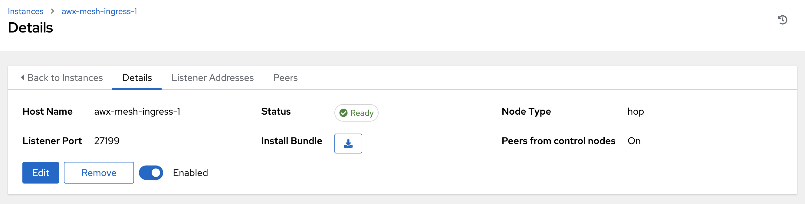
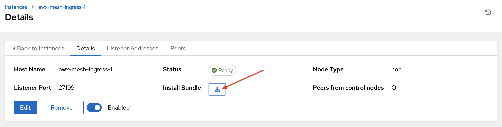

.. _ag_instances:

Managing Capacity With Instances
----------------------------------

.. index::
   pair: topology;capacity
   pair: mesh;capacity
   pair: remove;capacity
   pair: add;capacity

Scaling your mesh is only available on Openshift deployments of AWX and is possible through adding or removing nodes from your cluster dynamically, through the **Instances** resource of the AWX User Interface, without running the installation script.

Prerequisites
~~~~~~~~~~~~~~

- The system that is going to run the ``ansible-playbook`` requires the collection ``ansible.receptor`` to be installed:

	- If machine has access to the internet:

	::

		ansible-galaxy install -r requirements.yml

	Installing the receptor collection dependency from the ``requirements.yml`` file will consistently retrieve the receptor version specified there, as well as any other collection dependencies that may be needed in the future.

	- If machine does not have access to the internet, refer to `Downloading a collection from Automation Hub <https://docs.ansible.com/ansible/latest/galaxy/user_guide.html#downloading-a-collection-from-automation-hub>`_ to configure `Automation Hub <https://console.redhat.com/ansible/automation-hub>`_ in Ansible Galaxy locally.

- If you are using the default |ee| (provided with AWX) to run on remote execution nodes, you must add a pull secret in AWX that contains the credential for pulling the |ee| image. To do this, create a pull secret on the AWX namespace and configure the ``ee_pull_credentials_secret`` parameter in the Operator:

	1. Create a secret:
	::

		oc create secret generic ee-pull-secret \
    	  	 --from-literal=username=<username> \
    	  	 --from-literal=password=<password> \
    	  	 --from-literal=url=registry.redhat.io

	::

		oc edit awx <instance name>

	2. Add ``ee_pull_credentials_secret ee-pull-secret`` to the spec:
	::

		spec.ee_pull_credentials_secret=ee-pull-secret

- To manage instances from the AWX user interface, you must have System Administrator or System Auditor permissions.

Manage instances
~~~~~~~~~~~~~~~~~~

Click **Instances** from the left side navigation menu to access the Instances list.

.. image:: ../common/images/instances_list_view.png
	:alt: List view of instances in AWX

The Instances list displays all the current nodes in your topology, along with relevant details:

- **Host Name**

.. _node_statuses:

- **Status** indicates the state of the node:

	- **Installed**: a node that has successfully installed and configured, but has not yet passed the periodic health check
	- **Ready**: a node that is available to run jobs or route traffic between nodes on the mesh. This replaces the previously “Healthy” node state used in the mesh topology
	- **Provisioning**: a node that is in the process of being added to a current mesh, but is awaiting the job to install all of the packages (currently not yet supported and is subject to change in a future release)
	- **Deprovisioning**: a node that is in the process of being removed from a current mesh and is finishing up jobs currently running on it 
	- **Unavailable**: a node that did not pass the most recent health check, indicating connectivity or receptor problems
	- **Provisioning Failure**: a node that failed during provisioning (currently not yet supported and is subject to change in a future release)
	- **De-provisioning Failure**: a node that failed during deprovisioning (currently not yet supported and is subject to change in a future release)

- **Node Type** specifies whether the node is a control, hybrid, hop, or execution node. See :term:`node` for further detail.
- **Capacity Adjustment** allows you to adjust the number of forks in your nodes
- **Used Capacity** indicates how much capacity has been used
- **Actions** allow you to enable or disable the instance to control whether jobs can be assigned to it

From this page, you can add, remove or run health checks on your nodes. Use the check boxes next to an instance to select it to remove or run a health check against. When a button is grayed-out, you do not have permission for that particular action. Contact your Administrator to grant you the required level of access. If you are able to remove an instance, you will receive a prompt for confirmation, like the one below:

.. image:: ../common/images/instances_delete_prompt.png
	:alt: Prompt for deleting instances in AWX.

.. note::

	You can still remove an instance even if it is active and jobs are running on it. AWXwill attempt to wait for any jobs running on this node to complete before actually removing it.

Click **Remove** to confirm.

.. _health_check:

If running a health check on an instance, at the top of the Details page, a message displays that the health check is in progress. 

Click **Reload** to refresh the instance status. 

.. note::

	Health checks are ran asynchronously, and may take up to a minute for the instance status to update, even with a refresh. The status may or may not change after the health check. At the bottom of the Details page, a timer/clock icon displays next to the last known health check date and time stamp if the health check task is currently running.

	.. image:: ../common/images/instances_health_check_pending.png
		:alt: Health check for instance still in pending state.

The example health check shows the status updates with an error on node 'one':

.. image:: ../common/images/topology-viewer-instance-with-errors.png
	:alt: Health check showing an error in one of the instances.

Add an instance
~~~~~~~~~~~~~~~~
  
One of the ways to expand capacity is to create an instance, which serves as a node in your topology.

1. Click **Instances** from the left side navigation menu.

2. In the Instances list view, click the **Add** button and the Create new Instance window opens.

An instance has several attributes that may be configured:

- Enter a fully qualified domain name (ping-able DNS) or IP address for your instance in the **Host Name** field (required). This field is equivalent to ``hostname`` in the API.
- Optionally enter a **Description** for the instance
- The **Instance State** field is auto-populated, indicating that it is being installed, and cannot be modified 
- The **Listener Port** is pre-populated with the most optimal port, however you can change the port to one that is more appropriate for your configuration. This field is equivalent to ``listener_port`` in the API. 
- The **Instance Type** field is auto-populated and cannot be modified. Only execution nodes can be created at this time. 
- Check the **Enable Instance** box to make it available for jobs to run on it

3. Once the attributes are configured, click **Save** to proceed.

Upon successful creation, the Details of the created instance opens.

.. note::

	The proceeding steps 4-8 are intended to be ran from any computer that has SSH access to the newly created instance. 

4. Click the download button next to the **Install Bundle** field to download the tarball that includes this new instance and the files relevant to install the node into the mesh.

5. Extract the downloaded ``tar.gz`` file from the location you downloaded it. The install bundle contains yaml files, certificates, and keys that will be used in the installation process.

6. Before running the ``ansible-playbook`` command, edit the following fields in the ``inventory.yml`` file:

- ``ansible_user`` with the username running the installation
- ``ansible_ssh_private_key_file`` to contain the filename of the private key used to connect to the instance

::

	---
	all:
	  hosts:
	    remote-execution:
	      ansible_host: 18.206.206.34
	      ansible_user: <username> # user provided
	      ansible_ssh_private_key_file: ~/.ssh/id_rsa

The content of the ``inventory.yml`` file serves as a template and contains variables for roles that are applied during the installation and configuration of a receptor node in a mesh topology. You may modify some of the other fields, or replace the file in its entirety for advanced scenarios. Refer to `Role Variables <https://github.com/ansible/receptor-collection/blob/main/README.md>`_ for more information on each variable.  

7. Save the file to continue.

8. Run the following command on the machine you want to update your mesh:

::

	ansible-playbook -i inventory.yml install_receptor.yml

9. To view other instances within the same topology, click the **Peers** tab associated with the control node. 

.. note::

	You will only be able to view peers of the control plane nodes at this time, which are the execution nodes. Since you are limited to creating execution nodes in this release, you will be unable to create or view peers of execution nodes.  

You may run a health check by selecting the node and clicking the **Run health check** button from its Details page.

10. To view a graphical representation of your updated topology, refer to the :ref:`ag_topology_viewer` section of this guide.
