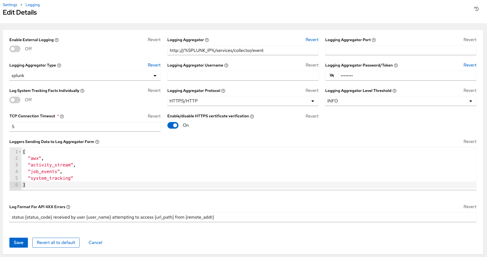
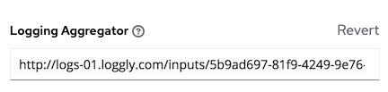
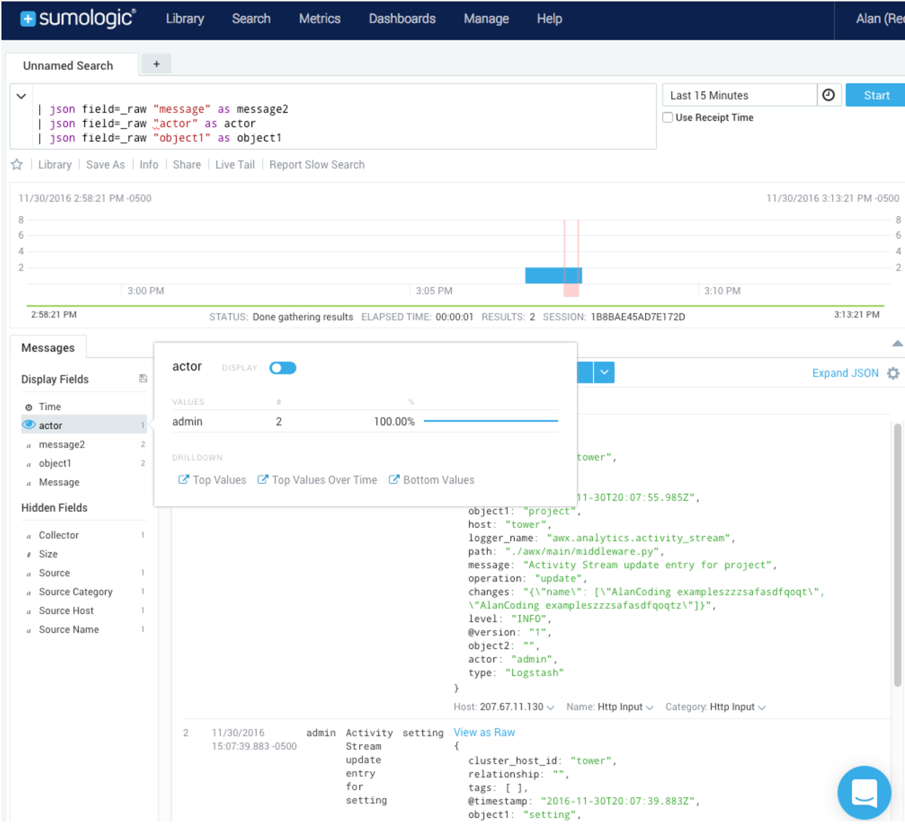
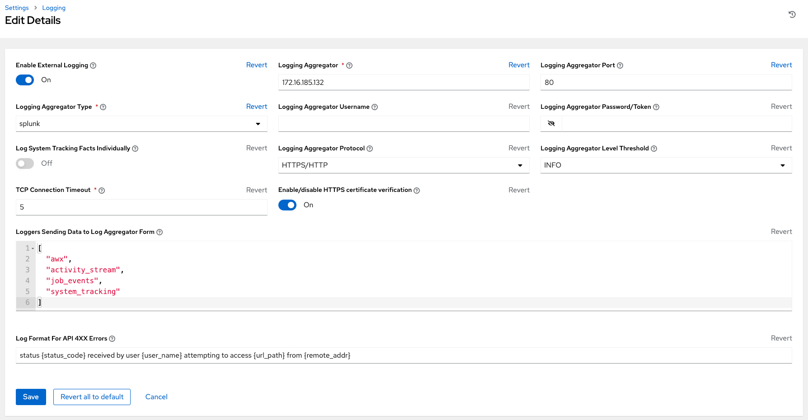

.. _ag_logging:

************************
Logging and Aggregation
************************

.. index::
   single: logging
   pair: logging; schema
   pair: logging; logstash
   pair: logging; splunk
   pair: logging; loggly
   pair: logging; sumologic
   pair: logging; ELK stack
   pair: logging; Elastic stack
   pair: logging; rsyslog

Logging is a feature that provides the capability to send detailed logs to several kinds of 3rd party external log aggregation services. Services connected to this data feed serve as a useful means in gaining insight into AWX usage or technical trends. The data can be used to analyze events in the infrastructure, monitor for anomalies, and correlate events from one service with events in another. The types of data that are most useful to AWX are job fact data, job events/job runs, activity stream data, and log messages. The data is sent in JSON format over a HTTP connection using minimal service-specific tweaks engineered in a custom handler or via an imported library. 

Installing AWX will install a newer version of rsyslog, which will replace the version that comes with the RHEL base. The version of rsyslog that is installed by AWX does not include the following rsyslog modules:  

- rsyslog-udpspoof.x86_64
- rsyslog-libdbi.x86_64

After installing AWX, use only AWX provided rsyslog package for any logging outside of AWX that may have previously been done with the RHEL provided rsyslog package. If you already use rsyslog for logging system logs on AWX instances, you can continue to use rsyslog to handle logs from outside of AWX by running a separate rsyslog process (using the same version of rsyslog that AWX is), and pointing it to a separate /etc/rsyslog.conf.

.. note::

  For systems that use rsyslog outside of AWX, consider any conflict that may arise with also using new version of rsyslog that comes with AWX. 
  
You can configure from the ``/api/v2/settings/logging/`` endpoint how AWX rsyslog process handles messages that have not yet been sent in the event that your external logger goes offline:  

- ``LOG_AGGREGATOR_MAX_DISK_USAGE_GB``: specifies the amount of data to store (in gigabytes) during an outage of the external log aggregator (defaults to 1). Equivalent to the ``rsyslogd queue.maxdiskspace`` setting.

- ``LOG_AGGREGATOR_MAX_DISK_USAGE_PATH``: specifies the location to persist logs that should be retried after an outage of the external log aggregator (defaults to ``/var/lib/awx``). Equivalent to the ``rsyslogd queue.spoolDirectory`` setting.

For example, if Splunk goes offline, rsyslogd stores a queue on the disk until Splunk comes back online. By default, it will store up to 1GB of events (while Splunk is offline) but you can make that more than 1GB if necessary, or change the path where you save the queue.


Loggers
----------

Below are special loggers (except for ``awx``, which constitutes generic server logs) that provide large amount of information in a predictable structured or semi-structured format, following the same structure as one would expect if obtaining the data from the API: 

- ``job_events``: Provides data returned from the Ansible callback module
- ``activity_stream``: Displays the record of changes to the objects within the AWX application
- ``system_tracking``: Provides fact data gathered by Ansible ``setup`` module (i.e. ``gather_facts: True``) when job templates are ran with **Enable Fact Cache** selected
- ``awx``: Provides generic server logs, which include logs that would normally be written to a file. It contains the standard metadata that all logs have, except it only has the message from the log statement.

These loggers only use log-level of INFO, except for the ``awx`` logger, which may be any given level.

Additionally, the standard AWX logs are be deliverable through this same mechanism. It is apparent how to enable or disable each of these five sources of data without manipulating a complex dictionary in your local settings file, as well as adjust the log-level consumed from the standard AWX logs.

To configure various logging components in AWX, click **Settings** from the left navigation bar then select **Logging settings** from the list of System options. 

Log message schema
~~~~~~~~~~~~~~~~~~~~

Common schema for all loggers:

- ``cluster_host_id``: Unique identifier of the host within the AWX cluster
- ``level``: Standard python log level, roughly reflecting the significance of the event All of the data loggers as a part of this feature use INFO level, but the other AWX logs will use different levels as appropriate
- ``logger_name``: Name of the logger we use in the settings, for example, "activity_stream" 
- ``@timestamp``: Time of log 
- ``path``: File path in code where the log was generated 


Activity stream schema
~~~~~~~~~~~~~~~~~~~~~~~~~

- (common): This uses all the fields common to all loggers listed above
- ``actor``: Username of the user who took the action documented in the log
- ``changes``: JSON summary of what fields changed, and their old/new values.
- ``operation``: The basic category of the changed logged in the activity stream, for instance, "associate". 
- ``object1``: Information about the primary object being operated on, consistent with what we show in the activity stream 
- ``object2``: If applicable, the second object involved in the action 


Job event schema
~~~~~~~~~~~~~~~~~~~~

This logger reflects the data being saved into job events, except when they would otherwise conflict with expected standard fields from the logger, in which case the fields are nested. Notably, the field host on the ``job_event`` model is given as ``event_host``. There is also a sub-dictionary field, ``event_data`` within the payload, which contains different fields depending on the specifics of the Ansible event.

This logger also includes the common fields.

Scan / fact / system tracking data schema
~~~~~~~~~~~~~~~~~~~~~~~~~~~~~~~~~~~~~~~~~~~

These contain a detailed dictionary-type fields that are either services, packages, or files.

- (common): This uses all the fields common to all loggers listed above 
- ``services``: For services scans, this field is included and has keys based on the name of the service. **NOTE**: Periods are disallowed by elastic search in names, and are replaced with "_" by our log formatter 
- ``package``: Included for log messages from package scans 
- ``files``: Included for log messages from file scans
- ``host``: Name of host scan applies to 
- ``inventory_id``: Inventory id host is inside of  


Job status changes
~~~~~~~~~~~~~~~~~~~~~

This is a intended to be a lower-volume source of information about changes in job states compared to job events, and also intended to capture changes to types of unified jobs other than job template based jobs.

In addition to common fields, these logs include fields present on the job model.


AWX logs
~~~~~~~~~~~~~~~~

In addition to the common fields, this contains a ``msg`` field with the log message. Errors contain a separate ``traceback`` field. These logs can be enabled or disabled with the ``ENABLE EXTERNAL LOGGING`` option from the Logging settings page.

Logging Aggregator Services
~~~~~~~~~~~~~~~~~~~~~~~~~~~~~~

The logging aggregator service works with the following monitoring and data analysis systems:

.. contents:: :local:

Logstash
^^^^^^^^^

These instructions describe how to use the logstash container.

1. Uncomment the following lines in the ``docker-compose.yml`` file:

::

  #- logstash
  ...

  #logstash:
  #  build:
  #    context: ./docker-compose
  #    dockerfile: Dockerfile-logstash

2. POST the following content to 1`/api/v2/settings/logging/1` (this uses authentication set up inside of the logstash configuration file).

::

  {
      "LOG_AGGREGATOR_HOST": "http://logstash",
      "LOG_AGGREGATOR_PORT": 8085,
      "LOG_AGGREGATOR_TYPE": "logstash",
      "LOG_AGGREGATOR_USERNAME": "awx_logger",
      "LOG_AGGREGATOR_PASSWORD": "workflows",
      "LOG_AGGREGATOR_LOGGERS": [
          "awx",
          "activity_stream",
          "job_events",
          "system_tracking"
      ],
      "LOG_AGGREGATOR_INDIVIDUAL_FACTS": false,
      "LOG_AGGREGATOR_TOWER_UUID": "991ac7e9-6d68-48c8-bbde-7ca1096653c6",
      "LOG_AGGREGATOR_ENABLED": true
  }

.. note:: HTTP must be specified in the ``LOG_AGGREGATOR_HOST`` if you are using the docker development environment.  

3. To view the most recent logs from the container:

::

  
  docker exec -i -t $(docker ps -aqf "name=tools_logstash_1") tail -n 50 /logstash.log

4. To add logstash plugins, you can add any plugins you need in ``tools/elastic/logstash/Dockerfile`` before running the container.  


Splunk
^^^^^^^^

AWX's Splunk logging integration uses the Splunk HTTP Collector. When configuring a SPLUNK logging aggregator, add the full URL to the HTTP Event Collector host, like in the following example:

   .. code-block:: text

      https://example.com/api/v2/settings/logging

      {
          "LOG_AGGREGATOR_HOST": "https://splunk_host:8088/services/collector/event",
          "LOG_AGGREGATOR_PORT": null,
          "LOG_AGGREGATOR_TYPE": "splunk",
          "LOG_AGGREGATOR_USERNAME": "",
          "LOG_AGGREGATOR_PASSWORD": "$encrypted$",
          "LOG_AGGREGATOR_LOGGERS": [
              "awx",
              "activity_stream",
              "job_events",
              "system_tracking"
          ],
          "LOG_AGGREGATOR_INDIVIDUAL_FACTS": false,
          "LOG_AGGREGATOR_ENABLED": true,
          "LOG_AGGREGATOR_TOWER_UUID": ""
      }

Splunk HTTP Event Collector listens on 8088 by default so it is necessary to provide the full HEC event URL (with port) in order for incoming requests to be processed successfully. These values are entered in the example below:




For further instructions on configuring the HTTP Event Collector, refer to the `Splunk documentation`_.

  .. _`Splunk documentation`: http://docs.splunk.com/Documentation/Splunk/latest/Data/UsetheHTTPEventCollector


Loggly
^^^^^^^

To set up the sending of logs through Loggly's HTTP endpoint, refer to https://www.loggly.com/docs/http-endpoint/. Loggly uses the URL convention described at http://logs-01.loggly.com/inputs/TOKEN/tag/http/, which is shown inputted in the **Logging Aggregator** field in the example below:




Sumologic
^^^^^^^^^^^^

In Sumologic, create a search criteria containing the json files that provide the parameters used to collect the data you need.




Elastic stack (formerly ELK stack)
^^^^^^^^^^^^^^^^^^^^^^^^^^^^^^^^^^^^

If starting from scratch, standing up your own version the elastic stack, the only change you required is to add the following lines to the logstash ``logstash.conf`` file:

::

  filter {
    json {
      source => "message"
    }
  }

.. note::

  Backward-incompatible changes were introduced with Elastic 5.0.0, and different configurations may be required depending on what versions you are using.

.. _ag_ctit_logging:

Set Up Logging
---------------

Log Aggregation
~~~~~~~~~~~~~~~~~~~~

To set up logging to any of the aggregator types:

1. Click **Settings** from the left navigation bar. 

2. Under the list of System options, click to select **Logging settings**.

3. At the bottom of the Logging settings screen, click **Edit**.

4. Set the configurable options from the fields provided:

- **Enable External Logging**: Click the toggle button to **ON** if you want to send logs to an external log aggregator.
- **Logging Aggregator**: Enter the hostname or IP address you want to send logs. 
- **Logging Aggregator Port**: Specify the port for the aggregator if it requires one.

.. note::

  When the connection type is HTTPS, you can enter the hostname as a URL with a port number and therefore, you are not required to enter the port again. But TCP and UDP connections are determined by the hostname and port number combination, rather than URL. So in the case of TCP/UDP connection, supply the port in the specified field. If instead a URL is entered in host field (**Logging Aggregator** field), its hostname portion will be extracted as the actual hostname.

- **Logging Aggregator Type**: Click to select the aggregator service from the drop-down menu:

.. image:: ../common/images/configure-awx-system-logging-types.png

- **Logging Aggregator Username**: Enter the username of the logging aggregator if it requires it.
- **Logging Aggregator Password/Token**: Enter the password of the logging aggregator if it requires it.
- **Log System Tracking Facts Individually**: Click the tooltip |help| icon for additional information whether or not you want to turn it on, or leave it off by default.
- **Logging Aggregator Protocol**: Click to select a connection type (protocol) to communicate with the log aggregator. Subsequent options vary depending on the selected protocol.
- **Logging Aggregator Level Threshold**: Select the level of severity you want the log handler to report.
- **TCP Connection Timeout**: Specify the connection timeout in seconds. This option is only applicable to HTTPS and TCP log aggregator protocols. 
- **Enable/disable HTTPS certificate verification**: Certificate verification is enabled by default for HTTPS log protocol. Click the toggle button to **OFF** if you do not want the log handler to verify the HTTPS certificate sent by the external log aggregator before establishing a connection.
- **Loggers to Send Data to the Log Aggregator Form**: All four types of data are pre-populated by default. Click the tooltip |help| icon next to the field for additional information on each data type. Delete the data types you do not want.
- **Log Format For API 4XX Errors**: Configure a specific error message. See :ref:`logging-api-400-error-config` for further detail.

.. |help| image:: ../common/images/tooltips-icon.png

5. Review your entries for your chosen logging aggregation. Below is an example of one set up for Splunk:



7. When done, click **Save** to apply the settings or **Cancel** to abandon the changes.

8. To verify if your configuration is set up correctly, click **Save** first then click **Test**. This sends a test log message to the log aggregator using the current logging configuration in AWX. You should check to make sure this test message was received by your external log aggregator.  

.. note::

  If the **Test** button is disabled, it is an indication that the fields are different than their initial values so save your changes first, and make sure the **Enable External Logging** toggle is set to ON.


.. _logging-api-400-error-config:

API 4XX Error Configuration
~~~~~~~~~~~~~~~~~~~~~~~~~~~~~~

When the API encounters an issue with a request, it will typically return an HTTP error code in the 400 range along with an error. When this happens, an error message will be generated in the log which follows the pattern:

```
status {status_code} received by user {user_name} attempting to access {url_path} from {remote_addr}
```

These messages can be configured as required. To modify the default API 4XX errors log message format, do the following:

1. Click **Settings** from the left navigation bar. 

2. Under the list of System options, click to select **Logging settings**.

3. At the bottom of the Logging settings screen, click **Edit**.

4. Modify the field **Log Format For API 4XX Errors**.

Items surrounded by ``{}`` will be substituted when the log error is generated. The following variables can be used:

- **status_code**: The HTTP status code the API is returning
- **user_name**: The name of the user that was authenticated when making the API request
- **url_path**: The path portion of the URL being called (aka the API endpoint)
- **remote_addr**: The remote address received by AWX
- **error**: The error message returned by the API or, if no error is specified, the HTTP status as text


Troubleshoot Logging
---------------------

API 4XX Errors
~~~~~~~~~~~~~~~~~~~~
You can include the API error message for 4XX errors by modifying the log format for those messages. Refer to the :ref:`logging-api-400-error-config` section for more detail.

LDAP
~~~~~~
You can enable logging messages for the LDAP adapter. Refer to the :ref:`ldap_logging` section for more detail.

SAML
~~~~~~~
You can enable logging messages for the SAML adapter the same way you can enable logging for LDAP. Refer to the :ref:`ldap_logging` section for more detail.
