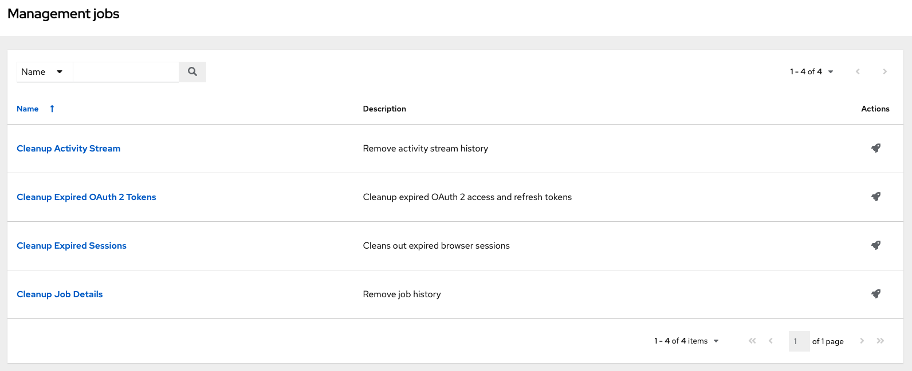
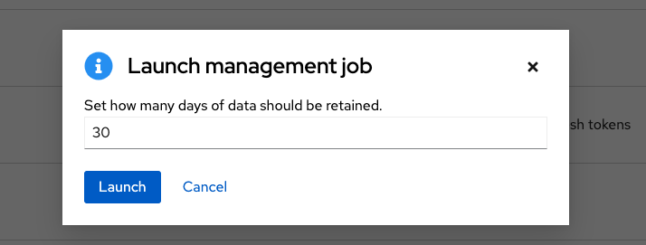
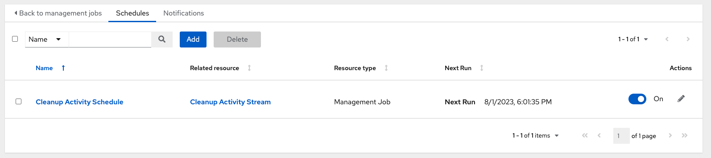
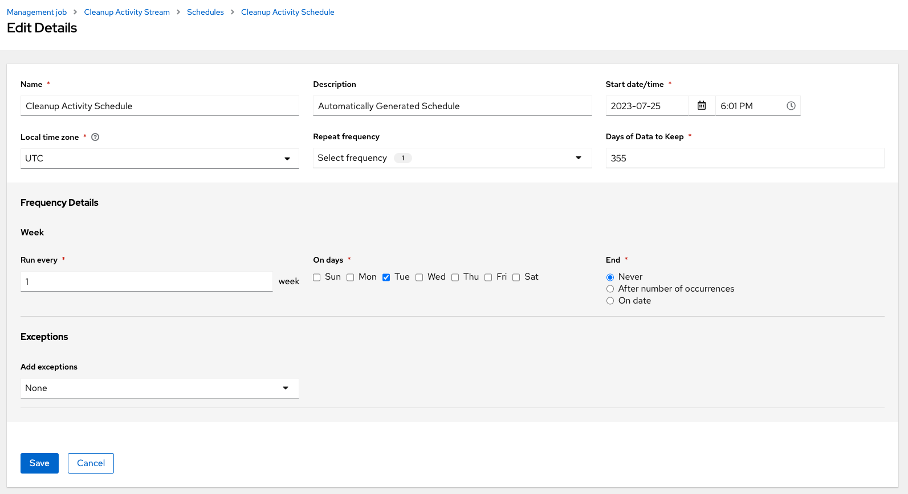
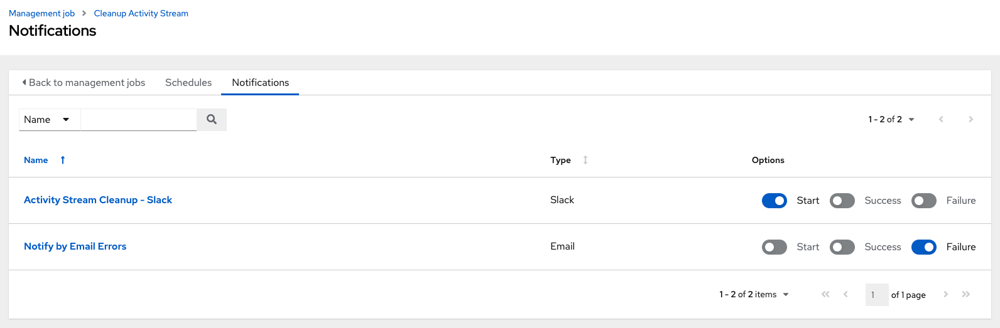
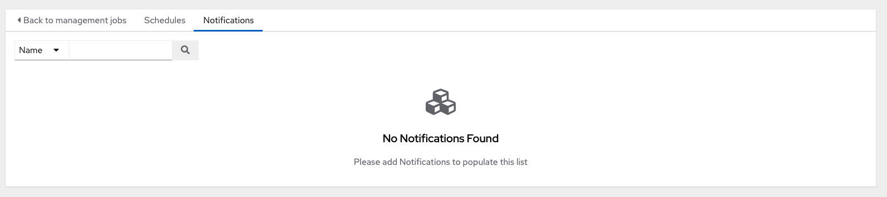
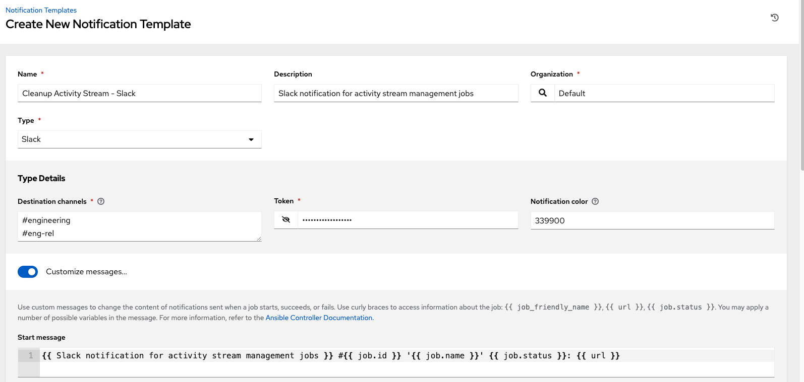
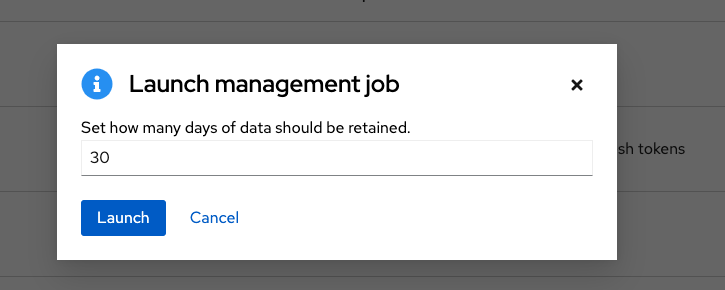

.. _ag_management_jobs:

Management Jobs
------------------

.. index::
   single: management jobs
   single: cleaning old data
   single: removing old data

**Management Jobs** assist in the cleaning of old data from AWX, including system tracking information, tokens, job histories, and activity streams. You can use this if you have specific retention policies or need to decrease the storage used by your AWX database. Click **Management Jobs** from the left navigation bar.

|management jobs|

Several job types are available for you to schedule and launch: 

- **Cleanup Activity Stream**: Remove activity stream history older than a specified number of days   
- **Cleanup Expired OAuth 2 Tokens**:  Remove expired OAuth 2 access tokens and refresh tokens
- **Cleanup Expired Sessions**:   Remove expired browser sessions from the database
- **Cleanup Job Details**: Remove job history older than a specified number of days 

Removing Old Activity Stream Data
============================================

.. index::
   pair: management jobs; cleanup activity stream
   single: activity stream cleanup management job

To remove older activity stream data, click on the launch (|launch|) button beside **Cleanup Activity Stream**.

|activity stream launch - remove activity stream launch|

Enter the number of days of data you would like to save and click **Launch**.

.. _ag_mgmt_job_schedule:

Scheduling
~~~~~~~~~~~~

To review or set a schedule for purging data marked for deletion:

1.  For a particular cleanup job, click the **Schedules** tab.

Note that you can turn this scheduled management job on and off easily using the **ON/OFF** toggle button.

2. Click on the name of the job, in this example "Cleanup Activity Schedule", to review the schedule settings and click **Edit** to modify them. You can also use the **Add** button to create a new schedule for this management job.

3. Enter the appropriate details into the following fields and click **Save**:

- Name (required)
- Start Date (required)
- Start Time (required)
- Local Time Zone (the entered Start Time should be in this timezone)
- Repeat Frequency (the appropriate options display as the update frequency is modified including data you do not want to include by specifying exceptions)
- Days of Data to Keep (required) - specify how much data you want to retain

The **Details** tab displays a description of the schedule and a list of the scheduled occurrences in the selected Local Time Zone.

.. note::

    Jobs are scheduled in UTC. Repeating jobs that runs at a specific time of day may move relative to a local timezone when Daylight Saving Time shifts occur.

.. _ag_mgmt_job_notify:

Notifications
~~~~~~~~~~~~~~~

To review or set notifications associated with a management job:

1.  For a particular cleanup job, click the **Notifications** tab.

If none exist, see :ref:`ug_notifications` for more information.

An example of a notifications with details specified:

Cleanup Expired OAuth2 Tokens
====================================

.. index::
   pair: management jobs; cleanup expired OAuth2 tokens
   single: expired OAuth2 tokens cleanup management job

To remove expired OAuth2 tokens, click on the launch (|launch|) button beside **Cleanup Expired OAuth2 Tokens**.

You can review or set a schedule for cleaning up expired OAuth2 tokens by performing the same procedure described for activity stream management jobs. See :ref:`ag_mgmt_job_schedule` for detail.

You can also set or review notifications associated with this management job the same way as described in :ref:`ag_mgmt_job_notify` for activity stream management jobs, and refer to :ref:`ug_notifications` for more detail.

Cleanup Expired Sessions
====================================

.. index::
   pair: management jobs; cleanup expired sessions
   single: expired sessions cleanup management job

To remove expired sessions, click on the launch (|launch|) button beside **Cleanup Expired Sessions**.

You can review or set a schedule for cleaning up expired sessions by performing the same procedure described for activity stream management jobs. See :ref:`ag_mgmt_job_schedule` for detail.

You can also set or review notifications associated with this management job the same way as described in :ref:`ag_mgmt_job_notify` for activity stream management jobs, and refer to :ref:`ug_notifications` for more detail.

Removing Old Job History 
====================================

.. index::
   pair: management jobs; cleanup job history
   single: job history cleanup management job

To remove job history older than a specified number of days, click on the launch (|launch|) button beside **Cleanup Job Details**.

.. |launch| image:: ../common/images/launch-button.png

|management jobs - cleanup job launch|

Enter the number of days of data you would like to save and click **Launch**.

.. note::

    The initial job run for an AWX resource (e.g. Projects, Job Templates) is excluded from **Cleanup Job Details**, regardless of retention value.

You can review or set a schedule for cleaning up old job history by performing the same procedure described for activity stream management jobs. See :ref:`ag_mgmt_job_schedule` for detail.

You can also set or review notifications associated with this management job the same way as described in :ref:`ag_mgmt_job_notify` for activity stream management jobs, and refer to :ref:`ug_notifications` for more detail.
