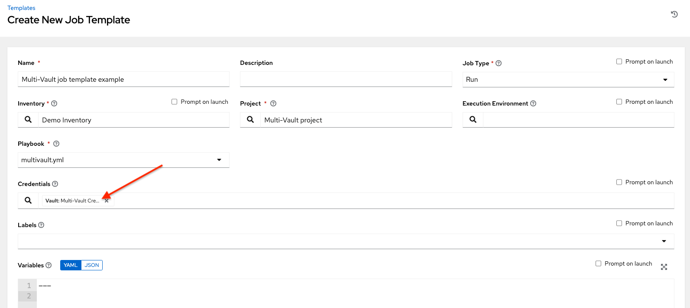

.. _ag_multicred_assgn:

Multi-Credential Assignment
=============================

.. index::
   single: credentials
   pair: credentials; multi
   pair: credentials; assignment
   
|at| provides support for assigning zero or more credentials to a job template.

Background
-----------

Prior to |at| 3.3, job templates had a certain set of requirements with respect to credentials:

* All job templates (and jobs) were required to have exactly *one* Machine/SSH or Vault credential (or one of both).
* All job templates (and jobs) could have zero or more "extra" credentials.
* Extra credentials represented "Cloud" and "Network" credentials that could be used to provide authentication to external services via environment variables (e.g., ``AWS_ACCESS_KEY_ID``).

This model required a variety of disjoint interfaces for specifying credentials on a job template and it lacked the ability associate multiple Vault credentials with a playbook run, a use case supported by Ansible core from Ansible 2.4 onwards.

This model also poses a stumbling block for certain playbook execution workflows, such as having to attach a "dummy" Machine/SSH credential to the job template simply to satisfy the requirement.

Important Changes
--------------------

Job templates now have a single interface for credential assignment. From the API endpoint:

``GET /api/v2/job_templates/N/credentials/``

You can associate and disassociate credentials using ``POST`` requests, similar to the behavior in the deprecated ``extra_credentials`` endpoint:

::

    POST /api/v2/job_templates/N/credentials/ {'associate': true, 'id': 'X'}
    POST /api/v2/job_templates/N/credentials/ {'disassociate': true, 'id': 'Y'}

Under this model, a job template is considered valid even when there are *no* credentials assigned to it. This model also provides users the ability to assign multiple Vault credentials to a job template.

Launch Time Considerations
------------------------------

Prior to |at| 3.3, job templates had a configurable attribute, ``ask_credential_on_launch``. This value was used at launch time to determine which missing credential values were necessary for launch - this was primarily
used as a way to specify a Machine/SSH credential to satisfy the minimum credential requirement.

Under the new unified credential list model, this attribute still exists, but it is no longer "requiring" a credential.  Now when ``ask_credential_on_launch`` is ``True``, it signifies that if desired, you may specify a list of credentials at launch time to override those defined on the job template. For example:

::

    POST /api/v2/job_templates/N/launch/ {'credentials': [A, B, C]}`

If ``ask_credential_on_launch`` is ``False``, it signifies that custom credentials provided in the ``POST /api/v2/job_templates/N/launch/`` will be ignored.

Under this model, the only purpose for ``ask_credential_on_launch`` is to signal API clients to prompt the user for (optional) changes at launch time.

.. _ag_multi_vault:

Multi-Vault Credentials
-------------------------

As it possible to assign multiple credentials to a job, you can specify multiple Vault credentials to decrypt when your job template runs. This functionality mirrors the support for `multiple vault passwords for a playbook run <http://docs.ansible.com/ansible/latest/vault.html#vault-ids-and-multiple-vault-passwords>`_ in Ansible 2.4 and later.

Vault credentials now have an optional field, ``vault_id``, which is analogous to the ``--vault-id`` argument to ``ansible-playbook``. To run a playbook which makes use of multiple vault passwords:

1. Create a Vault credential in the controller for each vault password; specify the Vault ID as a field on the credential and input the password (which will be encrypted and stored).

2. Assign multiple vault credentials to the job template via the new credentials endpoint:

::

    POST /api/v2/job_templates/N/credentials/

    {
        'associate': true,
        'id': X
    }

Alternatively, you can perform the same assignment in the controller User Interface in the *Create Credential* page:

.. image:: ../common/images/credentials-create-multivault-credential.png

In the above example, the credential created specifies the secret to be used by its Vault Identifier ("first") and password pair. When this credential is used in a Job Template, as in the example below, it will only decrypt the secret associated with the "first" Vault ID:

If you have a playbook that is setup the traditional way with all the secrets in one big file without distinction, then leave the **Vault Identifier** field blank when setting up the Vault credential.

Prompted Vault Credentials
^^^^^^^^^^^^^^^^^^^^^^^^^^^^^

Passwords for Vault credentials that are marked with "Prompt on launch", the launch endpoint of any related Job Templates will communicate necessary Vault passwords via the ``passwords_needed_to_start`` key: 

::

    GET /api/v2/job_templates/N/launch/
    {
        'passwords_needed_to_start': [
            'vault_password.X',
            'vault_password.Y',
        ]
    }

``X`` and ``Y`` in the above example are primary keys of the associated Vault credentials.

::

    POST /api/v2/job_templates/N/launch/
    {
        'credential_passwords': {
            'vault_password.X': 'first-vault-password'
            'vault_password.Y': 'second-vault-password'
        }
    } 

Linked credentials
^^^^^^^^^^^^^^^^^^^

Instead of uploading sensitive credential information into the controller, you can link credential fields to external systems and using them to run your playbooks. Refer to the :ref:`Secret Management System <userguide:ug_credential_plugins>` section of the |atu|.

