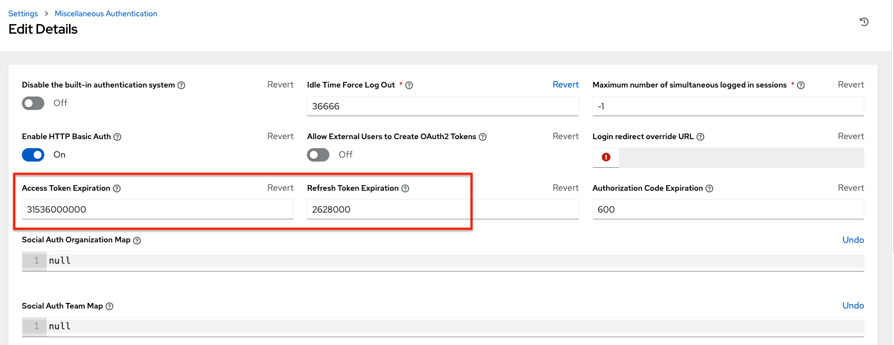

.. _ag_oauth2_token_auth:

Token-Based Authentication 
==================================================

.. index::
    single: token-based authentication
    single: authentication

OAuth 2 is used for token-based authentication. You can manage OAuth tokens as well as applications, a server-side representation of API clients used to generate tokens. By including an OAuth token as part of the HTTP authentication header, you can authenticate yourself and adjust the degree of restrictive permissions in addition to the base RBAC permissions. Refer to `RFC 6749`_ for more details of OAuth 2 specification.

	.. _`RFC 6749`: https://tools.ietf.org/html/rfc6749

For details on using the ``manage`` utility to create tokens, refer to the :ref:`ag_token_utility` section. 

Managing OAuth 2 Applications and Tokens
------------------------------------------

Applications and tokens can be managed as a top-level resource at ``/api/<version>/applications`` and ``/api/<version>/tokens``. These resources can also be accessed respective to the user at ``/api/<version>/users/N/<resource>``. Applications can be created by making a **POST** to either ``api/<version>/applications`` or ``/api/<version>/users/N/applications``.

Each OAuth 2 application represents a specific API client on the server side. For an API client to use the API via an application token, it must first have an application and issue an access token. Individual applications are accessible via their primary keys: ``/api/<version>/applications/<pk>/``. Here is a typical application:

::

	{
        "id": 1,
        "type": "o_auth2_application",
        "url": "/api/v2/applications/2/",
        "related": {
            "tokens": "/api/v2/applications/2/tokens/"
        },
        "summary_fields": {
            "organization": {
                "id": 1,
                "name": "Default",
                "description": ""
            },
            "user_capabilities": {
                "edit": true,
                "delete": true
            },
            "tokens": {
                "count": 0,
                "results": []
            }
        },
        "created": "2018-07-02T21:16:45.824400Z",
        "modified": "2018-07-02T21:16:45.824514Z",
        "name": "My Application",
        "description": "",
        "client_id": "Ecmc6RjjhKUOWJzDYEP8TZ35P3dvsKt0AKdIjgHV",
        "client_secret": "7Ft7ym8MpE54yWGUNvxxg6KqGwPFsyhYn9QQfYHlgBxai74Qp1GE4zsvJduOfSFkTfWFnPzYpxqcRsy1KacD0HH0vOAQUDJDCidByMiUIH4YQKtGFM1zE1dACYbpN44E",
        "client_type": "confidential",
        "redirect_uris": "",
        "authorization_grant_type": "password",
        "skip_authorization": false,
        "organization": 1
    }

As shown in the example above, ``name`` is the human-readable identifier of the application. The rest of the fields, like ``client_id`` and ``redirect_uris``, are mainly used for OAuth2 authorization, which is covered later in :ref:`ag_use_oauth_pat`.

The values for the ``client_id`` and ``client_secret`` fields are generated during creation and are non-editable identifiers of applications, while ``organization`` and ``authorization_grant_type`` are required upon creation and become non-editable.

Access Rules for Applications
^^^^^^^^^^^^^^^^^^^^^^^^^^^^^^^^

Access rules for applications are as follows:

- System administrators can view and manipulate all applications in the system
- Organization administrators can view and manipulate all applications belonging to Organization members
- Other users can only view, update, and delete their own applications, but cannot create any new applications

Tokens, on the other hand, are resources used to actually authenticate incoming requests and mask the permissions of the underlying user. There are two ways to create a token: 

- POST to the ``/api/v2/tokens/`` endpoint with ``application`` and ``scope`` fields to point to the related application and specify token scope
- POST to the ``/api/v2/applications/<pk>/tokens/`` endpoint with the ``scope`` field (the parent application will be automatically linked)

Individual tokens are accessible via their primary keys: ``/api/<version>/tokens/<pk>/``. Here is an example of a typical token:

  .. code-block:: text

      {
          "id": 4,
          "type": "o_auth2_access_token",
          "url": "/api/v2/tokens/4/",
          "related": {
              "user": "/api/v2/users/1/",
              "application": "/api/v2/applications/1/",
              "activity_stream": "/api/v2/tokens/4/activity_stream/"
      },
          "summary_fields": {
              "application": {
                  "id": 1,
                  "name": "Default application for root",
                  "client_id": "mcU5J5uGQcEQMgAZyr5JUnM3BqBJpgbgL9fLOVch"
              },
              "user": {
                  "id": 1,
                  "username": "root",
                  "first_name": "",
                  "last_name": ""
              }
          },
          "created": "2018-02-23T14:39:32.618932Z",
          "modified": "2018-02-23T14:39:32.643626Z",
          "description": "App Token Test",
          "user": 1,
          "token": "*************",
          "refresh_token": "*************",
          "application": 1,
          "expires": "2018-02-24T00:39:32.618279Z",
          "scope": "read"
      },

For an OAuth 2 token, the only fully editable fields are ``scope`` and ``description``. The ``application`` field is non-editable on update, and all other fields are entirely non-editable, and are auto-populated during creation, as follows:

- ``user`` field corresponds to the user the token is created for, and in this case, is also the user creating the token
- ``expires`` is generated according to AWX configuration setting ``OAUTH2_PROVIDER``
- ``token`` and ``refresh_token`` are auto-generated to be non-clashing random strings

Both application tokens and personal access tokens are shown at the ``/api/v2/tokens/`` endpoint. The ``application`` field in the personal access tokens is always **null**. This is a good way to differentiate the two types of tokens.

Access rules for tokens
^^^^^^^^^^^^^^^^^^^^^^^^^

Access rules for tokens are as follows:

- Users can create a token if they are able to view the related application; and are also able to create a personal token for themselves
- System administrators are able to view and manipulate every token in the system
- Organization administrators are able to view and manipulate all tokens belonging to Organization members
- System Auditors can view all tokens and applications
- Other normal users are only able to view and manipulate their own tokens

.. note:: 
    Users can only view the token or refresh the token value at the time of creation only.

.. _ag_use_oauth_pat:

Using OAuth 2 Token System for Personal Access Tokens (PAT)
---------------------------------------------------------------

The easiest and most common way to obtain an OAuth 2 token is to create a personal access token at the ``/api/v2/users/<userid>/personal_tokens/`` endpoint, as shown in this example below:

::

    curl -XPOST -k -H "Content-type: application/json" -d '{"description":"Personal AWX CLI token", "application":null, "scope":"write"}' https://<USERNAME>:<PASSWORD>@<AWX_SERVER>/api/v2/users/<USER_ID>/personal_tokens/ | python -m json.tool

You could also pipe the JSON output through ``jq``, if installed.

Following is an example of using the personal token to access an API endpoint using curl:

::

	curl -k -H "Authorization: Bearer <token>" -H "Content-Type: application/json" -X POST  -d '{}' https://awx/api/v2/job_templates/5/launch/

In AWX, the OAuth 2 system is built on top of the `Django Oauth Toolkit`_, which provides dedicated endpoints for authorizing, revoking, and refreshing tokens. These endpoints can be found under the ``/api/v2/users/<USER_ID>/personal_tokens/`` endpoint, which also provides detailed examples on some typical usage of those endpoints. These special OAuth 2 endpoints only support using the ``x-www-form-urlencoded`` **Content-type**, so none of the ``api/o/*`` endpoints accept ``application/json``. 

.. _`Django Oauth Toolkit`: https://django-oauth-toolkit.readthedocs.io/en/latest/

.. note:: 
    You can also request tokens using the ``/api/o/token`` endpoint by specifying ``null`` for the application type.

Alternatively, you can :ref:`add tokens <ug_tokens_auth_create>` for users through the AWX user interface, as well as configure the expiration of an access token and its associated refresh token (if applicable).  

Token scope mask over RBAC system
^^^^^^^^^^^^^^^^^^^^^^^^^^^^^^^^^^^

The scope of an OAuth 2 token is a space-separated string composed of valid scope keywords, 'read' and 'write'. These keywords are configurable and used to specify permission level of the authenticated API client. Read and write scopes provide a mask layer over the Role-Based Access Control (RBAC) permission system of AWX. Specifically, a 'write' scope gives the authenticated user the full permissions the RBAC system provides, while a 'read' scope gives the authenticated user only read permissions the RBAC system provides. Note that 'write' implies 'read' as well.

For example, if you have administrative permissions to a job template, you can view, modify, launch, and delete the job template if authenticated via session or basic authentication. In contrast, if you are authenticated using OAuth 2 token, and the related token scope is 'read', you can only view, but not manipulate or launch the job template, despite being an administrator. If the token scope is 'write' or 'read write', you can take full advantage of the job template as its administrator. 

To acquire and use a token, first create an application token:

1.  Make an application with ``authorization_grant_type`` set to ``password``. HTTP POST the following to the ``/api/v2/applications/`` endpoint  (supplying your own organization ID):

::

    
    {
        "name": "Admin Internal Application",
        "description": "For use by secure services & clients. ",
        "client_type": "confidential",
        "redirect_uris": "",
        "authorization_grant_type": "password",
        "skip_authorization": false,
        "organization": <organization-id>
    }

2. Make a token and POST to the ``/api/v2/tokens/`` endpoint:

::

    {
        "description": "My Access Token",
        "application": <application-id>,
        "scope": "write"
    }

This returns a <token-value> that you can use to authenticate with for future requests (this will not be shown again).

3. Use the token to access a resource. The following uses curl as an example:

::

    curl -H "Authorization: Bearer <token-value>" -H "Content-Type: application/json" -X GET https://<awx>/api/v2/users/ 

The ``-k`` flag may be needed if you have not set up a CA yet and are using SSL.

To revoke a token, you can make a DELETE on the detail page for that token, using that token's ID. For example:

::

    curl -ku <user>:<password> -X DELETE https://<awx>/api/v2/tokens/<pk>/

Similarly, using a token:

::

    curl -H "Authorization: Bearer <token-value>" -X DELETE https://<awx>/api/v2/tokens/<pk>/ -k

.. _ag_oauth2_token_auth_grant_types:

Application Functions
-----------------------

This page lists OAuth 2 utility endpoints used for authorization, token refresh, and revoke. The ``/api/o/`` endpoints are not meant to be used in browsers and do not support HTTP GET. The endpoints prescribed here strictly follow RFC specifications for OAuth 2, so use that for detailed reference. The following is an example of the typical usage of these endpoints in AWX, in particular, when creating an application using various grant types:

   - Authorization Code
   - Password

.. note::

    You can perform any of the application functions described here using AWX user interface. Refer to the :ref:`ug_applications_auth` section of the |atu| for more detail.

 

Application using ``authorization code`` grant type
^^^^^^^^^^^^^^^^^^^^^^^^^^^^^^^^^^^^^^^^^^^^^^^^^^^^^

The application ``authorization code`` grant type should be used when access tokens need to be issued directly to an external application or service. 

.. note::

    You can only use the ``authorization code`` type to acquire an access token when using an application. When integrating an external webapp with AWX, that webapp may need to create OAuth2 Tokens on behalf of users in that other webapp. Creating an application in AWX with the ``authorization code`` grant type is the preferred way to do this because:

    - this allows an external application to obtain a token from AWX for a user, using their credentials.
    - compartmentalized tokens issued for a particular application allows those tokens to be easily managed (revoke all tokens associated with that application without having to revoke *all* tokens in the system, for example)

 To create an application named *AuthCodeApp* with the ``authorization-code`` grant type, perform a POST to the ``/api/v2/applications/`` endpoint:

::

    {
        "name": "AuthCodeApp",
        "user": 1,
        "client_type": "confidential",
        "redirect_uris": "http://<awx>/api/v2",
        "authorization_grant_type": "authorization-code",
        "skip_authorization": false
    }

    .. _`Django-oauth-toolkit simple test application`: http://django-oauth-toolkit.herokuapp.com/consumer/

The workflow that occurs when you issue a **GET** to the ``authorize`` endpoint from the client application with the ``response_type``, ``client_id``, ``redirect_uris``, and ``scope``:

1. AWX responds with the authorization code and status to the ``redirect_uri`` specified in the application. 
2. The client application then makes a **POST** to the ``api/o/token/`` endpoint on AWX with the ``code``, ``client_id``, ``client_secret``, ``grant_type``, and ``redirect_uri``. 
3. AWX responds with the ``access_token``, ``token_type``, ``refresh_token``, and ``expires_in``. 

Refer to `Django's Test Your Authorization Server`_ toolkit to test this flow.

    .. _`Django's Test Your Authorization Server`: http://django-oauth-toolkit.readthedocs.io/en/latest/tutorial/tutorial_01.html#test-your-authorization-server

You may specify the number of seconds an authorization code remains valid in the **System settings** screen: 

Requesting an access token after this duration will fail. The duration defaults to 600 seconds (10 minutes), based on the `RFC6749 <https://tools.ietf.org/html/rfc6749>`_ recommendation. 

The best way to set up app integrations with AWX using the Authorization Code grant type is to whitelist the origins for those cross-site requests. More generally, you need to whitelist the service or application you are integrating with AWX, for which you want to provide access tokens. To do this, have your Administrator add this whitelist to their local AWX settings:

::

    CORS_ALLOWED_ORIGIN_REGEXES = [
        r"http://django-oauth-toolkit.herokuapp.com*",
        r"http://www.example.com*"
    ]

Where ``http://django-oauth-toolkit.herokuapp.com`` and ``http://www.example.com`` are applications needing tokens with which to access AWX.

Application using ``password`` grant type
^^^^^^^^^^^^^^^^^^^^^^^^^^^^^^^^^^^^^^^^^^^

The ``password`` grant type or ``Resource owner password-based`` grant type is ideal for users who have native access to the web app and should be used when the client is the Resource owner. The following supposes an application, 'Default Application' with grant type ``password``:

::

    {
        "id": 6,
        "type": "application",
        ...
        "name": "Default Application",
        "user": 1,
        "client_id": "gwSPoasWSdNkMDtBN3Hu2WYQpPWCO9SwUEsKK22l",
        "client_secret": "fI6ZpfocHYBGfm1tP92r0yIgCyfRdDQt0Tos9L8a4fNsJjQQMwp9569eIaUBsaVDgt2eiwOGe0bg5m5vCSstClZmtdy359RVx2rQK5YlIWyPlrolpt2LEpVeKXWaiybo",
        "client_type": "confidential",
        "redirect_uris": "",
        "authorization_grant_type": "password",
        "skip_authorization": false
    }

Logging in is not required for ``password`` grant type, so you can simply use curl to acquire a personal access token through the ``/api/v2/tokens/`` endpoint:

  .. code-block:: text

      curl -k --user <user>:<password> -H "Content-type: application/json" \
      -X POST \
      --data '{
          "description": "Token for Nagios Monitoring app",
          "application": 1,
          "scope": "write"
      }' \
      https://<awx>/api/v2/tokens/

.. note::

    The special OAuth 2 endpoints only support using the ``x-www-form-urlencoded`` **Content-type**, so as a result, none of the ``api/o/*`` endpoints accept ``application/json``. 

Upon success, a response displays in JSON format containing the access token, refresh token and other information:

::

    HTTP/1.1 200 OK
    Server: nginx/1.12.2
    Date: Tue, 05 Dec 2017 16:48:09 GMT
    Content-Type: application/json
    Content-Length: 163
    Connection: keep-alive
    Content-Language: en
    Vary: Accept-Language, Cookie
    Pragma: no-cache
    Cache-Control: no-store
    Strict-Transport-Security: max-age=15768000

    {"access_token": "9epHOqHhnXUcgYK8QanOmUQPSgX92g", "token_type": "Bearer", "expires_in": 315360000000, "refresh_token": "jMRX6QvzOTf046KHee3TU5mT3nyXsz", "scope": "read"}

Application Token Functions
------------------------------

This section describes the refresh and revoke functions associated with tokens. Everything that follows (Refreshing and revoking tokens at the ``/api/o/`` endpoints) can currently only be done with application tokens. 

Refresh an existing access token
^^^^^^^^^^^^^^^^^^^^^^^^^^^^^^^^^^^

The following example shows an existing access token with a refresh token provided:

::

    {
        "id": 35,
        "type": "access_token",
        ...
        "user": 1,
        "token": "omMFLk7UKpB36WN2Qma9H3gbwEBSOc",
        "refresh_token": "AL0NK9TTpv0qp54dGbC4VUZtsZ9r8z",
        "application": 6,
        "expires": "2017-12-06T03:46:17.087022Z",
        "scope": "read write"
    }

The ``/api/o/token/`` endpoint is used for refreshing the access token:

::

    curl -X POST \
        -d "grant_type=refresh_token&refresh_token=AL0NK9TTpv0qp54dGbC4VUZtsZ9r8z" \
        -u "gwSPoasWSdNkMDtBN3Hu2WYQpPWCO9SwUEsKK22l:fI6ZpfocHYBGfm1tP92r0yIgCyfRdDQt0Tos9L8a4fNsJjQQMwp9569eIaUBsaVDgt2eiwOGe0bg5m5vCSstClZmtdy359RVx2rQK5YlIWyPlrolpt2LEpVeKXWaiybo" \
        http://<awx>/api/o/token/ -i

In the above POST request, ``refresh_token`` is provided by ``refresh_token`` field of the access token above that. The authentication information is of format ``<client_id>:<client_secret>``, where ``client_id`` and ``client_secret`` are the corresponding fields of the underlying related application of the access token.

.. note::

    The special OAuth 2 endpoints only support using the ``x-www-form-urlencoded`` **Content-type**, so as a result, none of the ``api/o/*`` endpoints accept ``application/json``. 

Upon success, a response displays in JSON format containing the new (refreshed) access token with the same scope information as the previous one:

::

    HTTP/1.1 200 OK
    Server: nginx/1.12.2
    Date: Tue, 05 Dec 2017 17:54:06 GMT
    Content-Type: application/json
    Content-Length: 169
    Connection: keep-alive
    Content-Language: en
    Vary: Accept-Language, Cookie
    Pragma: no-cache
    Cache-Control: no-store
    Strict-Transport-Security: max-age=15768000

    {"access_token": "NDInWxGJI4iZgqpsreujjbvzCfJqgR", "token_type": "Bearer", "expires_in": 315360000000, "refresh_token": "DqOrmz8bx3srlHkZNKmDpqA86bnQkT", "scope": "read write"}

Essentially, the refresh operation replaces the existing token by deleting the original and then immediately creating a new token with the same scope and related application as the original one. Verify that new token is present and the old one is deleted in the ``/api/v2/tokens/`` endpoint.

.. _ag_oauth2_token_revoke:

Revoke an access token
^^^^^^^^^^^^^^^^^^^^^^^^^

Similarly, you can revoke an access token by using the ``/api/o/revoke-token/`` endpoint.

Revoking an access token by this method is the same as deleting the token resource object, but it allows you to delete a token by providing its token value, and the associated ``client_id`` (and ``client_secret`` if the application is ``confidential``). For example:

::

    curl -X POST -d "token=rQONsve372fQwuc2pn76k3IHDCYpi7" \
    -u "gwSPoasWSdNkMDtBN3Hu2WYQpPWCO9SwUEsKK22l:fI6ZpfocHYBGfm1tP92r0yIgCyfRdDQt0Tos9L8a4fNsJjQQMwp9569eIaUBsaVDgt2eiwOGe0bg5m5vCSstClZmtdy359RVx2rQK5YlIWyPlrolpt2LEpVeKXWaiybo" \
    http://<awx>/api/o/revoke_token/ -i

.. note::

    The special OAuth 2 endpoints only support using the ``x-www-form-urlencoded`` **Content-type**, so as a result, none of the ``api/o/*`` endpoints accept ``application/json``. 

.. note::

  The **Allow External Users to Create Oauth2 Tokens** (``ALLOW_OAUTH2_FOR_EXTERNAL_USERS`` in the API) setting is disabled by default. External users refer to users authenticated externally with a service like LDAP, or any of the other SSO services. This setting ensures external users cannot *create* their own tokens. If you enable then disable it, any tokens created by external users in the meantime will still exist, and are not automatically revoked.

Alternatively, you can use the ``manage`` utility, :ref:`ag_manage_utility_revoke_tokens`, to revoke tokens as described in the the :ref:`ag_token_utility` section. 

This setting can be configured at the system-level in the AWX User Interface: 

.. image:: ../common/images/configure-awx-system-oauth2-tokens-toggle.png

Upon success, a response of ``200 OK`` displays. Verify the deletion by checking whether the token is present in the ``/api/v2/tokens/`` endpoint.
