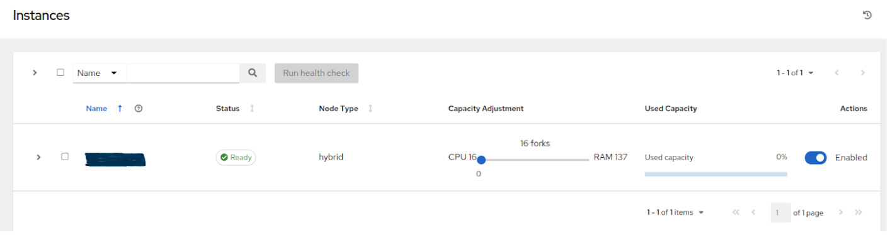
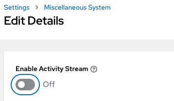

.. _ag_performance:

Improving AWX Performance
==================================
.. index::
   pair: performance; AWX

This section aims to provide the guidelines for tuning AWX for performance and scalability.

.. _ag_performance_improvements:

Performance improvements
-------------------------
.. index::
   pair: improvements; process

AWX brings multiple improvements that support large scale deployments of AWX. Major gains have been made to support workloads with many more concurrent jobs. In the past, there were issues with excessive database connections, job scheduling issues when there were thousands of pending and running jobs, and issues with successfully starting jobs when operating near 100% capacity of control nodes.

Additionally, changes have been made by default to take advantage of CPU capacity available on larger control nodes. This means customers who provision larger control nodes and want to run thousands of concurrent jobs have multiple improvements to look forward to in this release:

.. contents::
    :local:

Vertical scaling improvements
~~~~~~~~~~~~~~~~~~~~~~~~~~~~~~
.. index::
   pair: improvements; scaling

Control nodes are responsible for processing the output of jobs and writing them to the database. The process that does this is called the callback receiver. The callback receiver has a configurable number of workers, controlled by the setting ``JOB_EVENT_WORKERS``. In the past, the default for this setting was always 4, regardless of the CPU or memory capacity of the node. Now, in traditional virtual machines, the ``JOB_EVENT_WORKERS`` will be set to the same as the number of CPU if that is greater than 4. This means administrators that provision larger control nodes will see greater ability for those nodes to keep up with the job output created by jobs without having to manually adjust ``JOB_EVENT_WORKERS``. 

Job scheduling improvements
~~~~~~~~~~~~~~~~~~~~~~~~~~~~~~
.. index::
   pair: improvements; scheduling

When jobs are created either via a schedule, a workflow, the UI or the API, they are first created in Pending state. To determine when and where to run this job, a background task called the Task Manager collects all pending and running jobs and determines where capacity is available to run the job. In previous versions of AWX, scheduling slowed as the number of pending and running jobs increased, and the Task Manager was vulnerable to timing out without having made any progress. The scenario exhibits symptoms of having thousands of pending jobs, available capacity, but no jobs starting. 

Optimizations in the job scheduler have made scheduling faster, as well as safeguards to better ensure the scheduler commits its progress even if it is nearing time out. Additionally, work that previously occurred in the Task Manager that blocked its progress has been decoupled into separate, non-blocking work units executed by the Dispatcher. 

Database resource usage improvements
~~~~~~~~~~~~~~~~~~~~~~~~~~~~~~~~~~~~~
.. index::
   pair: improvements; database usage

The use of database connections by running jobs has dramatically decreased, which removes a previous limit to concurrent running jobs, as well reduces pressure on memory consumption of PostgreSQL.

Each job in AWX has a worker process, called the dispatch worker, on the control node that started the process, which submits the work to the execution node via the Receptor, as well as consumes the output of the job and puts it in the Redis queue for the callback receiver to serialize the output and write it to the database as job events. 

The dispatch worker is also responsible for noticing if the job has been canceled by the user in order to then cancel the receptor work unit. In the past, the worker maintained multiple open database connections per job. This caused two main problems:

- The application would begin to experience errors attempting to open new database connections (for API calls or other essential processes) when there were more than 350 jobs running concurrently, unless users increased the maximum number of connections.

- Even idle connections consume memory. For example, in experiments done by AWS, idle connections to PostgreSQL were shown to consume at least 1.5 MB of memory. So if an AWX administrator wanted to support running 2,000 concurrent jobs, this could result in 9GB of memory consumed on PostgreSQL from just idle connections alone.

The dispatch process closes database connections once the job has started. This means now the number of concurrent running jobs is no longer limited by the maximum number of database connections, and the risk of over-consuming memory on PostgreSQL is greatly reduced.

Stability improvements
~~~~~~~~~~~~~~~~~~~~~~~~~
.. index::
   pair: improvements; stability

Notable stability improvements in this release:

- **Improvements to job reaping** - Fixed root cause of jobs in waiting getting reaped before the job ever started, which often occurred when running near 100% capacity on control and hybrid nodes.

- **Improvements in stability for Operator-based deployments** - Resolved issues with multiple control pod deployments erroneously marking each other as offline. Now scaling operator-based deployments horizontally is more stable.

Metrics enhancements
~~~~~~~~~~~~~~~~~~~~~
.. index::
   pair: improvements; metrics

Metrics added in this release to track:

- **awx_database_connections_total** - Tracks current number of open database connections. When included in monitoring, can help identify when errors have occurred due lack of available database connections.

- **callback_receiver_event_processing_avg_seconds** - Proxy for “how far behind the callback receiver workers are in processing output". If this number stays large, consider horizontally scaling the control plane and reducing the ``capacity_adjustment`` value on the node.

LDAP login and basic authentication
~~~~~~~~~~~~~~~~~~~~~~~~~~~~~~~~~~~~
.. index::
   pair: improvements; LDAP
   pair: improvements; basic auth

Enhancements were made to the authentication backend that syncs LDAP configuration with the organizations and teams in the AWX. Logging in with large mappings between LDAP groups and organizations and teams is now up to 10 times faster than in previous versions.

Capacity Planning
------------------
.. index::
   pair: planning; capacity

Example capacity planning exercise
~~~~~~~~~~~~~~~~~~~~~~~~~~~~~~~~~~~~
.. index::
   pair: exercise; capacity planning   

Determining the number and size of instances to support the desired workload must take into account the following:

- Managed hosts
- Tasks/hour per host
- Maximum number of concurrent jobs you want to support
- Maximum number of forks set on jobs
- Node size you prefer to deploy (CPU/Memory/Disk)

With this data, you can calculate the number of tasks per hour, which the cluster needs control capacity to process; as well as the number of “forks” or capacity you need to be able to run your peak load, which the cluster needs execution capacity to run.

For example, to plan for a cluster with:

- 300 managed hosts
- 1,000 tasks/hour per host, or 16 tasks per minute per host
- 10 concurrent jobs
- Forks set to 5 on playbooks
- Average event size 1 Mb
- Preferred node size of 4 cpu and 16 GB Ram with disks rated at 3000 IOPs

Known factors:

- To run the 10 concurrent jobs, you need at least (10 jobs * 5 forks) + (10 jobs * 1 base task impact of a job) = 60 execution capacity
- To control 10 concurrent jobs, you need at least 10 control capacity.
- Running 1000 tasks * 300 managed hosts/hour will produce at least 300,000 events/hour. You would need to run the job to see exactly how many events it produces because this is dependent on the specific task and verbosity. For example, a debug task printing “Hello World” produces 6  job events with the verbosity of 1 on one host. With a verbosity of 3, it produces 34 job events on one host. Therefore, estimate the task produces at least 6 events. That means, closer to 3,000,000 events/hour or approximately 833 events/second.

To determine how many execution and control nodes you will need, reference experiment results in the following table that show the observed event processing rate of a single control node with 5 execution nodes of equal size (API Capacity column). The default “forks” setting of job templates is 5, so using this default the maximum number of jobs a control node can dispatch to execution nodes will make 5 execution nodes of equal CPU/RAM use 100% of their capacity, arriving to the previously mentioned 1:5 ratio of control to execution capacity.

.. list-table::
   :widths: 15 10 5 5 10 10 10
   :header-rows: 1

   * - Node
     - API Capacity
     - Default Execution Capacity
     - Default Control Capacity
     - Mean Event Processing Rate at 100% capacity usage
     - Mean Events Processing Rate at 50% capacity usage
     - Mean Events Processing Rate at 40% capacity usage
   * - 4 CPU @ 2.5Ghz, 16 GB RAM Control Node, max 3000 IOPs disk
     - 100 - 300 requests/second
     - n/a
     - 137 jobs
     - 1100/second
     - 1400/second
     - 1630/second
   * - 4 CPU @ 2.5Ghz, 16 GB RAM Execution Node, max 3000 IOPs disk
     - n/a
     - 137
     - 0
     - n/a
     - n/a
     - n/a
   * - 4 CPU @ 2.5Ghz, 16 GB RAM DB Node, max 3000 IOPs disk
     - n/a
     - n/a
     - n/a
     - n/a
     - n/a
     - n/a

This table shows that controlling jobs competes with job event processing on the control node. Therefore, over-provisioning control capacity can have a positive impact on reducing processing times. When processing times are high, users can experience a delay between when the job runs and when they can view the output in the API or UI.

For the example workload on 300 managed hosts, executing 1000 tasks/hour per host, 10 concurrent jobs with forks set to 5 on playbooks, and an average event size 1 Mb, do the following:

- Deploy 1 execution node, 1 control node, 1 DB node of 4 CPU @ 2.5Ghz, 16 GB RAM with disk having ~3000 IOPs
- Keep default fork setting of 5 on job templates
- Use the capacity adjustment feature on the control node to reduce the capacity down to 16 (lowest value) to reserve more of the Control node’s capacity for processing events

Factors influencing node size choice
~~~~~~~~~~~~~~~~~~~~~~~~~~~~~~~~~~~~~~
.. index::
   pair: factors; node size
   single: node size choice

The previous exercise was done given that the cluster administrator already had a preferred node size, which happened to be the minimum recommended node size for AWX. Increasing the RAM and CPU on nodes increases the calculated capacity of the instances. For each instance type, there are different considerations as to why you may want to vertically scale the node.

Control nodes
^^^^^^^^^^^^^^
Vertically scaling a control node increases the number of jobs it can perform control tasks for, which requires both more CPU and memory. In general, scaling CPU alongside memory in the same proportion is recommended (e.g. 1 CPU: 4GB RAM). Even in the case where memory consumption is observed to be high, increasing the CPU of an instance can often relieve pressure, as most memory consumption of control nodes is usually from unprocessed events.

As mentioned in the :ref:`ag_performance_improvements` section, increasing the number of CPU can also increase the job event processing rate of a control node. At this time, vertically scaling a control node does not increase the number of workers that handle web requests, so horizontally scaling is more effective, if the desire is to increase the API availability. 

Execution Nodes
^^^^^^^^^^^^^^^^
Vertical scaling an execution node will provide more forks for job execution. As mentioned in the example, a host with 16 GB of memory will by default, be assigned the capacity to run 137 “forks”, which at the default setting of 5 forks/job, will be able to run around 22 jobs concurrently. In general, scaling CPU alongside memory in the same proportion is recommended. Like control and hybrid nodes, there is a “capacity adjustment” on each execution instance that can be used to align actual utilization with the estimation of capacity consumption AWX makes. By default, all nodes are set to the top range of the capacity AWX estimates the node to have. If actual monitoring data reveals the node to be over-utilized, decreasing the capacity adjustment can help bring this in line with actual usage.
	
Vertically scaling execution will do exactly what the user expects and increase the number of concurrent jobs an instance can run. One downside is that concurrently running jobs on the same execution node, while isolated from each other in the sense that they cannot access the other’s data, can impact the other's performance, if a particular job is very resource-consumptive and overwhelms the node to the extent that it degrades performance of the entire node. Horizontal scaling the execution plane (e.g deploying more execution nodes) can provide some additional isolation of workloads, as well as allowing administrators to assign different instances to different instance groups, which can then be assigned to Organizations, Inventories, or Job Templates. This can enable something like an instance group that can only be used for running jobs against a “production” Inventory, this way jobs for development do not end up eating up capacity and causing higher priority jobs to queue waiting for capacity. 

Hop Nodes
^^^^^^^^^^
Hop nodes have very low memory and CPU utilization and there is no significant motivation for vertically scaling hop nodes. A hop node that serves as the sole connection of many execution nodes to the control plane should be monitored for network bandwidth utilization, if this is seen to be saturated, changes to the network may be worth considering.

Hybrid nodes
^^^^^^^^^^^^^
Hybrid nodes perform both execution and control tasks, so vertically scaling these nodes both increases the number of jobs they can run, and now in 4.3.0, how many events they can process. 

Capacity planning for Operator based Deployments
~~~~~~~~~~~~~~~~~~~~~~~~~~~~~~~~~~~~~~~~~~~~~~~~~
.. index::
   pair: Operator; deployment

For Operator based deployments, refer to `Ansible AWX Operator documentation <https://ansible.readthedocs.io/projects/awx-operator>`_.

Monitoring AWX
----------------------
.. index::
   pair: monitoring; AWX

It is a best practice to monitor your AWX hosts both from a system level as well as at the application level. System level monitoring would include information about disk I/O, RAM utilization, CPU utilization, and network traffic.

For application level monitoring, AWX provides Prometheus-style metrics on an API endpoint ``/api/v2/metrics``. This can be used to monitor aggregate data about job status as well as subsystem performance such as for job output processing or job scheduling.

Monitoring the actual CPU and memory utilization of your hosts is important because capacity management for instances does not dynamically introspect into the actual resource usage of hosts. The resource impact of automation will vary based on what exactly the playbooks are doing. For example, many cloud or networking modules do most of the actual processing on the node running the Ansible playbook (the execution node), which can have a significantly different impact on AWX than running ``yum update`` across many hosts, where the execution node spends much of the time during this task waiting on results.

If CPU or memory usage is very high, consider lowering the capacity adjustment on affected instances in AWX. This will limit how many jobs are run on or controlled by this instance.

Using this in combination with application level metrics can help identify what was happening in the application when and if any service degradation occurred. Having information about AWX’s performance over time can be very useful in diagnosing problems or doing capacity planning for future growth.

Database Settings
------------------
.. index::
   pair: settings; database

The following are configurable settings in the database that may help improve performance:

- **Autovacuuming**. Setting this PostgreSQL setting to true is a good practice. However, autovacuuming will not occur if there is never any idle time on the database. If it is observed that autovacuuming is not sufficiently cleaning up space on the database disk, then scheduling specific vacuum tasks during specific maintenance windows can be a solution.

- **GUC** parameters. Following are certain GUC (Grand Unified Configuration) parameters recommended for memory management in PostgreSQL, which is helpful for improving the performance of the database server. Recommended settings for each parameter are also provided.

	- ``shared_buffers`` (integer)
	- ``work_mem`` (integer)
	- ``maintenance_work_mem`` (integer)

All of these parameters reside under the ``postgresql.conf`` file (inside ``$PDATA`` directory), which manages the configurations of the database server. 

The **shared_buffers** parameter determines how much memory is dedicated to the server for caching data. Set in ``postgresql.conf``, the default value for this parameter is::

	#sharedPostgres_buffers = 128MB
 
The value should be set at 15%-25% of the machine’s total RAM. For example: if your machine’s RAM size is 32 GB, then the recommended value for ``shared_buffers`` is 8 GB. Please note that the database server needs to be restarted after this change.

The **work_mem** parameter basically provides the amount of memory to be used by internal sort operations and hash tables before writing to temporary disk files. Sort operations are used for order by, distinct, and merge join operations. Hash tables are used in hash joins and hash based aggregation. Set in ``postgresql.conf``, the default value for this parameter is::

	#work_mem = 4MB

Setting the correct value of ``work_mem`` parameter can result in less disk-swapping, and therefore far quicker queries. 

We can use the formula below to calculate the optimal ``work_mem`` value for the database server::

	Total RAM * 0.25 / max_connections 

The ``max_connections`` parameter is one of the GUC parameters to specify the maximum number of concurrent connections to the database server. Please note setting a large ``work_mem`` can cause issues like PostgreSQL server going out of memory (OOM), if there are too many open connections to the database.

The **maintenance_work_mem** parameter basically provides the maximum amount of memory to be used by maintenance operations like vacuum, create index, and alter table add foreign key operations. Set in ``postgresql.conf``, the default value for this parameter is::

	#maintenance_work_mem = 64MB

It is recommended to set this value higher than ``work_mem``; this can improve performance for vacuuming. In general, it should calculated as:: 

	Total RAM * 0.05

AWX Settings
~~~~~~~~~~~~~~~~~~~~~
.. index::
   pair: settings; AWX
   pair: settings; performance

Many AWX settings are available to set via AWX UI or API. There are additional settings that are only available as file-based settings. Refer to product documentation about where each of these settings can be set. This section will focus on why administrators may want to adjust these values.

Live events in the AWX UI
^^^^^^^^^^^^^^^^^^^^^^^^^^^^^^^^^
.. index::
   pair: settings; live events

Events are broadcast to all nodes so that the events can be served over websocket to any client that connects to a control node’s web service. This task is expensive, and becomes more expensive as the number of events that the cluster is producing increases as well as the number of control nodes increase, because all events are broadcast to all nodes regardless of how many clients are subscribed to particular jobs.

There are a few settings that allow you to influence behavior of how job events are displayed in the UI and served over websockets.

For large clusters with large job event loads, an easy way to avoid the additional overhead is to disable live streaming events (the events are only loaded on hard refresh to a job’s output detail page). This is possible by setting ``UI_LIVE_UPDATES_ENABLED`` to False or set the **Enable Activity Stream** toggle to **Off** from the AWX UI Miscellaneous System Settings window.

If disabling live streaming of events is not possible, for very verbose jobs with many events, administrators can consider reducing the number of events shown per second or before truncating or hiding events in the UI. The following settings all address issues of rate or size of events.

::

	# Returned in the header on event api lists as a recommendation to the UI
	# on how many events to display before truncating/hiding
	MAX_UI_JOB_EVENTS = 4000

	# The maximum size of the ansible callback event's "res" data structure,
	# (the "res" is the full "result" of the module)
	# beyond this limit and the value will be removed (e.g. truncated)
	MAX_EVENT_RES_DATA = 700000

	# Note: These settings may be overridden by database settings.
	EVENT_STDOUT_MAX_BYTES_DISPLAY = 1024
	MAX_WEBSOCKET_EVENT_RATE = 30

	# The amount of time before a stdout file is expired and removed locally
	# Note that this can be recreated if the stdout is downloaded
	LOCAL_STDOUT_EXPIRE_TIME = 2592000

Job Event Processing (Callback Receiver) Settings
^^^^^^^^^^^^^^^^^^^^^^^^^^^^^^^^^^^^^^^^^^^^^^^^^^^
.. index::
   pair: settings; job events
   pair: settings; callback receiver

The callback receiver is a process with multiple workers. The number of workers spawned is determined by the setting ``JOB_EVENT_WORKERS``. These workers pull events off of a queue in Redis where unprocessed events are placed by jobs’ respective dispatch workers as results are available. As mentioned in the :ref:`ag_performance_improvements` section, this number of workers increased based on the number of CPU detected on the control instance. Previously, this setting was hardcoded to 4 workers, and administrators had to set this file based setting via a custom settings file on each control node.

This setting is still available for administrators to modify, with the knowledge that that values above 1 worker per CPU or less than 4 workers is not recommended. Greater values will have more workers available to clear the Redis queue as events stream to AWX, but may compete with other processes for CPU seconds. Lower values of workers may compete less for CPU on a node that also has had its number of UWSGI workers increased significantly, to prioritize serving web requests.

Task Manager (Job Scheduling) Settings
^^^^^^^^^^^^^^^^^^^^^^^^^^^^^^^^^^^^^^^^
.. index::
   pair: settings; task manager
   pair: settings; job scheduling

The task manager is a periodic task that collects tasks that need to be scheduled and determines what instances have capacity and are eligible for running them. Its job is to find and assign the control and execution instances, update the job’s status to waiting, and send the message to the control node via ``pg_notify`` for the dispatcher to pick up the task and start running it.
	
As mentioned in the :ref:`ag_performance_improvements` section, a number of optimizations and refactors of this process were implemented in version 4.3. One such refactor was to fix a defect that when the task manager did reach its timeout, it was terminated in such a way that it did not make any progress. Multiple changes were implemented to fix this, so that as the task manager approaches its timeout, it makes an effort to exit and commit any progress made on that run. These issues generally arise when there are thousands of pending jobs, so may not be applicable to your use case.

The first “short-circuit” available to limit how much work the task manager attempts to do in one run is ``START_TASK_LIMIT``. The default is 100 jobs, which is a safe default. If there are remaining jobs to schedule, a new run of the task manager will be scheduled to run immediately after the current run. Users who are willing to risk potentially longer individual runs of the task manager in order to start more jobs in individual run may consider increasing the ``START_TASK_LIMIT``. One metric, the Prometheus metrics, available in ``/api/v2/metrics`` observes how long individual runs of the task manager take is “task_manager__schedule_seconds”.

As a safeguard against excessively long runs of the task manager, there is a timeout which is determined by the setting “TASK_MANAGER_TIMEOUT”. This is when the task manager will begin to exit any loops and attempt to commit any progress it made. The task is not actually killed until ``TASK_MANAGER_TIMEOUT`` + ``TASK_MANAGER_TIMEOUT_GRACE_PERIOD`` seconds has passed.

Additional Resources
---------------------

For workloads with high levels of API interaction, best practices include:

- Use a load balancer
- Limit the rate
- Set max connections per node to 100
- Use dynamic inventory sources instead of individually creating inventory hosts via the API
- Use webhook notifications instead of polling for job status

Since the published blog, additional observations have been made in the field regarding authentication methods. For automation clients that will make many requests in rapid succession, using tokens is a best practice, because depending on the type of user, there may be additional overhead when using basic authentication. For example, LDAP users using basic authentication trigger a process to reconcile if the LDAP user is correctly mapped to particular organizations, teams and roles. Refer to :ref:`ag_oauth2_token_auth` for detail on how to generate and use tokens.
