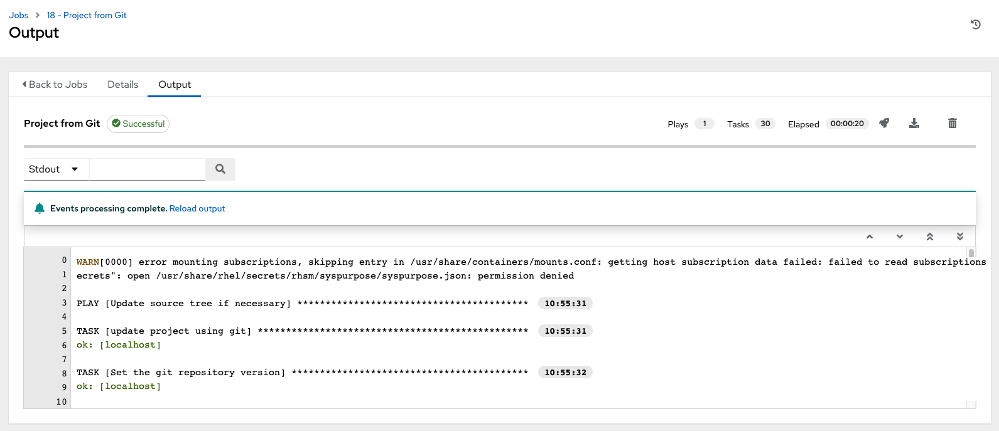

.. _ag_inv_import:

Inventory File Importing
=========================

.. index::
   single: inventory file importing
   single: inventory scripts; custom

AWX allows you to choose an inventory file from source control, rather than creating one from scratch. This function is the same as custom inventory scripts, except that the contents are obtained from source control instead of editing their contents browser. This means, the files are non-editable and as inventories are updated at the source, the inventories within the projects are also updated accordingly, including the ``group_vars`` and ``host_vars`` files or directory associated with them. SCM types can consume both inventory files and scripts, the overlap between inventory files and custom types in that both do scripts.

Any imported hosts will have a description of "imported" by default. This can be overridden by setting the ``_awx_description`` variable on a given host. For example, if importing from a sourced .ini file, you could add the following host variables:

::

	[main]
	127.0.0.1 _awx_description="my host 1"
	127.0.0.2 _awx_description="my host 2"

Similarly, group descriptions also default to "imported", but can be overridden by the ``_awx_description`` as well.

In order to use old inventory scripts in source control, see :ref:`ug_customscripts` in the |atu| for detail.

Custom Dynamic Inventory Scripts
---------------------------------

A custom dynamic inventory script stored in version control can be imported and run. This makes it much easier to make changes to an inventory script — rather than having to copy and paste one into AWX, it is pulled directly from source control and then executed. The script must be written to handle any credentials needed for doing its work and you are responsible for installing any Python libraries needed by the script (which is the same requirement for custom dynamic inventory scripts). And this applies to both user-defined inventory source scripts and SCM sources as they are both exposed to Ansible *virtualenv* requirements related to playbooks.

You can specify environment variables when you edit the SCM inventory source itself. For some scripts, this will be sufficient, however, this is not a secure way to store secret information that gives access to cloud providers or inventory.

The better way is to create a new credential type for the inventory script you are going to use. The credential type will need to specify all the necessary types of inputs. Then, when you create a credential of this type, the secrets will be stored in an encrypted form. If you apply that credential to the inventory source, the script will have access to those inputs like environment variables or files. 

For more detail, refer to :ref:`Credential types <ug_credential_types>`.

SCM Inventory Source Fields
-----------------------------

The source fields used are:

- ``source_project``: project to use

- ``source_path``: relative path inside the project indicating a directory or a file. If left blank, "" is still a relative path indicating the root directory of the project

- ``source_vars``: if set on a "file" type inventory source then they will be passed to the environment vars when running

An update of the project automatically triggers an inventory update where it is used. An update of the project is scheduled immediately after creation of the inventory source. Neither inventory nor project updates are blocked while a related job is running. In cases where you have a big project (around 10 GB), disk space on ``/tmp`` may be an issue.

You can specify a location manually in the AWX User Interface from the Create Inventory Source page. Refer to the :ref:`ug_inventories` section of the |atu| for instructions on creating an inventory source.

This listing should be refreshed to latest SCM info on a project update. If no inventory sources use a project as an SCM inventory source, then the inventory listing may not be refreshed on update.

For inventories with SCM sources, the Job Details page for inventory updates show a status indicator for the project update as well as the name of the project. The status indicator links to the project update job. The project name links to the project.

An inventory update can be performed while a related job is running.

Supported File Syntax
^^^^^^^^^^^^^^^^^^^^^^

AWX uses the ``ansible-inventory`` module from Ansible to process inventory files, and supports all valid inventory syntax that AWX requires.

