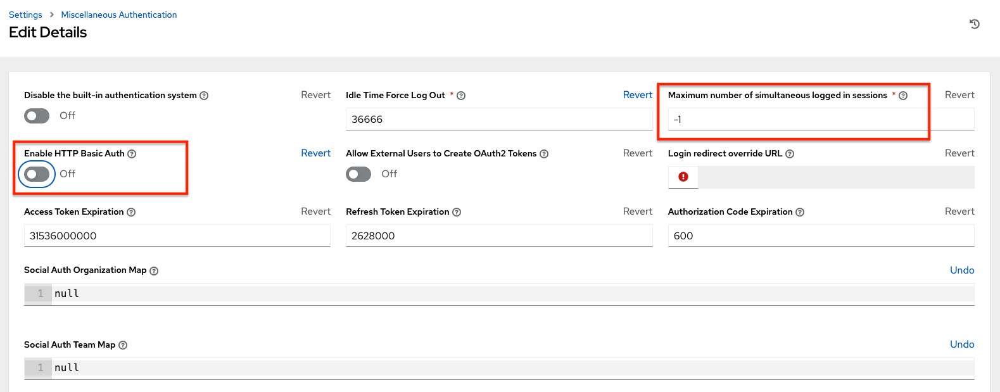

.. _ag_session_limits:

Working with Session Limits
=================================
.. index::
  single: session limits
  single: session.py
  pair: SESSIONS_PER_USER; session limits
  pair: AUTH_BASIC_ENABLED; session limits

Setting a session limit allows administrators to limit the number of simultaneous sessions per user or per IP address.

A session is created for each browser that a user uses to log in, which forces the user to log out any extra sessions after they exceed the administrator-defined maximum.

Session limits may be important, depending on your particular setup. For example, perhaps you only want a single user on your system with a single login per device (where the user could log in on his work laptop, phone, or home computer). In such a case, you would want to create a session limit equal to 1 (one). If the user logs in on his laptop, for example, then logs in using his phone, his laptop session expires (times out) and only the login on the phone persists. Proactive session limits will kick the user out when the session is idle. The default value is **-1**, which disables the maximum sessions allowed altogether, meaning you can have as many sessions without an imposed limit. 

While session counts can be very limited, they can also be expanded to cover as many session logins as are needed by your organization. 

When a user logs in and their login results in other users being logged out, the session limit has been reached and those users who are logged out are notified as to why the logout occurred. 

To make changes to your session limits, navigate to the **Miscellaneous System settings** of the Settings menu and edit the **Maximum Number Of Simultaneous Logged In Sessions** setting or use the :ref:`api_browsable_api` if you are comfortable with making REST requests.

.. note::
  To make the best use of session limits, disable ``AUTH_BASIC_ENABLED`` by changing the value to ``False``, as it falls outside of the scope of session limit enforcement. Alternatively, in the System Settings of the AWX UI, toggle the **Enable HTTP Basic Auth** to off.

