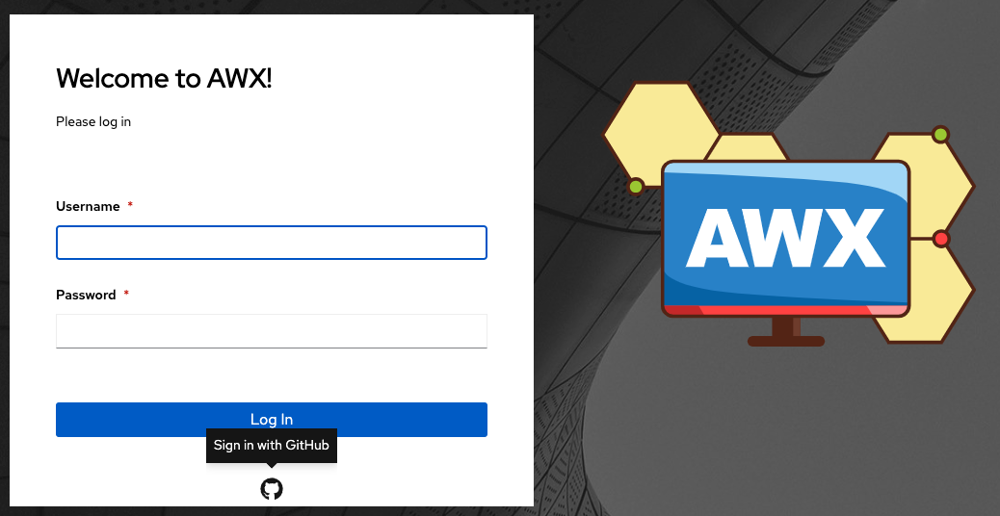
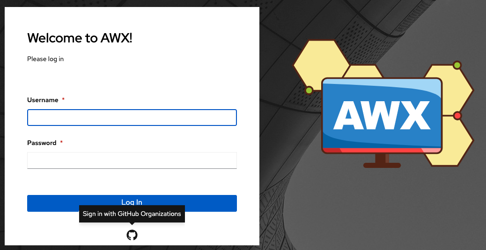
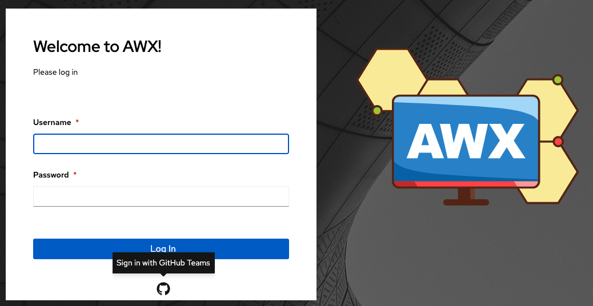
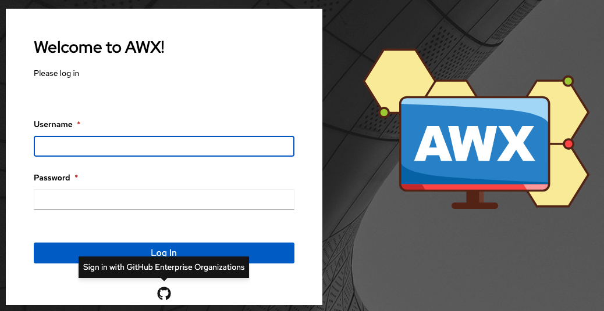
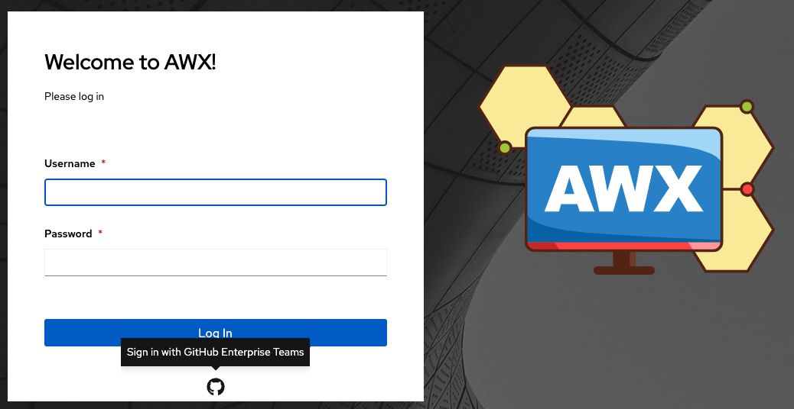

.. _ag_social_auth:

Setting up Social Authentication
==================================

.. index::
    single: social authentication
    single: authentication

Authentication methods help simplify logins for end users--offering single sign-ons using existing login information to sign into a third party website rather than creating a new login account specifically for that website. 

Account authentication can be configured in the AWX User Interface and saved to the PostgreSQL database. For instructions, refer to the :ref:`ag_configure_awx` section. 

Account authentication in AWX can be configured to centrally use OAuth2, while enterprise-level account authentication can be configured for SAML, RADIUS, or even LDAP as a source for authentication information. See :ref:`ag_ent_auth`.

For websites, such as Microsoft Azure, Google or GitHub, that provide account information, account information is often implemented using the OAuth standard. OAuth is a secure authorization protocol which is commonly used in conjunction with account authentication to grant 3rd party applications a "session token" allowing them to make API calls to providers on the user’s behalf.

SAML (Security Assertion Markup Language) is an XML-based, open-standard data format for exchanging account authentication and authorization data between  an identity provider and a service provider. 

The RADIUS distributed client/server system allows you to secure networks against unauthorized access and can be implemented in network environments requiring high levels of security while maintaining network access for remote users.

.. _ag_auth_github:

GitHub settings
----------------

.. index::
    pair: authentication; GitHub OAuth2

To set up social authentication for GitHub, you will need to obtain an OAuth2 key and secret for a web application. To do this, you must first register the new application with GitHub at https://github.com/settings/developers. In order to register the application, you must supply it with your homepage URL, which is the **Callback URL** shown in the Details tab for the GitHub default settings page. The OAuth2 key (Client ID) and secret (Client Secret) will be used to supply the required fields in the AWX User Interface. 

1. Click **Settings** from the left navigation bar.

2. On the left side of the Settings window, click **GitHub settings** from the list of Authentication options. 

3. Click the **GitHub Default** tab if not already selected.

The **GitHub OAuth2 Callback URL** field is already pre-populated and non-editable. Once the application is registered, GitHub displays the Client ID and Client Secret.

4. Click **Edit** and copy and paste GitHub's Client ID into the **GitHub OAuth2 Key** field.

5. Copy and paste GitHub's Client Secret into the **GitHub OAuth2 Secret** field.

6. For details on completing the mapping fields, see :ref:`ag_org_team_maps`. 

7. Click **Save** when done.

8. To verify that the authentication was configured correctly, logout of AWX and the login screen will now display the GitHub logo to allow logging in with those credentials.

.. _ag_auth_github_org:

GitHub Organization settings
~~~~~~~~~~~~~~~~~~~~~~~~~~~~~~

.. index::
    pair: authentication; GitHub Org

When defining account authentication with either an organization or a team within an organization, you should use the specific organization and team settings. Account authentication can be limited by an organization as well as by a team within an organization. 

You can also choose to allow all by specifying non-organization or non-team based settings (as shown above).

You can limit users who can login to AWX by limiting only those in an organization or on a team within an organization. 

To set up social authentication for a GitHub Organization, you will need to obtain an OAuth2 key and secret for a web application. To do this, you must first register your organization-owned application at ``https://github.com/organizations/<yourorg>/settings/applications``. In order to register the application, you must supply it with your Authorization callback URL, which is the **Callback URL** shown in the Details page. Each key and secret must belong to a unique application and cannot be shared or reused between different authentication backends. The OAuth2 key (Client ID) and secret (Client Secret) will be used to supply the required fields in the AWX User Interface.  

1. Click **Settings** from the left navigation bar.

2. On the left side of the Settings window, click **GitHub settings** from the list of Authentication options. 

3. Click the **GitHub Organization** tab.

The **GitHub Organization OAuth2 Callback URL** field is already pre-populated and non-editable. 

Once the application is registered, GitHub displays the Client ID and Client Secret.

4. Click **Edit** and copy and paste GitHub's Client ID into the **GitHub Organization OAuth2 Key** field.

5. Copy and paste GitHub's Client Secret into the **GitHub Organization OAuth2 Secret** field.

6. Enter the name of your GitHub organization, as used in your organization's URL (e.g., https://github.com/<yourorg>/) in the **GitHub Organization Name** field.

7. For details on completing the mapping fields, see :ref:`ag_org_team_maps`. 

8. Click **Save** when done.

9. To verify that the authentication was configured correctly, logout of AWX and the login screen will now display the GitHub Organization logo to allow logging in with those credentials.

.. _ag_auth_github_team:

GitHub Team settings
~~~~~~~~~~~~~~~~~~~~~~~~

.. index::
    pair: authentication; GitHub Team

To set up social authentication for a GitHub Team, you will need to obtain an OAuth2 key and secret for a web application. To do this, you must first register your team-owned application at ``https://github.com/organizations/<yourorg>/settings/applications``. In order to register the application, you must supply it with your Authorization callback URL, which is the **Callback URL** shown in the Details page. Each key and secret must belong to a unique application and cannot be shared or reused between different authentication backends. The OAuth2 key (Client ID) and secret (Client Secret) will be used to supply the required fields in the AWX User Interface.  

1. Find the numeric team ID using the GitHub API: http://fabian-kostadinov.github.io/2015/01/16/how-to-find-a-github-team-id/. The Team ID will be used to supply a required field in the AWX User Interface.

2. Click **Settings** from the left navigation bar.

3. On the left side of the Settings window, click **GitHub settings** from the list of Authentication options. 

4. Click the **GitHub Team** tab.

The **GitHub Team OAuth2 Callback URL** field is already pre-populated and non-editable.  Once the application is registered, GitHub displays the Client ID and Client Secret.

5. Click **Edit** and copy and paste GitHub's Client ID into the **GitHub Team OAuth2 Key** field.

6. Copy and paste GitHub's Client Secret into the **GitHub Team OAuth2 Secret** field.

7. Copy and paste GitHub's team ID in the **GitHub Team ID** field.

8. For details on completing the mapping fields, see :ref:`ag_org_team_maps`. 

9. Click **Save** when done.

10. To verify that the authentication was configured correctly, logout of AWX and the login screen will now display the GitHub Team logo to allow logging in with those credentials.

GitHub Enterprise settings
~~~~~~~~~~~~~~~~~~~~~~~~~~~

.. index::
    pair: authentication; GitHub Enterprise

To set up social authentication for a GitHub Enterprise, you will need to obtain a GitHub Enterprise URL, an API URL, OAuth2 key and secret for a web application. To obtain the URLs, refer to the GitHub documentation on `GitHub Enterprise administration <https://docs.github.com/en/enterprise-server@3.1/rest/reference/enterprise-admin>`_ . To obtain the  key and secret, you must first register your enterprise-owned application at ``https://github.com/organizations/<yourorg>/settings/applications``. In order to register the application, you must supply it with your Authorization callback URL, which is the **Callback URL** shown in the Details page. Because its hosted on site and not github.com, you must specify which auth adapter it will talk to. 

Each key and secret must belong to a unique application and cannot be shared or reused between different authentication backends. The OAuth2 key (Client ID) and secret (Client Secret) will be used to supply the required fields in the AWX User Interface.  

1. Click **Settings** from the left navigation bar.

2. On the left side of the Settings window, click **GitHub settings** from the list of Authentication options. 

3. Click the **GitHub Enterprise** tab.

The **GitHub Enterprise OAuth2 Callback URL** field is already pre-populated and non-editable.  Once the application is registered, GitHub displays the Client ID and Client Secret.

4. Click **Edit** to configure GitHub Enterprise settings.

5. In the **GitHub Enterprise URL** field, enter the hostname of the GitHub Enterprise instance (e.g., https://github.example.com).

6. In the **GitHub Enterprise API URL** field, enter the API URL of the GitHub Enterprise instance (e.g., https://github.example.com/api/v3)

7. Copy and paste GitHub's Client ID into the **GitHub Enterprise OAuth2 Key** field.

8. Copy and paste GitHub's Client Secret into the **GitHub Enterprise OAuth2 Secret** field.

9. For details on completing the mapping fields, see :ref:`ag_org_team_maps`. 

10. Click **Save** when done.

11. To verify that the authentication was configured correctly, logout of AWX and the login screen will now display the GitHub Enterprise logo to allow logging in with those credentials.

GitHub Enterprise Organization settings
~~~~~~~~~~~~~~~~~~~~~~~~~~~~~~~~~~~~~~~~

.. index::
    pair: authentication; GitHub Enterprise Org

To set up social authentication for a GitHub Enterprise Org, you will need to obtain a GitHub Enterprise Org URL, an Org API URL, an Org OAuth2 key and secret for a web application. To obtain the URLs, refer to the GitHub documentation on `GitHub Enterprise administration <https://docs.github.com/en/enterprise-server@3.1/rest/reference/enterprise-admin>`_ . To obtain the  key and secret, you must first register your enterprise organization-owned application at ``https://github.com/organizations/<yourorg>/settings/applications``. In order to register the application, you must supply it with your Authorization callback URL, which is the **Callback URL** shown in the Details page. Because its hosted on site and not github.com, you must specify which auth adapter it will talk to. 

Each key and secret must belong to a unique application and cannot be shared or reused between different authentication backends. The OAuth2 key (Client ID) and secret (Client Secret) will be used to supply the required fields in the AWX User Interface.  

1. Click **Settings** from the left navigation bar.

2. On the left side of the Settings window, click **GitHub settings** from the list of Authentication options. 

3. Click the **GitHub Enterprise Organization** tab.

The **GitHub Enterprise Organization OAuth2 Callback URL** field is already pre-populated and non-editable.  Once the application is registered, GitHub displays the Client ID and Client Secret.

4. Click **Edit** to configure GitHub Enterprise Organization settings.

5. In the **GitHub Enterprise Organization URL** field, enter the hostname of the GitHub Enterprise Org instance (e.g., https://github.orgexample.com).

6. In the **GitHub Enterprise Organization API URL** field, enter the API URL of the GitHub Enterprise Org instance (e.g., https://github.orgexample.com/api/v3)

7. Copy and paste GitHub's Client ID into the **GitHub Enterprise Organization OAuth2 Key** field.

8. Copy and paste GitHub's Client Secret into the **GitHub Enterprise Organization OAuth2 Secret** field.

9. Enter the name of your GitHub Enterprise organization, as used in your organization's URL (e.g., https://github.com/<yourorg>/) in the **GitHub Enterprise Organization Name** field.

10. For details on completing the mapping fields, see :ref:`ag_org_team_maps`. 

11. Click **Save** when done.

12. To verify that the authentication was configured correctly, logout of AWX and the login screen will now display the GitHub Enterprise Organization logo to allow logging in with those credentials.

GitHub Enterprise Team settings
~~~~~~~~~~~~~~~~~~~~~~~~~~~~~~~~

.. index::
    pair: authentication; GitHub Enterprise Team

To set up social authentication for a GitHub Enterprise teams, you will need to obtain a GitHub Enterprise Org URL, an Org API URL, an Org OAuth2 key and secret for a web application. To obtain the URLs, refer to the GitHub documentation on `GitHub Enterprise administration <https://docs.github.com/en/enterprise-server@3.1/rest/reference/enterprise-admin>`_ . To obtain the  key and secret, you must first register your enterprise team-owned application at ``https://github.com/organizations/<yourorg>/settings/applications``. In order to register the application, you must supply it with your Authorization callback URL, which is the **Callback URL** shown in the Details page. Because its hosted on site and not github.com, you must specify which auth adapter it will talk to. 

Each key and secret must belong to a unique application and cannot be shared or reused between different authentication backends. The OAuth2 key (Client ID) and secret (Client Secret) will be used to supply the required fields in the AWX User Interface.  

1. Find the numeric team ID using the GitHub API: http://fabian-kostadinov.github.io/2015/01/16/how-to-find-a-github-team-id/. The Team ID will be used to supply a required field in the AWX User Interface.

2. Click **Settings** from the left navigation bar.

3. On the left side of the Settings window, click **GitHub settings** from the list of Authentication options. 

4. Click the **GitHub Enterprise Team** tab.

The **GitHub Enterprise Team OAuth2 Callback URL** field is already pre-populated and non-editable.  Once the application is registered, GitHub displays the Client ID and Client Secret.

5. Click **Edit** to configure GitHub Enterprise Team settings.

6. In the **GitHub Enterprise Team URL** field, enter the hostname of the GitHub Enterprise team instance (e.g., https://github.teamexample.com).

7. In the **GitHub Enterprise Team API URL** field, enter the API URL of the GitHub Enterprise team instance (e.g., https://github.teamexample.com/api/v3)

8. Copy and paste GitHub's Client ID into the **GitHub Enterprise Team OAuth2 Key** field.

9. Copy and paste GitHub's Client Secret into the **GitHub Enterprise Team OAuth2 Secret** field.

10. Copy and paste GitHub's team ID in the **GitHub Enterprise Team ID** field.

11. For details on completing the mapping fields, see :ref:`ag_org_team_maps`. 

12. Click **Save** when done.

13. To verify that the authentication was configured correctly, logout of AWX and the login screen will now display the GitHub Enterprise Teams logo to allow logging in with those credentials.

.. _ag_auth_google_oauth2:

Google OAuth2 settings
-----------------------

.. index::
    pair: authentication; Google OAuth2

To set up social authentication for Google, you will need to obtain an OAuth2 key and secret for a web application. To do this, you must first create a project and set it up with Google. Refer to https://support.google.com/googleapi/answer/6158849 for instructions. If you already completed the setup process, you can access those credentials by going to the Credentials section of the `Google API Manager Console <https://console.developers.google.com/>`_. The OAuth2 key (Client ID) and secret (Client secret) will be used to supply the required fields in the AWX User Interface.  

1. Click **Settings** from the left navigation bar.

2. On the left side of the Settings window, click **Google OAuth 2 settings** from the list of Authentication options. 

The **Google OAuth2 Callback URL** field is already pre-populated and non-editable. 

3. The following fields are also pre-populated. If not, use the credentials Google supplied during the web application setup process, and look for the values with the same format as the ones shown in the example below:
    
  - Click **Edit** and copy and paste Google's Client ID into the **Google OAuth2 Key** field. 

  - Copy and paste Google's Client secret into the **Google OAuth2 Secret** field. 

    .. image:: ../common/images/configure-awx-auth-google.png

4. To complete the remaining optional fields, refer to the tooltips in each of the fields for instructions and required format. 

5. For details on completing the mapping fields, see :ref:`ag_org_team_maps`. 

6. Click **Save** when done.

7. To verify that the authentication was configured correctly, logout of AWX and the login screen will now display the Google logo to indicate it as a alternate method of logging into AWX.

.. _ag_org_team_maps:

Organization and Team Mapping
---------------------------------

.. index:: 
   single: organization mapping
   pair: authentication; organization mapping
   pair: authentication; team mapping
   single: team mapping

Organization mapping
~~~~~~~~~~~~~~~~~~~~~

You will need to control which users are placed into which organizations based on their username and email address (mapping out your organization admins/users from social or enterprise-level authentication accounts).  

Dictionary keys are organization names. Organizations will be created, if not already present and if the license allows for multiple organizations. Otherwise, the single default organization is used regardless of the key.  

Values are dictionaries defining the options for each organization's membership.  For each organization, it is possible to specify which users are automatically users of the organization and also which users can administer the organization. 

**admins**: None, True/False, string or list/tuple of strings.

 - If **None**, organization admins will not be updated.
 - If **True**, all users using account authentication will automatically be added as admins of the organization.
 - If **False**, no account authentication users will be automatically added as admins of the organization.
 - If a string or list of strings, specifies the usernames and emails for users who will be added to the organization. Strings beginning and ending with ``/`` will be compiled into regular expressions; modifiers ``i`` (case-insensitive) and ``m`` (multi-line) may be specified after the ending ``/``.

**remove_admins**: True/False. Defaults to **True**.

 - When **True**, a user who does not match is removed from the organization's administrative list.

**users**: None, True/False, string or list/tuple of strings. Same rules apply as for **admins**.

**remove_users**: True/False. Defaults to **True**. Same rules apply as for **remove_admins**.

::

    {
        "Default": {
            "users": true
        },
        "Test Org": {
            "admins": ["admin@example.com"],
            "users": true
        },
        "Test Org 2": {
            "admins": ["admin@example.com", "/^awx-[^@]+?@.*$/i"],
            "users": "/^[^@].*?@example\\.com$/"
        }
    }

Organization mappings may be specified separately for each account authentication backend.  If defined, these configurations will take precedence over the global configuration above.

::

    SOCIAL_AUTH_GOOGLE_OAUTH2_ORGANIZATION_MAP = {}
    SOCIAL_AUTH_GITHUB_ORGANIZATION_MAP = {}
    SOCIAL_AUTH_GITHUB_ORG_ORGANIZATION_MAP = {}
    SOCIAL_AUTH_GITHUB_TEAM_ORGANIZATION_MAP = {}
    SOCIAL_AUTH_SAML_ORGANIZATION_MAP = {}

Team mapping
~~~~~~~~~~~~~~

Team mapping is the mapping of team members (users) from social auth accounts. Keys are team names (will be created if not present). Values are dictionaries of options for each team's membership, where each can contain the following parameters:

**organization**: string. The name of the organization to which the team
belongs.  The team will be created if the combination of organization and
team name does not exist.  The organization will first be created if it
does not exist.  If the license does not allow for multiple organizations,
the team will always be assigned to the single default organization.

**users**: None, True/False, string or list/tuple of strings.

 - If **None**, team members will not be updated.
 - If **True**/**False**, all social auth users will be added/removed as team members.
 - If a string or list of strings, specifies expressions used to match users. User will be added as a team member if the username or email matches. Strings beginning and ending with ``/`` will be compiled into regular expressions; modifiers ``i`` (case-insensitive) and ``m`` (multi-line) may be specified after the ending ``/``.

**remove**: True/False. Defaults to **True**. When **True**, a user who does not match the rules above is removed from the team.

::

    {
        "My Team": {
            "organization": "Test Org",
            "users": ["/^[^@]+?@test\\.example\\.com$/"],
            "remove": true
        },
        "Other Team": {
            "organization": "Test Org 2",
            "users": ["/^[^@]+?@test\\.example\\.com$/"],
            "remove": false
        }
    }

Team mappings may be specified separately for each account authentication backend, based on which of these you setup.  When defined, these configurations take precedence over the the global configuration above.

::

    SOCIAL_AUTH_GOOGLE_OAUTH2_TEAM_MAP = {}
    SOCIAL_AUTH_GITHUB_TEAM_MAP = {}
    SOCIAL_AUTH_GITHUB_ORG_TEAM_MAP = {}
    SOCIAL_AUTH_GITHUB_TEAM_TEAM_MAP = {}
    SOCIAL_AUTH_SAML_TEAM_MAP = {}

Uncomment the line below (i.e. set ``SOCIAL_AUTH_USER_FIELDS`` to an empty list) to prevent new user accounts from being created.  Only users who have previously logged in to AWX using social or enterprise-level authentication or have a user account with a matching email address will be able to login.

::

    SOCIAL_AUTH_USER_FIELDS = []

