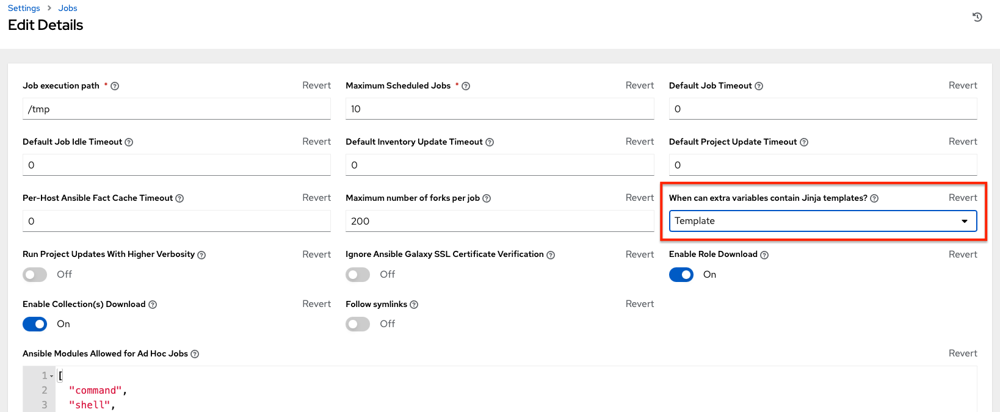
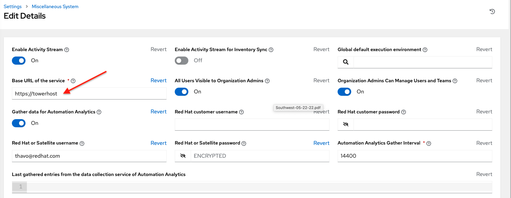
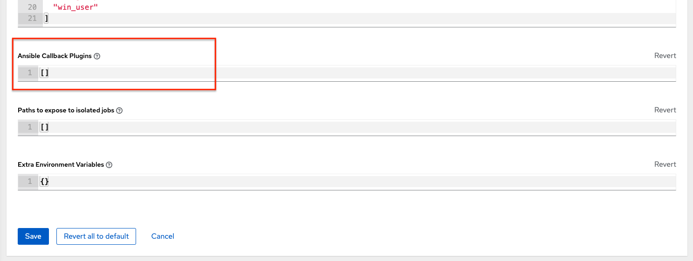

.. tipsandtricks

.. _tips_and_tricks:

**************************************
Controller Tips and Tricks
**************************************

.. index:: 
   single: tips
   single: best practices
   single: help

.. contents::
    :local:

Using the Controller CLI Tool
==============================

.. index::
    pair: controller CLI; command line interface
    pair: tips; controller CLI
    pair: tips; command line interface

|At| has a full-featured command line interface. Refer to `AWX Command Line Interface`_  documentation for configuration and usage instructions.

  .. _`AWX Command Line Interface`: https://docs.ansible.com/automation-controller/latest/html/controllercli/usage.html

.. _tips_change_password:

Changing the Controller Admin Password
=======================================

.. index::
    pair: admin password; changing password
    pair: tips; admin password change
    pair: awx-manage; change password

During the installation process, you are prompted to enter an administrator password which is used for the ``admin`` superuser/first user created in the controller. If you log into the instance via SSH, it will tell you the default admin password in the prompt. If you need to change this password at any point, run the following command as root on the controller server:

::

    awx-manage changepassword admin

Next, enter a new password. After that, the password you have entered will work as the admin password in the web UI.

To set policies at creation time for password validation using Django, see :ref:`ag_security_django_password` for detail.

Creating a controller Admin from the commandline 
==================================================

.. index::
    pair: admin creation; commandline
    pair: super user creation; awx-manage
    pair: tips; admin creation

Once in a while you may find it helpful to create an admin (superuser) account from the commandline. To create an admin, run the following command as root on the controller server and enter in the admin information as prompted:

::

    awx-manage createsuperuser

Setting up a jump host to use with the controller
===================================================

.. index::
    pair: jump host; ProxyCommand
    pair: tips; jump host 
    pair: tips; ProxyCommand

Credentials supplied by the controller will not flow to the jump host via ProxyCommand. They are only used for the end-node once the tunneled connection is set up. 

To make this work, configure a fixed user/keyfile in the AWX user's SSH config in the ProxyCommand definition that sets up the connection through the jump host. For example:

::

  Host tampa
  Hostname 10.100.100.11
  IdentityFile [privatekeyfile]

  Host 10.100..
  Proxycommand ssh -W [jumphostuser]@%h:%p tampa

You can also add a jump host to your controller instance through Inventory variables. These variables can be set at either the inventory, group, or host level. To add this, navigate to your inventory and in the ``variables`` field of whichever level you choose, add the following variables:

::
  
  ansible_user: <user_name>
  ansible_connection: ssh
  ansible_ssh_common_args: '-o ProxyCommand="ssh -W %h:%p -q <user_name>@<jump_server_name>"'

View Ansible outputs for JSON commands when using the controller
==================================================================
.. index::
   single: Ansible output for JSON commands
   single: JSON commands, Ansible output

When working with |at|, you can use the API to obtain the Ansible outputs for commands in JSON format.

To view the Ansible outputs, browse to:

::

   https://<controller server name>/api/v2/jobs/<job_id>/job_events/   

Locate and configure the Ansible configuration file
=====================================================
.. index::
   pair: tips; configuration file location
   pair: tips; configuration file configuration
   single: Ansible configuration file
   single: ansible.cfg
   pair: tips; ansible.cfg

While Ansible does not require a configuration file, OS packages often include a default one in ``/etc/ansible/ansible.cfg`` for possible customization. In order to use a custom ``ansible.cfg`` file, place it at the root of your project. |At| runs ``ansible-playbook`` from the root of the project directory, where it will then find the custom ``ansible.cfg`` file. An ``ansible.cfg`` anywhere else in the project will be ignored.

To learn which values you can use in this file, refer to the `configuration file on github`_.

.. _`configuration file on github`: https://github.com/ansible/ansible/blob/devel/examples/ansible.cfg

Using the defaults are acceptable for starting out, but know that you can configure the default module path or connection type here, as well as other things.

The controller overrides some ansible.cfg options. For example, the controller stores the SSH ControlMaster sockets, the SSH agent socket, and any other per-job run items in a per-job temporary directory that is passed to the container used for job execution.

View a listing of all ansible\_ variables
===========================================
.. index::
   pair: tips; ansible_variables, viewing all

Ansible by default gathers “facts” about the machines under its management, accessible in Playbooks and in templates. To view all facts available about a machine, run the ``setup`` module as an ad hoc action:

::

    ansible -m setup hostname

This prints out a dictionary of all facts available for that particular host. For more information, refer to: https://docs.ansible.com/ansible/playbooks_variables.html#information-discovered-from-systems-facts 

.. _ag_tips_jinja_extravars:

The ALLOW_JINJA_IN_EXTRA_VARS variable
========================================

Setting ``ALLOW_JINJA_IN_EXTRA_VARS = template`` only works for saved job template extra variables. Prompted variables and survey variables are excluded from the 'template'. This parameter has three values: ``template`` to allow usage of Jinja saved directly on a job template definition (the default), ``never`` to disable all Jinja usage (recommended), and ``always`` to always allow Jinja (strongly discouraged, but an option for prior compatibility). 

This parameter is configurable in the Jobs Settings screen of the controller UI:

Using execution environments
============================

.. index:: 
   single: execution environment
   pair: add; execution environment
   pair: jobs; add execution environment

See :ref:`ug_execution_environments` in the |atu|.

Configuring the ``controllerhost`` hostname for notifications
===============================================================

.. index:: 
   pair: notifications; hostname configuration

In the :ref:`System Settings <configure_awx_system>`, you can replace ``https://controller.example.com`` in the **Base URL of The Controller Host** field with your preferred hostname to change the notification hostname.     

Refreshing your controller license also changes the notification hostname. New installations of |at| should not have to set the hostname for notifications.

.. _launch_jobs_curl:

Launching Jobs with curl
===========================
.. index::
   pair: tips; curl

Launching jobs with the controller API is simple. Here are some easy to follow examples using the ``curl`` tool. 

Assuming that your Job Template ID is '1', your controller IP is 192.168.42.100, and that ``admin`` and ``awxsecret`` are valid login credentials, you can create a new job this way:

::

    curl -f -k -H 'Content-Type: application/json' -XPOST \
        --user admin:awxsecret \
        http://192.168.42.100/api/v2/job_templates/1/launch/

This returns a JSON object that you can parse and use to extract the 'id' field, which is the ID of the newly created job.

You can also pass extra variables to the Job Template call, such as is shown in the following example:

.. code-block:: text

    curl -f -k -H 'Content-Type: application/json' -XPOST \
        -d '{"extra_vars": "{\"foo\": \"bar\"}"}' \
        --user admin:awxsecret http://192.168.42.100/api/v2/job_templates/1/launch/

You can view the live API documentation by logging into http://192.168.42.100/api/ and browsing around to the various objects available.

.. note::

    The ``extra_vars`` parameter needs to be a string which contains JSON, not just a JSON dictionary, as you might expect. Use caution when escaping the quotes, etc.

Dynamic Inventory and private IP addresses
===========================================
.. index::
   pair: tips; EC2 VPC instances
   pair: tips; private IPs with dynamic inventory
   pair: tips; dynamic inventory and private IPs

By default, the controller only shows instances in a VPC that have an Elastic IP (EIP) address associated with them. To view all of your VPC instances, perform the following steps:

- In the controller interface, select your inventory. 
- Click on the group that has the Source set to AWS, and click on the Source tab. 
- In the "Source Variables" box, enter: ``vpc_destination_variable: private_ip_address``

Save and trigger an update of the group. You should now be able to see all of your VPC instances.

.. note:: 

  The controller must be running inside the VPC with access to those instances in order to usefully configure them.

Filtering instances returned by the dynamic inventory sources in the controller
=================================================================================
.. index:: 
   pair: tips; filtering instances
   pair: tips; dynamic inventory and instance filtering
   pair: tips; instance filtering 

By default, the dynamic inventory sources in the controller (AWS, Google, etc) return all instances available to the cloud credentials being used. They are automatically joined into groups based on various attributes. For example, AWS instances are grouped by region, by tag name and value, by security groups, etc. To target specific instances in your environment, write your playbooks so that they target the generated group names. For example:

::

  ---
  - hosts: tag_Name_webserver
    tasks:
    ...

You can also use the ``Limit`` field in the Job Template settings to limit a playbook run to a certain group, groups, hosts, or a combination thereof. The syntax is the same as the ``--limit parameter`` on the ansible-playbook command line.

You may also create your own groups by copying the auto-generated groups into your custom groups. Make sure that the ``Overwrite`` option is disabled on your dynamic inventory source, otherwise subsequent synchronization operations will delete and replace your custom groups.

Using an unreleased module from Ansible source with the controller
===================================================================
.. index:: 
   pair: tips; Ansible modules, unreleased
   pair: tips; unreleased modules 
   pair: tips; modules, using unreleased 

If there is a feature that is available in the latest Ansible core branch that you would like to leverage with your controller system, making use of it in the controller is fairly simple.

First, determine which is the updated module you want to use from the available Ansible Core Modules or Ansible Extra Modules GitHub repositories. 

Next, create a new directory, at the same directory level of your Ansible source playbooks, named ``/library``.

Once this is created, copy the module you want to use and drop it into the ``/library`` directory--it will be consumed first over your system modules and can be removed once you have updated the the stable version via your normal package manager.

Using callback plugins with the controller
============================================
.. index:: 
   pair: tips; callback plugins
   pair: tips; plugins, callback

Ansible has a flexible method of handling actions during playbook runs, called callback plugins. You can use these plugins with the controller to do things like notify services upon playbook runs or failures, send emails after every playbook run, etc. For official documentation on the callback plugin architecture, refer to: http://docs.ansible.com/developing_plugins.html#callbacks

.. note::

   |at| does not support the ``stdout`` callback plugin because Ansible only allows one, and it is already being used by |at| for streaming event data.

You may also want to review some example plugins, which should be modified for site-specific purposes, such as those available at: 
https://github.com/ansible/ansible/tree/devel/lib/ansible/plugins/callback

To use these plugins, put the callback plugin ``.py`` file into a directory called ``/callback_plugins`` alongside your playbook in your controller Project. Then, specify their paths (one path per line) in the **Ansible Callback Plugins** field of the Job settings, located towards the bottom of the screen:

.. note::

  To have most callbacks shipped with Ansible applied globally, you must add them to the ``callback_whitelist`` section of your ``ansible.cfg``. If you have a custom callbacks, refer to the Ansible documentation for `Enabling callback plugins <https://docs.ansible.com/ansible/latest/plugins/callback.html#enabling-callback-plugins>`_.

Connecting to Windows with winrm
====================================

.. index::
    pair: tips; Windows connection
    pair: tips; winrm

By default controller attempts to ``ssh`` to hosts. You must add the ``winrm`` connection info to the group variables to which the Windows hosts belong.  To get started, edit the Windows group in which the hosts reside and place the variables in the source/edit screen for the group.  

To add ``winrm`` connection info:

Edit the properties for the selected group by clicking on the |edit| button to the right of the group name that contains the Windows servers.  In the "variables" section, add your connection information as such: ``ansible_connection: winrm`` 

Once done, save your edits. If Ansible was previously attempting an SSH connection and failed, you should re-run the job template.

.. |edit| image:: ../common/images/edit-button.png

Importing existing inventory files and host/group vars into the controller
============================================================================

.. index::
    pair: tips; inventory import
    pair: importing inventory; importing host/group vars
    pair: tips; host/group vars import

To import an existing static inventory and the accompanying host and group vars into the controller, your inventory should be in a structure that looks similar to the following:

::

  inventory/
  |-- group_vars
  |   `-- mygroup
  |-- host_vars
  |   `-- myhost
  `-- hosts

To import these hosts and vars, run the ``awx-manage`` command:

::

  awx-manage inventory_import --source=inventory/ \
    --inventory-name="My Controller Inventory"

If you only have a single flat file of inventory, a file called ansible-hosts, for example, import it like the following:

::

  awx-manage inventory_import --source=./ansible-hosts \
    --inventory-name="My Controller Inventory"

In case of conflicts or to overwrite an inventory named "My Controller Inventory", run:

::

  awx-manage inventory_import --source=inventory/ \
    --inventory-name="My Controller Inventory" \
    --overwrite --overwrite-vars

If you receive an error, such as:

::

  ValueError: need more than 1 value to unpack

Create a directory to hold the hosts file, as well as the group_vars:

::

  mkdir -p inventory-directory/group_vars

Then, for each of the groups that have :vars listed, create a file called ``inventory-directory/group_vars/<groupname>`` and format the variables in YAML format.

Once broken out, the importer will handle the conversion correctly.

