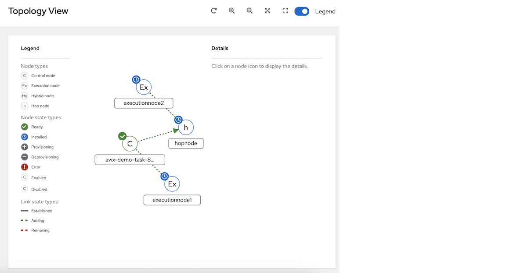
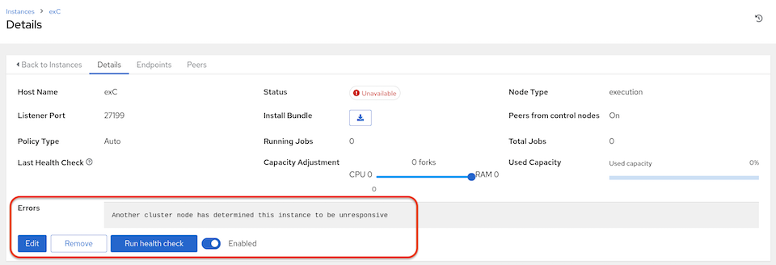

.. _ag_topology_viewer:

Topology Viewer
================

.. index::
   pair: topology;viewer
   
The topology viewer allows you to view node type, node health, and specific details about each node if you already have a mesh topology deployed. In order to access the topology viewer from the AWX user interface, you must have System Administrator or System Auditor permissions.

To access the topology viewer from the AWX user interface:

1. In the Administration menu from left navigation bar, click **Topology View**.

The Topology View opens and displays a graphic representation of how each receptor node links together. 

2. To adjust the zoom levels, or manipulate the graphic views, use the control buttons on the upper right-hand corner of the window.

.. image:: ../common/images/topology-viewer-view-controls.png

You can also click and drag to pan around; and use the scroll wheel on your mouse or trackpad to zoom. The fit-to-screen feature automatically scales the graphic to fit on the screen and repositions it in the center. It is particularly useful when you want to see a large mesh in its entirety.

.. image:: ../common/images/topology-viewer-zoomed-view.png

To reset the view to its default view, click **Reset zoom**. 

3. Refer to the Legend to the left of the graphic to identify the type of nodes that are represented.

.. note::

	If the Legend is not present, use the toggle on the upper right corner of the window to enable it.

The Legend shows the :ref:`node status <node_statuses>` by color, which is indicative of the health of the node. The status of **Error** in the legend encompasses the **Unavailable** state (as displayed in the Instances list view) plus any future error conditions encountered in later versions of AWX. Also depicted in the legend are the link statuses:

	- **Established**: this is a link state that indicates a peer connection between nodes that are either ready, unavailable, or disabled
	- **Adding**: this is a link state indicating a peer connection between nodes that was selected to be added to the mesh topology
	- **Removing**: this is a link state indicating a peer connection between nodes that was selected to be removed from the topology

4. Hover over a node and the connectors highlight to show its immediate connected nodes (peers) or click on a node to retrieve details about it, such as its hostname, node type, and status.

.. image:: ../common/images/topology-viewer-node-hover-click.png

5. Click on the link for instance hostname from the details displayed, and you will be redirected to its Details page that provides more information about that node, most notably for information about an ``Error`` status, as in the example below.

.. image:: ../common/images/topology-viewer-node-view.png

At the bottom of the Details view, you can remove the instance, run a health check on the instance on an as-needed basis, or unassign jobs from the instance. By default, jobs can be assigned to each node. However, you can disable it to exclude the node from having any jobs running on it.

For more information on creating new nodes and scaling the mesh, refer to :ref:`ag_instances` in this guide for more detail.
