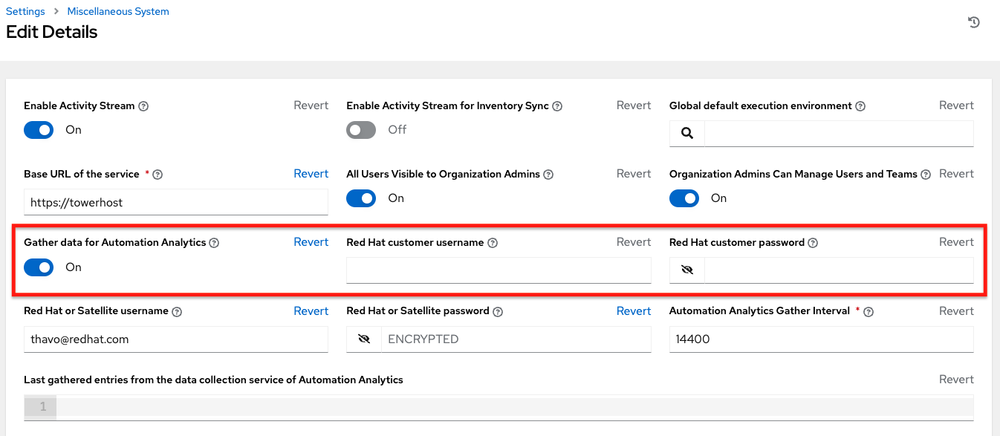
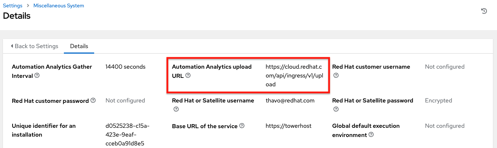
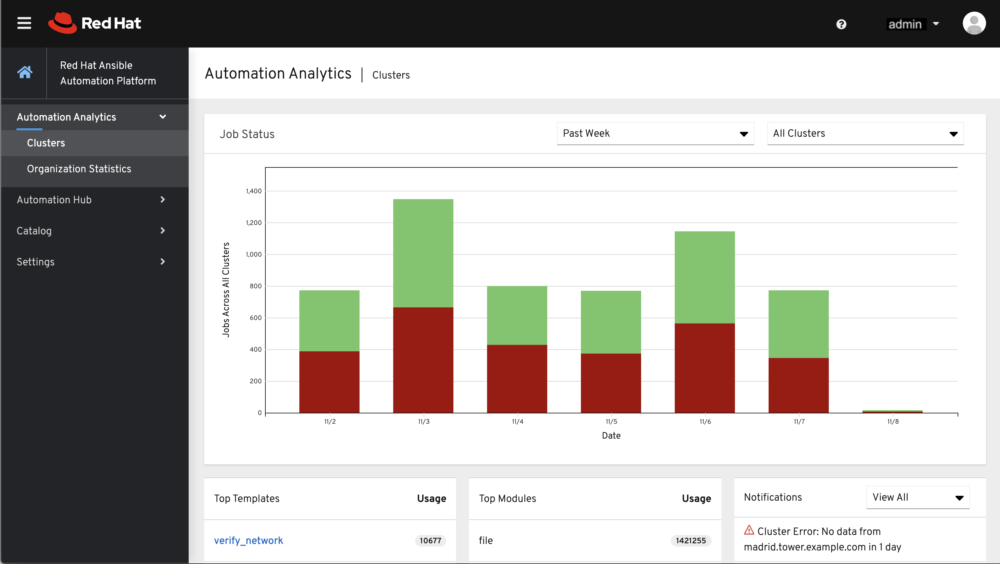
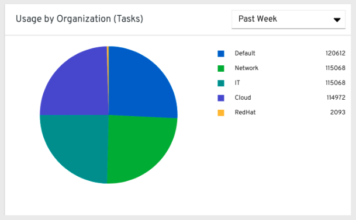
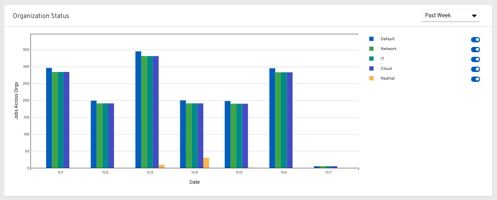
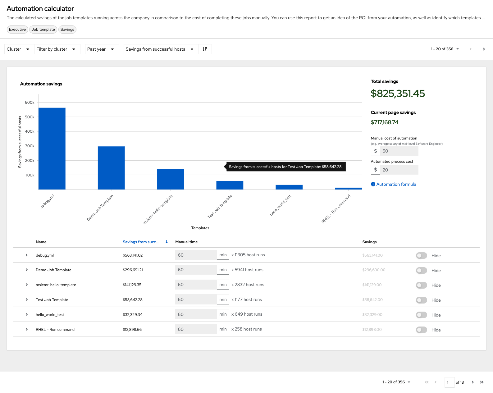

.. _usability_data_collection:

.. include:: ../common/user-data-tracking.rst

.. _user_data_insights:

Automation Analytics
~~~~~~~~~~~~~~~~~~~~~~

.. index::
	pair: Analytics; Insights
	pair: Automation; Insights

When you imported your license for the first time, you were given options related to the collection of data that powers |AA|, a cloud service that is part of the |aap| subscription. For opt-in of |AA| to have any effect, your instance of |at| **must** be running on |rhel|.

Much like Red Hat Insights, |AA| is built to only collect the minimum amount of data needed. No credential secrets, personal data, automation variables, or task output is gathered. For more information, see :ref:`Details of data collection<usability_data_collection_details>` below.

In order to enable this feature, turn on data collection for |AA| and enter your Red Hat customer credentials in the **Miscellaneous System settings** of the System configuration list of options located in the **Settings** menu.

You can view the location to which the collection of insights data will be uploaded in the **Automation Analytics upload URL** field in the Details view. 

By default, the |AA| data is collected every 4 hours and upon enabling the feature, data will be collected up to a month back (or until the previous collection). You may turn off this data collection at any time in the **Miscellaneous System settings** of the System configuration window.

This setting can also be enabled via the API by specifying ``INSIGHTS_TRACKING_STATE = True`` in either of these endpoints:

- ``api/v2/settings/all``
- ``api/v2/settings/system``

The |AA| generated from this data collection will be found on the `Red Hat Cloud Services`_ portal.

	.. _`Red Hat Cloud Services`: https://cloud.redhat.com

The **Clusters** data is the default view. This graph represents the number of job runs across all controller clusters over a period of time. The example above shows a span of a week in a stacked bar-style chart that is organized by the number of jobs that ran successfully (in green) and jobs that failed (in red).

Alternatively, you can select a single cluster to view its job status information. 

.. image:: ../common/images/aa-job-run-status-over-time-period.png

This multi-line chart represents the number of job runs for a single controller cluster for a specified period of time. The example here shows a span of a week, organized by the number of successfully running jobs (in green) and jobs that failed (in red). You can specify the number of successful and failed job runs for a selected cluster over a span of one week, two weeks, and monthly increments.

Click **Organization Statistics** from the left navigation pane to view information for the following:

.. contents::
    :local:

Usage by organization
^^^^^^^^^^^^^^^^^^^^^^^

This pie chart represents the number of tasks ran inside all jobs by a particular organization.

Job runs by organization
^^^^^^^^^^^^^^^^^^^^^^^^^^

This pie chart represents the controller usage across *all* controller clusters by organization, which is calculated by the number of jobs run by that organization.

.. image:: ../common/images/aa-usage-by-org.png

Organization status
^^^^^^^^^^^^^^^^^^^^^

This bar chart represents the controller usage by organization and date, which is calculated by the number of jobs run by that organization on a particular date. Alternatively, you can specify to show the number of job runs per organization in one week, two weeks, and monthly increments.

.. _usability_data_collection_details:

Details of data collection
~~~~~~~~~~~~~~~~~~~~~~~~~~

|AA| collects certain classes of data from |at|:

- Basic configuration, like which features are enabled, and what operating system is being used
- Topology and status of the controller environment and hosts, including capacity and health
- Counts of automation resources:

  - organizations, teams, and users
  - inventories and hosts
  - credentials (indexed by type)
  - projects (indexed by type)
  - templates
  - schedules
  - active sessions
  - running and pending jobs
  
- Job execution details (start time, finish time, launch type, and success)
- Automation task details (success, host id, playbook/role, task name, and module used)

You can use ``awx-manage gather_analytics`` (without ``--ship``) to inspect the data that the controller sends so you can satisfy your data collection concerns. This will create a tarball that contains the analytics data that would be sent to Red Hat.

This file contains a number of JSON and CSV files. Each file contains a different set of analytics data.

.. contents::
    :local:

manifest.json
^^^^^^^^^^^^^

manifest.json is the manifest of the analytics data. It describes each file included in the collection, and what version of the schema for that file is included.
An example manifest is:

::

  {
    "config.json": "1.1",
    "counts.json": "1.0",
    "cred_type_counts.json": "1.0",
    "events_table.csv": "1.1",
    "instance_info.json": "1.0",
    "inventory_counts.json": "1.2",
    "job_counts.json": "1.0",
    "job_instance_counts.json": "1.0",
    "org_counts.json": "1.0",
    "projects_by_scm_type.json": "1.0",
    "query_info.json": "1.0",
    "unified_job_template_table.csv": "1.0",
    "unified_jobs_table.csv": "1.0",
    "workflow_job_node_table.csv": "1.0",
    "workflow_job_template_node_table.csv": "1.0"
  }

config.json
^^^^^^^^^^^

The config.json file contains a subset of the configuration endpoint ``/api/v2/config`` from the cluster.
An example config.json is:

::

  {
      "ansible_version": "2.9.1",
      "authentication_backends": [
          "social_core.backends.azuread.AzureADOAuth2",
          "django.contrib.auth.backends.ModelBackend"
      ],
      "external_logger_enabled": true,
      "external_logger_type": "splunk",
      "free_instances": 1234,
      "install_uuid": "d3d497f7-9d07-43ab-b8de-9d5cc9752b7c",
      "instance_uuid": "bed08c6b-19cc-4a49-bc9e-82c33936e91b",
      "license_expiry": 34937373,
      "license_type": "enterprise",
      "logging_aggregators": [
          "awx",
          "activity_stream",
          "job_events",
          "system_tracking"
      ],
      "pendo_tracking": "detailed",
      "platform": {
          "dist": [
              "redhat",
              "7.4",
              "Maipo"
          ],
          "release": "3.10.0-693.el7.x86_64",
          "system": "Linux",
          "type": "traditional"
      },
      "total_licensed_instances": 2500,
      "controller_url_base": "https://ansible.rhdemo.io",
      "controller_version": "3.6.3"
  }

A reference of fields collected:

ansible_version
  The system Ansible version on the host
authentication_backends
  What user authentication backends are available.
  For more information, refer to :ref:`ag_social_auth` or
  see :ref:`ag_auth_ldap`.
external_logger_enabled
  Whether external logging is enaled
external_logger_type
  What logging backend is in use if enabled. See :ref:`ag_logging` for details
logging_aggregators
  What logging categories are sent to external logging. See :ref:`ag_logging` for details
free_instances
  How many hosts are available in the license. A value of zero means the cluster is fully consuming its license.
install_uuid
  A UUID for the installation (identical for all cluster nodes)
instance_uuid
  A UUID for the instance (different for each cluster node)
license_expiry
  Time to expiry of the license, in seconds
license_type
  Type of the license (should be 'enterprise' for most cases)
pendo_tracking
  State of :ref:`usability_data_collection`
platform
  The operating system the cluster is running on
total_licensed_instances
  The total number of hosts in the license
controller_url_base
  The base URL for the cluster used by clients (shown in |AA|)
controller_version
  Version of the software on the cluster

instance_info.json
^^^^^^^^^^^^^^^^^^

The instance_info.json file contains detailed information on the instances that make up the cluster, organized by instance UUID.
An example instance_info.json is:

::

  {
      "bed08c6b-19cc-4a49-bc9e-82c33936e91b": {
          "capacity": 57,
          "cpu": 2,
          "enabled": true,
          "last_isolated_check": "2019-08-15T14:48:58.553005+00:00",
          "managed_by_policy": true,
          "memory": 8201400320,
          "uuid": "bed08c6b-19cc-4a49-bc9e-82c33936e91b",
          "version": "3.6.3"
      }
      "c0a2a215-0e33-419a-92f5-e3a0f59bfaee": {
          "capacity": 57,
          "cpu": 2,
          "enabled": true,
          "last_isolated_check": "2019-08-15T14:48:58.553005+00:00",
          "managed_by_policy": true,
          "memory": 8201400320,
          "uuid": "c0a2a215-0e33-419a-92f5-e3a0f59bfaee",
          "version": "3.6.3"
      }
  }

A reference of fields collected:

capacity
  The capacity of the instance for executing tasks. See <link> for details on how this is calculated.
cpu
  CPU cores for the instance
memory
  Memory for the instance
enabled
  Whether the instance is enabled and accepting tasks
managed_by_policy
  Whether the instance's membership in instance groups is managed by policy, or manually managed
version
  Version of the software on the instance

counts.json
^^^^^^^^^^^

The counts.json file contains the total number of objects for each relevant category in a cluster.
An example counts.json is:
::

  {
      "active_anonymous_sessions": 1,
      "active_host_count": 682,
      "active_sessions": 2,
      "active_user_sessions": 1,
      "credential": 38,
      "custom_inventory_script": 2,
      "custom_virtualenvs": 4,
      "host": 697,
      "inventories": {
          "normal": 20,
          "smart": 1
      },
      "inventory": 21,
      "job_template": 78,
      "notification_template": 5,
      "organization": 10,
      "pending_jobs": 0,
      "project": 20,
      "running_jobs": 0,
      "schedule": 16,
      "team": 5,
      "unified_job": 7073,
      "user": 28,
      "workflow_job_template": 15
  }

Each entry in this file is for the corresponding API objects in ``/api/v2``, with the exception of the active session counts.

org_counts.json
^^^^^^^^^^^^^^^

The org_counts.json file contains information on each organization in the cluster, and the number of users and teams associated with that organization.
An example org_counts.json is:
::

  {
      "1": {
          "name": "Operations",
          "teams": 5,
          "users": 17
      },
      "2": {
          "name": "Development",
          "teams": 27,
          "users": 154
      },
      "3": {
          "name": "Networking",
          "teams": 3,
          "users": 28
      }
  }

cred_type_counts.json
^^^^^^^^^^^^^^^^^^^^^

The cred_type_counts.json file contains information on the different credential types in the cluster, and how many credentials exist for each type.
An example cred_type_counts.json is:
::

  {
      "1": {
          "credential_count": 15,
          "managed_by_controller": true,
          "name": "Machine"
      },
      "2": {
          "credential_count": 2,
          "managed_by_controller": true,
          "name": "Source Control"
      },
      "3": {
          "credential_count": 3,
          "managed_by_controller": true,
          "name": "Vault"
      },
      "4": {
          "credential_count": 0,
          "managed_by_controller": true,
          "name": "Network"
      },
      "5": {
          "credential_count": 6,
          "managed_by_controller": true,
          "name": "Amazon Web Services"
      },
      "6": {
          "credential_count": 0,
          "managed_by_controller": true,
          "name": "OpenStack"
      },
  ...

inventory_counts.json
^^^^^^^^^^^^^^^^^^^^^

The inventory_counts.json file contains information on the different inventories in the cluster.
An example inventory_counts.json is:
::

  {
      "1": {
          "hosts": 211,
          "kind": "",
          "name": "AWS Inventory",
          "source_list": [
              {
                  "name": "AWS",
                  "num_hosts": 211,
                  "source": "ec2"
              }
          ],
          "sources": 1
      },
      "2": {
          "hosts": 15,
          "kind": "",
          "name": "Manual inventory",
          "source_list": [],
          "sources": 0
      },
      "3": {
          "hosts": 25,
          "kind": "",
          "name": "SCM inventory - test repo",
          "source_list": [
              {
                  "name": "Git source",
                  "num_hosts": 25,
                  "source": "scm"
              }
          ],
          "sources": 1
      }
      "4": {
          "num_hosts": 5,
          "kind": "smart",
          "name": "Filtered AWS inventory",
          "source_list": [],
          "sources": 0
      }
  }

projects_by_scm_type.json
^^^^^^^^^^^^^^^^^^^^^^^^^

The projects_by_scm_type.json file provides a breakdown of all projects in the cluster, by source control type.
An example projects_by_scm_type.json is:
::

  {
      "git": 27,
      "hg": 0,
      "insights": 1,
      "manual": 0,
      "svn": 0
  }

query_info.json
^^^^^^^^^^^^^^^

The query_info.json file provides details on when and how the data collection happened.
An example query_info.json is:

::

  {
      "collection_type": "manual",
      "current_time": "2019-11-22 20:10:27.751267+00:00",
      "last_run": "2019-11-22 20:03:40.361225+00:00"
  }

collection_type is one of "manual" or "automatic".

job_counts.json
^^^^^^^^^^^^^^^

The job_counts.json file provides details on the job history of the cluster, describing both how jobs were launched, and what their finishing status is.
An example job_counts.json is:
::

  {
      "launch_type": {
          "dependency": 3628,
          "manual": 799,
          "relaunch": 6,
          "scheduled": 1286,
          "scm": 6,
          "workflow": 1348
      },
      "status": {
          "canceled": 7,
          "failed": 108,
          "successful": 6958
      },
      "total_jobs": 7073
  }

job_instance_counts.json
^^^^^^^^^^^^^^^^^^^^^^^^

The job_instance_counts.json file provides the same detail as job_counts.json, broken down by instance.
An example job_instance_counts.json is:
::

  {
      "localhost": {
          "launch_type": {
              "dependency": 3628,
              "manual": 770,
              "relaunch": 3,
              "scheduled": 1009,
              "scm": 6,
              "workflow": 1336
          },
          "status": {
              "canceled": 2,
              "failed": 60,
              "successful": 6690
          }
      }
  }

Note that instances in this file are by hostname, not by UUID as they are in instance_info.

unified_job_template_table.csv
^^^^^^^^^^^^^^^^^^^^^^^^^^^^^^

The unified_job_template_table.csv file provides information on job templates in the system.
Each line contains the following fields for the job template:

id
  Job template id
name
  Job template name
polymorphic_ctype_id
  The id of the type of template it is
model
  The name of the polymorphic_ctype_id for the template. Examples include 'project', 'systemjobtemplate', 'jobtemplate', 'inventorysource', and 'workflowjobtemplate'
created
  When the template was created
modified
  When the template was last updated
created_by_id
  The userid that created the template. Blank if done by the system.
modified_by_id
  The userid that last modified the template. Blank if done by the system.
current_job_id
  Currently executing job id for the template, if any
last_job_id
  Last execution of the job
last_job_run
  Time of last execution of the job
last_job_failed
  Whether the last_job_id failed
status
  Status of last_job_id
next_job_run
  Next scheduled execution of the template, if any
next_schedule_id
  Schedule id for next_job_run, if any

unified_jobs_table.csv
^^^^^^^^^^^^^^^^^^^^^^

The unified_jobs_table.csv file provides information on jobs run by the system.
Each line contains the following fields for a job:

id
  Job id
name
  Job name (from the template)
polymorphic_ctype_id
  The id of the type of job it is
model
  The name of the polymorphic_ctype_id for the job. Examples include 'job', 'worfklow', and more.
organization_id
  The organization ID for the job
organization_name
  Name for the organization_id
created
  When the job record was created
started
  When the job started executing
finished
  When the job finished
elapsed
  Elapsed time for the job in seconds
unified_job_template_id
  The template for this job
launch_type
  One of "manual", "scheduled", "relaunched", "scm", "workflow", or "dependnecy"
schedule_id
  The id of the schedule that launched the job, if any
instance_group_id
  The instance group that executed the job
execution_node
  The node that executed the job (hostname, not UUID)
controller_node
  The controller node for the job, if run as an isolated job, or in a container group
cancel_flag
  Whether the job was cancelled
status
  Status of the job
failed
  Whether the job failed
job_explanation
  Any additional detail for jobs that failed to execute properly 
forks
  Number of forks executed for this job

workflow_job_template_node_table.csv
^^^^^^^^^^^^^^^^^^^^^^^^^^^^^^^^^^^^

The workflow_job_template_node_table.csv provides information on the nodes
defined in workflow job templates on the system.

Each line contains the following fields for a worfklow job template node:

id
  Node id
created
  When the node was created
modified
  When the node was last updated
unified_job_template_id
  The id of the job template, project, inventory, or other parent resource for this node
workflow_job_template_id
  The workflow job template that contains this node
inventory_id
  The inventory used by this node
success_nodes
  Nodes that are triggered after this node succeeds
failure_nodes
  Nodes that are triggered after this node fails
always_nodes
  Nodes that always are triggered after this node finishes
all_parents_must_converge
  Whether this node requires all its parent conditions satisfied to start

workflow_job_node_table.csv
^^^^^^^^^^^^^^^^^^^^^^^^^^^

The workflow_job_node_table.csv provides information on the jobs
that have been executed as part of a workflow on the system.

Each line contains the following fields for a job run as part of a workflow:

id
  Node id
created
  When the node record was created
modified
  When the node record was last updated
job_id
  The job id for the job run for this node
unified_job_tempalte_id
  The id of the job template, project, inventory, or other parent resource for this job run
workflow_job_id
  The parent workflow job for this job run
inventory_id
  The inventory used by this job
success_nodes
  Nodes that were/would be triggered after this node succeded
failure_nodes
  Nodes that were/would be triggered after this node failed
always_nodes
  Nodes that were/would be triggered after this node finished
do_not_run
  Nodes that were not run in the workflow due to their start conditions not being triggered
all_parents_must_converge
  Whether this node required all its parent conditions satisfied to start

events_table.csv
^^^^^^^^^^^^^^^^

The events_table.csv file provides information on all job events from all job runs in the system.
Each line contains the following fields for a job event:

id
  Event id
uuid
  Event UUID
created
  When the event was created
parent_uuid
  The parent UUID for this event, if any
event
  The Ansible event type (such as runner_on_failed
task_action
  The module associated with this event, if any (such as 'command' or 'yum')
failed
  Whether the event returned "failed"
changed
  Whether the event returned "changed"
playbook
  Playbook associated with the event
play
  Play name from playbook
task
  Task name from playbook
role
  Role name from playbook
job_id
  Id of the job this event is from
host_id
  Id of the host this event is associated with, if any
host_name
  Name of the host this event is associated with, if any
start
  Start time of the task
end
  End time of the task
duration
  Duration of the task
warnings
  Any warnings from the task/module
deprecations
  Any deprecation warnings from the task/module

.. _analytics_reports:

Analytics Reports
~~~~~~~~~~~~~~~~~~~~

Reports from |AA| collection are accessible through the controller UI if you have superuser-level permissions. By including the analytics view on-prem where it is most convenient, you can access data that can affect your day-to-day work. This data is aggregated from the automation provided on `console.redhat.com <https://console.redhat.com>`_. Currently available is a view-only version of the Automation Calculator utility that shows a report that represent (possible) savings to the subscriber. 

.. note::

  Currently this option is available for tech preview and is subject to change in a future release. To preview the analytic reports view, click the **Enable Preview of New User Interface** toggle to **On** from the Miscellaneous System option of the Settings menu. 

  .. image:: ../common/images/configure-tower-system-misc-preview-newui.png

  After saving, logout and log back in to access the options under the Analytics section at the very bottom of the left navigation bar.

  .. image:: ../common/images/aa-options-navbar.png

Host Metrics is another analytics report collected for host data. The ability to access this option from this part of the UI is currently in tech preview and is subject to change in a future release. For more information, see the :ref:`Host Metrics view <host_metrics_ui>`.
