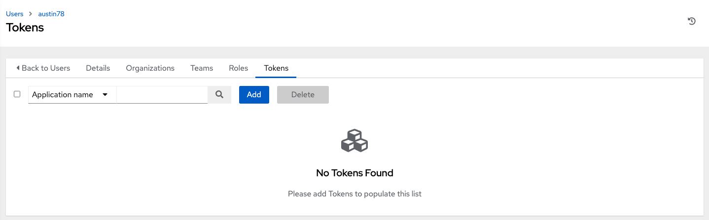
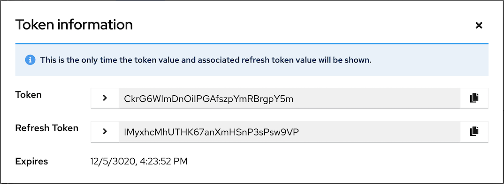
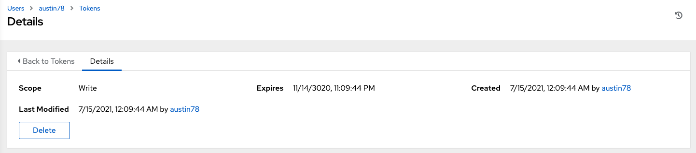

2. Click the **Tokens** tab from your user's profile. 

When no tokens are present, the Tokens screen prompts you to add them:

3. Click the **Add** button, which opens the Create Token window.

4. Enter the following details in Create Token window:

 - **Application**: enter the name of the application with which you want to associate your token. Alternatively, you can search for it by clicking the |search| button. This opens a separate window that allows you to choose from the available options. Use the Search bar to filter by name if the list is extensive. Leave this field blank if you want to create a Personal Access Token (PAT) that is not linked to any application.

 - **Description**: optionally provide a short description for your token.
 
 - **Scope** (required): specify the level of access you want this token to have.

.. |search| image:: ../common/images/search-button.png

5. When done, click **Save** or **Cancel** to abandon your changes.

After the token is saved, the newly created token for the user displays with the token information and when it expires. 

.. note:: This is the only time the token value and associated refresh token value will ever be shown.

In the user's profile, the application for which it is assigned to and its expiration displays in the token list view. 

