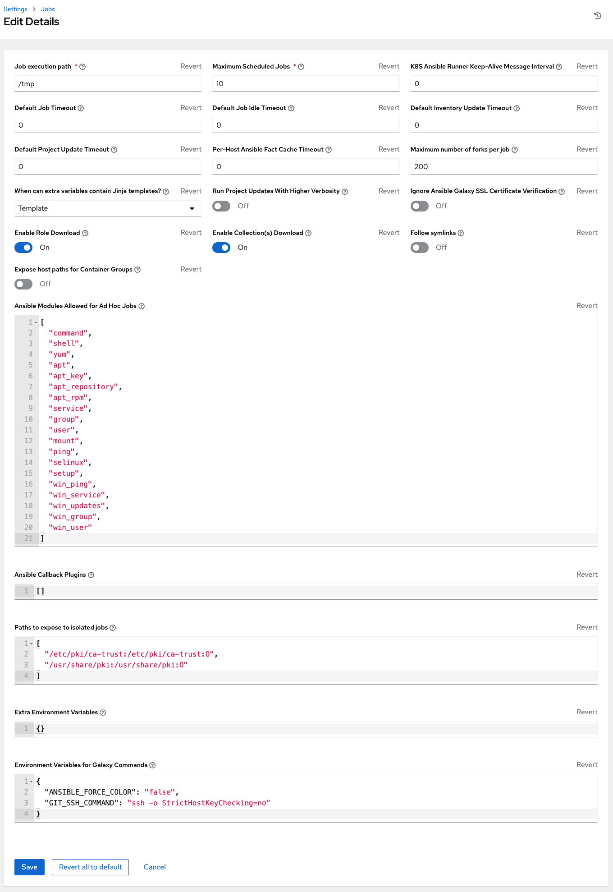

.. include:: ../common/configure_tower_overview.rst

Each tab contains fields with a **Reset** button, allowing you to revert any value entered back to the default value. **Reset All** allows you to revert all the values to their factory default values.

**Save** applies changes you make, but it does not exit the edit dialog. To return to the Settings screen, click **Settings** from the left navigation bar or use the breadcrumbs at the top of the current view.

Authentication
=================
.. index::
    single: social authentication
    single: authentication
    single: enterprise authentication
    pair: configuration; authentication

.. include:: ../common/configure_tower_authentication.rst

.. _configure_tower_jobs:

Jobs
=========
.. index:: 
   single: jobs
   pair: configuration; jobs

The Jobs tab allows you to configure the types of modules that are allowed to be used by the controller's Ad Hoc Commands feature, set limits on the number of jobs that can be scheduled, define their output size, and other details pertaining to working with Jobs in the controller.

1. From the left navigation bar, click **Settings** from the left navigation bar and select **Jobs settings** from the Settings screen. 

2. Set the configurable options from the fields provided. Click the tooltip |help| icon next to the field that you need additional information or details about. Refer to the :ref:`ug_galaxy` section for details about configuring Galaxy settings.

.. note::

    The values for all the timeouts are in seconds.

3. Click **Save** to apply the settings or **Cancel** to abandon the changes.

.. _configure_tower_system:

System
==========
.. index:: 
   pair: configuration; system

The System tab allows you to define the base URL for the controller host, configure alerts, enable activity capturing, control visibility of users, enable certain controller features and functionality through a license file, and configure logging aggregation options.

1. From the left navigation bar, click **Settings**. 

2. The right side of the Settings window is a set of configurable System settings. Select from the following options:

  - **Miscellaneous System settings**: enable activity streams, specify the default execution environment, define the base URL for the controller host, enable controller administration alerts, set user visibility, define analytics, specify usernames and passwords, and configure proxies.
  - **Miscellaneous Authentication settings**: configure options associated with authentication methods (built-in or SSO), sessions (timeout, number of sessions logged in, tokens), and social authentication mapping.
  - **Logging settings**: configure logging options based on the type you choose:
    
    .. image:: ../common/images/configure-tower-system-logging-types.png
    
    For more information about each of the logging aggregation types, refer to the :ref:`Controller Logging and Aggregation <ag_logging>` section of the |ata|.

3. Set the configurable options from the fields provided. Click the tooltip |help| icon next to the field that you need additional information or details about. Below is an example of the System settings window.

.. |help| image:: ../common/images/tooltips-icon.png

.. image:: ../common/images/configure-tower-system.png

.. note::

  The **Allow External Users to Create Oauth2 Tokens** setting is disabled by default. This ensures external users cannot *create* their own tokens. If you enable then disable it, any tokens created by external users in the meantime will still exist, and are not automatically revoked.

4. Click **Save** to apply the settings or **Cancel** to abandon the changes.

.. _configure_tower_ui:

User Interface
================
.. index:: 
   pair: configuration; UI
   pair: configuration; data collection
   pair: configuration; custom logo
   pair: configuration; custom login message
   pair: logo; custom
   pair: login message; custom

The User Interface tab allows you to set controller analytics settings, as well as configure custom logos and login messages.   

Access the User Interface settings by clicking **Settings** from the left navigation bar and select **User Interface settings** from the Settings screen. Click **Edit** to configure your preferences.

.. image:: ../common/images/configure-tower-ui.png

Custom Logos and Images
------------------------

.. include:: ../common/logos_branding.rst
