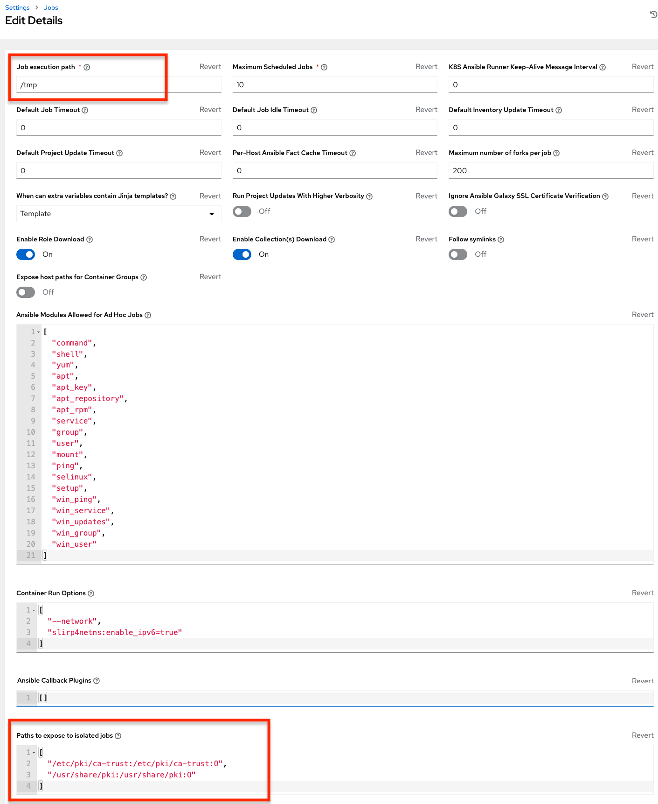

AWX uses container technology to isolate jobs from each other. By default, only the current project is exposed to the container running a job template.

You may find that you need to customize your playbook runs to expose additional directories. To fine tune your usage of job isolation, there are certain variables that can be set.

By default, AWX will use the system's ``tmp`` directory (``/tmp`` by default) as its staging area. This can be changed in the **Job Execution Path** field of the Jobs settings screen, or in the REST API at ``/api/v2/settings/jobs``:

``AWX_ISOLATION_BASE_PATH = "/opt/tmp"``

If there are any additional directories that should specifically be exposed from the host to the container that playbooks run in, you can specify those in the **Paths to Expose to Isolated Jobs**
field of the Jobs setting screen, or in the REST API at ``/api/v2/settings/jobs``:

``AWX_ISOLATION_SHOW_PATHS = ['/list/of/', '/paths']``

  .. note:: 
    The primary file you may want to add to ``AWX_ISOLATION_SHOW_PATHS`` is ``/var/lib/awx/.ssh``, if your playbooks need to use keys or settings defined there.

The above fields can be found in the Jobs Settings window:

.. end reused section
