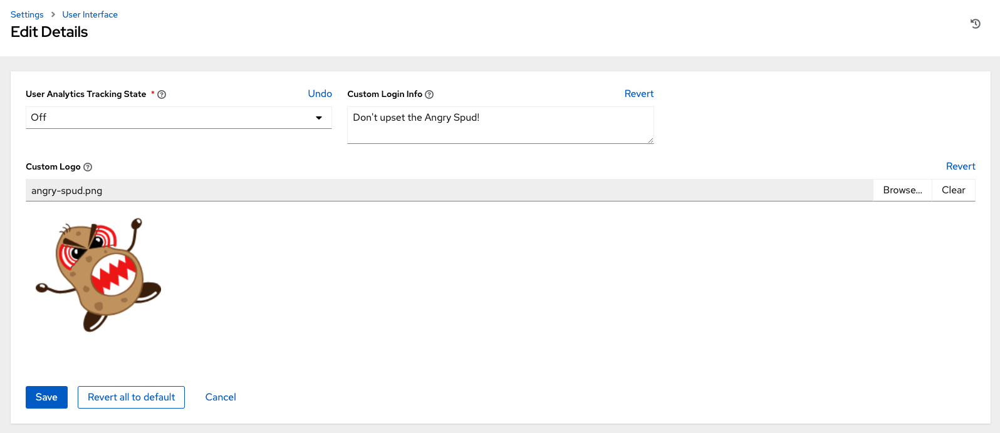
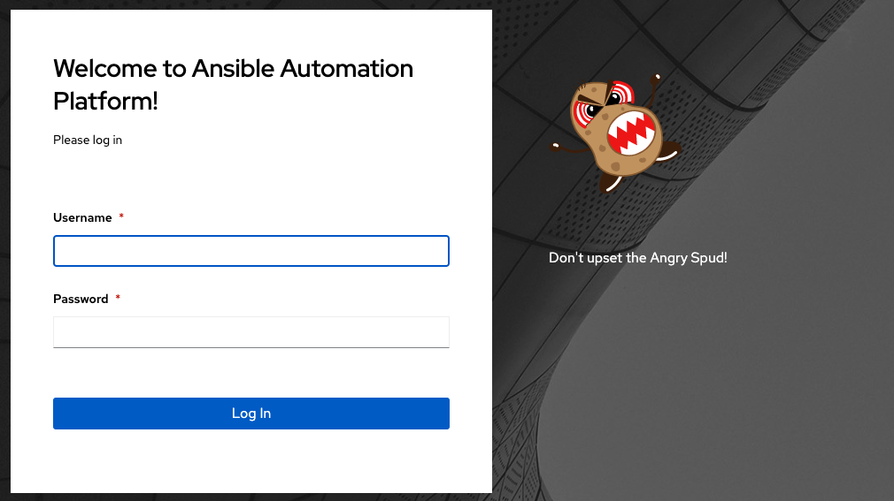

|at| supports the use of a custom logo. You can add a custom logo by uploading an image; and supply a custom login message from the **User Interface settings** of the Settings menu. 

.. image:: ../common/images/configure-tower-ui.png 

For the custom logo to look its best, use a ``.png`` file with a transparent background. GIF, PNG, and JPEG formats are supported.

If needed, you can add specific information (such as a legal notice or a disclaimer) to a text box in the login modal by
adding it to the **Custom Login Info** text field.

For example, if you uploaded a specific logo, and added the following text:

The Tower login dialog would look like this:

Selecting ``Revert`` will result in the appearance of the standard |at| logo.

.. image:: ../common/images/login-form.png
