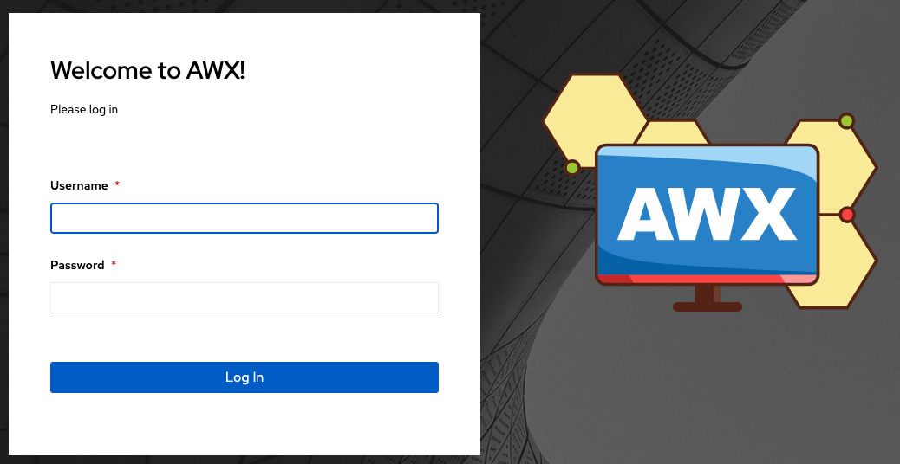

AWX supports the use of a custom logo and login message. You can add a custom logo by uploading an image; and supply a custom login message from the **User Interface settings** of the Settings menu. 

For the custom logo to look its best, use a ``.png`` file with a transparent background. GIF, PNG, and JPEG formats are supported.

If needed, you can add specific information (such as a legal notice or a disclaimer) to a text box in the login modal by
adding it to the **Custom Login Info** text field.

For example, if you uploaded a specific logo, and added the following text:

.. image:: ../common/images/configure-awx-ui-logo-filled.png
	:alt: Edit User Interface Settings form populated with custom text and logo.

The Tower login dialog would look like this:

.. image:: ../common/images/configure-awx-ui-angry-spud-login.png
	:alt: AWX login screen with custom text and logo.

Selecting ``Revert`` will result in the appearance of the standard |at| logo.

