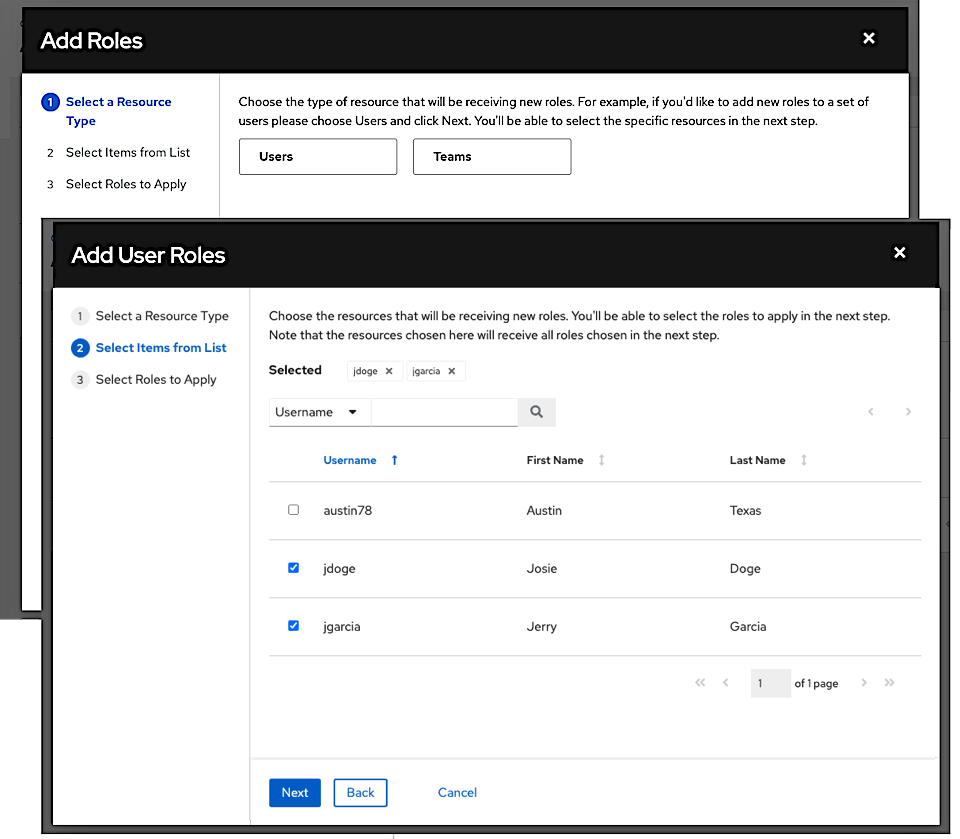
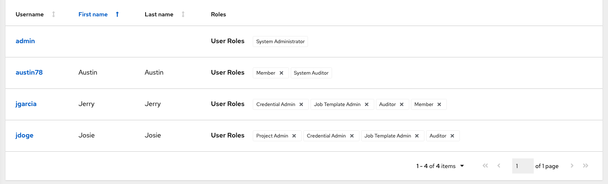
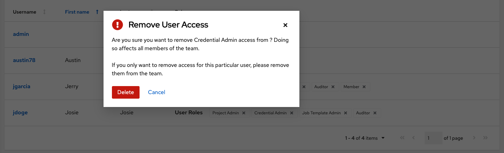

 .. _ug_permissions:

1. In the **Access** tab, click the **Add** button. 

2. Select a user or team to add and click **Next**

3. Select one or more users or teams from the list by clicking the check box(es) next to the name(s) to add them as members and click **Next**. 

In this example, two users have been selected to be added.

4. Select the role(s) you want the selected user(s) or team(s) to have. Be sure to scroll down for a complete list of roles. Different resources have different options available.

  .. image:: ../common/images/organizations-add-users-roles.png

5. Click the **Save** button to apply the roles to the selected user(s) or team(s) and to add them as members. 

The Add Users/Teams window closes to display the updated roles assigned for each user and team.

To remove roles for a particular user, click the disassociate (x) button next to its resource.

.. image:: ../common/images/permissions-disassociate.png

This launches a confirmation dialog, asking you to confirm the disassociation.
 
