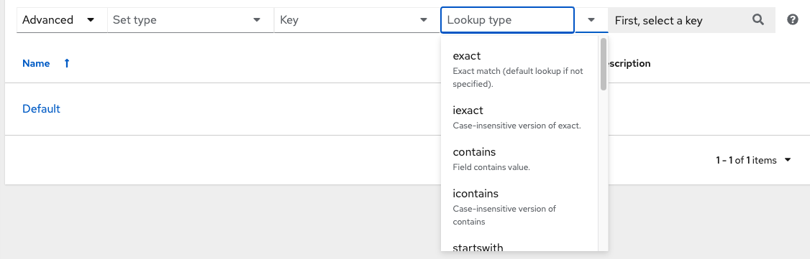
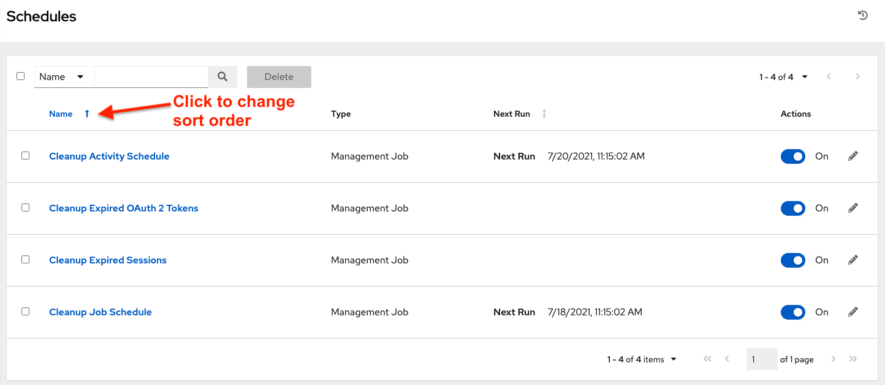

.. index::
   single: searching
 
AWX has a powerful search tool that provides both search and filter capabilities that span across multiple functions. Acceptable search criteria are provided in an expandable "cheat-sheet" accessible from the **Advanced** option from the **Name** drop-down menu in the search field. From there, use the combination of **Set Type**, **Key**, **Lookup type** to filter.

|key sheet|

Searching Tips
~~~~~~~~~~~~~~~~~~

These searching tips assume that you are not searching hosts. Most of this section still applies to hosts but with some subtle differences. A typical syntax of a search consists a field (left-hand side) and a value (right-hand side). A colon is used to separate the field that you want to search from the value. If a search doesn't have a colon (see example 3) it is treated as a simple string search where ``?search=foobar`` is sent. Here are the examples of syntax used for searching:

1. ``name:localhost`` In this example, the string before the colon represents the field that you want to search on. If that string does not match something from **Fields** or **Related Fields** then it's treated the same way Example 3 is (string search). The string after the colon is the string that you want to search for within the name attribute.  

2. ``organization.name:Default``  This example shows a Related Field Search. The period in the left-hand portion separates the model from the field in this case. Depending on how deep/complex the search is, you could have multiple periods in that left-hand portion.

3. ``foobar``    Simple string (key term) search that will find all instances of that term using an ``icontains`` search against the name and description fields. If a space is used between terms (e.g. foo bar), then any results that contain both terms will be returned. If the terms are wrapped in quotes (e.g. "foo bar"), AWX will search for the entire string with the terms appearing together. Specific name searches will search against the API name. For example, ``Management job`` in the user interface is ``system_job`` in the API.

4. ``organization:Default``  This example shows a Related Field search but without specifying a field to go along with the organization. This is supported by the API and is analogous to a simple string search but done against the organization (will do an ``icontains`` search against both the name and description).

Values for search fields
--------------------------

To find values for certain fields, refer to the API endpoint for extensive options and their valid values. For example, if you want to search against ``/api/v2/jobs`` -> ``type`` field, you can find the values by performing an **OPTIONS** request to ``/api/v2/jobs`` and look for entries in the API for ``"type"``. Additionally, you can view the related searches by scrolling to the bottom of each screen. In the example for ``/api/v2/jobs``, the related search shows:

::

	 "related_search_fields": [
            "modified_by__search",
            "project__search",
            "project_update__search",
            "credentials__search",
            "unified_job_template__search",
            "created_by__search",
            "inventory__search",
            "labels__search",
            "schedule__search",
            "webhook_credential__search",
            "job_template__search",
            "job_events__search",
            "dependent_jobs__search",
            "launch_config__search",
            "unifiedjob_ptr__search",
            "notifications__search",
            "unified_job_node__search",
            "instance_group__search",
            "hosts__search",
            "job_host_summaries__search"

The values for Fields come from the keys in a **GET** request. ``url``, ``related``, and ``summary_fields`` are not used. The values for Related Fields also come from the **OPTIONS** response, but from a different attribute.  Related Fields is populated by taking all the values from ``related_search_fields`` and stripping off the ``__search`` from the end.

Any search that does not start with a value from Fields or a value from the Related Fields, will be treated as a generic string search. Searching for something like ``localhost`` will result in the UI sending ``?search=localhost`` as a query parameter to the API endpoint. This is a shortcut for an ``icontains`` search on the name and description fields.

Searching using values from Related Fields
---------------------------------------------

Searching a Related Field requires you to start the search string with the Related Field. This example describes how to search using values from the Related Field, `organization`.

The left-hand side of the search string must start with `organization` (ex: ``organization:Default``). Depending on the related field, you might want to provide more specific direction for the search by providing secondary/tertiary fields. An example of this would be to specify that you want to search for all job templates that use a project matching a certain name. The syntax on this would look like: ``job_template.project.name:"A Project"``.

.. note::

    This query would execute against the ``unified_job_templates`` endpoint which is why it starts with ``job_template``. If we were searching against the ``job_templates`` endpoint, then you wouldn't need the ``job_template`` portion of that query.  

Other search considerations
------------------------------

The following are a few things about searching in AWX that you should be aware of:

- There's currently no supported syntax for **OR** queries. All search terms get **AND**'d in the query parameters.
- The left-hand portion of a search parameter can be wrapped in quotes to support searching for strings with spaces.
- Currently, the values in the Fields are direct attributes expected to be returned in a **GET** request.  Whenever you search against one of the values, AWX essentially does an ``__icontains`` search. So, for example, ``name:localhost`` would send back ``?name__icontains=localhost``. AWX currently performs this search for every Field value, even ``id``, which is not ideal.

Sort
~~~~~~

.. index::
   pair: sorting; ordering

Where applicable, use the arrows in each column to sort by ascending or descending order (following is an example from the schedules list). 

|sort arrow|

The direction of the arrow indicates the sort order of the column.

