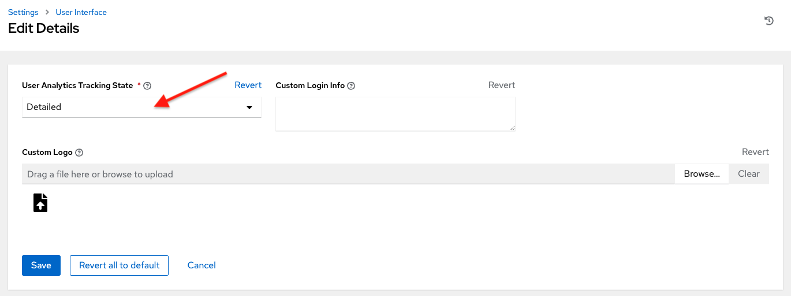

Usability Analytics and Data Collection
----------------------------------------

.. index::
    single: data collection
    single: analytics collection
    single: usability data collection
    single: Pendo
    single: USER_ANALYTICS_TRACKING_STATE
    single: user data tracking

Usability data collection is included with |at| to collect data to better understand how controller users specifically interact with it, to help enhance future releases, and to continue streamlining your user experience.

Only users installing a trial of |rhaap| or a fresh installation of |at| are opted-in for this data collection. 

|At| collects user data automatically to help improve the product. You can opt out or control the way the controller collects data by setting your participation level in the **User Interface settings** in the Settings menu.

1. Click **Settings** from the left navigation bar and select **User Interface settings**. 

2. Click **Edit**.

3. Select the desired level of data collection from the **User Analytics Tracking State** drop-down list:

-  **Off**: Prevents any data collection.

-  **Anonymous**: Enables data collection without your specific user data.

-  **Detailed**: Enables data collection including your specific user data.

4. Click **Save** to apply the settings or **Cancel** to abandon the changes.

For more information, see the Red Hat privacy policy at https://www.redhat.com/en/about/privacy-policy.

