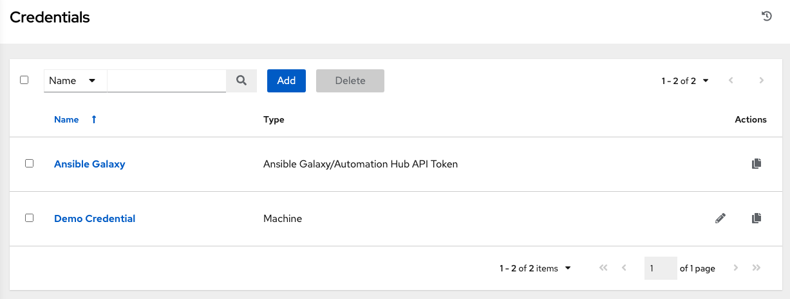

Create a Credential
~~~~~~~~~~~~~~~~~~~~~~~~~~

.. index::
   single: credentials; create 

Credentials authenticate the AWX user to launch Ansible playbooks, which can include passwords and SSH keys, against inventory hosts. You can also require the AWX user to enter a password or key phrase when a playbook launches using the credentials feature of AWX.

Access the list of credentials by clicking **Credentials** from the left navigation bar.

|Credentials - list view|

For the purpose of this Quick Start, a demo credential and a Galaxy credential have been provided for your use. The provided Galaxy credential serves as a template and can only be copied and not edited. You may add more credentials as necessary.  Refer to :ref:`ug_credentials_add` in the |atu| for detail.

.. note::
	When setting up additional credentials, keep in mind that the user you assign must have root access or be able to use SSH to connect to the host machine. 

Click **Demo Credential** to view its details.

|Credentials - review demo credential|

.. |Credentials - review demo credential| image:: ../common/images/qs-credentials-demo-details.png

For the purpose of this Quick Start Guide, leave the default demo credential as is. But to edit the default credential later - from the Details tab, click **Edit**, or from the Credentials list view, click the Edit (|edit|) button next to the credential name to edit the appropriate details, then save your changes. 

.. |edit| image:: ../common/images/edit-button.png