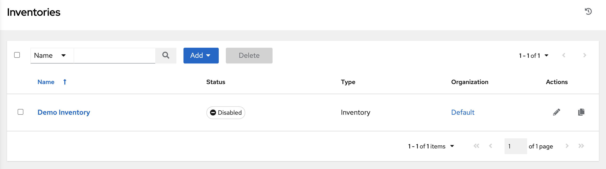
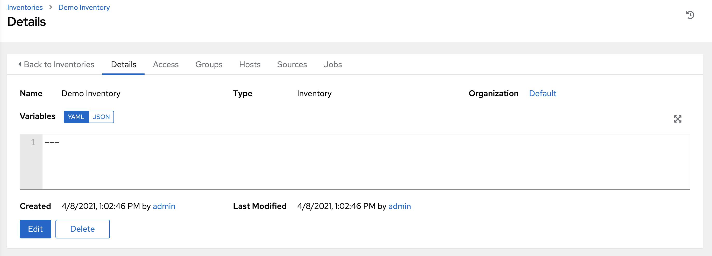
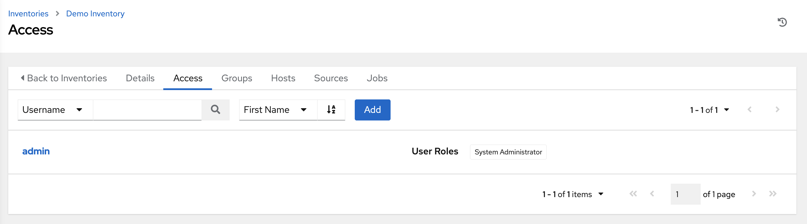
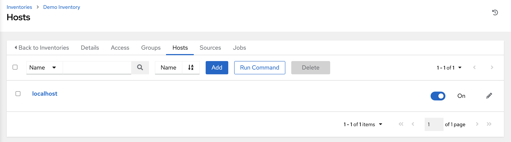

Create a new Inventory
~~~~~~~~~~~~~~~~~~~~~~~~

.. index::
   single: inventory; create new
   single: inventory; add to organization

An inventory is a collection of hosts managed by AWX. Organizations are assigned to inventories, while permissions to launch playbooks against inventories are controlled at the user and/or team level. For more information, refer to :ref:`Inventories <ug_inventories>`, :ref:`Users - Permissions <ug_users_permissions>`, and :ref:`Teams - Permissions <ug_teams_permissions>` in the |atu|.

To view existing inventories, click **Inventories** from the left navigation bar.

|at| provides a demo inventory for you to use as you learn how AWX works. It can be used as is or edited later as needed. You may create another inventory if necessary. Refer to :ref:`ug_inventories_add` in the |atu| for detail.

For the purpose of this Quick Start Guide, leave the default inventory as is. 

Click **Demo Inventory** to view its details.

|Inventories - Demo inventory details|

As with organizations, inventories also have associated users and teams that you can view through the **Access** tab.

A default admin user with the role of System Administrator has been automatically populated for this demo inventory. 

Groups and Hosts
^^^^^^^^^^^^^^^^^

Note that inventories are divided into groups and hosts. A group might represent a particular environment (e.g. "Datacenter 1" or "Stage Testing"), a server type (e.g. "Application Servers" or "DB Servers"), or any other representation of your environment. The groups and hosts that belong to the Demo inventory are shown in the **Groups** and **Hosts** tabs, respectively.

To add new groups, click the **Add** button in the Groups screen.  

Similarly, in the **Hosts** tab, click the **Add** button to add hosts to groups.

For the purposes of this Quick Start and to test that AWX is setup properly, a local host has been added for your use.

Suppose that the organization you created earlier has a group of web server hosts supporting a particular application. To add these hosts to the inventory, create a group and add the web server hosts. 

Click **Cancel** (if no changes were made) or use the breadcrumb navigational links at the top of the |at| browser to return to the Inventories list view. Clicking **Save** does not exit the Details dialog.
