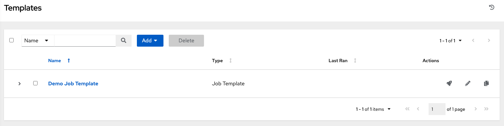
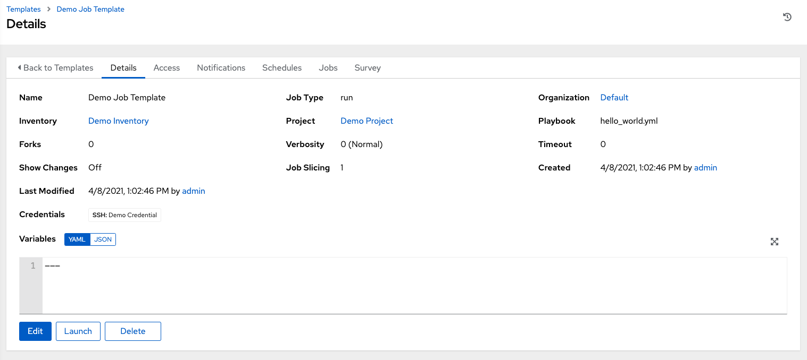
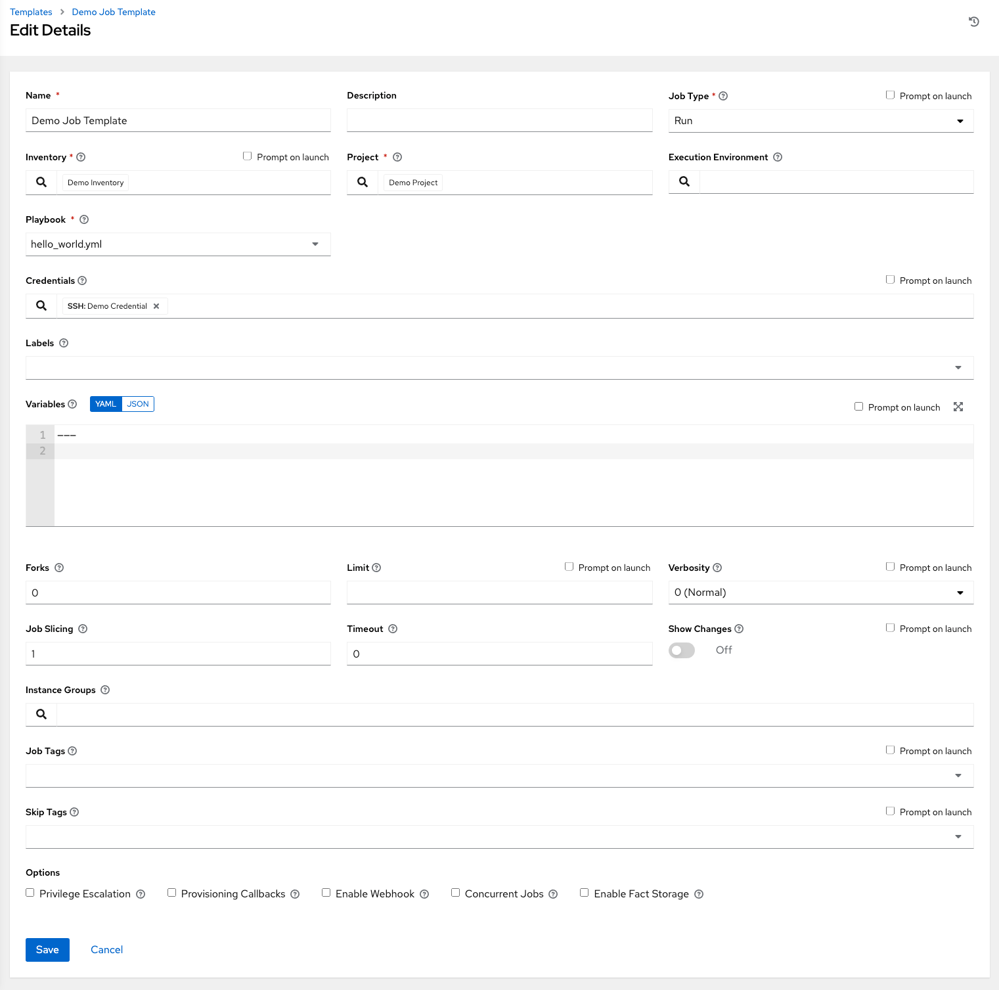

Create a new Job Template
~~~~~~~~~~~~~~~~~~~~~~~~~~~~~

.. index::
   single: job templates; creation

A job template combines an Ansible playbook from a project and the settings required to launch it. Review existing job templates by clicking **Templates** from the left navigation bar. 

|Job templates - home|

For the purpose of this Quick Start, a Demo Job Template has been created for your initial use.

Click **Demo Job Template** to view its details.

|Job templates - review demo template|

For the purpose of this Quick Start Guide, leave the default demo job template as is. But to edit the default template later - from the Details tab, click **Edit**, or from the Templates list view, click the Edit (|edit|) button next to the template name to edit the appropriate details, then save your changes. 

.. |edit| image:: ../common/images/edit-button.png

|Job templates - edit demo|

Click **Cancel** (if no changes were made) or use the breadcrumb navigational links at the top of the |at| browser to return to the Templates list view. Clicking **Save** does not exit the Details dialog.