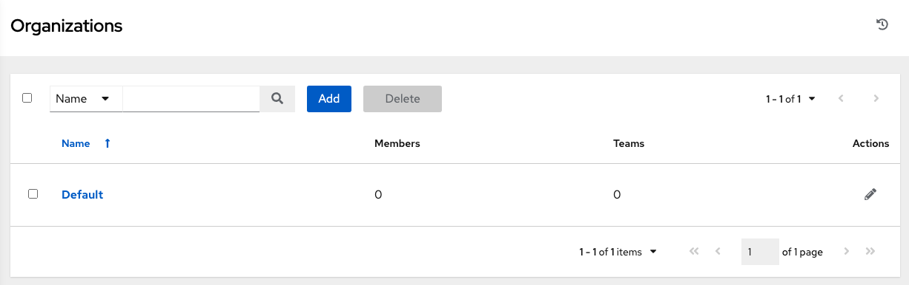
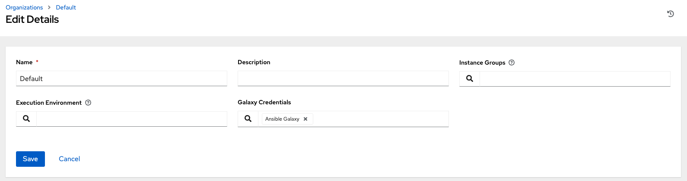

Review the Organization
~~~~~~~~~~~~~~~~~~~~~~~~~

.. index::
   single: organizations

An organization is a logical collection of users, teams, projects, and inventories. It is the highest level object in the AWX object hierarchy.

From the left navigation bar, click **Organizations**. 

.. note::
    AWX creates a default organization automatically. Users of Tower with a Self-support level license only have the 

|Organizations - default view|

.. index::
   single: organization; default

A default organization has been automatically created and is available to all users of AWX. It can be used as is or edited later as needed, but deleting it is not recommended.  

For the purpose of this Quick Start Guide, leave the default organization as is.

To edit the default organization later, expand its properties by clicking the Edit (|edit|) button and entering the appropriate details, then save your changes. 

.. |edit| image:: ../common/images/edit-button.png

.. image:: ../common/images/qs-organization-list-view-edit-icon.png

|Organizations - default expanded|

To add a new organization, refer to the :ref:`ug_organizations` section in the |atu|.
