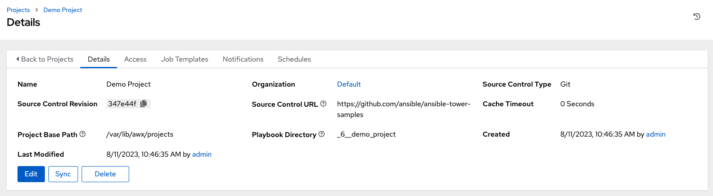

Setting up a Project
~~~~~~~~~~~~~~~~~~~~~~~

.. index::
   single: projects

A Project is a logical collection of Ansible playbooks, represented in AWX.

You can manage playbooks and playbook directories by either placing them manually under the Project Base Path on your AWX server, or by placing your playbooks into a source code management (SCM) system supported by AWX, including Git, Subversion, and Mercurial.

.. note::

  It is recommended that, whenever possible, you use source control to manage your playbooks. This type of best practice provides the ability to treat your infrastructure as code and is in line with DevOps ideals. While this Quick Start Guide uses lightweight examples to get you up and running, we suggest using source control to manage playbook for production purposes.

To review existing projects, click **Projects** from the left navigation bar. 

|Projects - home|

.. |Projects - home| image:: ../common/images/qs-projects-home.png

The |at| simplifies the startup process by providing you with a Demo Project to work with initially.

Click on **Demo Project** to view its details. 

|Projects - demo project|

For the purpose of this Quick Start Guide, leave the default demo project as is. But to edit the default project later - from the Details tab, click **Edit**, or from the Projects list view, click the Edit (|edit|) button next to the project name to edit the appropriate details, then save your changes. 

.. |edit| image:: ../common/images/edit-button.png

If you want to fetch the project for latest changes, you can manually start an SCM sync for this project. Update the SCM-based demo project from the Details tab, click **Sync**, or from the Projects list view, click the Sync (|sync|) button next to the project name.

.. note::

  Please note that immediately after adding new projects setup to use source control, a "sync" automatically starts that fetches the project details from the configured source control.

.. |sync| image:: ../common/images/refresh-button.png
