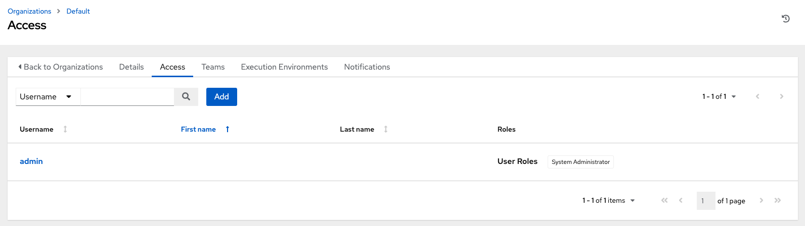

Create a User
~~~~~~~~~~~~~~~~

.. index::
   single: users; add new
   single: users; add to organization

Users associated with an organization are shown in the **Access** tab of the Organization.

|Organizations - default admin user|

A default `admin` user with the role of System Administrator has been automatically created and is available to all users of AWX. It can be used as is or edited later as needed. You may add other users to an organization, but you must create the user(s) first. Refer to the :ref:`Users <ug_users_create>` section in the |atu| for detail.

For the purpose of this Quick Start Guide, leave the default user as is. 

 