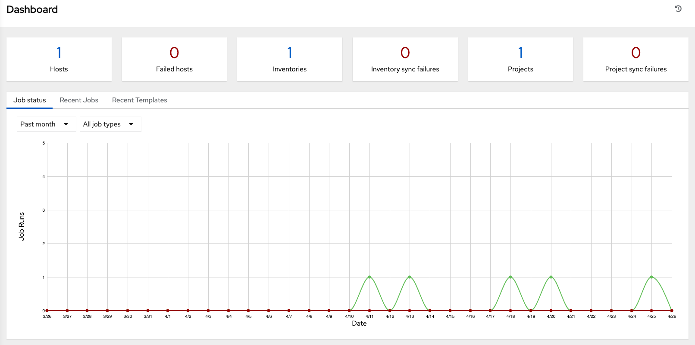
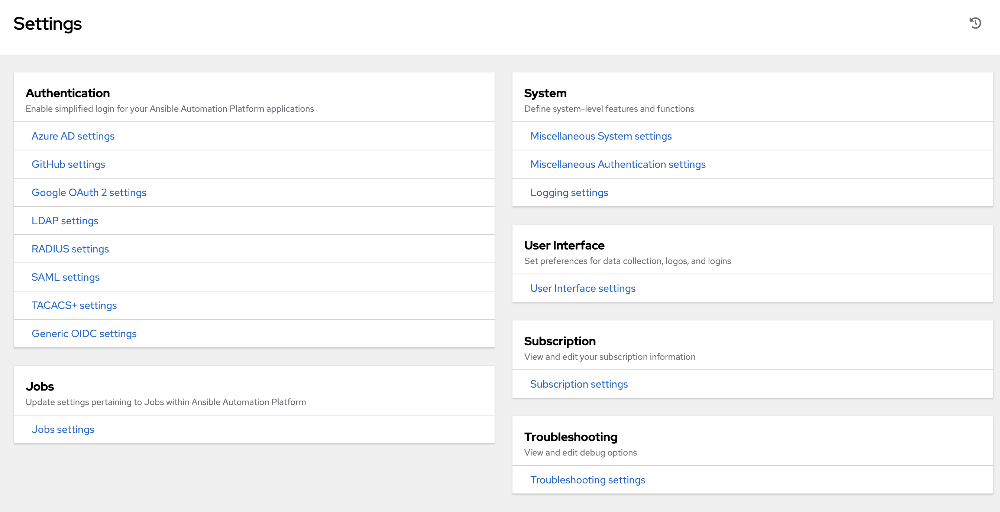

Examine the AWX Dashboard
~~~~~~~~~~~~~~~~~~~~~~~~~~

.. index::
   pair: dashboard; examine
   pair: settings menu; organization
   pair: settings menu; users
   pair: settings menu; teams
   pair: settings menu; credentials
   pair: settings menu; management jobs
   pair: settings menu; inventory scripts
   pair: settings menu; notifications
   pair: settings menu; credential types
   pair: settings menu; instance groups
   pair: settings menu; help about

The Dashboard offers a friendly graphical framework for your IT orchestration needs. Along the left side of the Dashboard is the navigation menu, where you can quickly display different views, navigate to your resources, grant access, and administer certain AWX features in the UI. 

.. note::

  The new AWX User Interface is available for tech preview and is subject to change in a future release. To preview the new UI, click the **Enable Preview of New User Interface** toggle to **On** from the Miscellaneous System option of the Settings menu. 

  .. image:: ../common/images/configure-awx-system-misc-preview-newui.png

  After saving, logout and log back in to access the new UI from the preview banner. To return to the current UI, click the link on the top banner where indicated.

  .. image:: ../common/images/ug-dashboard-preview-banner.png

Click on the Menu |menu| icon at the top of the left navigation to hide or display the navigation bar. 

On the main Dashboard view, a summary appears listing your current **Job Status**. You can filter the job status within a period of time or by job type. Also available in their respective tabs are summaries of **Recent Jobs** ran and **Recent Templates** used. These can be sorted by various attributes.

|Home dashboard|

The very last item in the navigation bar is **Settings**, which provides access to the AWX configuration Settings. 

The Settings page allows administrators to configure authentication, jobs, system-level attributes, customize the user interface, and product license information. Refer to :ref:`ag_configure_awx` section for more detail.

Regardless of the window or action you're performing, the very top of each page next to the your user icon is the About (|about|) icon, which provides you the versions of AWX and Ansible you are currently running.

.. note::
	Keep in mind that the goal of this Quick Start is to launch a simple playbook. To do this, a number of configuration options must be setup. Completing the quick start configuration tasks now ensures that tAWX is configured properly and allows for easier executions of more involved playbooks later on. 