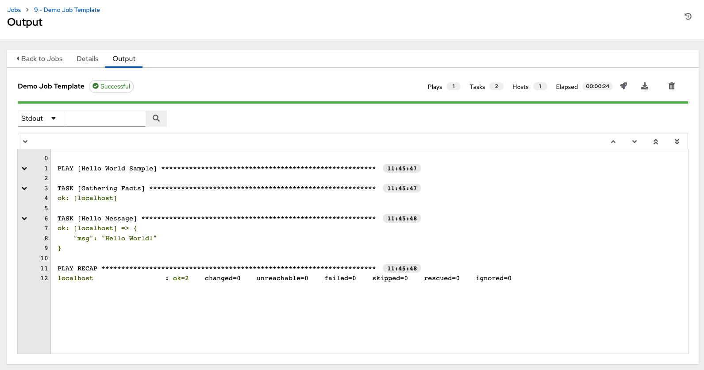

Launch it!
~~~~~~~~~~~~~~

.. index::
   pair: job templates; launch

From the Templates list view, click the Launch (|launch|) button to run the Demo Job Template.

.. |launch| image:: ../common/images/launch-button.png

|Job templates - home launch|

.. |Job templates - home launch| image:: ../common/images/qs-job-templates-list-view-click-launch.png

The initial job launch returns a status page which updates automatically using the controller's Live Event feature until the job is complete. Once complete, the job results look like the following:

|Job templates - demo run complete|

For more details on the job results, refer to :ref:`ug_jobs`.

Congratulations! Your controller installation is officially setup and running properly. To learn more about these controller features or to learn about administration tasks, the controller API, etc., refer to the following documentation sets:

- :ref:`Automation Controller User Guide <userguide:ug_start>`
- `Red Hat Ansible Automation Platform Installation Guide <https://access.redhat.com/documentation/en-us/red_hat_ansible_automation_platform/2.0-ea/html-single/red_hat_ansible_automation_platform_installation_guide/index>`_
- :ref:`Automation Controller Administration Guide <administration:ag_start>`
- :ref:`Automation Controller API Guide<controllerapi:api_start>`
- :ref:`Automation Controller Release Notes <release-notes:releasenotes_start>`
- `Ansible Documentation`_

.. _Ansible Documentation: http://docs.ansible.com/

