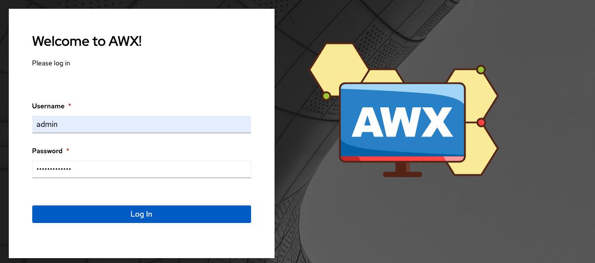

Login as a Superuser
~~~~~~~~~~~~~~~~~~~~~~~

.. index::
   pair: log in; AWX

Using the login information provided after your installation completed, open a web browser and log in to AWX by browsing to its server URL at: ``https://<AWX_SERVER_NAME>/``

Once the AWX UI is accessible, use the credentials specified during the installation process to login. The default username is ``admin``. The password for ``admin`` is the value specified for ``admin_password`` in your inventory file.

These defaults can be changed later by clicking **Users** from the left navigation bar.

|Login form|

