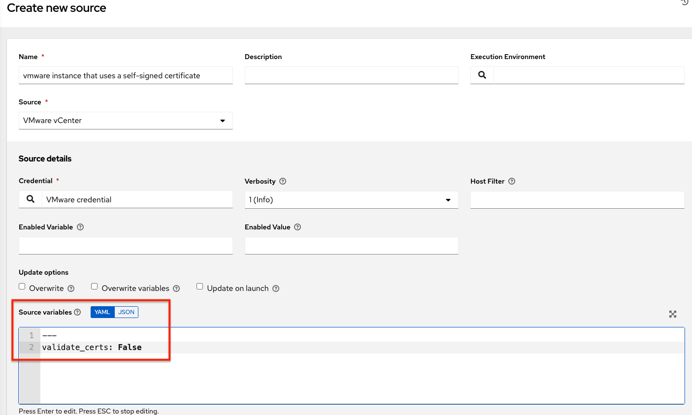
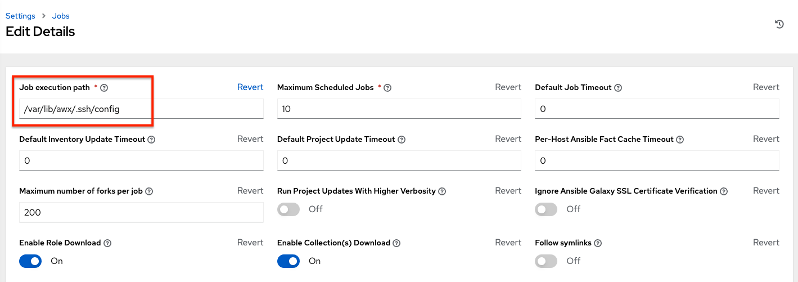

.. _ir_known_issues:

*************
Known Issues
*************

.. index:: 
   single: known issues
   single: issues, known
   pair: known issues; upgrades
   pair: known issues; ansible-runner   
   pair: known issues; proxy support
   pair: known issues; host comparisons
   pair: known issues; live event statuses
   pair: live event statuses; green dot
   pair: live event statuses; red dot
   pair: known issues; LDAP authentication
   pair: known issues; lost isolated jobs
   pair: known issues; sosreport 
   pair: known issues; local management
   pair: known issues; ssh customization
   pair: known issues; job isolation
   pair: known issues; bundled installer
   pair: known issues; Ubuntu
   pair: known issues; YAML traceback error
   pair: known issues; traceback error
   pair: known issues; session limit
   pair: known issues; Ansible Azure dependencies
   pair: known issues; authentication (reactive user)
   pair: known issues; SAML issues   
   pair: known issues; user cannot log in using authentication
   pair: known issues; login problems with social authentication
   pair: known issues; OAuth account recreation
   pair: known issues; login via http
   pair: known issues; web sockets in safari
   pair: known issues; browser auto-complete
   pair: known issues; database corruption
   pair: known issues; VMWare self-signed certs
   pair: known issues; self-signed certs (VMWare)
   pair: known issues; awx-manage inventory_import user
   pair: known issues; duplicate Ansible-Galaxy credentials
   pair: known issues; deleted default orgs

.. contents::
    :local:

.. _ki_csrf_trusted_origin_setting:

The ``CSRF_TRUSTED_ORIGIN`` setting
====================================

The ``CSRF_TRUSTED_ORIGIN`` setting may be required if you are using AWX behind a load balancer. With the update to Django 4.2, CSRF (Cross Sight Request Forgery) checking is more strict. Because of this, using AWX behind a load balancer can cause issues when it previously worked. If you encounter an error like the following, you will need to add the sources to the ``CSRF_TRUSTED_ORIGIN`` settings.

::

   WARNING [b336a554] django.security.csrf Forbidden (Origin checking failed - https://localhost:3001 does not match any trusted origins.): /api/login/

Refer to the `Django csrf-trusted-origins documentation <https://docs.djangoproject.com/en/4.2/ref/settings/#csrf-trusted-origins>`_ for further detail on how to resolve this error.

Launching the ansible-runner component not working as expected
================================================================

A change was made to the way the ansible-runner component is launched (the executable inside of the |ee| that AWX launches to run a playbook), introduced a backward incompatibility. It is highly recommended to always rebuild on top of the base |ees| that corresponds to the AWX version you are using. This should be the ideal way to upgrade in general.

Deleted default orgs produces duplicate Ansible-Galaxy credentials
====================================================================

Despite being able to run subsequent installs when deleting the default organization, it does not automatically remove or fix duplicate Ansible-Galaxy credentials.

Isolated nodes unsupported in an OpenShift deployment
=====================================================
Isolated nodes are not currently supported when deploying AWX in OpenShift.

Browsers ignoring the ``autocomplete=off`` setting
======================================================

AWX leverages the ``autocomplete=off`` attribute on forms to relay to the browser that it should not autocomplete the fields within that form. In some scenarios, however, the browser may ignore this setting and attempt to save and/or autocomplete fields. This tends to happen on forms that appear to contain login fields like username and password, such as the *User* form and some *Settings* forms. Further investigation is underway to deliver options that prevent this behavior.

Login via HTTP requires workaround
====================================

To access AWX nodes behind your load balancer (in traditional cluster AWX installs) via HTTP, refer to the procedure described in the :ref:`admin_troubleshooting` of the |ata|.

Job slicing and limit interactions
=====================================

When passing a limit to a Sliced Job, if the limit causes slices to have no hosts assigned, those slices will fail, causing the overall job to fail.

Misuse of job slicing can cause errors in job scheduling
============================================================

.. include:: ../common/job-slicing-rule.rst

Default LDAP directory must be configured to use LDAP Authentication
======================================================================

The ability to configure up to six LDAP directories for authentication requires a value. On the settings page for LDAP, there is a "Default" LDAP configuration followed by five-numbered configuration slots. If the "Default" is not populated, AWX will not try to authenticate using the other directory configurations.

Potential security issue using ``X_FORWARDED_FOR`` in ``REMOTE_HOST_HEADERS``
=================================================================================

If placing AWX nodes behind some sort of proxy, this may pose a security issue. This approach assumes traffic is always flowing exclusively through your load balancer, and that traffic that circumvents the load balancer is suspect to ``X-Forwarded-For`` header spoofing. 

Server error when accessing SAML metadata via hostname
=========================================================

When AWX is accessed via hostname only (e.g. https://my-little-awx), trying to read the SAML metadata from /sso/metadata/saml/ generates a ``sp_acs_url_invalid`` server error.

A configuration in which uses SAML when accessing AWX via hostname only instead of an FQDN, is not supported. Doing so will generate an error that is captured in the browser with full traceback information.

SAML authentication revokes admin role upon login
==================================================

Older versions of AWX, the SAML adapter did not evaluate the System Auditor or System Admin roles for a user logging in. Because of this, the login process would not change a user's system roles that were granted through the User Interface. The adapter now has a setting called **SAML User Flags Attribute Mapping** to grant users logging in these roles based on either SAML attributes or roles, and the adapter defaults to removing these roles if unspecified akin to the LDAP adapter. Refer to the :ref:`logic table <ag_auth_saml_user_flags_attr_map>` that shows the relationship between how the role, attribute, and attribute value settings are configured and whether or not a user will be granted the System Admin/Auditor roles.

Live events status indicators
===============================

Live events status dots are either seen as a red or orange dot at the top of AWX Dashboard when something goes wrong. They are not seen at all when the system is in a healthy state.  If you encounter a red or orange live events status indicator, even when your system seems fine, the following suggestions may offer a solution: 

- Try manually refreshing/reloading your browser page.
- Try changing web browsers, as Firefox and Safari have been reported to have issues trusting self-signed certificates. 
- Try creating a self-signed certificate that matches your DNS and import it into your trust manually.
- Try using an incognito or private browsing session.  
- Try disabling your browser plugins to ensure none are blocking the service. 

Live event status dots are used for troubleshooting problems with your AWX instance. You can collect troubleshooting help by running a ``sosreport``. As root, run the command ``sosreport`` from your system to automatically generate a diagnostic tar file, then contact Ansible's Support team with the collected information for further assistance. For more information on ``sosreport``, refer to :ref:`admin_troubleshooting_sosreport` in the |ata|.

VMWare Self-Signed Certs
================================================

If you have a VMware instance that uses a self-signed certificate, then you will need to add the following to the `Source Vars` configuration of the Cloud Group:

.. code-block:: text

   "source_vars": "---\nvalidate_certs: False",

You can set this in inventory source for VMware vCenter as follows:

awx-manage inventory_import user
================================================

In general, the use of ``awx-manage`` commands is supported when executed by the root or awx user. However, even when run as the root user, the command ``awx-manage inventory_import`` may fail to authenticate with the private registry where the execution environments are hosted. The workaround is to run the command as the ``awx`` user, given that the images should be pre-pulled by the installer which correctly authenticates.

Upgrading existing Instance Groups on OCP deployments
=======================================================
All job execution occurs in Container Groups are deployed on OpenShift. Creating new "normal" Instance Groups is disabled in the user interface, however upon upgrade, nothing happens to regular instance groups. This is a known issue because any resources that attempt to use the normal instance group that contains control plane pods as instances will have 0 capacity and jobs will stay in the pending state indefinitely. The workaround is to delete all of these "normal" instance groups. By default, there is a Container Group where job execution will occur in the same namespace as AWX pods are deployed. Additional capacity can be provided by configuring other Container Groups on the same or any other OpenShift cluster.

Database on Disk Becomes Corrupted
======================================

If AWX is not cleanly shutdown, it leaves a ``/var/lib/awx/beat.db`` file on disk. If that happens, the dispatcher won’t start, and you must manually delete the ``/var/lib/awx/beat.db`` file and restart AWX before the dispatcher will start properly.

Local management not functioning as expected
============================================

All playbooks are executed by AWX in a Linux container called an automation execution environment.

The use  of ``delegate_to: localhost`` or ``local_action`` to manage the executing host will not function in this environment, as it will still be executing inside the container.

To manage the local host where execution is running, you will need to use the ssh connection plugin to connect from the container to the local host.

Problems when using SSH customization 
======================================

The Job Isolation functionality in AWX limits the directories available for playbooks to the project that is in use. If you are attempting to customize SSH behavior by using a custom SSH configuration in the awx user's home directory, this directory must be added to the list of directories exposed to the container.

For example, to add a custom SSH config in ``/var/lib/awx/.ssh/config`` and make it available for AWX jobs, you can specify the path in the **Job Execution Isolation Path** field accessed from the **Jobs** tab of the Settings screen:

Database server installed on nodes
====================================

All nodes in the cluster get a database server even if the nodes do not have a database. This is unexpected and may take up space. 

Reactivating OAuth authentication accounts which have been deleted
===================================================================

Once a user who logs in using social authentication has been deleted, the user will not be able to login again or be recreated until the system administrator runs a ``cleanup_deleted`` action with ``days=0`` to allow users to login again. Once ``cleanup_deleted`` has been run, AWX must be restarted. Accounts which have been deleted prior to having the ``cleanup_deleted`` action run will receive a "Your account is inactive" message upon trying to login.

Using vaulted variables in inventory sourced from a project
===========================================================

When using inventory from a source control project, individual vaulted variable values are supported. Vaulted files are not currently supported.

Saved scheduled and workflow configurations and surveys
=======================================================

If a configuration of a job template is scheduled or added to a workflow with answers from a prompted survey, changing the Job Template survey to supply different variable names may cause the saved configuration to not function. The workaround is to delete the saved schedule configuration/workflow node, and recreate it with answers from the updated survey.
