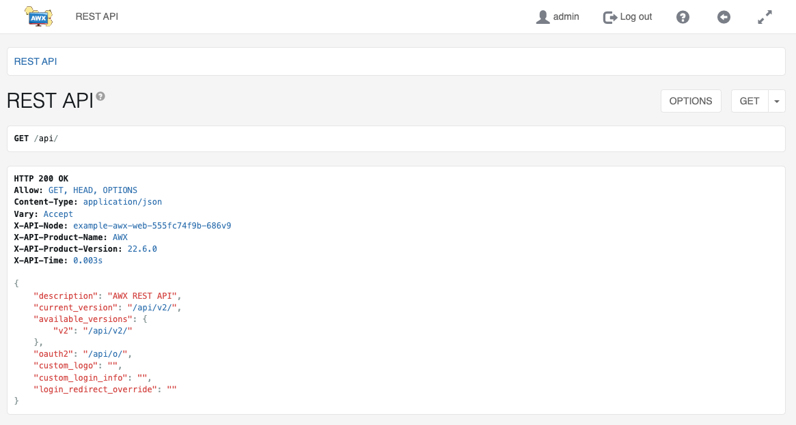
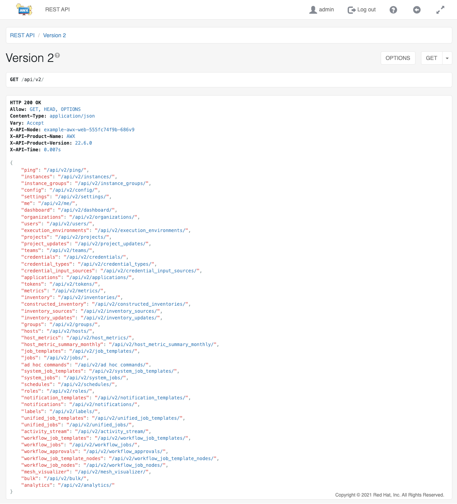
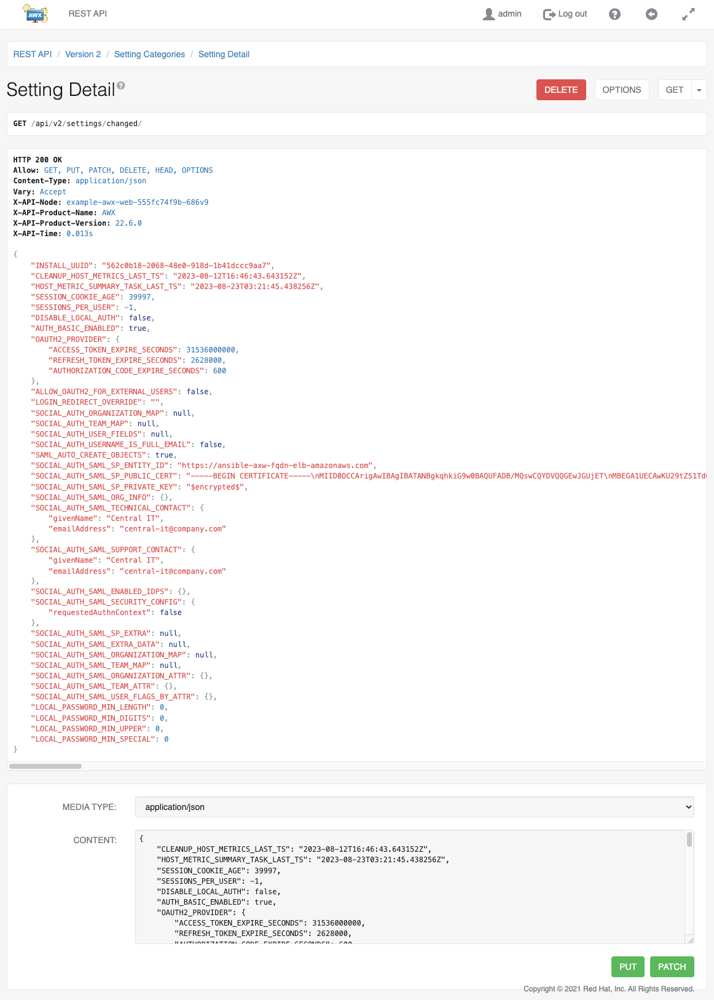

.. _api_browsable_api:

******************
Browsable API
******************

.. index::
   single: browsable API
   single: API; browsable

REST APIs provide access to resources (data entities) via URI paths.  You can visit the AWX REST API in a web browser at: ``http://<server name>/api/`` 

|REST API|

|At| supports version 2 of the API, which can be accessed by clicking the v2 link next to "current versions" or available versions":

|REST API V2|

.. |REST API V2| image:: ../common/images/rest-api-available-versions.png

If you perform a **GET** just the ``/api/`` endpoint, it gives the ``current_version``, which would be the recommended version.

Clicking on various links in the API allows you to explore related resources.

Clicking on the |question| next to the page name (toward the top of the screen) for an API endpoint gives you documentation on the access methods for that particular API endpoint and what data is returned when using those methods.

.. |question| image:: ../common/images/api-questionmark.png

.. index::
   pair: API; PUT
   pair: API; POST
   pair: API; JSON

You can also use PUT and POST verbs on the specific API pages by formatting JSON in the various text fields. 

|REST API - POST to API via form|

You can also view changed settings from factory defaults at ``/api/v2/settings/changed/`` endpoint. It reflects changes you made in the API browser, not changed settings that come from static settings files.

|REST API - Changes to Settings|

