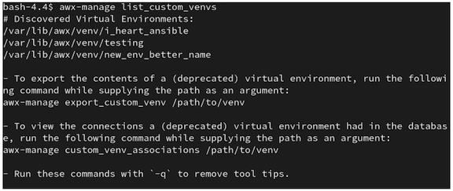
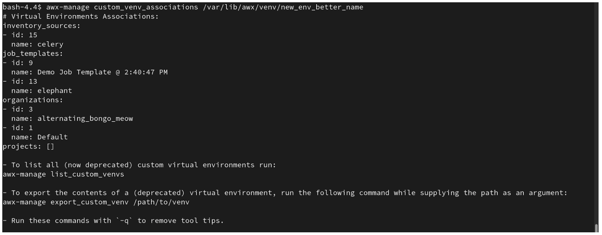
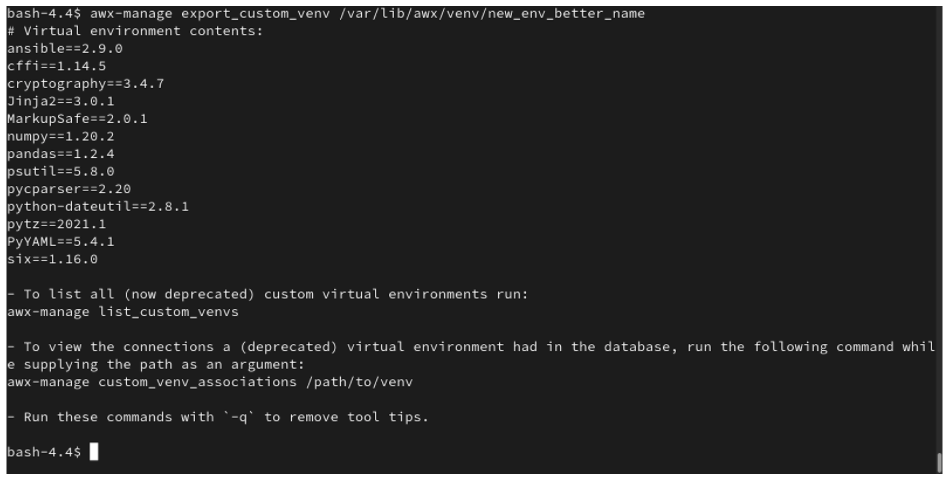

.. _upgrade_venv:

Upgrading to Execution Environments
===================================

.. index::
    single: execution environment
    pair: Ansible; executing in a execution environment
    pair: migrate to execution environments; virtual environments 
    pair: build; execution environments

If upgrading from older versions of |at| to 4.0 or later, the controller has the ability to detect previous versions of virtual environments associated with Organizations, Inventory, and Job Templates; and inform you that you will need to migrate to the new |ee| model. A brand new installation of |at| creates two virtualenvs during installation--one is used to run the controller itself, while the other is used to run Ansible. Like legacy virtual environments, |ees| allow the controller to run in a stable environment, while allowing you to add or update modules to your |ee| as necessary to run your playbooks. For more information, see :ref:`ug_execution_environments` in the |atu|.

.. Important::

    When upgrading, it is highly recommended to always rebuild on top of the base |ee| that corresponds to the platform version you are using. See :ref:`ug_build_ees` for more information.

.. so that you are aware, there will be a variable "|ab|" that will be substituted for "ansible-builder" and references to "|at| will be changed to read "Automation Controller". These branding changes will be merged in from product-docs PR #1506.

.. _migrate_new_venv:

Migrate legacy venvs to execution environments
----------------------------------------------

You can have the exact same setup in an |ee| that you had in a prior custom virtual environment by migrating them to the new |ee|. Use the ``awx-manage`` commands in this section to:

- list of all the current custom virtual environments and their paths (``list_custom_venvs``)
- view the resources that rely a particular custom virtual environment (``custom_venv_associations``)
- export a particular custom virtual environment to a format that can be used to migrate to an |ee| (``export_custom_venv``)

1. Before you migrate, it is recommended that you view all the custom virtual environments you currently have running by using the ``awx-manage list`` command:

::

  $ awx-manage list_custom_venvs

Below is an example output when running this command:

The above output shows three custom virtual environments and their paths. If you have a custom virtual environment that is not located within the default ``/var/lib/awx/venv/`` directory path, it will not be included here. 

2. Use the ``_associations`` command to view what organizations, jobs, and inventory sources a custom virtual environment is associated with in order to determine which resources rely on them:

::

  $ awx-manage custom_venv_associations /this/is/the/path/

Below is an example output when running this command:

3. Select a path for the virtual environment that you want to migrate and specify it in the ``awx-manage export`` command:

::

  $ awx-manage export_custom_venv /this/is/the/path/

The resulting output is essentially the results of executing a ``pip freeze`` command. The example shows the contents of the selected custom virtual environment:

.. note::

   All of these commands can be run with a ``-q`` option, which removes the instructional content provided on each output.

Now that you have the output from this ``pip freeze`` data, you can paste it into a definition file that can be used to spin up your new |ee| using |ab|. Anyone (both normal users and admins) can use |ab| to create an |ee|. See :ref:`ug_build_ees` in the |atu| for further detail.

.. _migrate_iso_to_exe:

Migrate isolated instances to execution nodes
-----------------------------------------------

The move from isolated instance groups to execution nodes enables inbound or outbound connections. Contrast this with versions 3.8 and older where only outbound connections were allowed from controller nodes to isolated nodes.
 
Migrating legacy isolated instance groups to execution nodes in order to function properly in the |at| mesh architecture in 4.1, is a preflight function of the installer that essentially creates an inventory file based on your old file. Even though both .ini and .yml files are still accepted formats, the generated file output is only an .ini file at this time. 

The preflight check leverages Ansible; and Ansible flattens the concept of children, this means that not every single inventory file can be replicated exactly, but it is very close. It will be functionally the same to Ansible, but may look different to you. The automated preflight processing does its best to create child relationships based on heuristics, but be aware that the tool lacks the nuance and judgment that human users have. Therefore, once the file is created, do **NOT** use it as-is. Check the file over and use it as a template to ensure that they work well for both you and the Ansible engine.

Here is an example of a before and after preflight check, demonstrating how Ansible flattens an inventory file and how the installer reconstructs a new inventory file. To Ansible, both of these files are essentially the same.

+-------------------------------------------------+----------------------------------------------------------------------------------------------------------------------+
| Old style (from Ansible docs)                   | New style (generated by installer)                                                                                   |
+=================================================+======================================================================================================================+
|::                                               |::                                                                                                                    |
|                                                 |                                                                                                                      |
|                                                 |                                                                                                                      |
|   [tower]                                       |   [all:vars]                                                                                                         |
|   localhost ansible_connection=local            |   admin_password='******'                                                                                            |
|   [database]                                    |   pg_host=''                                                                                                         |
|   [all:vars]                                    |   pg_port=''                                                                                                         |
|   admin_password='******'                       |   pg_database='awx'                                                                                                  |
|   pg_host=''                                    |   pg_username='awx'                                                                                                  |
|   pg_port=''                                    |   pg_password='******'                                                                                               |
|   pg_database='awx'                             |   rabbitmq_port=5672                                                                                                 |
|   pg_username='awx'                             |   rabbitmq_vhost='tower'                                                                                             |
|   pg_password='******'                          |   rabbitmq_username='tower'                                                                                          |
|   rabbitmq_port=5672                            |   rabbitmq_password='******'                                                                                         |
|   rabbitmq_vhost=tower                          |   rabbitmq_cookie='cookiemonster'                                                                                    |
|   rabbitmq_username=tower                       |   rabbitmq_use_long_name='false'                                                                                     |
|   rabbitmq_password='******'                    |   # In AAP 2.X [tower] has been renamed to [automationcontroller]                                                    |
|   rabbitmq_cookie=cookiemonster                 |   # Nodes in [automationcontroller] will be hybrid by default, capable of executing user jobs.                       |
|   # Needs to be true for fqdns and ip addresses |   # To specify that any of these nodes should be control-only instead, give them a host var of `node_type=control`   |
|   rabbitmq_use_long_name=false                  |   [automationcontroller]                                                                                             |
|                                                 |   localhost                                                                                                          |
|   [isolated_group_restrictedzone]               |   [automationcontroller:vars]                                                                                        |
|   isolated-node.c.towertest-188910.internal     |   # in AAP 2.X the controller variable has been replaced with `peers`                                                |
|                                                 |   # which allows finer grained control over node communication.                                                      |
|   [isolated_group_restrictedzone:vars]          |   # `peers` can be set on individual hosts, to a combination of multiple groups and hosts.                           |
|   controller=tower                              |   peers='instance_group_restrictedzone'                                                                              |
|                                                 |   ansible_connection='local'                                                                                         |
|                                                 |   # in AAP 2.X isolated groups are no longer a special type, and should be renamed to be instance groups             |
|                                                 |   [instance_group_restrictedzone]                                                                                    |
|                                                 |   isolated-node.c.towertest-188910.internal                                                                          |
|                                                 |   [instance_group_restrictedzone:vars]                                                                               |
|                                                 |   # in AAP 2.X Isolated Nodes are converted into Execution Nodes using node_state=iso_migrate                        |
|                                                 |   node_state='iso_migrate'                                                                                           |
|                                                 |   # In AAP 2.X Execution Nodes have replaced isolated nodes. All of these nodes will be by default                   |
|                                                 |   # `node_type=execution`. You can specify new nodes that cannot execute jobs and are intermediaries                 |
|                                                 |   # between your control and execution nodes by adding them to [execution_nodes] and setting a host var              |
|                                                 |   # `node_type=hop` on them.                                                                                         |
|                                                 |   [execution_nodes]                                                                                                  |
|                                                 |   [execution_nodes:children]                                                                                         |
|                                                 |   instance_group_restrictedzone                                                                                      |
+-------------------------------------------------+----------------------------------------------------------------------------------------------------------------------+

.. _mesh_topology_ee:

View mesh topology
------------------
.. index::
   single: mesh
   pair: mesh; graph
   pair: execution environments; mesh

If you configured a :term:`mesh` topology, the installer can graphically validate your mesh configuration through a generated graph rendering tool. The graph is generated by reading the contents of the inventory file.

.. image:: ../common/images/mesh-topology-rendering.png

Any given inventory file must include some sort of execution capacity that is governed by at least one control :term:`node`. That is, it is unacceptable to produce an inventory file that only contains control-only nodes, execution-only nodes or hop-only nodes. There is a tightly coupled relationship between control and execution nodes that must be respected at all times. The installer will fail if the inventory files aren't properly defined. The only exception to this rule would be a single hybrid node, as it will satisfy the control and execution constraints.

In order to run jobs on an execution node, either the installer needs to pre-register the node, or user needs to make a PATCH request to ``/api/v2/instances/N/`` to change the enabled field to true.

If you have already deployed a mesh topology and want to view node type, node health, and specific details about each node, see :ref:`ag_topology_viewer` in the |ata|. 
