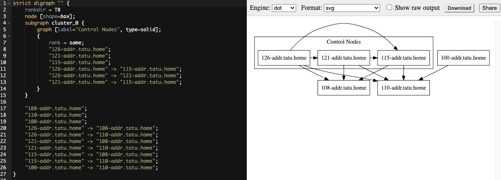

.. _upgrade_venv:

Upgrading to Execution Environments
===================================

.. index::
    single: execution environment
    pair: Ansible; executing in a execution environment
    pair: build; execution environments

Refer to :ref:`ag_restart_awx` in the |ata| and :ref:`ug_execution_environments` in the |atu| for detail.

.. Important::

    When upgrading, it is highly recommended to always rebuild on top of the base |ee| that corresponds to the AWX version you are using. See :ref:`ug_build_ees` for more information.

.. _mesh_topology_ee:

View mesh topology
------------------
.. index::
   single: mesh
   pair: mesh; graph
   pair: execution environments; mesh

If you configured a :term:`mesh` topology, the installer can graphically validate your mesh configuration through a generated graph rendering tool. The graph is generated by reading the contents of the inventory file.

Any given inventory file must include some sort of execution capacity that is governed by at least one control :term:`node`. That is, it is unacceptable to produce an inventory file that only contains control-only nodes, execution-only nodes or hop-only nodes. There is a tightly coupled relationship between control and execution nodes that must be respected at all times. The installer will fail if the inventory files aren't properly defined. The only exception to this rule would be a single hybrid node, as it will satisfy the control and execution constraints.

In order to run jobs on an execution node, either the installer needs to pre-register the node, or user needs to make a PATCH request to ``/api/v2/instances/N/`` to change the enabled field to true.

If you have already deployed a mesh topology and want to view node type, node health, and specific details about each node, see :ref:`ag_topology_viewer` in the |ata|. 
