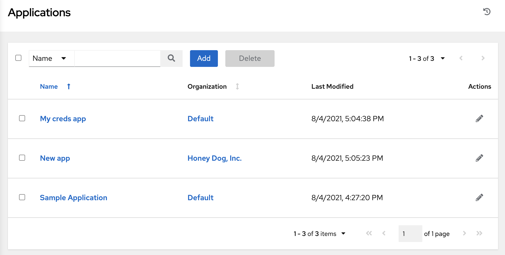
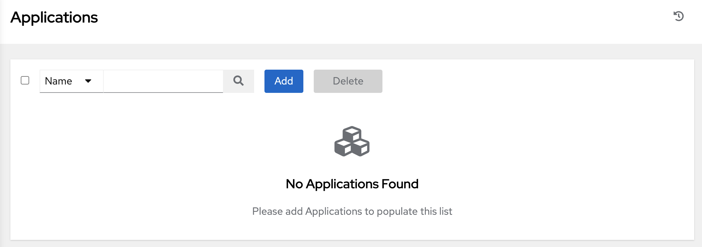
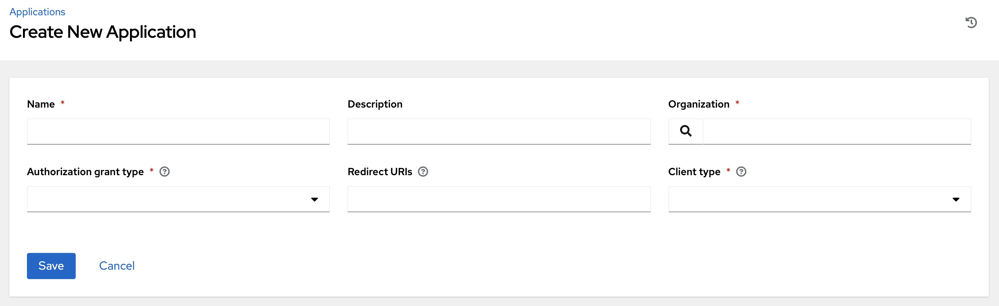
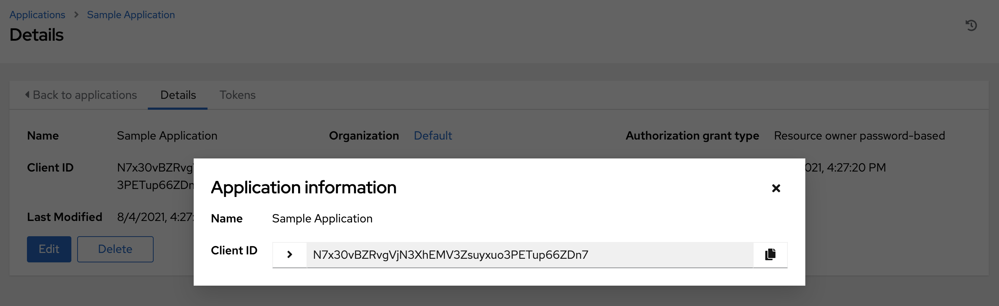
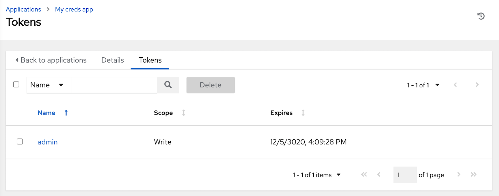
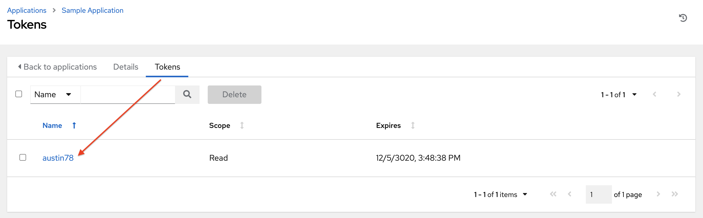

.. _ug_applications_auth:

Applications
=====================

.. index::
    single: token authentication
    single: authentication
    pair: applications; authentication
    pair: applications; tokens

Creating and configuring token-based authentication for external applications makes it easier for external applications such as ServiceNow and Jenkins to integrate with AWX. OAuth 2 allows you to use tokens to share certain data with an application without disclosing login information, and furthermore, these tokens can be scoped as "read-only".  You create an application that is representative of the external application you are integrating with, then use it to create tokens for that application to use on behalf of the users of the external application.  

Having these tokens associated to an application resource gives you the ability to manage all tokens issued for a particular application more easily. By separating token issuance under Applications, you can revoke all tokens based on the Application without having to revoke all tokens in the system.

When integrating an external web app with AWX that web app may need to create OAuth2 Tokens on behalf of users in that other web app. Creating an application with the Authorization Code grant type is the preferred way to do this because:

- external applications can obtain a token for users, using their credentials
- compartmentalized tokens issued for a particular application, allows those tokens to be easily managed (revoke all tokens associated with that application, for example)

Getting Started with Applications
-----------------------------------

.. index:: 
   pair: applications; getting started

Access the Applications page by clicking **Applications** from the left navigation bar. The Applications page displays a search-able list of all available Applications currently managed by AWX and can be sorted by **Name**.

|Applications - home with example apps|

If no other applications exist, only a gray box with a message to add applications displays.

.. _ug_applications_auth_create:

Create a new application
------------------------------

.. index::
    pair: applications; create
    pair: applications; adding new

Token-based authentication for users can be configured in the Applications window.  

1. In the AWX User Interface, click **Applications** from the left navigation bar. 

The Applications window opens. 

2. Click the **Add** button located in the upper right corner of the Applications window.

The New Application window opens.

|Create application|

3. Enter the following details in **Create New Application** window:

- **Name** (required): provide a name for the application you want to create
- **Description**: optionally provide a short description for your application
- **Organization** (required): provide an organization for which this application is associated
- **Authorization Grant Type** (required): Select from one of the grant types to use in order for the user to acquire tokens for this application. Refer to :ref:`grant types <ag_oauth2_token_auth_grant_types>` in the Applications section of the |ata|.
- **Redirect URIS**: Provide a list of allowed URIs, separated by spaces. This is required if you specified the grant type to be **Authorization code**.
- **Client Type** (required): Select the level of security of the client device

4. When done, click **Save** or **Cancel** to abandon your changes. Upon saving, the client ID displays in a pop-up window.

Applications - Tokens
~~~~~~~~~~~~~~~~~~~~~~~~~~~~

.. index::
    pair: applications; tokens
    pair: applications; adding tokens

Selecting the **Tokens** view displays a list of the users that have tokens to access the application. 

|Applications - tokens list|

Tokens can only access resources that its associated user can access, and can be limited further by specifying the scope of the token.

.. _ug_tokens_auth_create:

Add Tokens
^^^^^^^^^^^^^^^^^^^^^^

Tokens are added through the Users screen and can be associated with an application at that time. Specifying an application can be performed directly in the User's token settings. You can create a token for *your* user in the Tokens configuration tab, meaning only you can create and see your tokens in your own user screen. To add a token:

1. Access the Users list view by clicking **Users** from the left navigation bar then click on your user to configure your OAuth 2 tokens.

.. note::

		You can only create OAuth 2 Tokens for your user via the API or UI, which means you can only access your own user profile in order to configure or view your tokens. If you are an admin and need to create or remove tokens for other users, see the revoke and create commands in the :ref:`Token and session management <ag_token_utility>` section of the |ata|. 

.. include:: ../common/add-token.rst

To verify the application in the example above now shows the user with the appropriate token, go to the **Tokens** tab of the Applications window:

