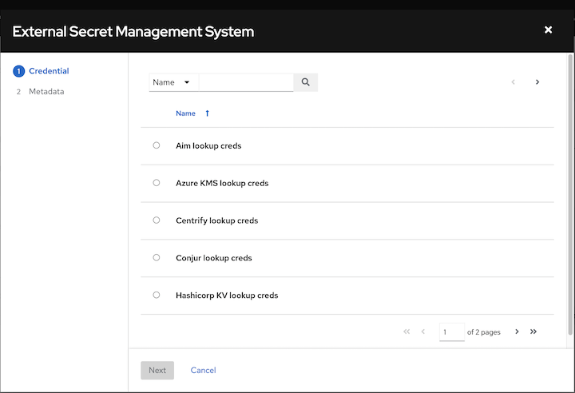
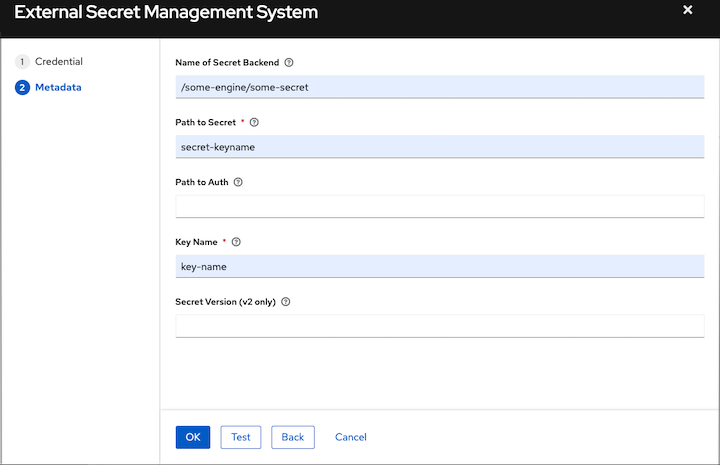
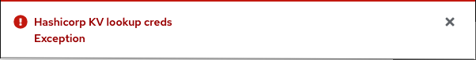
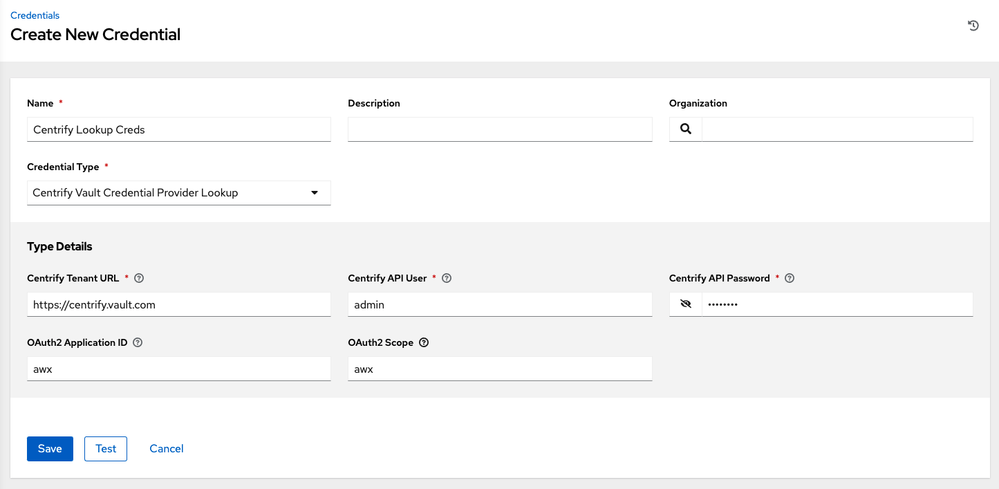
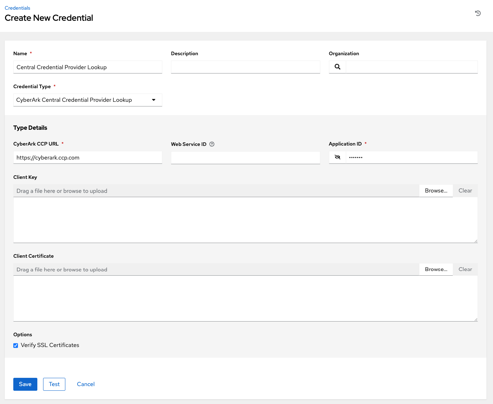
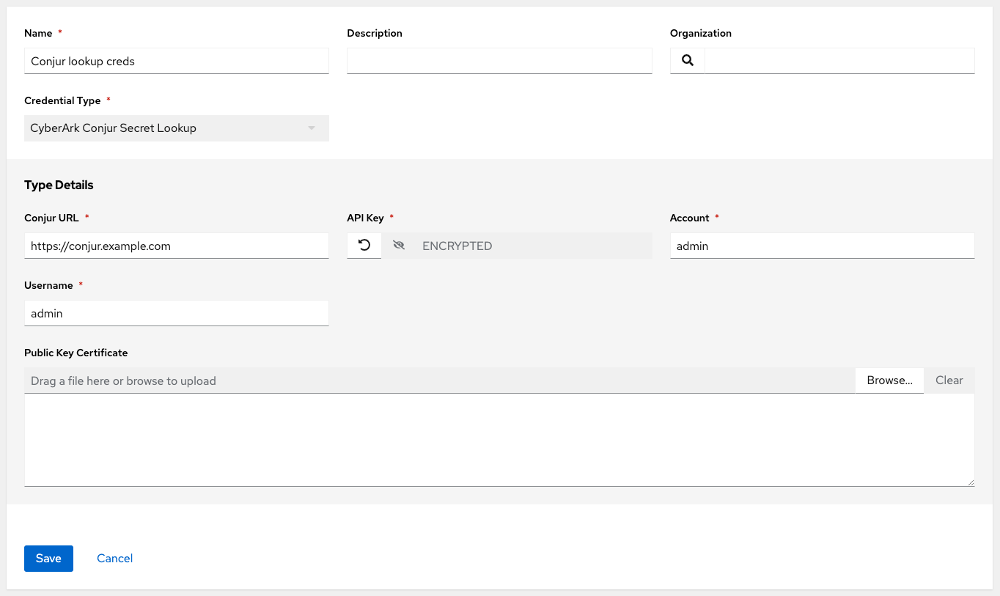
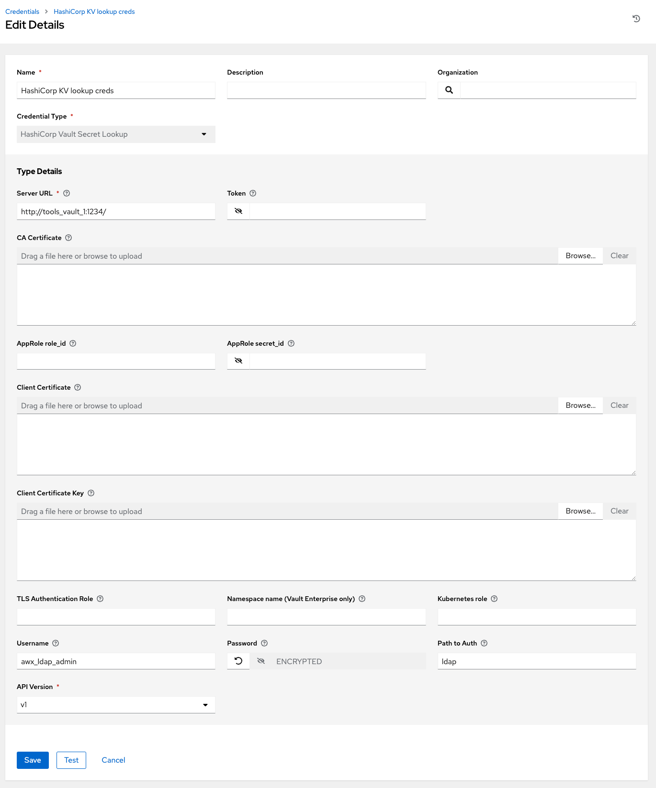
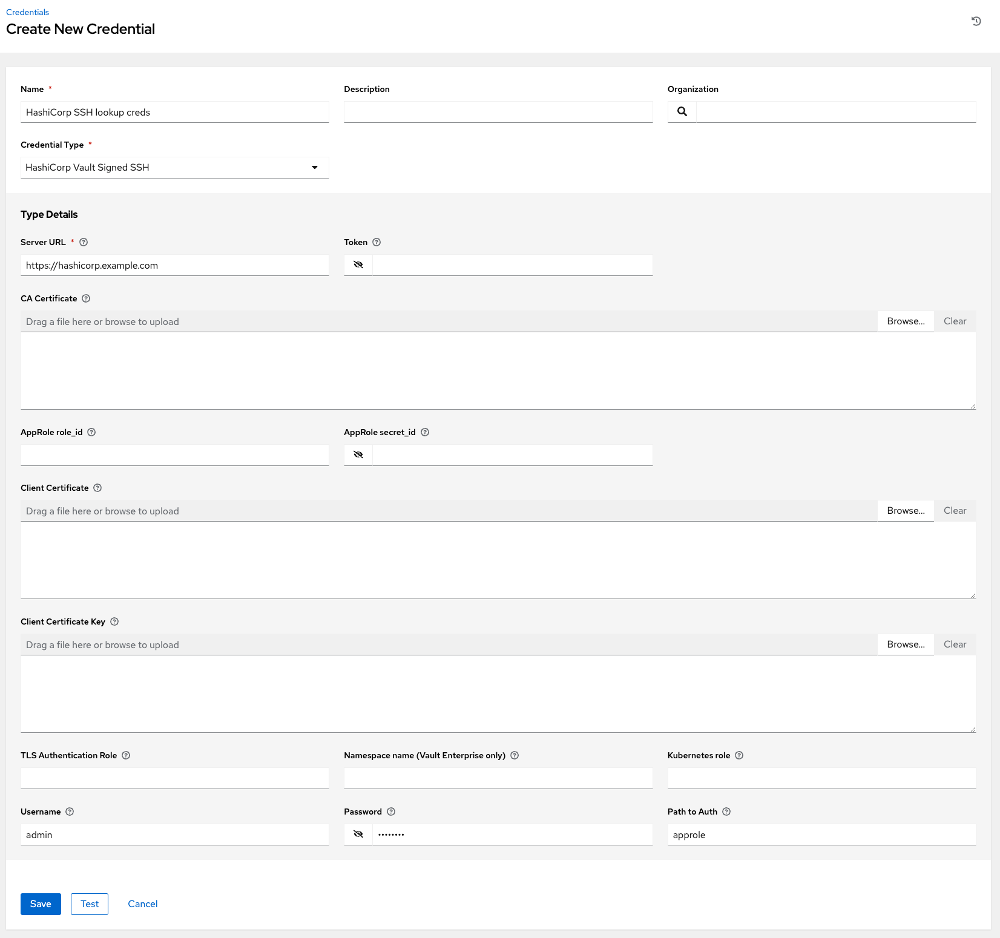
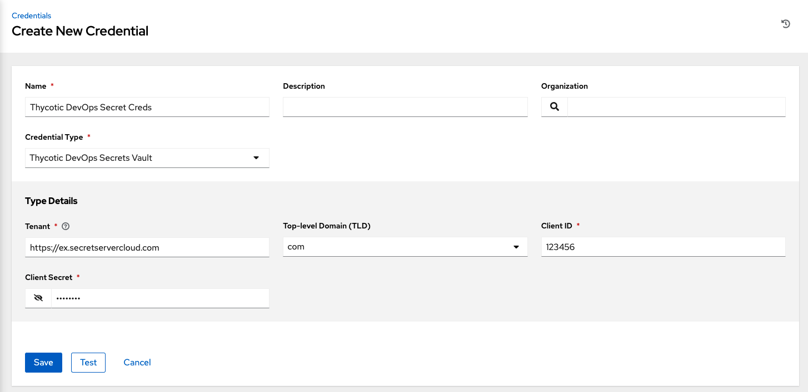
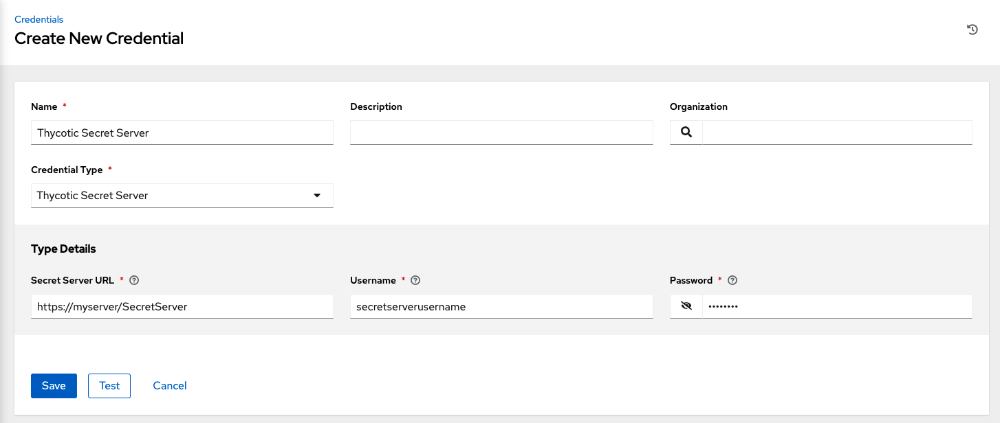

.. _ug_credential_plugins:

Secret Management System
=============================

.. index::
   single: credentials
   pair: credential; plugins
   pair: secret management; credential
   
Users and admins upload machine and cloud credentials so that automation can access machines and external services on their behalf. By default, sensitive credential values (such as SSH passwords, SSH private keys, API tokens for cloud services) are stored in the database after being encrypted. With external credentials backed by credential plugins, you can map credential fields (like a password or an SSH Private key) to values stored in a :term:`secret management system` instead of providing them to AWX directly. AWX provides a secret management system that include integrations for:

- Centrify Vault Credential Provider Lookup
- CyberArk Central Credential Provider Lookup (CCP)
- CyberArk Conjur Secrets Manager Lookup
- HashiCorp Vault Key-Value Store (KV)
- HashiCorp Vault SSH Secrets Engine
- Microsoft Azure Key Management System (KMS)
- Thycotic DevOps Secrets Vault
- Thycotic Secret Server

These external secret values will be fetched prior to running a playbook that needs them. For more information on specifying these credentials in the User Interface, see :ref:`ug_credentials`.

Configure and link secret lookups
-----------------------------------

When configuring AWX to pull a secret from a 3rd-party system, it is in essence linking credential fields to external systems. To link a credential field to a value stored in an external system, select the external credential corresponding to that system and provide :term:`metadata` to look up the desired value. The metadata input fields are part of the :term:`external credential type` definition of the :term:`source credential`. 

AWX provides a :term:`credential plugin` interface for developers, integrators, admins, and power-users with the ability to add new external credential types to extend it to support other secret management systems. For more detail, see the `development docs for credential plugins`_.

.. _`development docs for credential plugins`: https://github.com/ansible/awx/blob/devel/docs/credentials/credential_plugins.md

Use the AWX User Interface to configure and use each of the supported 3-party secret management systems. 

1. First, create an external credential for authenticating with the secret management system. At minimum, provide a name for the external credential and select one of the following for the **Credential Type**:

.. contents::
    :local:

2. Navigate to the credential form of the target credential and link one or more input fields to the external credential along with metadata for locating the secret in the external system. In this example, the *Demo Credential* is the target credential.

.. _ag_credential_plugins_link_step:

3. For any of the fields below the **Type Details** area that you want to link to the external credential, click the |key| button of the input field. You are prompted to set the input source to use to retrieve your secret information.

4. Select the credential you want to link to, and click **Next**. This takes you to the **Metadata** tab of the input source. This example shows the Metadata prompt for HashiVault Secret Lookup. Metadata is specific to the input source you select. See the :ref:`ug_metadata_creds_inputs` table for details.

5. Click **Test** to verify connection to the secret management system. If the lookup is unsuccessful, an error message like this one displays:

   
6. When done, click **OK**. This closes the prompt window and returns you to the Details screen of your target credential. **Repeat these steps**, starting with :ref:`step 3 above <ag_credential_plugins_link_step>` to complete the remaining input fields for the target credential. By linking the information in this manner, AWX retrieves sensitive information, such as username, password, keys, certificates, and tokens from the 3rd-party management systems and populates that data into the remaining fields of the target credential form.

7. If necessary, supply any information manually for those fields that do not use linking as a way of retrieving sensitive information. Refer to the appropriate :ref:`ug_credentials_cred_types` for more detail about each of the fields.

8. Click **Save** when done.

.. _ug_metadata_creds_inputs:

Metadata for credential input sources
^^^^^^^^^^^^^^^^^^^^^^^^^^^^^^^^^^^^^

**Centrify Vault Credential Provider Lookup**

.. list-table::
   :widths: 25 50
   :header-rows: 1

   * - Metadata
     - Description
   * - Account Name (Required)
     - Name of the system account or domain associated with Centrify Vault.
   * - System Name
     - Specify the name used by the Centrify portal.

**CyberArk Central Credential Provider Lookup**

.. list-table::
   :widths: 25 50
   :header-rows: 1

   * - Metadata
     - Description
   * - Object Query (Required)
     - Lookup query for the object.
   * - Object Query Format
     - Select ``Exact`` for a specific secret name, or ``Regexp`` for a secret that has a dynamically generated name.
   * - Object Property
     - Specifies the name of the property to return (e.g., ``UserName``, ``Address``, etc.) other than the default of ``Content``.
   * - Reason
     - If required per the object's policy, supply a reason for checking out the secret, as CyberArk logs those.

**CyberArk Conjur Secrets Lookup**

.. list-table::
   :widths: 25 50
   :header-rows: 1

   * - Metadata
     - Description
   * - Secret Identifier
     - The identifier for the secret.
   * - Secret Version
     - Specify a version of the secret, if necessary, otherwise, leave it empty to use the latest version.

**HashiVault Secret Lookup**

.. list-table::
   :widths: 25 50
   :header-rows: 1

   * - Metadata
     - Description
   * - Name of Secret Backend
     - Specify the name of the KV backend to use. Leave it blank to use the first path segment of the **Path to Secret** field instead.
   * - Path to Secret (required)
     - Specify the path to where the secret information is stored; for example, ``/path/username``.
   * - Key Name (required)
     - Specify the name of the key to look up the secret information.
   * - Secret Version (V2 Only)
     - Specify a version if necessary, otherwise, leave it empty to use the latest version.

**HashiCorp Signed SSH**

.. list-table::
   :widths: 25 50
   :header-rows: 1

   * - Metadata
     - Description
   * - Unsigned Public Key (required)
     - Specify the public key of the cert you want to get signed. It needs to be present in the authorized keys file of the target host(s).
   * - Path to Secret (required)
     - Specify the path to where the secret information is stored; for example, ``/path/username``.
   * - Role Name (required)
     - A role is a collection of SSH settings and parameters that are stored in Hashi vault. Typically, you can specify a couple of them with different privileges, timeouts, etc. So you could have a role that is allowed to get a cert signed for root, and other less privileged ones, for example.
   * - Valid Principals
     - Specify a user (or users) other than the default, that you are requesting vault to authorize the cert for the stored key. Hashi vault has a default user for whom it signs (e.g., ec2-user).

**Azure KMS**

.. list-table::
   :widths: 25 50
   :header-rows: 1

   * - Metadata
     - Description
   * - Secret Name (required)
     - The actual name of the secret as it is referenced in Azure's Key vault app.
   * - Secret Version
     - Specify a version of the secret, if necessary, otherwise, leave it empty to use the latest version.

**Thycotic DevOps Secrets Vault**

.. list-table::
   :widths: 25 50
   :header-rows: 1

   * - Metadata
     - Description
   * - Secret Path (required)
     - Specify the path to where the secret information is stored (e.g., /path/username).

**Thycotic Secret Server**

.. list-table::
   :widths: 25 50
   :header-rows: 1

   * - Metadata
     - Description
   * - Secret ID (required)
     - The identifier for the secret.
   * - Secret Field
     - Specify the field to be used from the secret.

.. _ug_credentials_centrify:

Centrify Vault Credential Provider Lookup
^^^^^^^^^^^^^^^^^^^^^^^^^^^^^^^^^^^^^^^^^^
.. index::
   pair: credential types; Centrify

You need the Centrify Vault web service running to store secrets in order for this integration to work. When **Centrify Vault Credential Provider Lookup** is selected for **Credential Type**, provide the following metadata to properly configure your lookup:

- **Centrify Tenant URL** (required): provide the URL used for communicating with Centrify's secret management system
- **Centrify API User** (required): provide the username
- **Centrify API Password** (required): provide the password
- **OAuth2 Application ID** : specify the identifier given associated with the OAuth2 client
- **OAuth2 Scope** : specify the scope of the OAuth2 client

Below shows an example of a configured CyberArk AIM credential.

.. _ug_credentials_cyberarkccp:

CyberArk Central Credential Provider (CCP) Lookup
^^^^^^^^^^^^^^^^^^^^^^^^^^^^^^^^^^^^^^^^^^^^^^^^^^^^
.. index::
   single: CyberArk CCP
   pair: credential; CyberArk CCP

You need the CyberArk Central Credential Provider web service running to store secrets in order for this integration to work. When **CyberArk Central Credential Provider Lookup** is selected for **Credential Type**, provide the following metadata to properly configure your lookup:

- **CyberArk CCP URL** (required): provide the URL used for communicating with CyberArk CCP's secret management system; must include URL scheme (http, https, etc.)
- **Web Service ID**: optionally specify the identifier for the web service; leaving it blank defaults to AIMWebService
- **Application ID** (required): specify the identifier given by CyberArk CCP services
- **Client Key**: paste the client key if provided by CyberArk
- **Client Certificate**: include the ``BEGIN CERTIFICATE`` and ``END CERTIFICATE`` lines when pasting the certificate, if provided by CyberArk
- **Verify SSL Certificates**: this option is only available when the URL uses HTTPS. Check this option to verify the server’s SSL certificate is valid and trusted. Environments that use internal or private CA's should leave this option unchecked to disable verification.

Below shows an example of a configured CyberArk CCP credential.

.. _ug_credentials_cyberarkconjur:

CyberArk Conjur Secrets Manager Lookup
^^^^^^^^^^^^^^^^^^^^^^^^^^^^^^^^^^^^^^^
.. index::
   single: CyberArk Conjur
   pair: credential; CyberArk Conjur

With a Conjur Cloud tenant available to target, configure the CyberArk Conjur Secrets Lookup external management system credential plugin as documented.

When **CyberArk Conjur Secrets Manager Lookup** is selected for **Credential Type**, provide the following metadata to properly configure your lookup:

- **Conjur URL** (required): provide the URL used for communicating with CyberArk Conjur's secret management system; must include URL scheme (http, https, etc.)
- **API Key** (required): provide the key given by your Conjur admin
- **Account** (required): the organization's account name
- **Username** (required): the specific authenticated user for this service
- **Public Key Certificate**: include the ``BEGIN CERTIFICATE`` and ``END CERTIFICATE`` lines when pasting the public key, if provided by CyberArk

Below shows an example of a configured CyberArk Conjur credential.

.. _ug_credentials_hashivault:

HashiCorp Vault Secret Lookup
^^^^^^^^^^^^^^^^^^^^^^^^^^^^^^^
.. index::
   single: HashiCorp Secret Lookup
   pair: credential; HashiCorp KV

When **HashiCorp Vault Secret Lookup** is selected for **Credential Type**, provide the following metadata to properly configure your lookup:

- **Server URL** (required): provide the URL used for communicating with HashiCorp Vault's secret management system
- **Token**: specify the access token used to authenticate HashiCorp's server
- **CA Certificate**: specify the CA certificate used to verify HashiCorp's server
- **Approle Role_ID**: specify the ID for Approle authentication
- **Approle Secret_ID**: specify the corresponding secret ID for Approle authentication
- **Client Certificate**: specify a PEM-encoded client certificate when using the TLS auth method including any required intermediate certificates expected by Vault
- **Client Certificate Key**: specify a PEM-encoded certificate private key when using the TLS auth method
- **TLS Authentication Role**: specify the role or certificate name in Vault that corresponds to your client certificate when using the TLS auth method. If it is not provided, Vault will attempt to match the certificate automatically
- **Namespace name** specify the namespace name (Vault Enterprise only)
- **Kubernetes role** specify the role name when using Kubernetes authentication
- **Path to Auth**: specify a path if other than the default path of ``/approle``
- **API Version** (required): select v1 for static lookups and v2 for versioned lookups
- **Username and Password**: specify the username and password for the user account

For more detail about the Approle auth method and its fields, refer to the `Vault documentation for Approle Auth Method <https://www.vaultproject.io/docs/auth/approle>`_.

For more detail about the Userpass auth method and its fields, refer to the `Vault documentation for LDAP auth method <https://www.vaultproject.io/docs/auth/userpass>`_.

For more detail about the Kubernetes auth method and its fields, refer to the `Vault documentation for Kubernetes auth method <https://developer.hashicorp.com/vault/docs/auth/kubernetes>` _.

For more detail about the TLS certificate auth method and its fields, refer to the `Vault documentation for TLS certificates auth method <https://developer.hashicorp.com/vault/docs/auth/cert>` _.

Below shows an example of a configured HashiCorp Vault Secret Lookup credential.

.. _ug_credentials_hashivaultssh:

HashiCorp Vault Signed SSH
^^^^^^^^^^^^^^^^^^^^^^^^^^^^^^
.. index::
   single: HashiCorp SSH Secrets Engine
   pair: credential; HashiCorp SSH Secrets Engine

When **HashiCorp Vault Signed SSH** is selected for **Credential Type**, provide the following metadata to properly configure your lookup:

- **Server URL** (required): provide the URL used for communicating with HashiCorp Signed SSH's secret management system
- **Token**: specify the access token used to authenticate HashiCorp's server
- **CA Certificate**: specify the CA certificate used to verify HashiCorp's server
- **Approle Role_ID**: specify the ID for Approle authentication
- **Approle Secret_ID**: specify the corresponding secret ID for Approle authentication
- **Client Certificate**: specify a PEM-encoded client certificate when using the TLS auth method including any required intermediate certificates expected by Vault
- **Client Certificate Key**: specify a PEM-encoded certificate private key when using the TLS auth method
- **TLS Authentication Role**: specify the role or certificate name in Vault that corresponds to your client certificate when using the TLS auth method. If it is not provided, Vault will attempt to match the certificate automatically
- **Namespace name** specify the namespace name (Vault Enterprise only)
- **Kubernetes role** specify the role name when using Kubernetes authentication
- **Path to Auth**: specify a path if other than the default path of ``/approle``

For more detail about the Approle auth method and its fields, refer to the `Vault documentation for Approle Auth Method <https://www.vaultproject.io/docs/auth/approle>`_.

For more detail about the Kubernetes auth method and its fields, refer to the `Vault documentation for Kubernetes auth method <https://developer.hashicorp.com/vault/docs/auth/kubernetes>` _.

For more detail about the TLS certificate auth method and its fields, refer to the `Vault documentation for TLS certificates auth method <https://developer.hashicorp.com/vault/docs/auth/cert>` _.

Below shows an example of a configured HashiCorp SSH Secrets Engine credential.

.. _ug_credentials_azurekeyvault:

Microsoft Azure Key Vault
^^^^^^^^^^^^^^^^^^^^^^^^^^^
.. index::
   single: MS Azure KMS
   pair: credential; MS Azure KMS
   triple: credential; Azure; KMS

When **Microsoft Azure Key Vault** is selected for **Credential Type**, provide the following metadata to properly configure your lookup:

- **Vault URL (DNS Name)** (required): provide the URL used for communicating with MS Azure's key management system
- **Client ID** (required): provide the identifier as obtained by the Azure Active Directory
- **Client Secret** (required): provide the secret as obtained by the Azure Active Directory
- **Tenant ID** (required): provide the unique identifier that is associated with an Azure Active Directory instance within an Azure subscription
- **Cloud Environment**: select the applicable cloud environment to apply

Below shows an example of a configured Microsoft Azure KMS credential.

.. image:: ../common/images/credentials-create-azure-kms-credential.png
   :alt: Example new Microsoft Azure Key Vault credential lookup dialog

.. _ug_credentials_thycoticvault:

Thycotic DevOps Secrets Vault
^^^^^^^^^^^^^^^^^^^^^^^^^^^^^^^
.. index::
   single: Thycotic DevOps Secrets Vault
   pair: credential; Thycotic DevOps Secrets Vault

When **Thycotic DevOps Secrets Vault** is selected for **Credential Type**, provide the following metadata to properly configure your lookup:

- **Tenant** (required): provide the URL used for communicating with Thycotic's secret management system
- **Top-level Domain (TLD)** : provide the top-level domain designation (e.g., com, edu, org) associated with the secret vault you want to integrate
- **Client ID** (required): provide the identifier as obtained by the Thycotic secret management system
- **Client Secret** (required): provide the secret as obtained by the Thycotic secret management system

Below shows an example of a configured Thycotic DevOps Secrets Vault credential.

.. _ug_credentials_thycoticserver:

Thycotic Secret Server
^^^^^^^^^^^^^^^^^^^^^^^^
.. index::
   single: Thycotic Secret Server
   pair: credential; Thycotic Secret Server

When **Thycotic Secrets Server** is selected for **Credential Type**, provide the following metadata to properly configure your lookup:

- **Secret Server URL** (required): provide the URL used for communicating with the Thycotic Secrets Server management system
- **Username** (required): specify the authenticated user for this service
- **Password** (required): provide the password associated with the user

Below shows an example of a configured Thycotic Secret Server credential.

