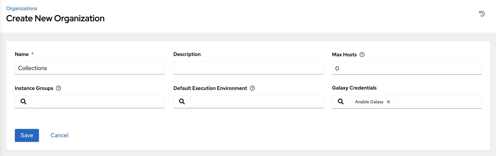
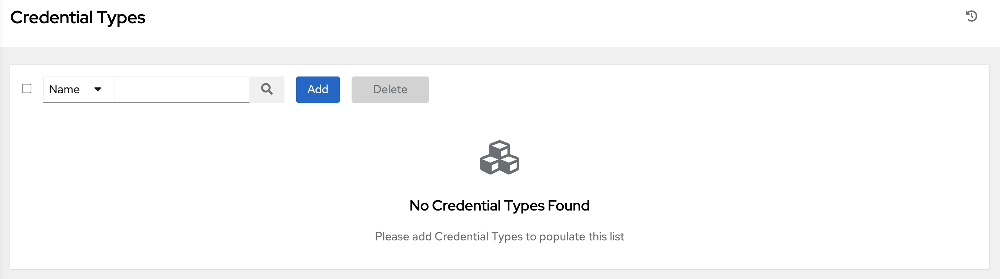
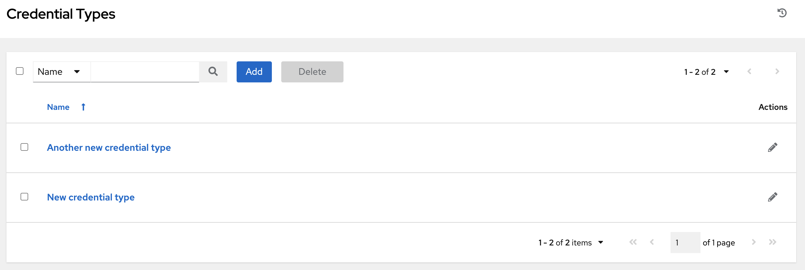
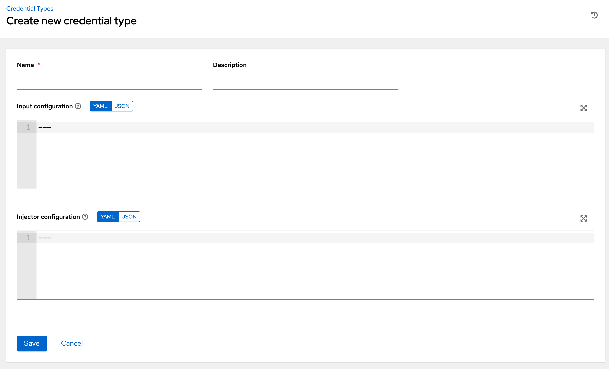
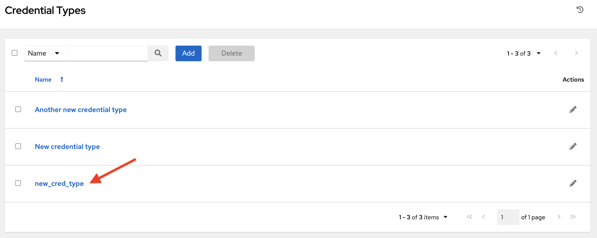
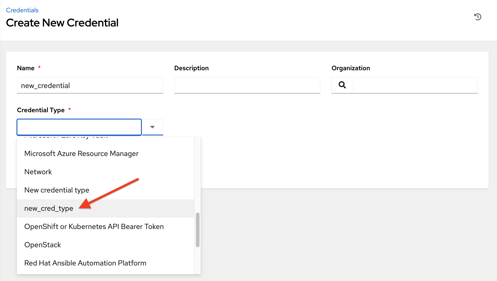

.. _ug_credential_types:

Custom Credential Types
==========================

.. index:: 
   single: credential types

As an administrator with superuser access, you can define a custom credential type in a standard format using a YAML/JSON-like definition, allowing the assignment of new credential types to jobs and inventory updates. This allows you to define a custom credential type that works in ways similar to existing credential types. For example, you could create a custom credential type that injects an API token for a third-party web service into an environment variable, which your playbook or custom inventory script could consume. 

Custom credentials support the following ways of injecting their authentication information:

- Environment variables
- Ansible extra variables
- File-based templating (i.e., generating ``.ini`` or ``.conf`` files that contain credential values)

You can attach one SSH and multiple cloud credentials to a Job Template. Each cloud credential must be of a different type. In other words, only one AWS credential, one GCE credential, etc., are allowed. Vault credentials and machine credentials are separate entities.

.. note::

    When creating a new credential type, you are responsible for avoiding collisions in the ``extra_vars``, ``env``, and file namespaces. Also, avoid environment variable or extra variable names that start with ``ANSIBLE_`` because they are reserved. You must have Superuser permissions to be able to create and edit a credential type (``CredentialType``) and to be able to view the ``CredentialType.injection`` field.

Content sourcing from collections
-----------------------------------

A "managed" credential type of ``kind=galaxy`` represents a content source for fetching collections defined in ``requirements.yml`` when project updates are run (e.g., galaxy.ansible.com, cloud.redhat.com, on-premise Automation Hub). This new type will represent a URL and (optional) authentication details necessary to construct the environment variables when a project update runs ``ansible-galaxy collection install`` as described in the Ansible documentation, `Configuring the ansible-galaxy client <https://docs.ansible.com/ansible/latest/user_guide/collections_using.html#configuring-the-ansible-galaxy-client>`_. It has fields which map directly to the configuration options exposed to the Ansible Galaxy CLI, e.g., per-server. An endpoint in the API reflects an ordered list of these credentials at the Organization level:

::
    
    /api/v2/organizations/N/galaxy_credentials/

Installations of AWX migrates existing Galaxy-oriented setting values in such a way that post-upgrade, proper credentials are created and attached to every Organization. After upgrading to the latest version, every organization that existed prior to upgrade now has a list of (one or more) "Galaxy" credentials associated with it.

Additionally, post-upgrade, these settings are not be visible (or editable) from the ``/api/v2/settings/jobs/`` endpoint.

AWX should still continue to fetch roles directly from public Galaxy even if galaxy.ansible.com is not the first credential in the list for the Organization. The global "Galaxy" settings are no longer configured at the jobs level, but at the Organization level in the User Interface. The Organization's Add and Edit windows have an optional **Credential** lookup field for credentials of ``kind=galaxy``. 

It is very important to specify the order of these credentials as order sets precedence for the sync and lookup of the content.
For more information, see :ref:`ug_organizations_create`.
For detail on how to set up a project using collections, see :ref:`ug_collections_usage`. 

Backwards-Compatible API Considerations
-----------------------------------------

.. index:: 
    pair: credential types; API considerations

Support for version 2 of the API (``api/v2/``) means a one-to-many relationship for Job Templates to credentials (including multi-cloud support). Credentials can be filtered using the v2 API:

::
    
    $ curl "https://awx.example.org/api/v2/credentials/?credential_type__namespace=aws"

In the V2 CredentialType model, the relationships are defined as follows:

+----------+--------------------------------------------------------------+
| Machine  | SSH                                                          |
+----------+--------------------------------------------------------------+
| Vault    | Vault                                                        |
+----------+--------------------------------------------------------------+
| Network  | Sets environment variables (e.g., ``ANSIBLE_NET_AUTHORIZE``) |
+----------+--------------------------------------------------------------+
| SCM      | Source Control                                               |
+----------+--------------------------------------------------------------+
| Cloud    | EC2, AWS                                                     |
+----------+--------------------------------------------------------------+
|          | Lots of others                                               |
+----------+--------------------------------------------------------------+
| Insights | Insights                                                     |
+----------+--------------------------------------------------------------+
| Galaxy   | galaxy.ansible.com, cloud.redhat.com                         |
+----------+--------------------------------------------------------------+
|          | on-premise Automation Hub                                    |
+----------+--------------------------------------------------------------+

.. _ug_content_verification:

Content verification
---------------------

AWX uses GNU Privacy Guard (GPG) to verify content. For more information, refer to `The GNU Privacy Handbook <https://www.gnupg.org/gph/en/manual/c14.html#:~:text=GnuPG%20uses%20public%2Dkey%20cryptography,the%20user%20wants%20to%20communicate>`_.

Getting Started with Credential Types
---------------------------------------

.. index:: 
   pair: credentials; getting started

Access the Credentials from clicking **Credential Types** from the left navigation bar. If no custom credential types have been created, the Credential Types view will not have any to display and will prompt you to add one:

|Credential Types - home empty|

If credential types have been created, this page displays a list of all existing and available Credential Types. 

|Credential Types - home with example credential types|

To view more information about a credential type, click on its name or the Edit (|edit|) button from the **Actions** column.

.. |edit| image:: ../common/images/edit-button.png
    :alt: Edit button

Each credential type displays its own unique configurations in the **Input Configuration** field and the **Injector Configuration** field, if applicable. Both YAML and JSON formats are supported in the configuration fields. 

Create a New Credential Type
--------------------------------

.. index:: 
   pair: credential types; creating new

To create a new credential type:   

1. Click the **Add** button in the **Credential Types** screen.

|Create new credential type|

2. Enter the appropriate details in the **Name** and **Description** field.

.. note::

    When creating a new credential type, do not use reserved variable names that start with ``ANSIBLE_`` for the **INPUT** and **INJECTOR** names and IDs, as they are invalid for custom credential types. 

3. In the **Input Configuration** field, specify an input schema which defines a set of ordered fields for that type. The format can be in YAML or JSON, as shown:

  **YAML**

  .. code-block:: yaml

     fields:
       - type: string
         id: username
         label: Username
       - type: string
         id: password
         label: Password
         secret: true
     required:
       - username
       - password

  **JSON**

  .. code-block:: json

     {
     "fields": [
       {
       "type": "string",
       "id": "username",
       "label": "Username"
       },
       {
       "secret": true,
       "type": "string",
       "id": "password",
       "label": "Password"
        }
       ],
      "required": ["username", "password"]
     }

  The configuration in JSON format below show each field and how they are used:

  .. code-block:: text

     {
       "fields": [{
         "id": "api_token",               # required - a unique name used to
                                          # reference the field value

         "label": "API Token",            # required - a unique label for the
                                          # field

         "help_text": "User-facing short text describing the field.",

         "type": ("string" | "boolean")   # defaults to 'string'

         "choices": ["A", "B", "C"]       # (only applicable to `type=string`)

         "format": "ssh_private_key"      # optional, can be used to enforce data
                                          # format validity for SSH private key
                                          # data (only applicable to `type=string`)

         "secret": true,                  # if true, the field value will be encrypted

         "multiline": false               # if true, the field should be rendered
                                          # as multi-line for input entry
                                          # (only applicable to `type=string`)
     },{
         # field 2...
     },{
         # field 3...
     }],

     "required": ["api_token"]            # optional; one or more fields can be marked as required
     },

When ``type=string``, fields can optionally specify multiple choice options:

  .. code-block:: text

     {
       "fields": [{
           "id": "api_token",          # required - a unique name used to reference the field value
           "label": "API Token",       # required - a unique label for the field
           "type": "string",
           "choices": ["A", "B", "C"]
       }]
     },

4. In the **Injector Configuration** field, enter environment variables or extra variables that specify the values a credential type can inject. The format can be in YAML or JSON (see examples in the previous step). The configuration in JSON format below show each field and how they are used: 

.. code-block:: json

  {
    "file": {
        "template": "[mycloud]\ntoken={{ api_token }}"
    },
    "env": {
        "THIRD_PARTY_CLOUD_API_TOKEN": "{{ api_token }}"
    },
    "extra_vars": {
        "some_extra_var": "{{ username }}:{{ password }}"
    }
  }

Credential Types can also generate temporary files to support .ini files or certificate/key data:

.. code-block:: json

  {
    "file": {
        "template": "[mycloud]\ntoken={{ api_token }}"
    },
    "env": {
        "MY_CLOUD_INI_FILE": "{{ awx.filename }}"
    }
  }

In this example, AWX will write a temporary file that contains:

.. code-block:: text

  [mycloud]\ntoken=SOME_TOKEN_VALUE

The absolute file path to the generated file will be stored in an environment variable named ``MY_CLOUD_INI_FILE``.

An example of referencing multiple files in a custom credential template is as follows:

**Inputs**

.. code-block:: json

  {
    "fields": [{
      "id": "cert",
      "label": "Certificate",
      "type": "string"
    },{
      "id": "key",
      "label": "Key",
      "type": "string"
    }]
  }

**Injectors**

.. code-block:: json

    {
      "file": {
        "template.cert_file": "[mycert]\n{{ cert }}",
        "template.key_file": "[mykey]\n{{ key }}"
    },
    "env": {
        "MY_CERT_INI_FILE": "{{ awx.filename.cert_file }}",
        "MY_KEY_INI_FILE": "{{ awx.filename.key_file }}"
    }
  }

5. Click **Save** when done.

6. Scroll down to the bottom of the screen and your newly created credential type appears on the list of credential types:

|New credential type|

Click |edit| to modify the credential type options under the Actions column.

.. note::
  
  In the Edit screen, you can modify the details or delete the credential. If the **Delete** button is grayed out, it is indication that the credential type that is being used by a credential, and you must delete the credential type from all the credentials that use it before you can delete it. Below is an example of such a message:

  .. image:: ../common/images/credential-types-delete-confirmation.png
    :alt: Credential type delete confirmation

7. Verify that the newly created credential type can be selected from the **Credential Type** selection window when creating a new credential:

|Verify new credential type|

For details on how to create a new credential, see :ref:`ug_credentials`.
