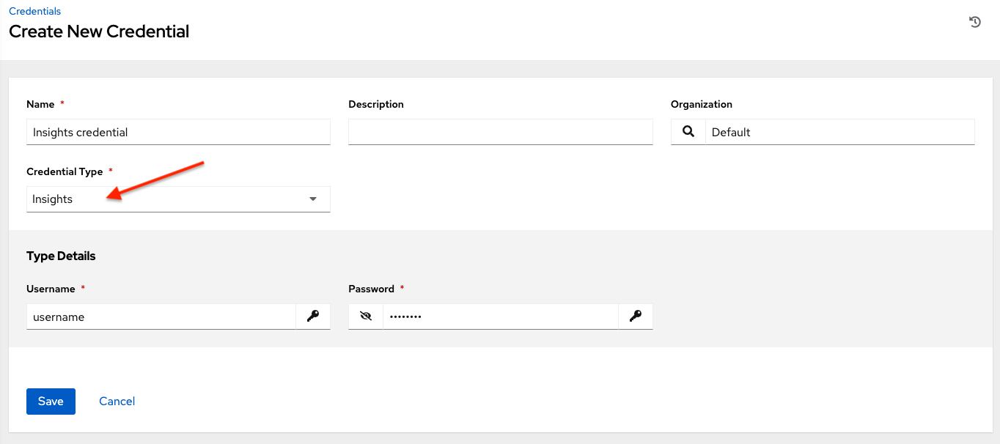
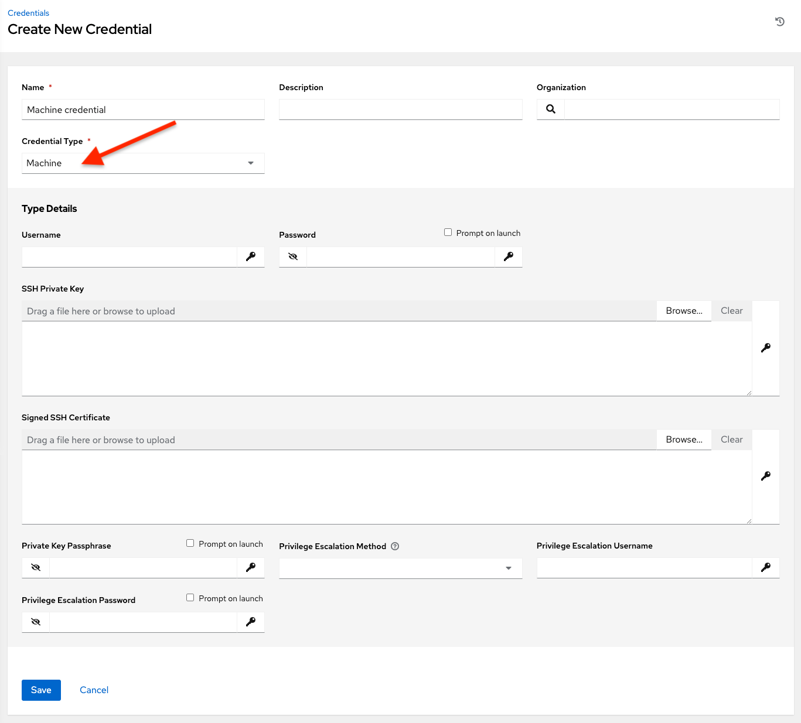
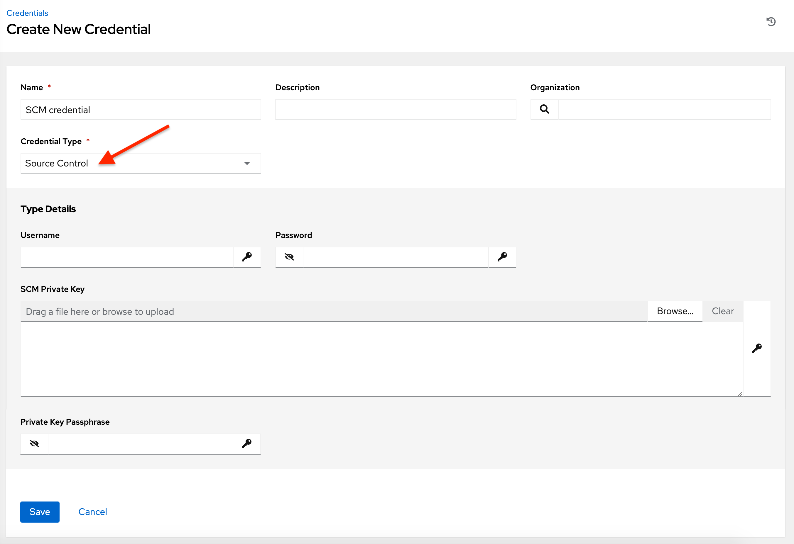

.. _ug_credentials:

Credentials
===============

.. index:: 
   single: credentials

Credentials are utilized for authentication when launching Jobs against machines, synchronizing with inventory sources, and importing project content from a version control system.

You can grant users and teams the ability to use these credentials, without actually exposing the credential to the user. If you have a user move to a different team or leave the organization, you don’t have to re-key all of your systems just because that credential was available in AWX.

.. note::

    AWX encrypts passwords and key information in the database and never makes secret information visible via the API. See :ref:`ag_secret_handling` in the |ata| for details.

.. _how_credentials_work:

Understanding How Credentials Work
------------------------------------

.. index:: 
    pair: credentials; how they work

AWX uses SSH to connect to remote hosts (or the Windows equivalent).  In order to pass the key from AWX to SSH, the key must be decrypted before it can be written a named pipe. AWX then uses that pipe to send the key to SSH (so that it is never written to disk).   

If passwords are used, AWX handles those by responding directly to the password prompt and decrypting the password before writing it to the prompt.

.. (commented out from note above, add back once api guide is extended again) Refer to :ref:`Unified Job List API Endpoint <unified_job_list>` in the |atapi| for more information.

Getting Started with Credentials
----------------------------------

.. index:: 
   pair: credentials; getting started

Click **Credentials** from the left navigation bar to access the Credentials page. The Credentials page displays a search-able list of all available Credentials and can be sorted by **Name**.

|Credentials - home with example credentials|

.. |Credentials - home with example credentials| image:: ../common/images/credentials-demo-edit-details.png
    :alt: Credentials - home with example credentials

Credentials added to a Team are made available to all members of the Team, whereas credentials added to a User are only available to that specific User by default.

To help you get started, a Demo Credential has been created for your use.

Clicking on the link for the **Demo Credential** takes you to the **Details** view of this Credential.

|Credentials - home with demo credential details|

.. |Credentials - home with demo credential details| image:: ../common/images/credentials-home-with-demo-credential-details.png
    :alt: Credentials - Demo credential details

Clicking the **Access** tab shows you users and teams associated with this Credential and their granted roles (owner, admin, auditor, etc.)

|Credentials - home with permissions credential details|

.. |Credentials - home with permissions credential details| image:: ../common/images/credentials-home-with-permissions-detail.png
    :alt: Credentials - Access tab for Demo credential containing two users with their roles

.. note::

  A credential with roles associated will retain them even after the credential has been reassigned to another organization.

You can click the **Add** button to assign this **Demo Credential** to additional users. If no users exist, add them from the **Users** menu and refer to the :ref:`ug_users` section for further detail.

Clicking the **Job Templates** tab shows you the job templates associated with this Credential and which jobs recently ran using this particular credential.

You can click the **Add** button to assign this **Demo Credential** to additional job templates. Refer to the :ref:`ug_JobTemplates` section for further detail on creating a new job template.

.. _ug_credentials_add:

Add a New Credential
----------------------

.. index:: 
   pair: credentials; adding new

To create a new credential:   

1. Click the **Add** button from the **Credentials** screen.

|Create credential|

.. |Create credential| image:: ../common/images/credentials-create-credential.png
    :alt: Create credential form

2. Enter the name for your new credential in the **Name** field.

3. Optionally enter a description and enter or select the name of the organization with which the credential is associated.

.. note::

  A credential with a set of permissions associated with one organization will remain even after the credential is reassigned to another organization.

4. Enter or select the credential type you want to create. 

.. image:: ../common/images/credential-types-drop-down-menu.png
    :alt: Credential types drop down menu

5. Enter the appropriate details depending on the type of credential selected, as described in the next section, :ref:`ug_credentials_cred_types`.

6. Click **Save** when done.

.. _ug_credentials_cred_types:

Credential Types
-----------------

.. index:: 
   single: credentials; types
   single: credential types

The following credential types are supported with AWX:

.. contents::
    :local:

The credential types associated with Centrify, CyberArk, HashiCorp Vault, Microsoft Azure Key Management System (KMS), and Thycotic are part of the credential plugins capability that allows an external system to lookup your secrets information. See the :ref:`ug_credential_plugins` section for further detail.

.. _ug_credentials_aws:

Amazon Web Services
^^^^^^^^^^^^^^^^^^^^^^^^

.. index::
   pair: credential types; Amazon Web Services

Selecting this credential type enables synchronization of cloud inventory with Amazon Web Services.

AWX uses the following environment variables for AWS credentials and are fields prompted in the user interface:

::

  AWS_ACCESS_KEY_ID
  AWS_SECRET_ACCESS_KEY
  AWS_SECURITY_TOKEN

|Credentials - create AWS credential|

.. |Credentials - create AWS credential| image:: ../common/images/credentials-create-aws-credential.png
    :alt: Credentials - create AWS credential form

Traditional Amazon Web Services credentials consist of the AWS **Access Key** and **Secret Key**. 

AWX provides support for EC2 STS tokens (sometimes referred to as IAM STS credentials). Security Token Service (STS) is a web service that enables you to request temporary, limited-privilege credentials for AWS Identity and Access Management (IAM) users. To learn more about the IAM/EC2 STS Token, refer to: http://docs.aws.amazon.com/IAM/latest/UserGuide/id_credentials_temp.html

.. note::

  If the value of your tags in EC2 contain booleans (yes/no/true/false), you must remember to quote them.

.. warning::

  To use implicit IAM role credentials, do not attach AWS cloud credentials in AWX when relying on IAM roles to access the AWS API.  While it may seem to make sense to attach your AWS cloud credential to your job template, doing so will force the use of your AWS credentials and will not "fall through" to use your IAM role credentials (this is due to the use of the boto library.)

Ansible Galaxy/Automation Hub API Token
^^^^^^^^^^^^^^^^^^^^^^^^^^^^^^^^^^^^^^^^^^
.. index::
   pair: credential types; Galaxy
   pair: credential types; Automation Hub

Selecting this credential allows AWX to access Galaxy or use a collection published on a local |ah|. See :ref:`ug_collections_usage` for detail. Entering the Galaxy server URL is the only required value on this screen.  

|Credentials - create galaxy credential|

To populate the **Galaxy Server URL** and the **Auth Server URL** fields, look for the corresponding fields of the |ah| section of the `Red Hat Hybrid Cloud Console <https://console.redhat.com/ansible/automation-hub/token>`_ labeled **Server URL** and **SSO URL**, respectively.

.. image:: ../common/images/hub-console-tokens-page.png
    :alt: Hub console tokens page

Centrify Vault Credential Provider Lookup
^^^^^^^^^^^^^^^^^^^^^^^^^^^^^^^^^^^^^^^^^^
This is considered part of the secret management capability. See :ref:`ug_credentials_centrify` for more detail.

Container Registry
^^^^^^^^^^^^^^^^^^^
.. index::
   pair: credential types; Container Registry

Selecting this credential allows AWX to access a collection of container images. See `What is a container registry? <https://www.redhat.com/en/topics/cloud-native-apps/what-is-a-container-registry>`_ for more information. 

Aside from specifying a name, the **Authentication URL** is the only required field on this screen, and it is already pre-populated with a default value. You may change this default by specifying the authentication endpoint for a different container registry.

|Credentials - create container credential|

.. |Credentials - create container credential| image:: ../common/images/credentials-create-container-credential.png
    :alt: Credentials - create container credential form

CyberArk Central Credential Provider Lookup
^^^^^^^^^^^^^^^^^^^^^^^^^^^^^^^^^^^^^^^^^^^^^
This is considered part of the secret management capability. See :ref:`ug_credentials_cyberarkccp` for more detail.

CyberArk Conjur Secrets Manager Lookup
^^^^^^^^^^^^^^^^^^^^^^^^^^^^^^^^^^^^^^^^
This is considered part of the secret management capability. See :ref:`ug_credentials_cyberarkconjur` for more detail.

.. _ug_credentials_github:

GitHub Personal Access Token
^^^^^^^^^^^^^^^^^^^^^^^^^^^^^^
.. index::
   pair: credential types; GitHub PAT

Selecting this credential allows you to access GitHub using a Personal Access Token (PAT), which is obtained through GitHub. See :ref:`ug_webhooks` for detail. Entering the provided token is the only required value in this screen.  

|Credentials - create GitHub credential|

GitHub PAT credentials require a value in the **Token** field, which is provided in your GitHub profile settings. 

This credential can be used for establishing an API connection to GitHub for use in webhook listener jobs, to post status updates.

.. _ug_credentials_gitlab:

GitLab Personal Access Token
^^^^^^^^^^^^^^^^^^^^^^^^^^^^^^^
.. index::
   pair: credential types; GitLab PAT

Selecting this credential allows you to access GitLab using a Personal Access Token (PAT), which is obtained through GitLab. See :ref:`ug_webhooks` for detail. Entering the provided token is the only required value in this screen. 

|Credentials - create GitLab credential|

.. |Credentials - create GitLab credential| image:: ../common/images/credentials-create-webhook-gitlab-credential.png
    :alt: Credentials - create GitLab credential form

GitLab PAT credentials require a value in the **Token** field, which is provided in your GitLab profile settings. 

This credential can be used for establishing an API connection to GitLab for use in webhook listener jobs, to post status updates.

Google Compute Engine
^^^^^^^^^^^^^^^^^^^^^^^^

.. index::
   pair: credential types; Google Compute Engine

Selecting this credential type enables synchronization of cloud inventory with Google Compute Engine (GCE).

AWX uses the following environment variables for GCE credentials and are fields prompted in the user interface:

::

  GCE_EMAIL
  GCE_PROJECT
  GCE_CREDENTIALS_FILE_PATH

|Credentials - create GCE credential|

GCE credentials have the following inputs that are required:

-  **Service Account Email Address**: The email address assigned to the Google Compute Engine **service account**.
-  **Project**: Optionally provide the GCE assigned identification or the unique project ID you provided at project creation time.
-  **Service Account JSON File**: Optionally upload a GCE service account file. Use the folder (|file-browser|) icon to browse for the file that contains the special account information that can be used by services and applications running on your GCE instance to interact with other Google Cloud Platform APIs. This grants permissions to the service account and virtual machine instances.
-  **RSA Private Key**: The PEM file associated with the service account email.

.. |file-browser| image:: ../common/images/file-browser-button.png
    :alt: File browser button

GPG Public Key
^^^^^^^^^^^^^^^^

.. index::
   pair: credential types; GPG public key

Selecting this credential type allows you to create a credential that gives AWX the ability to verify the integrity of the project when syncing from source control. 

|Credentials - create GPG credential|

.. |Credentials - create GPG credential| image:: ../common/images/credentials-create-gpg-credential.png
    :alt: Credentials - create GPG credential form

See :ref:`ug_content_signing` for detailed information on how to generate a valid keypair, use the CLI tool to sign content, and how to add the public key to AWX.

HashiCorp Vault Secret Lookup
^^^^^^^^^^^^^^^^^^^^^^^^^^^^^^
This is considered part of the secret management capability. See :ref:`ug_credentials_hashivault` for more detail.

HashiCorp Vault Signed SSH
^^^^^^^^^^^^^^^^^^^^^^^^^^^^^^
This is considered part of the secret management capability. See :ref:`ug_credentials_hashivaultssh` for more detail.

Insights
^^^^^^^^^^^

.. index::
   pair: credential types; insights

Selecting this credential type enables synchronization of cloud inventory with Red Hat Insights.

|Credentials - create Insights credential|

Insights credentials consist of the Insights **Username** and **Password**, which is the user’s Red Hat Customer Portal Account username and password.

Machine
^^^^^^^^

.. index::
   pair: credential types; machine

Machine credentials enable AWX to invoke Ansible on hosts under your management. Just like using Ansible on the command line, you can specify the SSH username, optionally provide a password, an SSH key, a key password, or even have AWX prompt the user for their password at deployment time. They define ssh and user-level privilege escalation access for playbooks, and are used when submitting jobs to run playbooks on a remote host. Network connections (``httpapi``, ``netconf``, and ``network_cli``) use **Machine** for the credential type.

Machine/SSH credentials do not use environment variables. Instead, they pass the username via the ``ansible -u`` flag, and interactively write the SSH password when the underlying SSH client prompts for it.

|Credentials - create machine credential|

Machine credentials have several attributes that may be configured:

- **Username**: The username to be used for SSH authentication.
- **Password**: The actual password to be used for SSH authentication. This password will be stored encrypted in the database, if entered. Alternatively, you can configure AWX to ask the user for the password at launch time by selecting **Prompt on launch**. In these cases, a dialog opens when the job is launched, promoting the user to enter the password and password confirmation.
- **SSH Private Key**: Copy or drag-and-drop the SSH private key for the machine credential.
- **Private Key Passphrase**: If the SSH Private Key used is protected by a password, you can configure a Key Password for the private key. This password will be stored encrypted in the database, if entered. Alternatively, you can configure AWX to ask the user for the password at launch time by selecting **Prompt on launch**. In these cases, a dialog opens when the job is launched, prompting the user to enter the password and password confirmation.
- **Privilege Escalation Method**: Specifies the type of escalation privilege to assign to specific users. This is equivalent to specifying the ``--become-method=BECOME_METHOD`` parameter, where ``BECOME_METHOD`` could be any of the typical methods described below, or a custom method you've written. Begin entering the name of the method, and the appropriate name auto-populates.

.. image:: ../common/images/credentials-create-machine-credential-priv-escalation.png
    :alt: Credentials - create machine credential privilege escalation drop-down menu

- empty selection: If a task/play has ``become`` set to ``yes`` and is used with an empty selection, then it will default to ``sudo``
- **sudo**: Performs single commands with super user (root user) privileges
- **su**: Switches to the super user (root user) account (or to other user accounts)
- **pbrun**:  Requests that an application or command be run in a controlled account and provides for advanced root privilege delegation and keylogging
- **pfexec**: Executes commands with predefined process attributes, such as specific user or group IDs
- **dzdo**: An enhanced version of sudo that uses RBAC information in an Centrify's Active Directory service (see Centrify's `site on DZDO <http://community.centrify.com/t5/Centrify-Server-Suite/FAQ-What-is-DirectAuthorize-dzdo-dzwin/td-p/21193>`_)
- **pmrun**: Requests that an application is run in a controlled account (refer to `Privilege Manager for Unix 6.0 <http://documents.software.dell.com/privilege-manager-for-unix/6.0/administrators-guide/privilege-manager-programs/pmrun>`_)
- **runas**: Allows you to run as the current user
- **enable**: Switches to elevated permissions on a network device
- **doas**: Allows your remote/login user to execute commands as another user via the doas ("Do as user") utility
- **ksu**: Allows your remote/login user to execute commands as another user via Kerberos access
- **machinectl**: Allows you to manage containers via the systemd machine manager
- **sesu**: Allows your remote/login user to execute commands as another user via the CA Privileged Access Manager

.. note::
   Custom ``become`` plugins are available only starting with Ansible 2.8. For more detail on this concept, refer to `Understanding Privilege Escalation  https://docs.ansible.com/ansible/latest/user_guide/become.html` and the `list of become plugins https://docs.ansible.com/ansible/latest/plugins/become.html#plugin-list`.

- **Privilege Escalation Username** field is only seen if an option for privilege escalation is selected. Enter the username to use with escalation privileges on the remote system.
- **Privilege Escalation Password**: field is only seen if an option for privilege escalation is selected. Enter the actual password to be used to authenticate the user via the selected privilege escalation type on the remote system. This password will be stored encrypted in the database, if entered. Alternatively, you may configure AWX to ask the user for the password at launch time by selecting **Prompt on launch**. In these cases, a dialog opens when the job is launched, promoting the user to enter the password and password confirmation.

.. note::
   Sudo Password must be used in combination with SSH passwords or SSH Private Keys, since AWX must first establish an authenticated SSH connection with the host prior to invoking sudo to change to the sudo user.

.. warning::
   Credentials which are used in *Scheduled Jobs* must not be configured as "**Prompt on launch**".

Microsoft Azure Key Vault
^^^^^^^^^^^^^^^^^^^^^^^^^^^
This is considered part of the secret management capability. See :ref:`ug_credentials_azurekeyvault` for more detail.

Microsoft Azure Resource Manager
^^^^^^^^^^^^^^^^^^^^^^^^^^^^^^^^

.. index::
   pair: credential types; Microsoft Azure Resource Manager

Selecting this credential type enables synchronization of cloud inventory with Microsoft Azure Resource Manager. 

|Credentials - create Azure credential|

Microsoft Azure Resource Manager credentials have several attributes that may be configured:

-  **Subscription ID**: The Subscription UUID for the Microsoft Azure account (required).
-  **Username**: The username to use to connect to the Microsoft Azure account. 
-  **Password**: The password to use to connect to the Microsoft Azure account.
-  **Client ID**: The Client ID for the Microsoft Azure account.
-  **Client Secret**: The Client Secret for the Microsoft Azure account.
-  **Tenant ID**: The Tenant ID for the Microsoft Azure account.
-  **Azure Cloud Environment**: The variable associated with Azure cloud or Azure stack environments.

These fields are equivalent to the variables in the API. To pass service principal credentials, define the following variables::

    AZURE_CLIENT_ID
    AZURE_SECRET
    AZURE_SUBSCRIPTION_ID
    AZURE_TENANT
    AZURE_CLOUD_ENVIRONMENT

To pass an Active Directory username/password pair, define the following variables::

    AZURE_AD_USER
    AZURE_PASSWORD
    AZURE_SUBSCRIPTION_ID

You can also pass credentials as parameters to a task within a playbook. The order of precedence is parameters, then environment variables, and finally a file found in your home directory.

To pass credentials as parameters to a task, use the following parameters for service principal credentials::

    client_id
    secret
    subscription_id
    tenant
    azure_cloud_environment

Or, pass the following parameters for Active Directory username/password::

    ad_user
    password
    subscription_id

Network
^^^^^^^^

.. index::
   pair: credential types; network

Select the Network credential type **only** if you are using a `local` connection with `provider` to use Ansible networking modules to connect to and manage networking devices. When connecting to network devices, the credential type must match the connection type:

- For ``local`` connections using ``provider``, credential type should be **Network**
- For all other network connections (``httpapi``, ``netconf``, and ``network_cli``), credential type should be **Machine**

For an overview of connection types available for network devices, refer to `Multiple Communication Protocols`_.

  .. _`Multiple Communication Protocols`: https://docs.ansible.com/ansible/devel/network/getting_started/network_differences.html#multiple-communication-protocols.

AWX uses the following environment variables for Network credentials and are fields prompted in the user interface:

::

  ANSIBLE_NET_USERNAME
  ANSIBLE_NET_PASSWORD

|Credentials - create network credential|

.. |Credentials - create network credential| image:: ../common/images/credentials-create-network-credential.png
    :alt: Credentials - create network credential form

Network credentials have several attributes that may be configured:

-  **Username**: The username to use in conjunction with the network device (required).
-  **Password**:  The password to use in conjunction with the network device.
- **SSH Private Key**: Copy or drag-and-drop the actual SSH Private Key to be used to authenticate the user to the network via SSH.
-  **Private Key Passphrase**: The actual passphrase for the private key to be used to authenticate the user to the network via SSH.
-  **Authorize**: Select this from the Options field to control whether or not to enter privileged mode.
- If **Authorize** is checked, enter a password in the **Authorize Password** field to access privileged mode. 

For more information, refer to the *Inside Playbook* blog, `Porting Ansible Network Playbooks with New Connection Plugins`_.

.. _`Porting Ansible Network Playbooks with New Connection Plugins`: https://www.ansible.com/blog/porting-ansible-network-playbooks-with-new-connection-plugins 

.. _ug_credentials_ocp_k8s:

OpenShift or Kubernetes API Bearer Token
^^^^^^^^^^^^^^^^^^^^^^^^^^^^^^^^^^^^^^^^^

.. index::
   pair: credential types; OpenShift
   pair: credential types; Kubernetes
   pair: credential types; API bearer token

Selecting this credential type allows you to create instance groups that point to a Kubernetes or OpenShift container. For more information about this concept, refer to :ref:`ag_ext_exe_env`.

|Credentials - create Containers credential|

.. |Credentials - create Containers credential| image:: ../common/images/credentials-create-containers-credential.png
    :alt: Credentials - create Containers credential form

Container credentials have the following inputs:

- **OpenShift or Kubernetes API Endpoint** (required): the endpoint to be used to connect to an OpenShift or Kubernetes container
- **API Authentication Bearer Token** (required): The token to use to authenticate the connection
- **Verify SSL**: Optionally you can check this option to verify the server’s SSL certificate is valid and trusted. Environments that use internal or private CA’s should leave this option unchecked to disable verification.
- **Certificate Authority Data**: include the ``BEGIN CERTIFICATE`` and ``END CERTIFICATE`` lines when pasting the certificate, if provided

.. include:: ../common/get-creds-from-service-account.rst

OpenStack
^^^^^^^^^^^^

.. index::
   pair: credential types; OpenStack

Selecting this credential type enables synchronization of cloud inventory with OpenStack.

|Credentials - create OpenStack credential|

.. |Credentials - create OpenStack credential| image:: ../common/images/credentials-create-openstack-credential.png
    :alt: Credentials - create OpenStack credential form

OpenStack credentials have the following inputs that are required:   

- **Username**: The username to use to connect to OpenStack.
- **Password (API Key)**: The password or API key to use to connect to OpenStack.
- **Host (Authentication URL)**: The host to be used for authentication.
- **Project (Tenant Name)**: The Tenant name or Tenant ID used for OpenStack. This value is usually the same as the username. 
- **Project (Domain Name)**: Optionally provide the project name associated with your domain.
- **Domain name**: Optionally provide the FQDN to be used to connect to OpenStack.

If you are interested in using OpenStack Cloud Credentials, refer to :ref:`ug_CloudCredentials` in this guide for more information, including a sample playbook.

Red Hat Ansible Automation Platform
^^^^^^^^^^^^^^^^^^^^^^^^^^^^^^^^^^^

.. index::
   pair: credential types; automation platform

Selecting this credential allows you to access a Red Hat Ansible Automation Platform instance. 

The Red Hat Ansible Automation Platform credentials have the following inputs that are required:

-  **Red Hat Ansible Automation Platform**: The base URL or IP address of the other instance to connect to.
-  **Username**: The username to use to connect to it.
-  **Password**: The password to use to connect to it.
-  **Oauth Token**: If username and password is not used, provide an OAuth token to use to authenticate.

Red Hat Satellite 6
^^^^^^^^^^^^^^^^^^^^^^^^

.. index::
   pair: credential types; Red Hat Satellite

Selecting this credential type enables synchronization of cloud inventory with Red Hat Satellite 6. 

AWX writes a Satellite configuration file based on fields prompted in the user interface. The absolute path to the file is set in the following environment variable:

::

  FOREMAN_INI_PATH

|Credentials - create Red Hat Satellite 6 credential|

.. |Credentials - create Red Hat Satellite 6 credential| image:: ../common/images/credentials-create-rh-sat-credential.png
    :alt: Credentials - create Red Hat Satellite 6 credential form

Satellite credentials have the following inputs that are required:   

-  **Satellite 6 URL**: The Satellite 6 URL or IP address to connect to.
-  **Username**: The username to use to connect to Satellite 6.
-  **Password**: The password to use to connect to Satellite 6.

Red Hat Virtualization
^^^^^^^^^^^^^^^^^^^^^^^^

.. index::
   pair: credential types; oVirt
   pair: credential types; rhv
   pair: credential types; Red Hat Virtualization

This credential allows AWX to access Ansible's ``oVirt4.py`` dynamic inventory plugin, which is managed by Red Hat Virtualization (RHV). 

AWX uses the following environment variables for Red Hat Virtualization credentials and are fields in the user interface:

::

  OVIRT_URL
  OVIRT_USERNAME
  OVIRT_PASSWORD

|Credentials - create rhv credential|

.. |Credentials - create rhv credential| image:: ../common/images/credentials-create-rhv-credential.png
    :alt: Credentials - create Red Hat Virtualization credential form

RHV credentials have the following inputs that are required:

-  **Host (Authentication URL)**: The host URL or IP address to connect to. In order to sync with the inventory, the credential URL needs to include the ``ovirt-engine/api`` path. 
-  **Username**: The username to use to connect to oVirt4. This needs to include the domain profile to succeed, for example ``username@ovirt.host.com``.
-  **Password**: The password to use to connect to it.
-  **CA File**: Optionally provide an absolute path to the oVirt certificate file (it may end in ``.pem``, ``.cer`` and ``.crt`` extensions, but preferably ``.pem`` for consistency)

Source Control
^^^^^^^^^^^^^^^^

.. index::
   pair: credential types; source control

SCM (source control) credentials are used with Projects to clone and update local source code repositories from a remote revision control system such as Git or Subversion.

|Credentials - create SCM credential|

Source Control credentials have several attributes that may be configured:

-  **Username**: The username to use in conjunction with the source control system.
-  **Password**:  The password to use in conjunction with the source control system.
-  **SCM Private Key**: Copy or drag-and-drop the actual SSH Private Key to be used to authenticate the user to the source control system via SSH.
-  **Private Key Passphrase**: If the SSH Private Key used is protected by a passphrase, you may configure a Key Passphrase for the private key.

.. note::

    Source Control credentials cannot be configured as "**Prompt on launch**". 
    If you are using a GitHub account for a Source Control credential and you have 2FA (Two Factor Authentication) enabled on your account, you will need to use your Personal Access Token in the password field rather than your account password. 

Thycotic DevOps Secrets Vault
^^^^^^^^^^^^^^^^^^^^^^^^^^^^^^^
This is considered part of the secret management capability. See :ref:`ug_credentials_thycoticvault` for more detail.

Thycotic Secret Server
^^^^^^^^^^^^^^^^^^^^^^^^^^^
This is considered part of the secret management capability. See :ref:`ug_credentials_thycoticserver` for more detail.

Vault
^^^^^^^^

.. index::
   pair: credential types; Vault

Selecting this credential type enables synchronization of inventory with Ansible Vault.

|Credentials - create Vault credential|

.. |Credentials - create Vault credential| image:: ../common/images/credentials-create-vault-credential.png
    :alt: Credentials - create Vault credential form

Vault credentials require the **Vault Password** and an optional **Vault Identifier** if applying multi-Vault credentialing. For more information on AWX Multi-Vault support, refer to the :ref:`ag_multi_vault` section of the |ata|.

You may configure AWX to ask the user for the password at launch time by selecting **Prompt on launch**. In these cases, a dialog opens when the job is launched, promoting the user to enter the password and password confirmation.

.. warning::

    Credentials which are used in *Scheduled Jobs* must not be configured as "**Prompt on launch**". 

For more information about Ansible Vault, refer to: http://docs.ansible.com/ansible/playbooks_vault.html

VMware vCenter
^^^^^^^^^^^^^^^^

.. index::
   pair: credential types; VMware

Selecting this credential type enables synchronization of inventory with VMware vCenter. 

AWX uses the following environment variables for VMware vCenter credentials and are fields prompted in the user interface:

::

  VMWARE_HOST
  VMWARE_USER
  VMWARE_PASSWORD
  VMWARE_VALIDATE_CERTS

|Credentials - create VMware credential|

VMware credentials have the following inputs that are required:

-  **vCenter Host**: The vCenter hostname or IP address to connect to.
-  **Username**: The username to use to connect to vCenter.
-  **Password**: The password to use to connect to vCenter.

.. note::

    If the VMware guest tools are not running on the instance, VMware inventory sync may not return an IP address for that instance.

