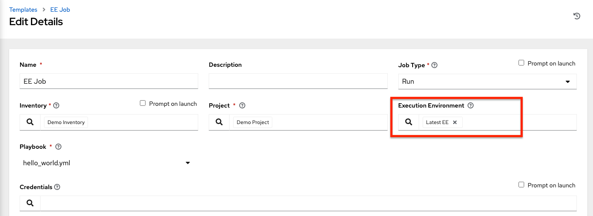
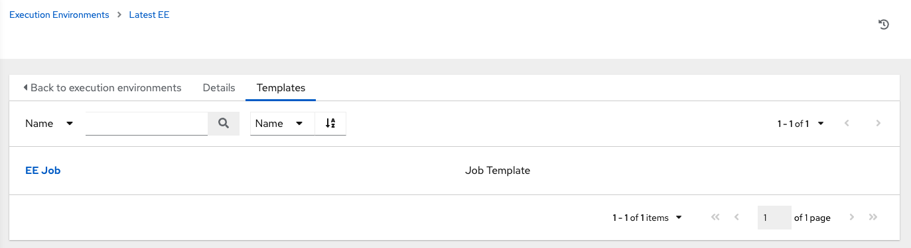
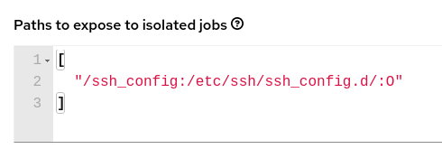
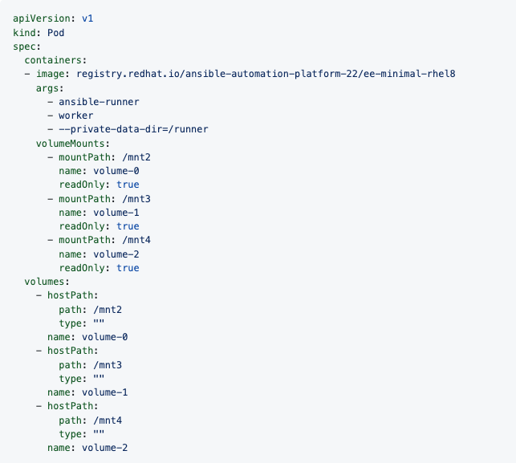

.. _ug_execution_environments:

Execution Environments
======================

.. index::
   single: execution environment
   pair: add; execution environment
   pair: jobs; add execution environment

.. include:: ../common/execution_environs.rst

.. _ug_build_ees:

Building an Execution Environment
---------------------------------

The `Getting started with Execution Environments guide <https://ansible.readthedocs.io/en/latest/getting_started_ee/index.html>`_ will give you a brief technology overview and show you how to build and test your first |ee| in a few easy steps.

Use an execution environment in jobs
------------------------------------

In order to use an |ee| in a job, a few components are required:

- Use the AWX user interface to specify the |ee| you :ref:`build<ug_build_ees>` to use in your job templates.

- Depending on whether an |ee| is made available for global use or tied to an organization, you must have the appropriate level of administrator privileges in order to use an |ee| in a job. |Ees| tied to an organization require Organization administrators to be able to run jobs with those |ees|.

- Before running a job or job template that uses an |ee| that has a credential assigned to it, be sure that the credential contains a username, host, and password.

1. Click **Execution Environments** from the left navigation bar of the AWX user interface. 

2. Add an |ee| by selecting the **Add** button.

3. Enter the appropriate details into the following fields:

-  **Name**: Enter a name for the |ee| (required).
-  **Image**: Enter the image name (required). The image name requires its full location (repo), the registry, image name, and version tag in the example format of ``quay.io/ansible/awx-ee:latestrepo/project/image-name:tag``. 
-  **Pull**: optionally choose the type of pull when running jobs:

  - **Always pull container before running**: Pulls the latest image file for the container.
  - **Only pull the image if not present before running**: Only pulls latest image if none specified.
  - **Never pull container before running**: Never pull the latest version of the container image.

-  **Description**: optional.
-  **Organization**: optionally assign the organization to specifically use this |ee|. To make the |ee| available for use across multiple organizations, leave this field blank.
-  **Registry credential**: If the image has a protected container registry, provide the credential to access it.

.. image:: ../common/images/ee-new-ee-form-filled.png
   :alt: Create new Execution Environment form

4. Click **Save**. 

Now your newly added |ee| is ready to be used in a job template. To add an |ee| to a job template, specify it in the **Execution Environment** field of the job template, as shown in the example below. For more information on setting up a job template, see :ref:`ug_JobTemplates` in the |atu|.

Once you added an |ee| to a job template, you can see those templates listed in the **Templates** tab of the |ee|:

Execution environment mount options
-----------------------------------

.. index:: 
   pair: mount options; execution environment
   pair: system trust store; execution environment

.. https://github.com/ansible/product-docs/issues/1647 and https://github.com/ansible/awx/issues/10787

Rebuilding an |ee| is one way to add certs, but inheriting certs from the host provides a more convenient solution.  

Additionally, you may customize |ee| mount options and mount paths in the **Paths to expose to isolated jobs** field of the Job Settings page, where it supports podman-style volume mount syntax. Refer to the `Podman documentation <https://docs.podman.io/en/latest/markdown/podman-run.1.html#volume-v-source-volume-host-dir-container-dir-options>`_ for detail.

In some cases where the ``/etc/ssh/*`` files were added to the |ee| image due to customization of an |ee|, an SSH error may occur. For example, exposing the ``/etc/ssh/ssh_config.d:/etc/ssh/ssh_config.d:O`` path allows the container to be mounted, but the ownership permissions are not mapped correctly. 

If you encounter this error, or have upgraded from an older version of AWX, perform the following steps:

1. Change the container ownership on the mounted volume  to ``root``.

2. In the **Paths to expose to isolated jobs** field of the Job Settings page, using the current example, expose the path as such:

   
.. note::

	The ``:O`` option is only supported for directories. It is highly recommended that you be as specific as possible, especially when specifying system paths. Mounting ``/etc`` or ``/usr`` directly have impact that make it difficult to troubleshoot. 

This informs podman to run a command similar to the example below, where the configuration is mounted and the ``ssh`` command works as expected.

::

	podman run -v /ssh_config:/etc/ssh/ssh_config.d/:O ...

.. https://github.com/ansible/awx/issues/11600

To expose isolated paths in OpenShift or Kubernetes containers as HostPath, assume the following configuration:

.. image:: ../common/images/settings-paths2expose-iso-jobs-mount-containers.png
   :alt: Jobs Settings page showing Paths to expose to isolated jobs field with assumed configuration and Expose host paths for Container Group toggle enabled 

Use the **Expose host paths for Container Groups** toggle to enable it. 

Once the playbook runs, the resulting Pod spec will display similar to the example below. Note the details of the ``volumeMounts`` and ``volumes`` sections.

