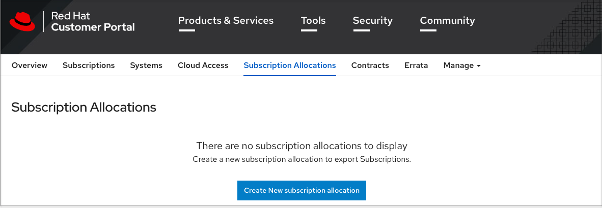
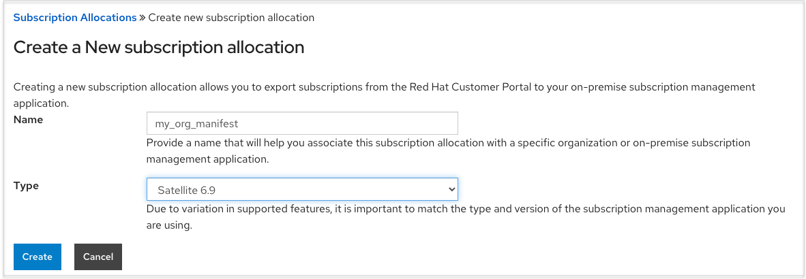
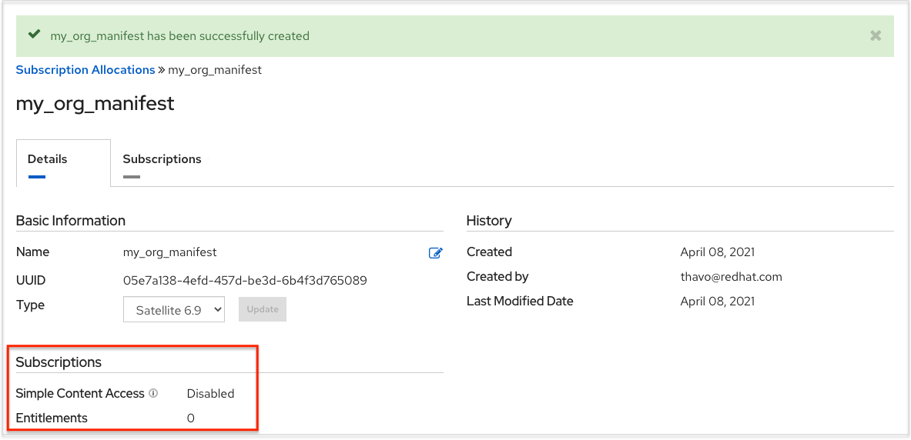
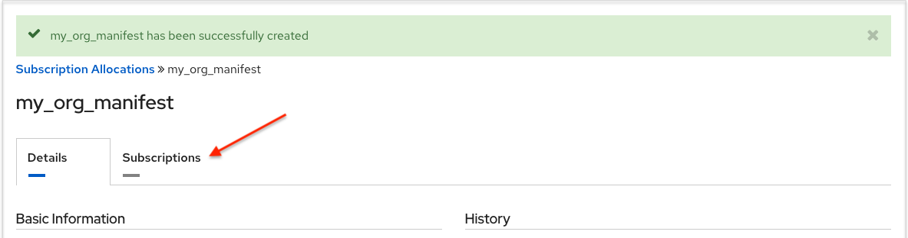
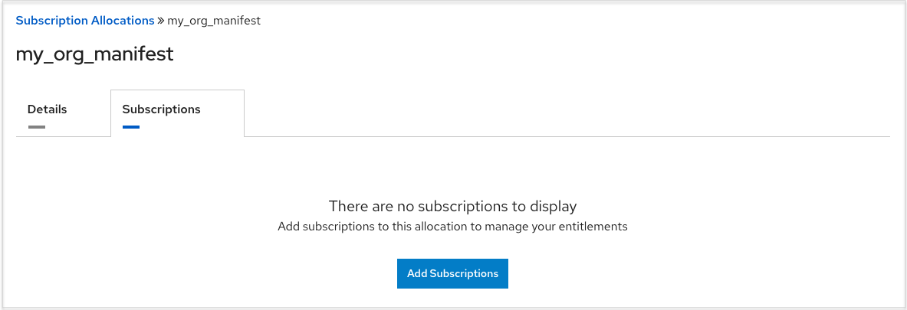
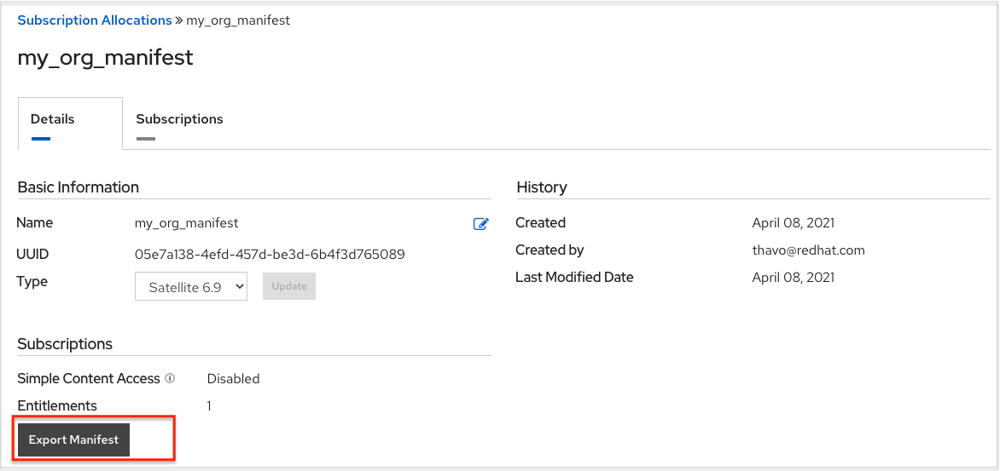

.. _import_subscription:

Import a Subscription
======================

.. index::
   pair: subscriptions; import

.. include:: ../common/import_license.rst

.. _obtain_sub_manifest:

Obtaining a subscriptions manifest
----------------------------------

.. index::
   pair: subscriptions; manifest
   pair: obtain; subscriptions manifest

In order to upload a subscriptions manifest, first set up your subscription allocations:

1. Go to https://access.redhat.com/management/subscription_allocations.

The Subscriptions Allocations page contains no subscriptions until you create one. 

2. Click the **Create New subscription allocation** button to create a new subscription allocation. 

.. note::

	If this button is not present or disabled, you do not have the proper permissions to create subscription allocations. To create a subscription allocation, you must either be an *Administrator* on the Customer Portal, or have the *Manage Your Subscriptions* role. Contact an access.redhat.com administrator or organization administrator who will be able to grant you permission to manage subscriptions.

3. Enter a name for your subscription and select **Satellite 6.8** from the Type drop-down menu.

4. Click **Create**.

5. Once your subscriptions manifest is successfully created, it displays various information including subscription information at the bottom of the **Details** tab. The number indicated next to Entitlements indicates the number of entitlements associated with your subscription. 

In order to obtain a subscriptions manifest, you must add an entitlement to your subscriptions though the Subscriptions tab.

6. Click the **Subscriptions** tab. 

7. In the Subscriptions tab, there are no subscriptions to display, click the **Add Subscriptions** button.

The next screen allows you to select and add entitlements to put in the manifest file. You may select multiple |aap| subscriptions (with the same SKU) in your subscription allocation. Valid |aap| subscriptions commonly go by the name "|rhaa|...".

8. Specify the number of entitlements/managed nodes to put in the manifest file. This allows you to split up a subscription (for example: 400 nodes on a development cluster and 600 nodes for the production cluster, out of a 1000 node subscription).

  .. image:: ../common/images/aap-subscriptions.png

.. Note:: 

	You can apply multiple subscriptions to a single installation by adding multiple subscriptions of the same type to a manifest file and uploading them. Similarly, a subset of a subscription can be applied by only allocating a portion of the subscription when creating the manifest.

9. Click **Submit**.

The allocations you specified, once successfully added, are displayed in the **Subscriptions** tab.

10. Click the **Details** tab to access the subscription manifest file.

11. At the bottom of the details window under *Entitlements*, click the **Export Manifest** button to export the manifest file for this subscription.

A folder pre-pended with ``manifest_`` in the name is downloaded to your local drive. Multiple subscriptions with the same SKU will be aggregated.

12. Now that you have a subscription manifest, proceed to the :ref:`Subscription screen <upload_manifest>`. Upload the entire manifest file (.zip) by clicking **Browse** and navigate to the location where the file is saved. Do not open it or upload individual parts of it.

.. _add_license_manually:

Adding a subscription manually
------------------------------

.. index::
   pair: license; troubleshooting
   single: license, add manually

If you are unable to apply or update the subscription info using the user interface, you can upload the subscriptions manifest manually in an Ansible playbook using the ``license`` module in the ``ansible.controller`` collection:

::

	- name: Set the license using a file
          license:
          manifest: "/tmp/my_manifest.zip"

See the `Ansible tower_license module <https://cloud.redhat.com/ansible/automation-hub/ansible/tower/content/module/tower_license>`_ for more information.
